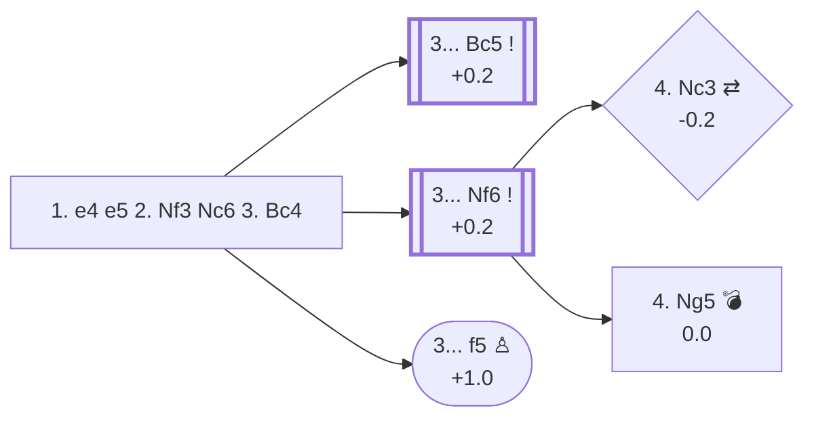

<a name="_TOP_"></a>

# C50 Italian Game <br> 1. e4 e5 2. Nf3 Nc6 3. Bc4 #

White develops the bishop to a good square where it controls a valuable diagonal. From c4 the bishop controls d5 and pressures Black's f7-pawn, the most vulnerable pawn in Black's position. Having developed both kingside minor pieces quickly, White is ready to castle. White's plans include a swift attack on f7 and building a big centre with c3 and d4.

### Overview

*Quick map of every move covered on this card — see the [shape key](https://github.com/onclemarcel/chess_flashcards/blob/main/start.md#content-diagram-optional) in start.md. Several candidates in the text below (3... Bc5, 3... h6, 3... Be7, 3... d6, and 4. d3/4. d4 under Two Knights) have no card or anchor yet, so they're left off this map rather than pointing nowhere — including 4. d3, which is actually the masters main try (74.6%) here. Treat this diagram as "what's built so far," not the full picture.*

<!-- content-diagram:start -->

<!-- content-diagram:end -->

<a name="_initial_move_"></a>

[](https://lichess.org/analysis/standard/r1bqkbnr/pppp1ppp/2n5/4p3/2B1P3/5N2/PPPP1PPP/RNBQK2R_b_KQkq_-_3_3)

*... 1. e4 e5 2. Nf3 Nc6 3. Bc4 — Italian Game*

```
r1bqkbnr/pppp1ppp/2n5/4p3/2B1P3/5N2/PPPP1PPP/RNBQK2R b KQkq - 3 3
```

|  | +0.1 |
| --- | --- |

<!-- lichess-stats:start fen="r1bqkbnr/pppp1ppp/2n5/4p3/2B1P3/5N2/PPPP1PPP/RNBQK2R b KQkq - 3 3" db="lichess,masters" speeds="bullet,blitz" ratings="1800,2000,2200,2500" moves="8" -->
| Move | Online | W/D/B | Masters | W/D/B | |
| :--- | ---: | :--- | ---: | :--- | :-- |
| Bc5 | 20.3 M (40.1%) | ⬜⬜⬜⬜⬜⬛⬛⬛⬛⬛ 49/4/46 | 25 k (52.3%) | ⬜⬜⬜🟫🟫🟫🟫🟫⬛⬛ 27/50/22 |  |
| Nf6 | 18.3 M (36.2%) | ⬜⬜⬜⬜⬜⬛⬛⬛⬛⬛ 49/4/47 | 21 k (43.9%) | ⬜⬜⬜🟫🟫🟫🟫⬛⬛⬛ 31/44/25 |  |
| d6 | 3.4 M (6.6%) | ⬜⬜⬜⬜⬜⬛⬛⬛⬛⬛ 51/5/45 | 647 (1.3%) | ⬜⬜⬜⬜🟫🟫🟫⬛⬛⬛ 37/33/29 |  |
| Be7 | 2.9 M (5.6%) | ⬜⬜⬜⬜⬜⬛⬛⬛⬛⬛ 49/5/46 | 1.0 k (2.1%) | ⬜⬜⬜⬜🟫🟫🟫🟫⬛⬛ 42/37/21 |  |
| h6 | 2.1 M (4.1%) | ⬜⬜⬜⬜⬜⬜⬛⬛⬛⬛ 55/4/41 | 28 (0.1%) | ⬜⬜⬜⬜⬜🟫🟫⬛⬛⬛ 46/25/29 |  |
| f5 | 1.5 M (2.9%) | ⬜⬜⬜⬜⬜⬛⬛⬛⬛⬛ 46/3/51 | 13 (0.0%) | — |  |
| Nd4 | 1.3 M (2.6%) | ⬜⬜⬜⬜⬜⬛⬛⬛⬛⬛ 50/4/46 | 0 | — | ⚠ |
| g6 | 195 k (0.4%) | ⬜⬜⬜⬜⬜⬛⬛⬛⬛⬛ 48/4/48 | 129 (0.3%) | ⬜⬜⬜⬜🟫🟫🟫⬛⬛⬛ 36/34/30 |  |
| a6 | 0 | — | 7 (0.0%) | — |  |

*Online: bullet/blitz, 1800+ — 50.6 M games. Masters: 49 k games. [Open in the explorer](https://lichess.org/analysis/standard/r1bqkbnr/pppp1ppp/2n5/4p3/2B1P3/5N2/PPPP1PPP/RNBQK2R_b_KQkq_-_3_3#explorer) — updated 2026-08-31*
<!-- lichess-stats:end -->

### Candidate moves

There is no immediate threat to Black's position so they have some flexibility in how to respond. It would be good to develop a piece, and there are several options, the top two being 3... Nf6 (the Two Knights) or 3... Bc5 (the Giuoco Piano).

* [**3... Nf6**](#_Nf6_) (+0.2): the [Two Knights Defense](#_Nf6_) develops a piece while putting pressure on the undefended e4 pawn, at 43.9% of masters games (second to 3... Bc5's 52.3%). Note that **3... Nf6** allows 4. Ng5, a sharp move that also attacks f7 and can lead to an aggressive knight sacrifice known as the [Fried Liver Attack](#_Fried_Liver_); this opening trap needs to be known by Black.
* [**3... Bc5**](https://github.com/onclemarcel/chess_flashcards/blob/main/e4_openings/C50_Giuoco_Piano.md) (+0.2): by developing the kingside bishop before the kingside knight, Black keeps control of the g5 square, then after 4... Nf6 Black is ready to castle 5... O-O. By developing in this order, Black avoids the sharper Ng5 lines that follow the Two Knights Defense: g5 is controlled by the queen until Black is ready to castle and defend f7 with the rook. Hence this continuation is called the [***Giuoco Piano***](https://github.com/onclemarcel/chess_flashcards/blob/main/e4_openings/C50_Giuoco_Piano.md) — masters' actual most popular try here (52.3%, ahead of the Two Knights' 43.9%), covered on its own card.
* [**3... f5**](https://github.com/onclemarcel/chess_flashcards/blob/main/gambits/Rousseau/Rousseau.md) (+1.0): the [Rousseau Gambit](https://github.com/onclemarcel/chess_flashcards/blob/main/gambits/Rousseau/Rousseau.md) resembles a Vienna Gambit with colours reversed. Black hopes White will take the offered pawn, 4. exf5?, deflecting one of their pawns from the centre and allowing 4... e4, when the attacked knight retreats with 5. Ng1 or holds its ground with 5. Qe2 (defending it in place) — engines actually prefer the more active 5. Nd4. However, White can decline with 4. d3 or countergambit with 4. d4.
* **3... h6** (+0.6): called the **Anti-Fried Liver**, an amateur attempt to avoid the Ng5 lines. The idea is to allow Black to play 4... Nf6 without giving up control of g5. Though this is a straightforward idea, its drawback is that it doesn't control the centre or develop a piece, essentially giving White an extra tempo to attack with **4. d4**.
* **3... Be7** (+0.5): the **Hungarian Defense**, a minor sideline. This is a more conservative developing move, getting ready to castle while not giving up control of g5 yet. After 4. d4 d6, a Philidor-style position is reached.
* **3... d6** (+0.4): the **Paris Defense**, very passive. It avoids developing a piece and over-defends e5, which wasn't at risk anyway. This usually transposes into an Exchange Philidor.

[*Back to TOP*](#_TOP_)

---

<a name="_Nf6_"></a>

### 3... Nf6 — Two Knights Defense

With **3... Nf6**, Black develops a knight and attacks the e4-pawn, getting one step closer to castling. This move seems like the most obvious one Black can play in the Italian, but it also comes at the cost of blocking the d8-h4 diagonal of the black queen.

[](https://lichess.org/analysis/standard/r1bqkb1r/pppp1ppp/2n2n2/4p3/2B1P3/5N2/PPPP1PPP/RNBQK2R_w_KQkq_-_4_4)

*... 3... Nf6 — Two Knights Defense*

```
r1bqkb1r/pppp1ppp/2n2n2/4p3/2B1P3/5N2/PPPP1PPP/RNBQK2R w KQkq - 4 4
```

|  | +0.2 |
| --- | --- |

<!-- lichess-stats:start fen="r1bqkb1r/pppp1ppp/2n2n2/4p3/2B1P3/5N2/PPPP1PPP/RNBQK2R w KQkq - 4 4" db="lichess,masters" speeds="bullet,blitz" ratings="1800,2000,2200,2500" moves="6" -->
| Move | Online | W/D/B | Masters | W/D/B | |
| :--- | ---: | :--- | ---: | :--- | :-- |
| d3 | 6.9 M (34.5%) | ⬜⬜⬜⬜⬜⬛⬛⬛⬛⬛ 49/5/46 | 16 k (74.6%) | ⬜⬜⬜🟫🟫🟫🟫🟫⬛⬛ 32/45/24 |  |
| Ng5 | 5.3 M (26.6%) | ⬜⬜⬜⬜⬜⬛⬛⬛⬛⬛ 49/4/47 | 3.5 k (16.1%) | ⬜⬜⬜🟫🟫🟫🟫⬛⬛⬛ 33/43/24 |  |
| O-O | 2.9 M (14.5%) | ⬜⬜⬜⬜⬜⬛⬛⬛⬛⬛ 49/4/47 | 100 (0.5%) | ⬜⬜🟫🟫🟫⬛⬛⬛⬛⬛ 23/31/46 |  |
| Nc3 | 2.1 M (10.4%) | ⬜⬜⬜⬜⬜⬛⬛⬛⬛⬛ 46/5/50 | 118 (0.6%) | ⬜⬜🟫🟫🟫🟫🟫⬛⬛⬛ 19/47/34 |  |
| d4 | 1.9 M (9.8%) | ⬜⬜⬜⬜⬜⬛⬛⬛⬛⬛ 51/4/45 | 1.7 k (7.9%) | ⬜⬜⬜🟫🟫🟫🟫⬛⬛⬛ 28/40/31 |  |
| c3 | 562 k (2.8%) | ⬜⬜⬜⬜⬜⬛⬛⬛⬛⬛ 47/4/49 | 0 | — | ⚠ |
| Qe2 | 0 | — | 75 (0.4%) | ⬜⬜⬜⬜🟫🟫🟫⬛⬛⬛ 40/27/33 |  |

*Online: bullet/blitz, 1800+ — 19.9 M games. Masters: 21 k games. [Open in the explorer](https://lichess.org/analysis/standard/r1bqkb1r/pppp1ppp/2n2n2/4p3/2B1P3/5N2/PPPP1PPP/RNBQK2R_w_KQkq_-_4_4#explorer) — updated 2026-08-31*
<!-- lichess-stats:end -->

White has several options to defend the e4 pawn:

* **4. d3** (+0.1): the most common move, defending the pawn and opening the c1-h6 diagonal for the dark-squared bishop. Known as the [**Modern Bishop's Opening**](https://github.com/onclemarcel/chess_flashcards/blob/main/e4_openings/C23_Modern_Bishops_Opening.md), it represents 73% of masters games — covered in full on its own card.
* [**4. Nc3**](https://github.com/onclemarcel/chess_flashcards/blob/main/e4_openings/C47_Four_Knights_Game.md) (-0.2): transposes into the Italian Variation of the [Four Knights Game](https://github.com/onclemarcel/chess_flashcards/blob/main/e4_openings/C47_Four_Knights_Game.md). This looks like a logical way to defend the pawn, but it allows Black **4... Nxe4!** — the common ***Center Fork Trick***, where Black temporarily sacrifices a piece to play d5 and win it back with a comfortable position.
* [**4. Ng5**](#_Fried_Liver_) (0.0): leading to the [Fried Liver Attack](#_Fried_Liver_), White double-attacks the f7-pawn and takes advantage of the fact that Black hasn't developed the f8-bishop and cannot react by castling. This usually results in Black sacrificing a pawn for a lead in development at master level.
* **4. d4** (0.0): almost always transposes to the [***Scotch Gambit***](https://github.com/onclemarcel/chess_flashcards/blob/main/e4_openings/C44_Scotch.md#_Bc4_) after 4... exd4 5. Bc4 — covered in full there, including Black's 4...Nf6/4...Bc5 replies and the Naroditsky-sourced Nxc6/Qf6 TIP.

[*Back to TOP*](#_TOP_)

---

> [!TIP]
> **4. Ng5** attacks f7 twice — the point of the Fried Liver Attack — and it works precisely because Black hasn't castled or developed the f8-bishop.
>
> <a name="_Fried_Liver_"></a>
>
> ### 3... Nf6 4. Ng5 — the Fried Liver Attack
>
> Black's only sensible way to defend f7 is to block the bishop's access with **4... d5**. After **5. exd5**, Black has several possible answers:
>
> * **5... Nxd5?!** (+0.7) is *not* played at master level and is considered an incorrect positional move, due to the open line created by White's **6. Nxf7** — the Fried Liver Attack proper.
> * **5... Na5** (0.0) is the *most played move* at master level, attacking Bc4 and chasing White's bishop. Black can then go after the knight with **... h6**, and push e5 to e4 to carry on harassing the White knight as it retreats towards f3. The pawn on d5 can also be taken back with the queen when convenient. If White plays **6. Bb5+ c6 7. dxc6 bxc6 8. Be2**, the bishop has to retreat to a safe square eventually.
> * **5... b5** (+0.3): while giving a slightly better score to White, this move is rarely played (7% of masters games) — the **Ulvestad Variation**.
>
> [](https://lichess.org/analysis/standard/r1bqkb1r/p1p2ppp/2n2n2/1p1Pp1N1/2B5/8/PPPP1PPP/RNBQK2R_w_KQkq_-_0_6)
>
> *... 5... b5 — Ulvestad Variation*
>
> ```
> r1bqkb1r/p1p2ppp/2n2n2/1p1Pp1N1/2B5/8/PPPP1PPP/RNBQK2R w KQkq - 0 6
> ```
>
> |  | +0.3 |
> | --- | --- |
>
> Best play for White is the unnatural-looking **6. Bf1** (known to master players, though...). Other White replies lead to a better game for Black with careful play — for example **6. Bxb5** allows **6... Qxd5**, forking the bishop and the g2 pawn, and Black gets open diagonals with a centralised queen.
>
> [](https://lichess.org/analysis/standard/r1bqkb1r/p1p2ppp/2n2n2/1B1Pp1N1/8/8/PPPP1PPP/RNBQK2R_b_KQkq_-_0_6)
>
> *... 6. Bxb5 — about 15% of Ulvestad games*
>
> ```
> r1bqkb1r/p1p2ppp/2n2n2/1B1Pp1N1/8/8/PPPP1PPP/RNBQK2R b KQkq - 0 6
> ```
>
> |  | +0.0 |
> | --- | --- |
>
> [*Back to 3... Nf6*](#_Nf6_)
> [*Back to TOP*](#_TOP_)
