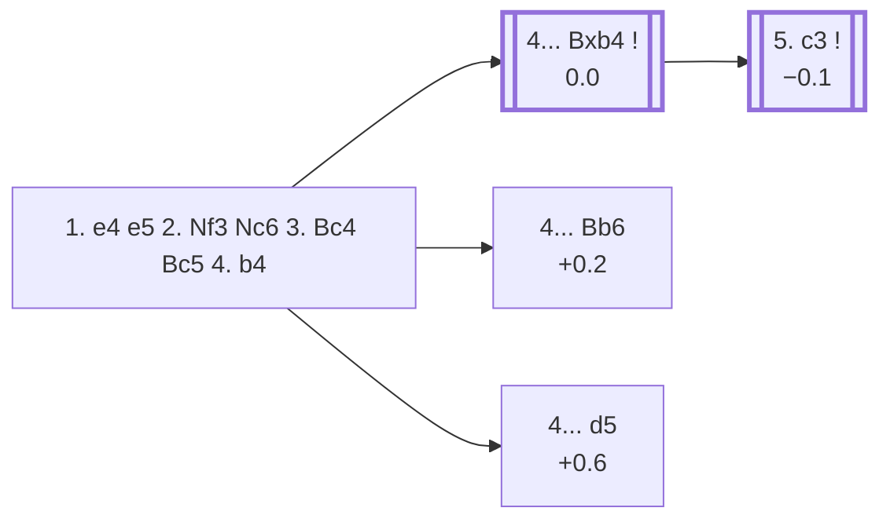

<a name="_TOP_"></a>

# C51 Italian Game: Evans Gambit <br> 1. e4 e5 2. Nf3 Nc6 3. Bc4 Bc5 4. b4 #

Spun off from [C50's own "4. b4" candidate bullet](https://github.com/onclemarcel/chess_flashcards/blob/main/e4_openings/C50_Italian.md#_Bc5_), a genuine zero-coverage gap surfaced by a full A00-E99 ECO-code audit despite being one of the most historically famous gambits in chess (Kasparov himself revived it at the top level in the 1990s). White offers the b-pawn to deflect the c5-bishop, planning a big c3/d4 pawn centre and a fast lead in development.

### Overview

*Quick map of every move covered on this card — see the [shape key](https://github.com/onclemarcel/chess_flashcards/blob/main/start.md#content-diagram-optional) in start.md.*

<!-- content-diagram:start -->

<!-- content-diagram:end -->

<a name="_initial_move_"></a>

[](https://lichess.org/analysis/standard/r1bqk1nr/pppp1ppp/2n5/2b1p3/1PB1P3/5N2/P1PP1PPP/RNBQK2R_b_KQkq_b3_0_4)

*... 4. b4 — Evans Gambit*

```
r1bqk1nr/pppp1ppp/2n5/2b1p3/1PB1P3/5N2/P1PP1PPP/RNBQK2R b KQkq b3 0 4
```

|  | 0.0 |
| --- | --- |

<!-- lichess-stats:start fen="r1bqk1nr/pppp1ppp/2n5/2b1p3/1PB1P3/5N2/P1PP1PPP/RNBQK2R b KQkq b3 0 4" db="lichess,masters" speeds="bullet,blitz" ratings="1800,2000,2200,2500" moves="8" -->
| Move | Online | W/D/B | Masters | W/D/B | |
| :--- | ---: | :--- | ---: | :--- | :-- |
| Bxb4 | 2.0 M (81.0%) | ⬜⬜⬜⬜⬜⬛⬛⬛⬛⬛ 51/3/45 | 1.5 k (86.1%) | ⬜⬜⬜🟫🟫🟫🟫⬛⬛⬛ 27/46/28 |  |
| Bb6 | 291 k (11.8%) | ⬜⬜⬜⬜⬜⬛⬛⬛⬛⬛ 46/4/50 | 219 (12.8%) | ⬜⬜⬜🟫🟫🟫⬛⬛⬛⬛ 30/32/38 |  |
| Nxb4 | 68 k (2.7%) | ⬜⬜⬜⬜⬜⬜⬛⬛⬛⬛ 57/3/40 | 1 (0.1%) | — | ⚠ |
| d6 | 31 k (1.2%) | ⬜⬜⬜⬜⬜⬜⬜⬛⬛⬛ 67/3/31 | 0 | — | ⚠ |
| Nf6 | 30 k (1.2%) | ⬜⬜⬜⬜⬜⬜⬜⬛⬛⬛ 68/3/29 | 0 | — | ⚠ |
| Be7 | 14 k (0.6%) | ⬜⬜⬜⬜⬜🟫⬛⬛⬛⬛ 53/4/43 | 9 (0.5%) | — |  |
| Bd4 | 10 k (0.4%) | ⬜⬜⬜⬜⬜⬜⬛⬛⬛⬛ 57/3/40 | 0 | — | ⚠ |
| Bd6 | 7.4 k (0.3%) | ⬜⬜⬜⬜⬜⬜⬛⬛⬛⬛ 55/3/42 | 1 (0.1%) | — | ⚠ |
| d5 | 0 | — | 8 (0.5%) | — |  |

*Online: bullet/blitz, 1800+ — 2.5 M games. Masters: 1.7 k games. [Open in the explorer](https://lichess.org/analysis/standard/r1bqk1nr/pppp1ppp/2n5/2b1p3/1PB1P3/5N2/P1PP1PPP/RNBQK2R_b_KQkq_b3_0_4#explorer) — updated 2026-09-05*
<!-- lichess-stats:end -->

### Candidate moves

* [**4... Bxb4**](#_Bxb4_) (0.0, 86.1% masters): masters' overwhelming choice — accepting the pawn, covered below.
* [**4... Bb6**](#_Bb6_) (+0.2, 12.8% masters): declining while keeping the bishop's diagonal, covered below.
* [**4... d5**](#_d5_) (+0.6, 0.5% masters): live-tagged the ***Hein Countergambit*** — a real database rarity, not built out further here (backlog).

[*Back to TOP*](#_TOP_)

---

<a name="_Bxb4_"></a>

### 4... Bxb4 — Evans Gambit Accepted

[](https://lichess.org/analysis/standard/r1bqk1nr/pppp1ppp/2n5/4p3/1bB1P3/5N2/P1PP1PPP/RNBQK2R_w_KQkq_-_0_5)

*... 4... Bxb4 — Evans Gambit Accepted*

```
r1bqk1nr/pppp1ppp/2n5/4p3/1bB1P3/5N2/P1PP1PPP/RNBQK2R w KQkq - 0 5
```

|  | 0.0 |
| --- | --- |

**5. c3** is essentially forced (100% of masters games) — the whole point of the gambit, kicking the bishop while preparing d4.

[*Back to 4. b4*](#_initial_move_)
[*Back to TOP*](#_TOP_)

---

<a name="_c3_"></a>

### 5. c3

[](https://lichess.org/analysis/standard/r1bqk1nr/pppp1ppp/2n5/4p3/1bB1P3/2P2N2/P2P1PPP/RNBQK2R_b_KQkq_-_0_5)

*... 5. c3*

```
r1bqk1nr/pppp1ppp/2n5/4p3/1bB1P3/2P2N2/P2P1PPP/RNBQK2R b KQkq - 0 5
```

|  | −0.1 |
| --- | --- |

The bishop retreats:

* **5... Ba5** (60.5% masters): masters' actual main line by a wide margin, keeping the bishop pinned toward a future ...Qb6/...b5 idea — but this transposes straight into ECO's own C52 (*Compromised Defence* territory), so it falls outside this card's scope (backlog, not built out further here).
* [**5... Be7**](#_Anderssen_) (29.6% masters): covered below.
* **5... Bc5** (2.5% masters): transposes back into the main tabiya below.
* [**5... Bd6**](#_StoneWare_) (7.3% masters): covered below.
* [**5... Bf8**](#_MayetDefence_) (0.1% masters, a genuine database rarity): covered below.

Continuing **5... Bc5 6. d4 exd4 7. O-O d6 8. cxd4 Bb6**, White has a full pawn centre and a real lead in development for the gambit pawn — this exact tabiya is live-tagged the ***McDonnell Defense, Main Line*** (+0.2), the *normal Variation* in `eco.md`'s own naming.

[](https://lichess.org/analysis/standard/r1bqk1nr/ppp2ppp/1bnp4/8/2BPP3/5N2/P4PPP/RNBQ1RK1_w_kq_-_1_9)

*... 8... Bb6 — McDonnell Defense, Main Line*

```
r1bqk1nr/ppp2ppp/1bnp4/8/2BPP3/5N2/P4PPP/RNBQ1RK1 w kq - 1 9
```

|  | +0.2 |
| --- | --- |

* [**9. Nc3**](#_Morphy_) (+0.4): the *Morphy Attack* — covered below.
* [**9. d5**](#_Ulvestad_) (0.0): toward the *Ulvestad Variation* — covered below.

[*Back to 4... Bxb4*](#_Bxb4_)
[*Back to TOP*](#_TOP_)

---

<a name="_Morphy_"></a>

### 9. Nc3 — Morphy Attack

[](https://lichess.org/analysis/standard/r1bqk1nr/ppp2ppp/1bnp4/8/2BPP3/2N2N2/P4PPP/R1BQ1RK1_b_kq_-_2_9)

*... 9. Nc3 — Morphy Attack*

```
r1bqk1nr/ppp2ppp/1bnp4/8/2BPP3/2N2N2/P4PPP/R1BQ1RK1 b kq - 2 9
```

|  | +0.4 |
| --- | --- |

Masters split between **9... Na5** (57.9%) and **9... Bg4** (36.8%) — note the online pool inverts this almost entirely, preferring Bg4 (44.7%) to Na5 (a mere 2.1%), a real online/masters split.

* **9... Na5** (57.9% masters): trades off the strong c4-bishop. Deeper, **10. Bg5!?**, live-tagged the ***Göring Attack*** (−0.2, `eco.md` spells it *Goering*), pins the f6-knight (which isn't even on the board yet — the pin is on the f-file toward the king) rather than retreating the bishop; masters split between **10... f6** (65.4%) and **10... Ne7**. Continuing **10... f6 11. Be3!?**, the *Steinitz Variation* (−0.4), retreats instead of trading. Neither built out further here (backlog).
* [**9... Bg4**](#_Bg4_) (36.8% masters): pins the f3-knight instead — covered below.

[*Back to 5. c3*](#_c3_)
[*Back to TOP*](#_TOP_)

---

<a name="_Bg4_"></a>

### 9... Bg4

[](https://lichess.org/analysis/standard/r2qk1nr/ppp2ppp/1bnp4/8/2BPP1b1/2N2N2/P4PPP/R1BQ1RK1_w_kq_-_3_10)

*... 9... Bg4*

```
r2qk1nr/ppp2ppp/1bnp4/8/2BPP1b1/2N2N2/P4PPP/R1BQ1RK1 w kq - 3 10
```

|  | +0.13 |
| --- | --- |

Pins the f3-knight rather than trading the bishop off on a5. **10. Qa4!?**, live-tagged the *Fraser Attack* (0.00), pins the c6-knight to the king along the a4-e8 diagonal instead of castling further or developing quietly. Masters have no recorded games at this exact position (a genuine online-only try); online, Black's clear main reply is **10... Bxf3** (69.8%), simplifying immediately rather than retreating the bishop. Deeper, **10... Bd7 11. Qb3 Na5 12. Bxf7+ Kf8 13. Qc2**, the *Fraser-Mortimer Attack* (−0.73, a real engine swing toward Black despite White's piece sac for two pawns and an exposed king), is a long forcing sequence. Neither built out further here (backlog).

[*Back to 9. Nc3 — Morphy Attack*](#_Morphy_)
[*Back to TOP*](#_TOP_)

---

<a name="_Ulvestad_"></a>

### 9. d5 — toward the Ulvestad Variation

[](https://lichess.org/analysis/standard/r1bqk1nr/ppp2ppp/1bnp4/3P4/2B1P3/5N2/P4PPP/RNBQ1RK1_b_kq_-_0_9)

*... 9. d5 — toward the Ulvestad Variation*

```
r1bqk1nr/ppp2ppp/1bnp4/3P4/2B1P3/5N2/P4PPP/RNBQ1RK1 b kq - 0 9
```

|  | 0.0 |
| --- | --- |

**9... Na5** attacks the c4-bishop, and after **10. Bb2**, White develops the bishop toward the long diagonal instead of retreating it further. This is the *Ulvestad Variation* (+0.1) — a real, if now sparsely-played, database-confirmed line. Deeper, **10... Ne7**, the *Paulsen Variation* (0.0), redeploys the knight to reroute it toward g6 or f5 rather than sitting offside on a5. Neither built out further here (backlog).

[*Back to 5. c3*](#_c3_)
[*Back to TOP*](#_TOP_)

---

<a name="_Bb6_"></a>

### 4... Bb6 — Evans Gambit Declined

[](https://lichess.org/analysis/standard/r1bqk1nr/pppp1ppp/1bn5/4p3/1PB1P3/5N2/P1PP1PPP/RNBQK2R_w_KQkq_-_1_5)

*... 4... Bb6 — Evans Gambit Declined*

```
r1bqk1nr/pppp1ppp/1bn5/4p3/1PB1P3/5N2/P1PP1PPP/RNBQK2R w KQkq - 1 5
```

|  | +0.2 |
| --- | --- |

Keeps the bishop's own diagonal rather than accepting a pawn that comes with real theoretical obligations.

* [**5. a4**](#_a4_) (80.0% masters): masters' clear main try — covered below.
* [**5. b5**](#_b5_) (10.0% masters): pushes the pawn immediately instead — covered below.
* [**5. Bb2**](#_Cordel_) (mention-only): the *Cordel Variation* — covered below.

[*Back to 4. b4*](#_initial_move_)
[*Back to TOP*](#_TOP_)

---

<a name="_a4_"></a>

### 5. a4

[](https://lichess.org/analysis/standard/r1bqk1nr/pppp1ppp/1bn5/4p3/PPB1P3/5N2/2PP1PPP/RNBQK2R_b_KQkq_a3_0_5)

*... 5. a4*

```
r1bqk1nr/pppp1ppp/1bn5/4p3/PPB1P3/5N2/2PP1PPP/RNBQK2R b KQkq a3 0 5
```

|  | 0.0 |
| --- | --- |

Threatens **a5**, gaining a further tempo on the bishop. **5... a6**, continuing **6. Nc3!?**, is the *Showalter Variation* (+0.2, a real, well-tested try, 78 masters games) — masters split between **6... Nf6** (75.6%) and **6... d6** (24.4%). Not built out further here (backlog).

[*Back to 4... Bb6*](#_Bb6_)
[*Back to TOP*](#_TOP_)

---

<a name="_b5_"></a>

### 5. b5

[](https://lichess.org/analysis/standard/r1bqk1nr/pppp1ppp/1bn5/1P2p3/2B1P3/5N2/P1PP1PPP/RNBQK2R_b_KQkq_-_0_5)

*... 5. b5*

```
r1bqk1nr/pppp1ppp/1bn5/1P2p3/2B1P3/5N2/P1PP1PPP/RNBQK2R b KQkq - 0 5
```

|  | 0.0 |
| --- | --- |

**5... Na5** is essentially forced — the knight has to move somewhere and this keeps an eye on the c4-bishop. After **6. Nxe5!?**, White grabs the e-pawn rather than retreating the bishop — a real, sharp continuation, live-verified untagged at this exact bare ply despite `eco.md`'s own naming starting here.

[](https://lichess.org/analysis/standard/r1bqk1nr/pppp1ppp/1b6/nP2N3/2B1P3/8/P1PP1PPP/RNBQK2R_b_KQkq_-_0_6)

```
r1bqk1nr/pppp1ppp/1b6/nP2N3/2B1P3/8/P1PP1PPP/RNBQK2R b KQkq - 0 6
```

|  | −0.3 |
| --- | --- |

* [**6... Nh6**](#_Lange_) (a genuine database rarity): the *Lange Variation* — covered below.
* [**6... Qg5**](#_Hirschbach_) (a genuine database rarity): the *Hirschbach Variation* — covered below.

[*Back to 4... Bb6*](#_Bb6_)
[*Back to TOP*](#_TOP_)

---

<a name="_Lange_"></a>

### 6... Nh6 — Lange Variation

[](https://lichess.org/analysis/standard/r1bqk2r/pppp1ppp/1b5n/nP2N3/2B1P3/8/P1PP1PPP/RNBQK2R_w_KQkq_-_1_7)

*... 6... Nh6 — Lange Variation*

```
r1bqk2r/pppp1ppp/1b5n/nP2N3/2B1P3/8/P1PP1PPP/RNBQK2R w KQkq - 1 7
```

|  | −0.3 |
| --- | --- |

Develops the knight to a slightly awkward square rather than trading it off. Deeper, **7. d4 d6 8. Bxh6 dxe5 9. Bxg7 Rg8 10. Bxf7+ Kxf7 11. Bxe5 Qg5 12. Nd2**, the *Pavlov Variation* — a long forcing sequence trading White's dark-squared bishop and two minor pieces' worth of activity for a rook and two pawns, ending with a real engine swing back toward Black (−0.7) despite the material grab. Not built out further here (backlog).

[*Back to 5. b5*](#_b5_)
[*Back to TOP*](#_TOP_)

---

<a name="_Hirschbach_"></a>

### 6... Qg5 — Hirschbach Variation

[](https://lichess.org/analysis/standard/r1b1k1nr/pppp1ppp/1b6/nP2N1q1/2B1P3/8/P1PP1PPP/RNBQK2R_w_KQkq_-_1_7)

*... 6... Qg5 — Hirschbach Variation*

```
r1b1k1nr/pppp1ppp/1b6/nP2N1q1/2B1P3/8/P1PP1PPP/RNBQK2R w KQkq - 1 7
```

|  | −0.6 |
| --- | --- |

Forks the e5-knight and g2 pawn at once — a sharper try than 6... Nh6, and already a real engine edge for Black. Two named continuations:

* **7. Bxf7+ Ke7 8. Qh5!?**, the *Vasquez Variation* (−0.2) — White grabs a second pawn and counter-attacks rather than retreating.
* **7. Qf3 Qxe5 8. Qxf7+ Kd8 9. Bb2!?**, the *Hicken Variation* (−1.5, a real engine swing toward Black) — White regains the piece but Black's material and king safety both come out ahead.

Neither built out further here (backlog).

[*Back to 5. b5*](#_b5_)
[*Back to TOP*](#_TOP_)

---

<a name="_Cordel_"></a>

### 5. Bb2 — Cordel Variation

[](https://lichess.org/analysis/standard/r1bqk1nr/pppp1ppp/1bn5/4p3/1PB1P3/5N2/PBPP1PPP/RN1QK2R_b_KQkq_-_2_5)

*... 5. Bb2 — Cordel Variation*

```
r1bqk1nr/pppp1ppp/1bn5/4p3/1PB1P3/5N2/PBPP1PPP/RN1QK2R b KQkq - 2 5
```

|  | −0.1 |
| --- | --- |

Develops the bishop toward the long diagonal immediately instead of gaining space with a4/b5 first. Masters' clear reply is **5... d6** (86.7%). Not built out further here (backlog).

[*Back to 4... Bb6*](#_Bb6_)
[*Back to TOP*](#_TOP_)

---

<a name="_StoneWare_"></a>

### 5... Bd6 — Stone-Ware Variation

[](https://lichess.org/analysis/standard/r1bqk1nr/pppp1ppp/2nb4/4p3/2B1P3/2P2N2/P2P1PPP/RNBQK2R_w_KQkq_-_1_6)

*... 5... Bd6 — Stone-Ware Variation*

```
r1bqk1nr/pppp1ppp/2nb4/4p3/2B1P3/2P2N2/P2P1PPP/RNBQK2R w KQkq - 1 6
```

|  | +0.32 |
| --- | --- |

Sidesteps c3's attack on the bishop while keeping an eye on e5, rather than retreating further back. Masters' clear reply is **6. d4** (88.8%). Not built out further here (backlog).

[*Back to 5. c3*](#_c3_)
[*Back to TOP*](#_TOP_)

---

<a name="_MayetDefence_"></a>

### 5... Bf8 — Mayet Defence

[](https://lichess.org/analysis/standard/r1bqkbnr/pppp1ppp/2n5/4p3/2B1P3/2P2N2/P2P1PPP/RNBQK2R_w_KQkq_-_1_6)

*... 5... Bf8 — Mayet Defence*

```
r1bqkbnr/pppp1ppp/2n5/4p3/2B1P3/2P2N2/P2P1PPP/RNBQK2R w KQkq - 1 6
```

|  | +0.34 |
| --- | --- |

Retreats all the way home — a genuine database rarity (only 2 masters games total), conceding the bishop's activity entirely to bank the extra tempo. Masters' only recorded try is **6. d4** (100%, both games). Not built out further here (backlog).

[*Back to 5. c3*](#_c3_)
[*Back to TOP*](#_TOP_)

---

<a name="_Anderssen_"></a>

### 5... Be7 — Anderssen Variation

[](https://lichess.org/analysis/standard/r1bqk1nr/ppppbppp/2n5/4p3/2B1P3/2P2N2/P2P1PPP/RNBQK2R_w_KQkq_-_1_6)

*... 5... Be7 — Anderssen Variation*

```
r1bqk1nr/ppppbppp/2n5/4p3/2B1P3/2P2N2/P2P1PPP/RNBQK2R w KQkq - 1 6
```

|  | 0.00 |
| --- | --- |

`eco.md` leaves this bare ply untagged (its own label is literally "5...Be7"), but the live explorer already tags it the ***Anderssen Variation*** — a real name divergence. Masters' clear main try is **6. d4** (93.8%), continuing **6... Na5**, reaching the ***Anderssen Variation, Cordel Line*** — [covered below](#_CordelLine_). Note the name collision: this is a *different* "Cordel Variation" from the one already covered under [4... Bb6 5. Bb2](#_Cordel_) — `eco.md` re-uses the bare name "Cordel Variation" for both.

[*Back to 5. c3*](#_c3_)
[*Back to TOP*](#_TOP_)

---

<a name="_CordelLine_"></a>

### 6... Na5 — Anderssen Variation, Cordel Line

[](https://lichess.org/analysis/standard/r1bqk1nr/ppppbppp/8/n3p3/2BPP3/2P2N2/P4PPP/RNBQK2R_w_KQkq_-_1_7)

*... 6... Na5 — Anderssen Variation, Cordel Line*

```
r1bqk1nr/ppppbppp/8/n3p3/2BPP3/2P2N2/P4PPP/RNBQK2R w KQkq - 1 7
```

|  | 0.00 |
| --- | --- |

Attacks the c4-bishop immediately rather than castling or developing further. Masters split three ways: **7. Be2** (46.6%), **7. Nxe5** (28.7%), and **7. Bd3** (24.2%). Not built out further here (backlog).

[*Back to 5... Be7*](#_Anderssen_)
[*Back to TOP*](#_TOP_)

---

<a name="_d5_"></a>

### 4... d5 — Hein Countergambit

[](https://lichess.org/analysis/standard/r1bqk1nr/ppp2ppp/2n5/2bpp3/1PB1P3/5N2/P1PP1PPP/RNBQK2R_w_KQkq_d6_0_5)

*... 4... d5 — Hein Countergambit*

```
r1bqk1nr/ppp2ppp/2n5/2bpp3/1PB1P3/5N2/P1PP1PPP/RNBQK2R w KQkq d6 0 5
```

|  | +0.6 |
| --- | --- |

`eco.md`'s own name for this is the *Evans Counter-Gambit*, but the live explorer already tags it the ***Hein Countergambit*** — a real name divergence. Counter-offers a pawn back to open the centre before White can consolidate — a genuine database rarity today (8 masters games). Masters' main try is **5. exd5** (75.0%). Not built out further here (backlog).

[*Back to 4. b4*](#_initial_move_)
[*Back to TOP*](#_TOP_)
