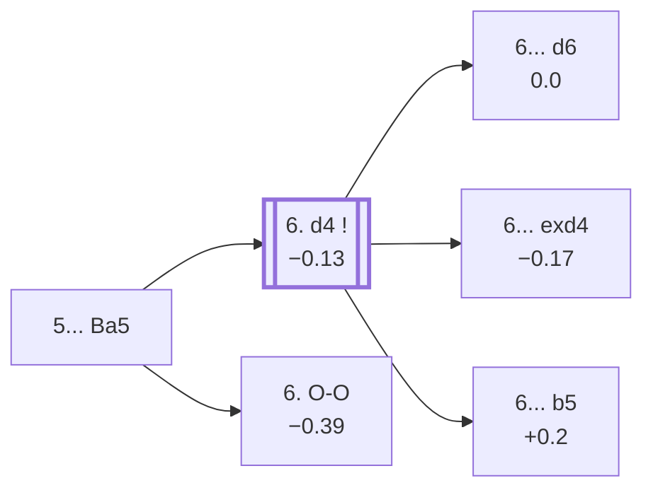

<a name="_TOP_"></a>

# C52 Italian Game: Evans Gambit, Main Line <br> 1. e4 e5 2. Nf3 Nc6 3. Bc4 Bc5 4. b4 Bxb4 5. c3 Ba5 #

Spun off from [C51's own "5. c3" candidate bullet](https://github.com/onclemarcel/chess_flashcards/blob/main/e4_openings/C51_Evans_Gambit.md#_c3_) — masters' actual most popular reply there by a wide margin (60.5%), even though it transposes straight into its own ECO code rather than staying at C51. Keeping the bishop pinned toward a future ...Qb6/...b5 idea, rather than retreating it further back or accepting the transposition into the Bc5 tabiya.

### Overview

*Quick map of every move covered on this card — see the [shape key](https://github.com/onclemarcel/chess_flashcards/blob/main/start.md#content-diagram-optional) in start.md.*

<!-- content-diagram:start -->

<!-- content-diagram:end -->

<a name="_initial_move_"></a>

[](https://lichess.org/analysis/standard/r1bqk1nr/pppp1ppp/2n5/b3p3/2B1P3/2P2N2/P2P1PPP/RNBQK2R_w_KQkq_-_1_6)

*... 5... Ba5 — Evans Gambit, Main Line*

```
r1bqk1nr/pppp1ppp/2n5/b3p3/2B1P3/2P2N2/P2P1PPP/RNBQK2R w KQkq - 1 6
```

|  | 0.00 |
| --- | --- |

<!-- lichess-stats:start fen="r1bqk1nr/pppp1ppp/2n5/b3p3/2B1P3/2P2N2/P2P1PPP/RNBQK2R w KQkq - 1 6" db="lichess,masters" speeds="bullet,blitz" ratings="1800,2000,2200,2500" moves="8" -->
| Move | Online | W/D/B | Masters | W/D/B | |
| :--- | ---: | :--- | ---: | :--- | :-- |
| d4 | 752 k (78.3%) | ⬜⬜⬜⬜⬜⬛⬛⬛⬛⬛ 52/3/45 | 843 (94.8%) | ⬜⬜🟫🟫🟫🟫🟫🟫⬛⬛ 21/55/24 |  |
| O-O | 115 k (12.0%) | ⬜⬜⬜⬜⬜⬛⬛⬛⬛⬛ 46/3/51 | 34 (3.8%) | ⬜⬜⬜🟫🟫🟫🟫⬛⬛⬛ 32/35/32 |  |
| Qb3 | 86 k (8.9%) | ⬜⬜⬜⬜⬜⬛⬛⬛⬛⬛ 52/3/46 | 12 (1.3%) | — |  |
| Ba3 | 5.0 k (0.5%) | ⬜⬜⬜⬜⬛⬛⬛⬛⬛⬛ 43/3/54 | 0 | — | ⚠ |
| d3 | 1.1 k (0.1%) | ⬜⬜⬜⬜⬛⬛⬛⬛⬛⬛ 41/3/55 | 0 | — | ⚠ |
| a4 | 393 (0.0%) | ⬜⬜⬜⬜⬛⬛⬛⬛⬛⬛ 39/2/59 | 0 | — | ⚠ |
| Bb2 | 359 (0.0%) | ⬜⬜⬜⬜⬛⬛⬛⬛⬛⬛ 40/2/57 | 0 | — | ⚠ |
| Qa4 | 331 (0.0%) | ⬜⬜⬜⬜⬜⬛⬛⬛⬛⬛ 46/3/51 | 0 | — | ⚠ |

*Online: bullet/blitz, 1800+ — 961 k games. Masters: 889 games. [Open in the explorer](https://lichess.org/analysis/standard/r1bqk1nr/pppp1ppp/2n5/b3p3/2B1P3/2P2N2/P2P1PPP/RNBQK2R_w_KQkq_-_1_6#explorer) — updated 2026-09-06*
<!-- lichess-stats:end -->

### Candidate moves

* [**6. d4**](#_d4_) (−0.13, 94.8% masters): masters' overwhelming choice, striking the centre at once — covered below.
* [**6. O-O**](#_OO_) (−0.39, 3.8% masters): live-tagged the ***Slow Variation***, castling before committing the centre pawn — covered below.
* **6. Qb3** (1.3% masters): a genuine minor try, not built out further here (backlog).

[*Back to TOP*](#_TOP_)

---

<a name="_d4_"></a>

### 6. d4

[](https://lichess.org/analysis/standard/r1bqk1nr/pppp1ppp/2n5/b3p3/2BPP3/2P2N2/P4PPP/RNBQK2R_b_KQkq_d3_0_6)

*... 6. d4*

```
r1bqk1nr/pppp1ppp/2n5/b3p3/2BPP3/2P2N2/P4PPP/RNBQK2R b KQkq d3 0 6
```

|  | −0.13 |
| --- | --- |

Strikes the centre while the bishop still sits offside on a5.

* [**6... d6**](#_d6_) (53.7% masters): live-tagged the ***Bronstein Defense*** (`eco.md` leaves this bare ply untagged, itself just labelled "Evans Gambit") — covered below.
* [**6... exd4**](#_exd4_) (42.2% masters): opens the position immediately — covered below.
* [**6... b5**](#_Leonhardt_) (1.3% masters): the ***Leonhardt Countergambit*** (`eco.md`'s own name is *Leonhardt Variation*, a real name divergence) — covered below.

[*Back to 5... Ba5*](#_initial_move_)
[*Back to TOP*](#_TOP_)

---

<a name="_exd4_"></a>

### 6... exd4 7. O-O

[](https://lichess.org/analysis/standard/r1bqk1nr/pppp1ppp/2n5/b7/2BpP3/2P2N2/P4PPP/RNBQ1RK1_b_kq_-_1_7)

*... 6... exd4 7. O-O*

```
r1bqk1nr/pppp1ppp/2n5/b7/2BpP3/2P2N2/P4PPP/RNBQ1RK1 b kq - 1 7
```

|  | −0.17 |
| --- | --- |

Castles before recapturing, banking on development rather than the pawn. Black's reply here is a genuinely even spread at masters level: **7... Nge7** (54.5%), **7... Nf6** (19.6%), **7... d6** (8.6%), **7... d3** (7.2%), **7... dxc3** (5.3%), and **7... Bb6** (4.8%) — worth noting the ***Compromised Defense*** (7...dxc3) is actually one of masters' *least* popular tries here despite being the most heavily annotated line in the books. Only the `eco.md`-named line is built out further on this card:

* [**7... dxc3**](#_Compromised_) (5.3% masters): the ***Compromised Defense*** — covered below.

The other replies (Nge7/Nf6/d6/d3/Bb6) aren't built out further here (backlog).

[*Back to 6. d4*](#_d4_)
[*Back to TOP*](#_TOP_)

---

<a name="_Compromised_"></a>

### 7... dxc3 — Compromised Defense

[](https://lichess.org/analysis/standard/r1bqk1nr/pppp1ppp/2n5/b7/2B1P3/2p2N2/P4PPP/RNBQ1RK1_w_kq_-_0_8)

*... 7... dxc3 — Compromised Defense*

```
r1bqk1nr/pppp1ppp/2n5/b7/2B1P3/2p2N2/P4PPP/RNBQ1RK1 w kq - 0 8
```

|  | +0.17 |
| --- | --- |

`eco.md` spells this the "compromised Defence"; the live explorer's own capitalisation is *Compromised Defense*. Grabs a second pawn, but the extra c3-pawn will fall right back and Black's king is stuck in the centre a while longer. **8. Qb3** is essentially forced (100% masters, 81.3% online), forking f7 and b7 at once. **8... Qf6** (81.8% masters) defends both, and after **9. e5!?** (69.2% masters) forking the queen, **9... Qg6 10. Nxc3 Nge7** reaches a further, near-forced tabiya where White's 11th move genuinely forks:

* [**11. Ba3**](#_CompromisedMain_): live-tagged *Compromised Defense, Main Line* — a real name divergence from `eco.md`'s own *Paulsen Variation* — covered below.
* [**11. Rd1**](#_Potter_): the *Potter Variation* — covered below.

[*Back to 6... exd4 7. O-O*](#_exd4_)
[*Back to TOP*](#_TOP_)

---

<a name="_CompromisedMain_"></a>

### 11. Ba3 — Compromised Defense, Main Line

[](https://lichess.org/analysis/standard/r1b1k2r/ppppnppp/2n3q1/b3P3/2B5/BQN2N2/P4PPP/R4RK1_b_kq_-_2_11)

*... 11. Ba3 — Compromised Defense, Main Line*

```
r1b1k2r/ppppnppp/2n3q1/b3P3/2B5/BQN2N2/P4PPP/R4RK1 b kq - 2 11
```

|  | 0.00 |
| --- | --- |

Develops the bishop actively rather than defending the a-rook's own file. Masters' recorded main try here is **11... O-O** (a genuine database rarity, only 5 masters games total at this exact position), though online **11... Bxc3** (32.7%) is a real secondary try alongside it (59.6% O-O). Not built out further here (backlog).

[*Back to 7... dxc3*](#_Compromised_)
[*Back to TOP*](#_TOP_)

---

<a name="_Potter_"></a>

### 11. Rd1 — Potter Variation

[](https://lichess.org/analysis/standard/r1b1k2r/ppppnppp/2n3q1/b3P3/2B5/1QN2N2/P4PPP/R1BR2K1_b_kq_-_2_11)

*... 11. Rd1 — Potter Variation*

```
r1b1k2r/ppppnppp/2n3q1/b3P3/2B5/1QN2N2/P4PPP/R1BR2K1 b kq - 2 11
```

|  | 0.00 |
| --- | --- |

Centralises the rook instead of developing the bishop — a genuine database rarity (no masters games recorded, only 69 online). Masters' analogue reply pattern online is overwhelmingly **11... O-O** (87.0%). Not built out further here (backlog).

[*Back to 7... dxc3*](#_Compromised_)
[*Back to TOP*](#_TOP_)

---

<a name="_Leonhardt_"></a>

### 6... b5 — Leonhardt Countergambit

[](https://lichess.org/analysis/standard/r1bqk1nr/p1pp1ppp/2n5/bp2p3/2BPP3/2P2N2/P4PPP/RNBQK2R_w_KQkq_b6_0_7)

*... 6... b5 — Leonhardt Countergambit*

```
r1bqk1nr/p1pp1ppp/2n5/bp2p3/2BPP3/2P2N2/P4PPP/RNBQK2R w KQkq b6 0 7
```

|  | +0.20 |
| --- | --- |

Counter-offers a second pawn to deflect the c4-bishop away from f7, rather than resolving the central tension. Masters' clear reply is **7. Bxb5** (72.7%). Not built out further here (backlog).

[*Back to 6. d4*](#_d4_)
[*Back to TOP*](#_TOP_)

---

<a name="_d6_"></a>

### 6... d6 — Bronstein Defense

[](https://lichess.org/analysis/standard/r1bqk1nr/ppp2ppp/2np4/b3p3/2BPP3/2P2N2/P4PPP/RNBQK2R_w_KQkq_-_0_7)

*... 6... d6 — Bronstein Defense*

```
r1bqk1nr/ppp2ppp/2np4/b3p3/2BPP3/2P2N2/P4PPP/RNBQK2R w KQkq - 0 7
```

|  | 0.00 |
| --- | --- |

Solidifies e5 before resolving the central tension. Note a real online/masters split at White's next move: masters strongly prefer **7. Qb3** (92.9%), while online it's nearly a coin flip between **7. O-O** (39.8%) and **7. Qb3** (38.1%) — another genuine online/masters inversion.

* [**7. Qb3**](#_Tartakower_) (92.9% masters): the *Tartakower Attack* — covered below.
* [**7. Bg5**](#_Sokolsky_) (0.2% online, no masters games recorded): the *Sokolsky Variation*, a genuine database rarity — covered below.

[*Back to 6. d4*](#_d4_)
[*Back to TOP*](#_TOP_)

---

<a name="_Tartakower_"></a>

### 7. Qb3 — Tartakower Attack

[](https://lichess.org/analysis/standard/r1bqk1nr/ppp2ppp/2np4/b3p3/2BPP3/1QP2N2/P4PPP/RNB1K2R_b_KQkq_-_1_7)

*... 7. Qb3 — Tartakower Attack*

```
r1bqk1nr/ppp2ppp/2np4/b3p3/2BPP3/1QP2N2/P4PPP/RNB1K2R b KQkq - 1 7
```

|  | 0.00 |
| --- | --- |

Forks f7 and b7 at once — the whole point of delaying O-O. Masters' clear reply is **7... Qd7** (97.6%, defending both points at once; online is less unanimous — 64.5% Qd7 / 25.2% Qe7). Continuing **8. dxe5 dxe5 9. O-O Bb6 10. Ba3 Na5 11. Nxe5!?**, the *Levenfish Variation* — a real piece sacrifice, trading a knight for two pawns and Black's central structure — is a further genuine engine-level dead heat (0.00). Not built out further here (backlog).

[*Back to 6... d6*](#_d6_)
[*Back to TOP*](#_TOP_)

---

<a name="_Sokolsky_"></a>

### 7. Bg5 — Sokolsky Variation

[](https://lichess.org/analysis/standard/r1bqk1nr/ppp2ppp/2np4/b3p1B1/2BPP3/2P2N2/P4PPP/RN1QK2R_b_KQkq_-_1_7)

*... 7. Bg5 — Sokolsky Variation*

```
r1bqk1nr/ppp2ppp/2np4/b3p1B1/2BPP3/2P2N2/P4PPP/RN1QK2R b KQkq - 1 7
```

|  | −0.55 |
| --- | --- |

Pins the f6-knight before it's even developed — a genuine database rarity (no masters games recorded, only 314 online) and, per the engine, a real (if modest) inaccuracy compared with the main **7. Qb3**. Not built out further here (backlog).

[*Back to 6... d6*](#_d6_)
[*Back to TOP*](#_TOP_)

---

<a name="_OO_"></a>

### 6. O-O — Slow Variation

[](https://lichess.org/analysis/standard/r1bqk1nr/pppp1ppp/2n5/b3p3/2B1P3/2P2N2/P2P1PPP/RNBQ1RK1_b_kq_-_2_6)

*... 6. O-O — Slow Variation*

```
r1bqk1nr/pppp1ppp/2n5/b3p3/2B1P3/2P2N2/P2P1PPP/RNBQ1RK1 b kq - 2 6
```

|  | −0.39 |
| --- | --- |

Castles before committing the centre pawn — `eco.md` leaves this bare ply as a generic "Evans Gambit", but the live explorer already tags it the ***Slow Variation***.

* [**6... Nf6**](#_Richardson_) (47.1% masters): covered below.
* [**6... d6**](#_OOd6_) (38.2% masters): covered below.

[*Back to 5... Ba5*](#_initial_move_)
[*Back to TOP*](#_TOP_)

---

<a name="_Richardson_"></a>

### 6... Nf6 7. d4 O-O 8. Nxe5 — Richardson Attack

[](https://lichess.org/analysis/standard/r1bq1rk1/pppp1ppp/2n2n2/b3N3/2BPP3/2P5/P4PPP/RNBQ1RK1_b_-_-_0_8)

*... 8. Nxe5 — Richardson Attack*

```
r1bq1rk1/pppp1ppp/2n2n2/b3N3/2BPP3/2P5/P4PPP/RNBQ1RK1 b - - 0 8
```

|  | −0.45 |
| --- | --- |

**7. d4** is essentially forced after 6...Nf6 (100% masters). **7... O-O** is masters' plurality (56.2%) but far from unanimous — online actually prefers **7... exd4** (50.1% online vs. only 25.0% masters), another real online/masters split. Grabbing the pawn back with **8. Nxe5!?** rather than the quieter **8. dxe5** is the *Richardson Attack* — a real, if modest, engine edge for Black despite the pawn grab. Not built out further here (backlog).

[*Back to 6. O-O*](#_OO_)
[*Back to TOP*](#_TOP_)

---

<a name="_OOd6_"></a>

### 6... d6

[](https://lichess.org/analysis/standard/r1bqk1nr/ppp2ppp/2np4/b3p3/2B1P3/2P2N2/P2P1PPP/RNBQ1RK1_w_kq_-_0_7)

*... 6... d6*

```
r1bqk1nr/ppp2ppp/2np4/b3p3/2B1P3/2P2N2/P2P1PPP/RNBQ1RK1 w kq - 0 7
```

|  | −0.31 |
| --- | --- |

Solidifies e5 before White strikes with d4. **7. d4** is masters' clear main try (87.5%), reaching a genuine four-way fork at Black's 7th move (masters: **Bb6** 59.4%, **Bg4** 21.9%, **Nf6** 9.4%, **exd4** 6.2%, **Bd7** 3.1%):

* [**7. d4 exd4 8. Qb3**](#_Waller_) (6.2% masters at move 7, but a much more popular online try, 27.8%): the *Waller Attack* — covered below.
* [**7. d4 Bb6**](#_Lasker_) (59.4% masters): masters' clear main try, the *Lasker Defence* — covered below.
* [**7. d4 Bd7**](#_SandersAlapin_) (3.1% masters, a genuine rarity): the *Sanders-Alapin Variation* — covered below.
* [**7. d4 Bg4**](#_AlapinSteinitz_) (21.9% masters): the *Alapin-Steinitz Variation* — covered below.

**7. Qb3** (12.5% masters) is a genuine minor try, not built out further here (backlog).

[*Back to 6. O-O*](#_OO_)
[*Back to TOP*](#_TOP_)

---

<a name="_Waller_"></a>

### 7... exd4 8. Qb3 — Waller Attack

[](https://lichess.org/analysis/standard/r1bqk1nr/ppp2ppp/2np4/b7/2BpP3/1QP2N2/P4PPP/RNB2RK1_b_kq_-_1_8)

*... 8. Qb3 — Waller Attack*

```
r1bqk1nr/ppp2ppp/2np4/b7/2BpP3/1QP2N2/P4PPP/RNB2RK1 b kq - 1 8
```

|  | +0.08 |
| --- | --- |

Forks f7 and b7 again rather than recapturing the pawn immediately. Masters' clear reply is **8... Qe7** (72.7%). Not built out further here (backlog).

[*Back to 6... d6*](#_OOd6_)
[*Back to TOP*](#_TOP_)

---

<a name="_Lasker_"></a>

### 7... Bb6 — Lasker Defence

[](https://lichess.org/analysis/standard/r1bqk1nr/ppp2ppp/1bnp4/4p3/2BPP3/2P2N2/P4PPP/RNBQ1RK1_w_kq_-_1_8)

*... 7... Bb6 — Lasker Defence*

```
r1bqk1nr/ppp2ppp/1bnp4/4p3/2BPP3/2P2N2/P4PPP/RNBQ1RK1 w kq - 1 8
```

|  | −0.18 |
| --- | --- |

Retreats the bishop to safety rather than grabbing the d4-pawn — masters' clear preference at move 7. Masters' clear reply is **8. dxe5** (75.0%). Not built out further here (backlog).

[*Back to 6... d6*](#_OOd6_)
[*Back to TOP*](#_TOP_)

---

<a name="_SandersAlapin_"></a>

### 7... Bd7 — Sanders-Alapin Variation

[](https://lichess.org/analysis/standard/r2qk1nr/pppb1ppp/2np4/b3p3/2BPP3/2P2N2/P4PPP/RNBQ1RK1_w_kq_-_1_8)

*... 7... Bd7 — Sanders-Alapin Variation*

```
r2qk1nr/pppb1ppp/2np4/b3p3/2BPP3/2P2N2/P4PPP/RNBQ1RK1 w kq - 1 8
```

|  | −0.14 |
| --- | --- |

Unpins the c6-knight in advance rather than resolving the centre — a genuine database rarity (only 1 masters game recorded at this exact position). Not built out further here (backlog).

[*Back to 6... d6*](#_OOd6_)
[*Back to TOP*](#_TOP_)

---

<a name="_AlapinSteinitz_"></a>

### 7... Bg4 — Alapin-Steinitz Variation

[](https://lichess.org/analysis/standard/r2qk1nr/ppp2ppp/2np4/b3p3/2BPP1b1/2P2N2/P4PPP/RNBQ1RK1_w_kq_-_1_8)

*... 7... Bg4 — Alapin-Steinitz Variation*

```
r2qk1nr/ppp2ppp/2np4/b3p3/2BPP1b1/2P2N2/P4PPP/RNBQ1RK1 w kq - 1 8
```

|  | −0.31 |
| --- | --- |

Pins the f3-knight instead of retreating the bishop or resolving the centre. Masters' recorded reply (a genuine rarity, 7 games total) is **8. Bb5** (42.9%). Not built out further here (backlog).

[*Back to 6... d6*](#_OOd6_)
[*Back to TOP*](#_TOP_)
