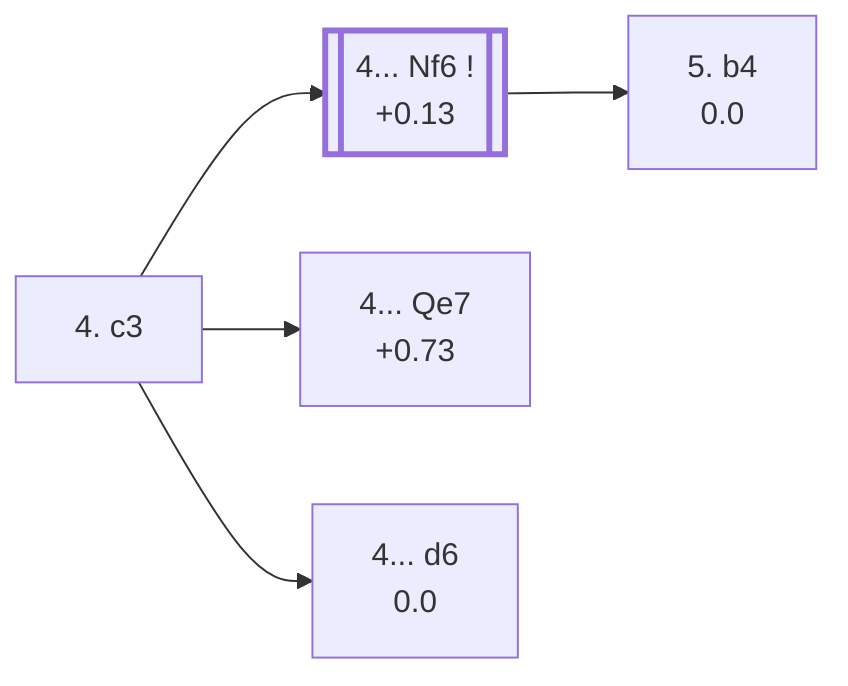

<a name="_TOP_"></a>

# C53 Italian Game: Giuoco Piano, Classical Variation <br> 1. e4 e5 2. Nf3 Nc6 3. Bc4 Bc5 4. c3 #

Spun off from [C50's own "4. c3" candidate bullet](https://github.com/onclemarcel/chess_flashcards/blob/main/e4_openings/C50_Italian.md#_Bc5_), a genuine zero-coverage gap. Rather than the quiet `d3` (C50's own Pianissimo), White prepares an immediate d4, aiming for a full pawn centre.

### Overview

*Quick map of every move covered on this card — see the [shape key](https://github.com/onclemarcel/chess_flashcards/blob/main/start.md#content-diagram-optional) in start.md.*

<!-- content-diagram:start -->

<!-- content-diagram:end -->

<a name="_initial_move_"></a>

[](https://lichess.org/analysis/standard/r1bqk1nr/pppp1ppp/2n5/2b1p3/2B1P3/2P2N2/PP1P1PPP/RNBQK2R_b_KQkq_-_0_4)

*... 4. c3 — Classical Variation*

```
r1bqk1nr/pppp1ppp/2n5/2b1p3/2B1P3/2P2N2/PP1P1PPP/RNBQK2R b KQkq - 0 4
```

|  | +0.09 |
| --- | --- |

<!-- lichess-stats:start fen="r1bqk1nr/pppp1ppp/2n5/2b1p3/2B1P3/2P2N2/PP1P1PPP/RNBQK2R b KQkq - 0 4" db="lichess,masters" speeds="bullet,blitz" ratings="1800,2000,2200,2500" moves="8" -->
| Move | Online | W/D/B | Masters | W/D/B | |
| :--- | ---: | :--- | ---: | :--- | :-- |
| Nf6 | 3.9 M (56.8%) | ⬜⬜⬜⬜⬜🟫⬛⬛⬛⬛ 51/5/45 | 13 k (96.0%) | ⬜⬜⬜🟫🟫🟫🟫🟫⬛⬛ 26/53/21 |  |
| d6 | 2.0 M (29.0%) | ⬜⬜⬜⬜⬜⬛⬛⬛⬛⬛ 50/4/45 | 169 (1.2%) | ⬜⬜⬜⬜🟫🟫🟫🟫⬛⬛ 40/36/25 |  |
| Qf6 | 209 k (3.1%) | ⬜⬜⬜⬜🟫⬛⬛⬛⬛⬛ 43/4/53 | 28 (0.2%) | ⬜⬜⬜⬜🟫🟫🟫⬛⬛⬛ 43/29/29 |  |
| Nge7 | 174 k (2.5%) | ⬜⬜⬜⬜⬜⬛⬛⬛⬛⬛ 51/4/46 | 2 (0.0%) | — | ⚠ |
| h6 | 161 k (2.3%) | ⬜⬜⬜⬜⬜⬜⬛⬛⬛⬛ 54/4/42 | 0 | — | ⚠ |
| Qe7 | 142 k (2.1%) | ⬜⬜⬜⬜🟫⬛⬛⬛⬛⬛ 43/4/53 | 266 (1.9%) | ⬜⬜⬜⬜⬜🟫🟫🟫⬛⬛ 48/28/24 |  |
| Bb6 | 140 k (2.0%) | ⬜⬜⬜⬜⬜⬛⬛⬛⬛⬛ 45/4/51 | 97 (0.7%) | ⬜⬜⬜⬜⬜🟫🟫⬛⬛⬛ 47/26/27 |  |
| a6 | 85 k (1.2%) | ⬜⬜⬜⬜⬜⬜⬛⬛⬛⬛ 56/3/41 | 1 (0.0%) | — | ⚠ |

*Online: bullet/blitz, 1800+ — 6.9 M games. Masters: 14 k games. [Open in the explorer](https://lichess.org/analysis/standard/r1bqk1nr/pppp1ppp/2n5/2b1p3/2B1P3/2P2N2/PP1P1PPP/RNBQK2R_b_KQkq_-_0_4#explorer) — updated 2026-09-07*
<!-- lichess-stats:end -->

### Candidate moves

* [**4... Nf6**](#_Nf6_) (+0.13, 96.0% masters): masters' overwhelming choice — covered below.
* [**4... Qe7**](#_Qe7_) (+0.73, 1.9% masters): live-tagged the ***Closed Variation*** (`eco.md` spells it lowercase, "close Variation") — covered below.
* [**4... d6**](#_d6_) (0.00, 1.2% masters): covered below.
* **4... Bb6** (0.7% masters): a genuine minor try, not built out further here (backlog).

[*Back to TOP*](#_TOP_)

---

<a name="_Nf6_"></a>

### 4... Nf6

[](https://lichess.org/analysis/standard/r1bqk2r/pppp1ppp/2n2n2/2b1p3/2B1P3/2P2N2/PP1P1PPP/RNBQK2R_w_KQkq_-_1_5)

*... 4... Nf6*

```
r1bqk2r/pppp1ppp/2n2n2/2b1p3/2B1P3/2P2N2/PP1P1PPP/RNBQK2R w KQkq - 1 5
```

|  | +0.13 |
| --- | --- |

Develops the last minor piece before committing the centre — masters' overwhelming choice at move 4. A real finding worth stating plainly: masters' *actual* main try from here is **5. d3** (75.7%!) — transposing straight back into [C50's own Giuoco Pianissimo tree](https://github.com/onclemarcel/chess_flashcards/blob/main/e4_openings/C50_Italian.md#_Pianissimo_) rather than staying in C53/C54 territory at all. Both `eco.md`-named branches below are genuinely secondary tries at masters level:

* [**5. b4**](#_Bird_) (2.7% masters): the *Bird's Attack* — covered below.
* **5. d4** (21.1% masters): live-tagged the *Center Attack* — and already **live-tagged its own code, C54**, at this exact bare ply (a real "wrong root code" divergence: `eco.md` keeps filing this whole branch, and everything under it, as C53) — covered on its own card, [C54](https://github.com/onclemarcel/chess_flashcards/blob/main/e4_openings/C54_Giuoco_Piano_Center_Attack.md).

[*Back to 4. c3*](#_initial_move_)
[*Back to TOP*](#_TOP_)

---

<a name="_Bird_"></a>

### 5. b4 — Bird's Attack

[](https://lichess.org/analysis/standard/r1bqk2r/pppp1ppp/2n2n2/2b1p3/1PB1P3/2P2N2/P2P1PPP/RNBQK2R_b_KQkq_b3_0_5)

*... 5. b4 — Bird's Attack*

```
r1bqk2r/pppp1ppp/2n2n2/2b1p3/1PB1P3/2P2N2/P2P1PPP/RNBQK2R b KQkq b3 0 5
```

|  | 0.00 |
| --- | --- |

Offers a second pawn to deflect the c5-bishop, Evans-Gambit style, rather than striking the centre with d4. Masters' clear reply is **5... Bb6** (88.0%). Not built out further here (backlog).

[*Back to 4... Nf6*](#_Nf6_)
[*Back to TOP*](#_TOP_)

---

<a name="_Qe7_"></a>

### 4... Qe7 — Closed Variation

[](https://lichess.org/analysis/standard/r1b1k1nr/ppppqppp/2n5/2b1p3/2B1P3/2P2N2/PP1P1PPP/RNBQK2R_w_KQkq_-_1_5)

*... 4... Qe7 — Closed Variation*

```
r1b1k1nr/ppppqppp/2n5/2b1p3/2B1P3/2P2N2/PP1P1PPP/RNBQK2R w KQkq - 1 5
```

|  | +0.73 |
| --- | --- |

Defends e5 a second time and keeps ...d6/...Nf6 flexible, at the cost of blocking in the f8-bishop's own diagonal partner — a real, if modest, engine edge for White compared with the immediate 4...Nf6. Masters' actual main try here is **5. O-O** (64.3%, not built out further here); the `eco.md`-named branch is:

* [**5. d4**](#_Qe7Center_) (22.2% masters): the *Center Holding Variation* — covered below.

[*Back to 4. c3*](#_initial_move_)
[*Back to TOP*](#_TOP_)

---

<a name="_Qe7Center_"></a>

### 5. d4 Bb6 — Center Holding Variation

[](https://lichess.org/analysis/standard/r1b1k1nr/ppppqppp/1bn5/4p3/2BPP3/2P2N2/PP3PPP/RNBQK2R_w_KQkq_-_1_6)

*... 5. d4 Bb6 — Center Holding Variation*

```
r1b1k1nr/ppppqppp/1bn5/4p3/2BPP3/2P2N2/PP3PPP/RNBQK2R w KQkq - 1 6
```

|  | +0.86 |
| --- | --- |

Retreats the bishop to safety rather than resolving the centre — masters' clear main try after 5. d4. White's own 6th move genuinely forks three ways, all real named lines:

* [**6. O-O**](#_Tarrasch_) (53.3% masters): masters' clear main try, the *Tarrasch Variation* — covered below.
* [**6. Bg5**](#_Mestel_) (26.7% masters): the *Mestel Variation* — covered below.
* [**6. d5**](#_Eisinger_) (11.4% masters): the *Eisinger Variation* — covered below.

[*Back to 4... Qe7*](#_Qe7_)
[*Back to TOP*](#_TOP_)

---

<a name="_Tarrasch_"></a>

### 6. O-O ... 9. h3 — Tarrasch Variation

[](https://lichess.org/analysis/standard/r1b1k2r/1pp1qppp/pbnp1n2/4p3/P1BPP3/2P2N1P/1P3PP1/RNBQR1K1_b_kq_-_0_9)

*... 9. h3 — Tarrasch Variation*

```
r1b1k2r/1pp1qppp/pbnp1n2/4p3/P1BPP3/2P2N1P/1P3PP1/RNBQR1K1 b kq - 0 9
```

|  | +0.70 |
| --- | --- |

**6... Nf6 7. a4 a6 8. Re1 d6 9. h3** — White castles, gains queenside space with a4, centralises the rook, and inserts h3 against a future ...Bg4/...Ng4 before doing anything more committal. Masters' clear reply is **9... h6** (62.5%). Not built out further here (backlog).

[*Back to 5. d4 Bb6*](#_Qe7Center_)
[*Back to TOP*](#_TOP_)

---

<a name="_Mestel_"></a>

### 6. Bg5 — Mestel Variation

[](https://lichess.org/analysis/standard/r1b1k1nr/ppppqppp/1bn5/4p1B1/2BPP3/2P2N2/PP3PPP/RN1QK2R_b_KQkq_-_2_6)

*... 6. Bg5 — Mestel Variation*

```
r1b1k1nr/ppppqppp/1bn5/4p1B1/2BPP3/2P2N2/PP3PPP/RN1QK2R b KQkq - 2 6
```

|  | +0.70 |
| --- | --- |

Pins the queen to the king rather than castling — a genuinely popular try, not just a sideline. Masters' clear reply is **6... Nf6** (96.4%). Not built out further here (backlog).

[*Back to 5. d4 Bb6*](#_Qe7Center_)
[*Back to TOP*](#_TOP_)

---

<a name="_Eisinger_"></a>

### 6. d5 Nb8 7. d6 — Eisinger Variation

[](https://lichess.org/analysis/standard/rnb1k1nr/ppppqppp/1b1P4/4p3/2B1P3/2P2N2/PP3PPP/RNBQK2R_b_KQkq_-_0_7)

*... 7. d6 — Eisinger Variation*

```
rnb1k1nr/ppppqppp/1b1P4/4p3/2B1P3/2P2N2/PP3PPP/RNBQK2R b KQkq - 0 7
```

|  | +0.50 |
| --- | --- |

Gains space and, incidentally, attacks the e7-queen — the whole point of pushing past rather than retreating. Masters' near-forced reply is **7... Qxd6** (75.0%, a genuine database rarity, only 4 masters games total). Not built out further here (backlog).

[*Back to 5. d4 Bb6*](#_Qe7Center_)
[*Back to TOP*](#_TOP_)

---

<a name="_d6_"></a>

### 4... d6

[](https://lichess.org/analysis/standard/r1bqk1nr/ppp2ppp/2np4/2b1p3/2B1P3/2P2N2/PP1P1PPP/RNBQK2R_w_KQkq_-_0_5)

*... 4... d6*

```
r1bqk1nr/ppp2ppp/2np4/2b1p3/2B1P3/2P2N2/PP1P1PPP/RNBQK2R w KQkq - 0 5
```

|  | 0.00 |
| --- | --- |

Solidifies e5 immediately, a Philidor-style setup. Masters' clear reply is **5. d4** (58.2%), and after **5... exd4 6. cxd4**, Black's clear main try is **6... Bb6** (89.3%), reaching the *LaBourdonnais Variation* — covered below.

* [**6... Bb6**](#_LaBourdonnais_) (89.3% masters): the *LaBourdonnais Variation* — covered below.

[*Back to 4. c3*](#_initial_move_)
[*Back to TOP*](#_TOP_)

---

<a name="_LaBourdonnais_"></a>

### 6... Bb6 — LaBourdonnais Variation

[](https://lichess.org/analysis/standard/r1bqk1nr/ppp2ppp/1bnp4/8/2BPP3/5N2/PP3PPP/RNBQK2R_w_KQkq_-_1_7)

*... 6... Bb6 — LaBourdonnais Variation*

```
r1bqk1nr/ppp2ppp/1bnp4/8/2BPP3/5N2/PP3PPP/RNBQK2R w KQkq - 1 7
```

|  | +0.44 |
| --- | --- |

Retreats to safety after the central trade, reaching a real, well-tested tabiya with a small White edge (a full pawn centre against Black's own solid, if slightly passive, setup). Not built out further here (backlog).

[*Back to 4... d6*](#_d6_)
[*Back to TOP*](#_TOP_)
