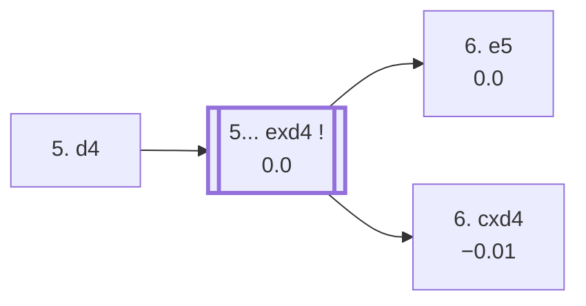

<a name="_TOP_"></a>

# C54 Italian Game: Giuoco Piano, Center Attack <br> 1. e4 e5 2. Nf3 Nc6 3. Bc4 Bc5 4. c3 Nf6 5. d4 #

Spun off from [C53's own "4... Nf6" candidate bullet](https://github.com/onclemarcel/chess_flashcards/blob/main/e4_openings/C53_Giuoco_Piano_Classical_Variation.md#_Nf6_) — a genuine "wrong root code" find: `eco.md` files this whole branch (and everything under it) as C53, but the live explorer already tags the bare **5. d4** position itself C54. The boundary is disclosed here rather than hidden: everything from this exact ply onward — including two `eco.md` entries nominally filed under C53 (the *Ghulam-Kassim Variation* and *Anderssen Variation*) — lives on this card instead, matching the live tag rather than `eco.md`'s own placement.

### Overview

*Quick map of every move covered on this card — see the [shape key](https://github.com/onclemarcel/chess_flashcards/blob/main/start.md#content-diagram-optional) in start.md.*

<!-- content-diagram:start -->

<!-- content-diagram:end -->

<a name="_initial_move_"></a>

[](https://lichess.org/analysis/standard/r1bqk2r/pppp1ppp/2n2n2/2b1p3/2BPP3/2P2N2/PP3PPP/RNBQK2R_b_KQkq_d3_0_5)

*... 5. d4 — Center Attack*

```
r1bqk2r/pppp1ppp/2n2n2/2b1p3/2BPP3/2P2N2/PP3PPP/RNBQK2R b KQkq d3 0 5
```

|  | 0.00 |
| --- | --- |

Strikes the centre at once, the sharpest of the three 5th-move tries seen from this exact position (21.1% masters, behind the quiet 5. d3's 75.7%, which transposes to [C50's own Giuoco Pianissimo](https://github.com/onclemarcel/chess_flashcards/blob/main/e4_openings/C50_Italian.md#_Pianissimo_) — not built out further here). **5... exd4** is essentially forced (100% masters).

[*Back to TOP*](#_TOP_)

---

<a name="_exd4_"></a>

### 5... exd4

[](https://lichess.org/analysis/standard/r1bqk2r/pppp1ppp/2n2n2/2b5/2BpP3/2P2N2/PP3PPP/RNBQK2R_w_KQkq_-_0_6)

*... 5... exd4*

```
r1bqk2r/pppp1ppp/2n2n2/2b5/2BpP3/2P2N2/PP3PPP/RNBQK2R w KQkq - 0 6
```

|  | 0.00 |
| --- | --- |

White's 6th move is the real fork of the whole complex — push the e-pawn past, or recapture immediately:

* [**6. e5**](#_e5_) : live-tagged the *Modern Line* — covered below.
* [**6. cxd4**](#_cxd4_) : live-tagged the *Traditional Line* — the historically better-known **Möller Attack** complex — covered below.

[*Back to 5. d4*](#_initial_move_)
[*Back to TOP*](#_TOP_)

---

<a name="_e5_"></a>

### 6. e5 — Modern Line

[](https://lichess.org/analysis/standard/r1bqk2r/pppp1ppp/2n2n2/2b1P3/2Bp4/2P2N2/PP3PPP/RNBQK2R_b_KQkq_-_0_6)

*... 6. e5 — Modern Line*

```
r1bqk2r/pppp1ppp/2n2n2/2b1P3/2Bp4/2P2N2/PP3PPP/RNBQK2R b KQkq - 0 6
```

|  | 0.00 |
| --- | --- |

Pushes past the knight rather than recapturing at once. Masters' overwhelming reply is **6... d5** (99.7%) — **6... Ne4** (reaching the *Ghulam-Kassim Variation*, `eco.md` files this as C53 despite the live explorer already tagging it C54) is a genuine database rarity, only 6 masters games total:

* [**6... d5**](#_d5_) (99.7% masters): covered below.
* **6... Ne4 7. Bd5 Nxf2 8. Kxf2 dxc3 9. Kg3!?**, the *Ghulam-Kassim Variation* (+1.29, a real, substantial engine edge for White despite the exposed king) — a genuine database curiosity, not built out further here (backlog).

[*Back to 5... exd4*](#_exd4_)
[*Back to TOP*](#_TOP_)

---

<a name="_d5_"></a>

### 6... d5 7. Bb5

[](https://lichess.org/analysis/standard/r1bqk2r/ppp2ppp/2n2n2/1BbpP3/3p4/2P2N2/PP3PPP/RNBQK2R_b_KQkq_-_1_7)

*... 7. Bb5*

```
r1bqk2r/ppp2ppp/2n2n2/1BbpP3/3p4/2P2N2/PP3PPP/RNBQK2R b KQkq - 1 7
```

|  | 0.00 |
| --- | --- |

Pins the c6-knight to gain a tempo rather than recapturing the pawn immediately. Masters' overwhelming reply is **7... Ne4** (99.7%), and after **8. cxd4 Bb4!?**, the *Anderssen Variation* (+0.24, `eco.md` also files this as C53 despite its own live C54 tag) is reached — a small, real White edge. Not built out further here (backlog).

[*Back to 6. e5*](#_e5_)
[*Back to TOP*](#_TOP_)

---

<a name="_cxd4_"></a>

### 6. cxd4 — Traditional Line

[](https://lichess.org/analysis/standard/r1bqk2r/pppp1ppp/2n2n2/2b5/2BPP3/5N2/PP3PPP/RNBQK2R_b_KQkq_-_0_6)

*... 6. cxd4 — Traditional Line*

```
r1bqk2r/pppp1ppp/2n2n2/2b5/2BPP3/5N2/PP3PPP/RNBQK2R b KQkq - 0 6
```

|  | −0.01 |
| --- | --- |

Recaptures at once, matching `eco.md`'s own C54 root — the historically better-known **Möller Attack** complex. **6... Bb4+** is forced (100% masters, a real check — `eco.md`'s own SAN just writes "Bb4"). White's 7th move genuinely forks four ways:

* [**7. Bd2**](#_Krause_) (60.1% masters): masters' clear main try, reaching the *Krause Variation* — covered below.
* **7. Nbd2** (21.3% masters): a real secondary try, not built out further here (backlog).
* [**7. Nc3**](#_Greco_) (18.1% masters): *Greco's Attack* — covered below, the deepest and most heavily analysed branch on this card.
* [**7. Kf1**](#_Cracow_) (0.5% masters, a genuine rarity): the *Cracow Variation* — covered below.

[*Back to 5... exd4*](#_exd4_)
[*Back to TOP*](#_TOP_)

---

<a name="_Krause_"></a>

### 7. Bd2 — Krause Variation

[](https://lichess.org/analysis/standard/r1bq3r/ppp3pp/5k2/3pN3/1n1Pn3/1Q3P2/PP4PP/RN2K2R_b_KQ_-_0_12)

*... 12. f3 — Krause Variation*

```
r1bq3r/ppp3pp/5k2/3pN3/1n1Pn3/1Q3P2/PP4PP/RN2K2R b KQ - 0 12
```

|  | +0.79 |
| --- | --- |

A long, forcing sequence: **7... Nxe4 8. Bxb4 Nxb4 9. Bxf7+ Kxf7 10. Qb3+ d5 11. Ne5+ Kf6 12. f3!?** — White trades off the dark-squared bishops, sacrifices the light-squared one for two pawns and a king hunt, and ends up with a real, substantial engine edge despite the material deficit — Black's king is stuck in the centre of the board on move 12. A genuine database rarity at this exact depth (only 1 masters game recorded reaching this far). Not built out further here (backlog).

[*Back to 6. cxd4*](#_cxd4_)
[*Back to TOP*](#_TOP_)

---

<a name="_Cracow_"></a>

### 7. Kf1 — Cracow Variation

[](https://lichess.org/analysis/standard/r1bqk2r/pppp1ppp/2n2n2/8/1bBPP3/5N2/PP3PPP/RNBQ1K1R_b_kq_-_2_7)

*... 7. Kf1 — Cracow Variation*

```
r1bqk2r/pppp1ppp/2n2n2/8/1bBPP3/5N2/PP3PPP/RNBQ1K1R b kq - 2 7
```

|  | −0.21 |
| --- | --- |

Sidesteps the check by hand rather than blocking it — giving up castling rights outright, a genuine database rarity (only 6 masters games). Masters' clear reply is **7... d5** (66.7%). Not built out further here (backlog).

[*Back to 6. cxd4*](#_cxd4_)
[*Back to TOP*](#_TOP_)

---

<a name="_Greco_"></a>

### 7. Nc3 — Greco's Attack

[](https://lichess.org/analysis/standard/r1bqk2r/pppp1ppp/2n2n2/8/1bBPP3/2N2N2/PP3PPP/R1BQK2R_b_kq_-_2_7)

*... 7. Nc3 — Greco's Attack*

```
r1bqk2r/pppp1ppp/2n2n2/8/1bBPP3/2N2N2/PP3PPP/R1BQK2R b kq - 2 7
```

|  | −0.17 |
| --- | --- |

Blocks the check with the knight instead of the bishop, offering the e4-pawn — the start of the deepest, most heavily analysed sub-tree on this card. Masters' clear reply is **7... Nxe4** (97.7%), and **8. O-O** is essentially forced in turn (97.6% masters).

[*Back to 6. cxd4*](#_cxd4_)
[*Back to TOP*](#_TOP_)

---

<a name="_GrecoVar_"></a>

### 8. O-O — reply fork

[](https://lichess.org/analysis/standard/r1bqk2r/pppp1ppp/2n5/8/1bBPn3/2N2N2/PP3PPP/R1BQ1RK1_b_kq_-_1_8)

*... 8. O-O*

```
r1bqk2r/pppp1ppp/2n5/8/1bBPn3/2N2N2/PP3PPP/R1BQ1RK1 b kq - 1 8
```

|  | +0.00 |
| --- | --- |

Black's two recaptures aren't equally popular — a real, striking split. **8... Bxc3** is masters' overwhelming choice (98.0%!); the `eco.md`-named ***Greco Variation*** (8...Nxc3) is in fact the rare try, at just 2.0% (only 4 masters games):

* [**8... Nxc3**](#_GrecoNamed_) (2.0% masters, a genuine database rarity): the *Greco Variation* — covered below.
* [**8... Bxc3**](#_Bxc3_) (98.0% masters): masters' overwhelming choice — covered below.

[*Back to 7. Nc3*](#_Greco_)
[*Back to TOP*](#_TOP_)

---

<a name="_GrecoNamed_"></a>

### 8... Nxc3 — Greco Variation

[](https://lichess.org/analysis/standard/r1bqk2r/pppp1ppp/2n5/8/1bBP4/2n2N2/PP3PPP/R1BQ1RK1_w_kq_-_0_9)

*... 8... Nxc3 — Greco Variation*

```
r1bqk2r/pppp1ppp/2n5/8/1bBP4/2n2N2/PP3PPP/R1BQ1RK1 w kq - 0 9
```

|  | 0.00 |
| --- | --- |

Recaptures with the knight rather than the bishop — despite giving this whole 8th-move fork its name in the books, this is genuinely the rarer choice at masters level (see the split above). **9. bxc3** is forced (100% masters). Continuing **9... Bxc3 10. Qb3 d5!?**, the *Bernstein Variation* (+0.60, a real engine edge for White) counters the attack on the a1-rook with a central strike of its own; **10. Ba3!?** instead, the *Aitken Variation*, is a genuine database curiosity (only 1 masters game recorded) with a striking engine evaluation (+2.37) — trading the dark-squared bishop's activity for a very concrete attack. Neither built out further here (backlog).

[*Back to 8. O-O*](#_GrecoVar_)
[*Back to TOP*](#_TOP_)

---

<a name="_Bxc3_"></a>

### 8... Bxc3 — Greco Gambit, Main Line

[](https://lichess.org/analysis/standard/r1bqk2r/pppp1ppp/2n5/8/2BPn3/2b2N2/PP3PPP/R1BQ1RK1_w_kq_-_0_9)

*... 8... Bxc3 — Greco Gambit, Main Line*

```
r1bqk2r/pppp1ppp/2n5/8/2BPn3/2b2N2/PP3PPP/R1BQ1RK1 w kq - 0 9
```

|  | −0.33 |
| --- | --- |

White's own 9th move is the classical fork of the whole Möller complex — push the d-pawn to trap the c3-bishop's retreat, or simply recapture:

* [**9. d5!?**](#_Moeller_) (97.0% masters): masters' overwhelming choice, the *Moeller-Therkatz Attack* — covered below.
* [**9. bxc3**](#_Steinitz_) (3.0% masters, though a real secondary try online at 42.8% — a genuine online/masters inversion): the *Steinitz Variation* (`eco.md`'s own entry has a doubled-letter typo, "SSteinitz") — covered below.

[*Back to 8. O-O*](#_GrecoVar_)
[*Back to TOP*](#_TOP_)

---

<a name="_Steinitz_"></a>

### 9. bxc3 d5 10. Ba3 — Steinitz Variation

[](https://lichess.org/analysis/standard/r1bqk2r/ppp2ppp/2n5/3p4/2BPn3/B1P2N2/P4PPP/R2Q1RK1_b_kq_-_1_10)

*... 10. Ba3 — Steinitz Variation*

```
r1bqk2r/ppp2ppp/2n5/3p4/2BPn3/B1P2N2/P4PPP/R2Q1RK1 b kq - 1 10
```

|  | −1.53 |
| --- | --- |

Recaptures the pawn immediately and develops the bishop actively rather than committing to the d5 pawn-push — a genuine database rarity at this exact depth (only 2 masters games), and, per the engine, a real, substantial swing in Black's favour compared with the main 9. d5. Not built out further here (backlog).

[*Back to 8... Bxc3*](#_Bxc3_)
[*Back to TOP*](#_TOP_)

---

<a name="_Moeller_"></a>

### 9. d5 — Moeller-Therkatz Attack

[](https://lichess.org/analysis/standard/r1bqk2r/pppp1ppp/2n5/3P4/2B1n3/2b2N2/PP3PPP/R1BQ1RK1_b_kq_-_0_9)

*... 9. d5 — Moeller-Therkatz Attack*

```
r1bqk2r/pppp1ppp/2n5/3P4/2B1n3/2b2N2/PP3PPP/R1BQ1RK1 b kq - 0 9
```

|  | −0.23 |
| --- | --- |

Attacks the c6-knight and the c3-bishop's retreat square at once, rather than simply recapturing on c3 — the defining try of this whole complex. Masters' clear reply is **9... Bf6** (72.2%, retreating the bishop to safety while still eyeing the long diagonal); **9... Ne5** (25.3%) is a real secondary try. Continuing **9... Bf6 10. Re1 Ne7 11. Rxe4 d6**, reaching a further tabiya where White's 12th move genuinely forks:

* [**12. Bg5**](#_Therkatz_) (88.1% masters): masters' overwhelming choice, the *Therkatz-Herzog Variation* — covered below.
* [**12. g4**](#_Bayonet_) (5.6% masters): the *Moeller-Bayonet Attack* — covered below.

[*Back to 8... Bxc3*](#_Bxc3_)
[*Back to TOP*](#_TOP_)

---

<a name="_Therkatz_"></a>

### 12. Bg5 — Therkatz-Herzog Variation

[](https://lichess.org/analysis/standard/r1bq1rk1/ppp1nppN/3p4/3P4/2B1R3/8/PP3PPP/R2Q2K1_b_-_-_0_14)

*... 14. Nxh7 — Therkatz-Herzog Variation*

```
r1bq1rk1/ppp1nppN/3p4/3P4/2B1R3/8/PP3PPP/R2Q2K1 b - - 0 14
```

|  | 0.00 |
| --- | --- |

A long forcing sequence: **12. Bg5 Bxg5 13. Nxg5 O-O 14. Nxh7!?** — pins and trades the f6-bishop, then sacrifices the knight for the h-pawn and a real attack against the newly-castled king, engine-verified a dead heat despite the material grab. Masters' clear reply is **14... Kxh7** (66.7%). Not built out further here (backlog).

[*Back to 9. d5*](#_Moeller_)
[*Back to TOP*](#_TOP_)

---

<a name="_Bayonet_"></a>

### 12. g4 — Moeller-Bayonet Attack

[](https://lichess.org/analysis/standard/r1bqk2r/ppp1nppp/3p1b2/3P4/2B1R1P1/5N2/PP3P1P/R1BQ2K1_b_kq_g3_0_12)

*... 12. g4 — Moeller-Bayonet Attack*

```
r1bqk2r/ppp1nppp/3p1b2/3P4/2B1R1P1/5N2/PP3P1P/R1BQ2K1 b kq g3 0 12
```

|  | −0.59 |
| --- | --- |

Launches the g-pawn at once instead of trading on f6 first — a real, if secondary, try (5.6% masters), and per the engine a somewhat less convincing one than 12. Bg5. Masters' clear reply is **12... O-O** (85.7%). Not built out further here (backlog).

[*Back to 9. d5*](#_Moeller_)
[*Back to TOP*](#_TOP_)

---

<a name="_Rosentreter_"></a>

### Rosentreter Variation

*Reached via a different move order — [C55's own "4. O-O" section](https://github.com/onclemarcel/chess_flashcards/blob/main/e4_openings/C55_Two_Knights_Defense.md#_OO_): 1. e4 e5 2. Nf3 Nc6 3. Bc4 Nf6 4. O-O Bc5 5. d4 Bxd4 6. Nxd4 Nxd4 7. Bg5 h6 8. Bh4 g5 9. f4!?*

[](https://lichess.org/analysis/standard/r1bqk2r/pppp1p2/5n1p/4p1p1/2BnPP1B/8/PPP3PP/RN1Q1RK1_b_kq_f3_0_9)

*... 9. f4 — Rosentreter Variation*

```
r1bqk2r/pppp1p2/5n1p/4p1p1/2BnPP1B/8/PPP3PP/RN1Q1RK1 b kq f3 0 9
```

|  | +0.22 |
| --- | --- |

Rather than retreat the bishop after Black's kingside pawn storm (7...h6 8. Bh4 g5), White strikes back in the centre with **9. f4!?**, undermining Black's own g5-pawn. This exact position is live-tagged **C54** despite `eco.md` filing it under C55 — the same shared *Giuoco Piano* code space found repeatedly across this whole 4.O-O/4.c3 complex. Masters' clear reply is **9... d5** (70.0%, a genuine database rarity — only 10 masters games recorded). Not built out further here (backlog).

[*Back to C55's "4. O-O" section*](https://github.com/onclemarcel/chess_flashcards/blob/main/e4_openings/C55_Two_Knights_Defense.md#_OO_)
[*Back to TOP*](#_TOP_)

---

<a name="_Holzhausen_"></a>

### Holzhausen Attack

*Reached via a different move order — [C55's own "4. O-O" section](https://github.com/onclemarcel/chess_flashcards/blob/main/e4_openings/C55_Two_Knights_Defense.md#_OO_): 1. e4 e5 2. Nf3 Nc6 3. Bc4 Nf6 4. O-O Bc5 5. d4 Bxd4 6. Nxd4 Nxd4 7. Bg5 d6 8. f4 Qe7 9. fxe5 dxe5 10. Nc3!?*

[](https://lichess.org/analysis/standard/r1b1k2r/ppp1qppp/5n2/4p1B1/2BnP3/2N5/PPP3PP/R2Q1RK1_b_kq_-_1_10)

*... 10. Nc3 — Holzhausen Attack*

```
r1b1k2r/ppp1qppp/5n2/4p1B1/2BnP3/2N5/PPP3PP/R2Q1RK1 b kq - 1 10
```

|  | −0.37 |
| --- | --- |

Develops the last minor piece and pressures the d4-knight a second time, rather than recapturing on e5 immediately — trading the f-file's own doubled pawn structure for open lines toward Black's king. A genuine database rarity, only 2 masters games recorded at this exact depth. Masters' clear reply is **10... c6**. Not built out further here (backlog).

[*Back to C55's "4. O-O" section*](https://github.com/onclemarcel/chess_flashcards/blob/main/e4_openings/C55_Two_Knights_Defense.md#_OO_)
[*Back to TOP*](#_TOP_)
