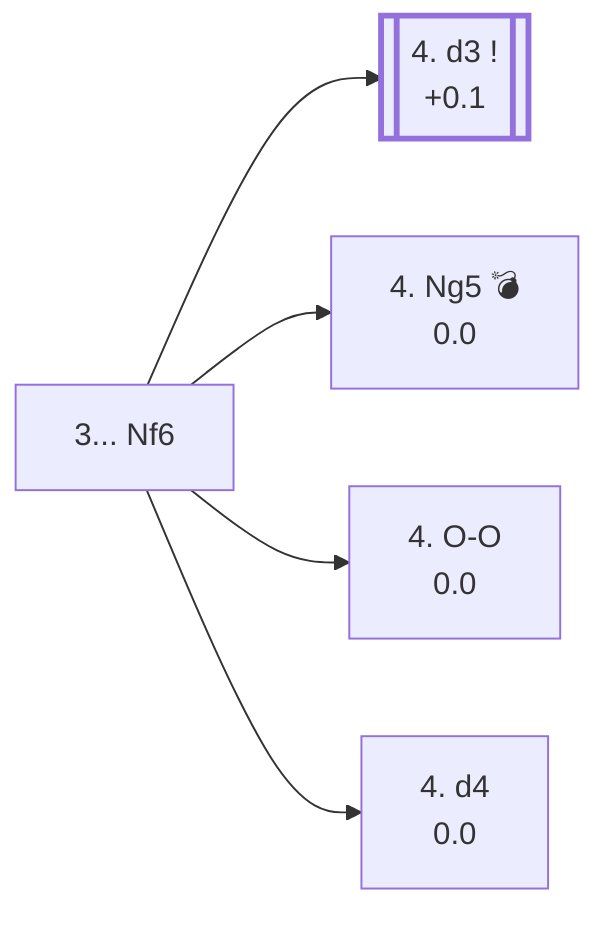

<a name="_TOP_"></a>

# C55 Italian Game: Two Knights Defense <br> 1. e4 e5 2. Nf3 Nc6 3. Bc4 Nf6 #

Migrated from [C50's own "3... Nf6" section](https://github.com/onclemarcel/chess_flashcards/blob/main/e4_openings/C50_Italian.md#_Nf6_) — this exact position is already live-tagged its own code, C55, rather than staying part of C50. With **3... Nf6**, Black develops a knight and attacks the e4-pawn, getting one step closer to castling — at the cost of blocking the d8-h4 diagonal for the queen.

### Overview

*Quick map of every move covered on this card — see the [shape key](https://github.com/onclemarcel/chess_flashcards/blob/main/start.md#content-diagram-optional) in start.md.*

<!-- content-diagram:start -->

<!-- content-diagram:end -->

<a name="_initial_move_"></a>

[](https://lichess.org/analysis/standard/r1bqkb1r/pppp1ppp/2n2n2/4p3/2B1P3/5N2/PPPP1PPP/RNBQK2R_w_KQkq_-_4_4)

*... 3... Nf6 — Two Knights Defense*

```
r1bqkb1r/pppp1ppp/2n2n2/4p3/2B1P3/5N2/PPPP1PPP/RNBQK2R w KQkq - 4 4
```

|  | +0.2 |
| --- | --- |

<!-- lichess-stats:start fen="r1bqkb1r/pppp1ppp/2n2n2/4p3/2B1P3/5N2/PPPP1PPP/RNBQK2R w KQkq - 4 4" db="lichess,masters" speeds="bullet,blitz" ratings="1800,2000,2200,2500" moves="8" -->
| Move | Online | W/D/B | Masters | W/D/B | |
| :--- | ---: | :--- | ---: | :--- | :-- |
| d3 | 6.9 M (34.5%) | ⬜⬜⬜⬜⬜⬛⬛⬛⬛⬛ 49/5/46 | 16 k (74.6%) | ⬜⬜⬜🟫🟫🟫🟫🟫⬛⬛ 32/45/24 |  |
| Ng5 | 5.3 M (26.6%) | ⬜⬜⬜⬜⬜⬛⬛⬛⬛⬛ 49/4/47 | 3.5 k (16.1%) | ⬜⬜⬜🟫🟫🟫🟫⬛⬛⬛ 33/43/24 |  |
| O-O | 2.9 M (14.5%) | ⬜⬜⬜⬜⬜⬛⬛⬛⬛⬛ 49/4/47 | 100 (0.5%) | ⬜⬜🟫🟫🟫⬛⬛⬛⬛⬛ 23/31/46 |  |
| Nc3 | 2.1 M (10.4%) | ⬜⬜⬜⬜⬜⬛⬛⬛⬛⬛ 46/5/50 | 118 (0.6%) | ⬜⬜🟫🟫🟫🟫🟫⬛⬛⬛ 19/47/34 |  |
| d4 | 1.9 M (9.8%) | ⬜⬜⬜⬜⬜⬛⬛⬛⬛⬛ 51/4/45 | 1.7 k (7.9%) | ⬜⬜⬜🟫🟫🟫🟫⬛⬛⬛ 28/40/31 |  |
| c3 | 562 k (2.8%) | ⬜⬜⬜⬜⬜⬛⬛⬛⬛⬛ 47/4/49 | 6 (0.0%) | — |  |
| Qe2 | 122 k (0.6%) | ⬜⬜⬜⬜⬜⬛⬛⬛⬛⬛ 51/4/45 | 75 (0.4%) | ⬜⬜⬜⬜🟫🟫🟫⬛⬛⬛ 40/27/33 |  |
| Bxf7+ | 72 k (0.4%) | ⬜⬜⬜⬜⬜⬛⬛⬛⬛⬛ 49/3/48 | 0 | — | ⚠ |
| Ke2 | 0 | — | 1 (0.0%) | — |  |

*Online: bullet/blitz, 1800+ — 19.9 M games. Masters: 21 k games. [Open in the explorer](https://lichess.org/analysis/standard/r1bqkb1r/pppp1ppp/2n2n2/4p3/2B1P3/5N2/PPPP1PPP/RNBQK2R_w_KQkq_-_4_4#explorer) — updated 2026-09-14*
<!-- lichess-stats:end -->

White has several options to defend the e4 pawn:

* [**4. d3**](https://github.com/onclemarcel/chess_flashcards/blob/main/e4_openings/C24_Bishop_Opening_Berlin_Defense.md#_d3_) (+0.1, 74.6% masters): masters' overwhelming choice, defending the pawn and opening the c1-h6 diagonal. Live-tagged the ***Modern Bishop's Opening*** — already covered in full there, since this exact tabiya carries no ECO code of its own and shares its nearest live-tagged ancestor with [C24's own Bishop's Opening card](https://github.com/onclemarcel/chess_flashcards/blob/main/e4_openings/C24_Bishop_Opening_Berlin_Defense.md).
* [**4. Ng5**](https://github.com/onclemarcel/chess_flashcards/blob/main/e4_openings/C57_Two_Knights_Defense_Knight_Attack.md) (0.0, 16.1% masters): the *Knight Attack*, leading to the Fried Liver Attack — already live-tagged its own code, **C57**, covered on its own card.
* [**4. O-O**](#_OO_) (0.5% masters, a genuine minor try — but with real named theory further down): covered below.
* [**4. Nc3**](https://github.com/onclemarcel/chess_flashcards/blob/main/e4_openings/C47_Four_Knights_Game.md) (0.6% masters): transposes into the Italian Variation of the [Four Knights Game](https://github.com/onclemarcel/chess_flashcards/blob/main/e4_openings/C47_Four_Knights_Game.md) — allows Black's ***Center Fork Trick*** (4... Nxe4!).
* **4. d4** (0.00, 7.9% masters): already live-tagged its own code, **C56** ("Open Variation"), at this exact bare ply — `eco.md` splits this whole branch across its own C55 and C56 headings, but the live explorer keeps it uniformly C56 throughout. Covered in full on its own card, [C56](https://github.com/onclemarcel/chess_flashcards/blob/main/e4_openings/C56_Two_Knights_Defense_Max_Lange_Attack.md).

[*Back to TOP*](#_TOP_)

---

<a name="_OO_"></a>

### 4. O-O

[](https://lichess.org/analysis/standard/r1bqk2r/pppp1ppp/5n2/4p1B1/2BnP3/8/PPP2PPP/RN1Q1RK1_b_kq_-_1_7)

*... 7. Bg5 — after 4. O-O Bc5 5. d4 Bxd4 6. Nxd4 Nxd4*

```
r1bqk2r/pppp1ppp/5n2/4p1B1/2BnP3/8/PPP2PPP/RN1Q1RK1 b kq - 1 7
```

|  | 0.00 |
| --- | --- |

Castles before resolving anything centrally. After **4... Bc5 5. d4 Bxd4 6. Nxd4 Nxd4 7. Bg5!?**, pinning the newly-arrived d4-knight to the queen, Black's reply genuinely forks four ways — but both `eco.md`-named endpoints from here transpose one ply further into positions the live explorer tags **C54**, not C55 (the same shared *Giuoco Piano* code space found in the [C53/C54 batch](https://github.com/onclemarcel/chess_flashcards/blob/main/e4_openings/C54_Giuoco_Piano_Center_Attack.md)):

* **7... d6** (45.1% masters): forces **8. f4!?** (100% masters) next — reaching the ***Holzhausen Attack*** (8...Qe7 9.fxe5 dxe5 10.Nc3), live-tagged **C54** — [covered there](https://github.com/onclemarcel/chess_flashcards/blob/main/e4_openings/C54_Giuoco_Piano_Center_Attack.md#_Holzhausen_).
* **7... h6** (32.0% masters): reaching the ***Rosentreter Variation*** (8.Bh4 g5 9.f4), also live-tagged **C54** — [covered there](https://github.com/onclemarcel/chess_flashcards/blob/main/e4_openings/C54_Giuoco_Piano_Center_Attack.md#_Rosentreter_).
* **7... Qe7** (12.3% masters) and **7... Ne6** (9.0% masters): genuine minor tries, not built out further here (backlog).

[*Back to 3... Nf6*](#_initial_move_)
[*Back to TOP*](#_TOP_)
