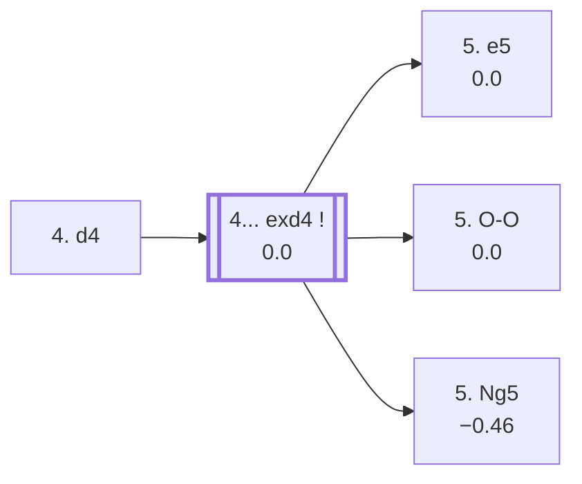

<a name="_TOP_"></a>

# C56 Italian Game: Two Knights Defense, Open Variation <br> 1. e4 e5 2. Nf3 Nc6 3. Bc4 Nf6 4. d4 #

Spun off from [C55's own "4. d4" candidate bullet](https://github.com/onclemarcel/chess_flashcards/blob/main/e4_openings/C55_Two_Knights_Defense.md#_initial_move_) — already live-tagged its own code at this exact bare ply. `eco.md` splits this whole tree across its own C55 and C56 headings (Keidanz/Perreux/Max Lange under "C55", the Nxe4 branch under "C56"), but the live explorer's own tags fluctuate between **C56** ("Two Knights Defense, Open Variation"/"Scotch Gambit") and **C44** ("Scotch Game: Scotch Gambit...") at various points along the *same* forcing sequences — a real, heavy transposition with the [Scotch Gambit](https://github.com/onclemarcel/chess_flashcards/blob/main/e4_openings/C44_Scotch.md#_DuboisReti_) (3. d4 exd4 4. Bc4 Nf6 reaches the identical position one ply later). Rather than force a single clean boundary that the data doesn't actually support, every node below states its own live tag as found.

### Overview

*Quick map of every move covered on this card — see the [shape key](https://github.com/onclemarcel/chess_flashcards/blob/main/start.md#content-diagram-optional) in start.md.*

<!-- content-diagram:start -->

<!-- content-diagram:end -->

<a name="_initial_move_"></a>

[](https://lichess.org/analysis/standard/r1bqkb1r/pppp1ppp/2n2n2/4p3/2BPP3/5N2/PPP2PPP/RNBQK2R_b_KQkq_d3_0_4)

*... 4. d4 — Open Variation*

```
r1bqkb1r/pppp1ppp/2n2n2/4p3/2BPP3/5N2/PPP2PPP/RNBQK2R b KQkq d3 0 4
```

|  | 0.00 |
| --- | --- |

Strikes the centre at once, offering a pawn for rapid development — a real, if secondary, try (7.9% masters, well behind 4. d3's 74.6%). **4... exd4** is essentially forced (98.9% masters).

[*Back to TOP*](#_TOP_)

---

<a name="_exd4_"></a>

### 4... exd4

[](https://lichess.org/analysis/standard/r1bqkb1r/pppp1ppp/2n2n2/8/2BpP3/5N2/PPP2PPP/RNBQK2R_w_KQkq_-_0_5)

*... 4... exd4 — transposes into the Scotch Gambit's own Dubois Réti Defense*

```
r1bqkb1r/pppp1ppp/2n2n2/8/2BpP3/5N2/PPP2PPP/RNBQK2R w KQkq - 0 5
```

|  | 0.00 |
| --- | --- |

This exact position is identical, by transposition, to [C44's own "Dubois Réti Defense"](https://github.com/onclemarcel/chess_flashcards/blob/main/e4_openings/C44_Scotch.md#_DuboisReti_) (reached there via 3. d4 exd4 4. Bc4 Nf6) — the live explorer tags this shared node **C44**, not C56. White's 5th move genuinely forks three ways:

* [**5. e5**](#_e5_) (70.0% masters): masters' clear main try — covered below.
* [**5. O-O**](#_OO_) (26.8% masters): covered below.
* [**5. Ng5**](#_Perreux_) (3.0% masters): the *Perreux Variation* — covered below.

[*Back to 4. d4*](#_initial_move_)
[*Back to TOP*](#_TOP_)

---

<a name="_e5_"></a>

### 5. e5 — Advance Variation

[](https://lichess.org/analysis/standard/r1bqkb1r/pppp1ppp/2n2n2/4P3/2Bp4/5N2/PPP2PPP/RNBQK2R_b_KQkq_-_0_5)

*... 5. e5 — Advance Variation*

```
r1bqkb1r/pppp1ppp/2n2n2/4P3/2Bp4/5N2/PPP2PPP/RNBQK2R b KQkq - 0 5
```

|  | 0.00 |
| --- | --- |

Pushes past the knight rather than castling or developing further — live-tagged the *Scotch Gambit, Advance Variation* (**C44** again at this exact ply). Masters' clear reply is **5... d5** (76.5%), and after **6. Bb5 Ne4 7. Nxd4 Bc5 8. Nxc6 Bxf2!? 9. Kf1 Qh4!?**, reaching the ***Keidansky Variation*** (`eco.md` spells it *Keidanz*) — a long forcing sequence, a genuine database curiosity at this exact depth (only 1 masters game recorded), engine-verified a dead heat (0.00) despite the king walk. Not built out further here (backlog).

[*Back to 4... exd4*](#_exd4_)
[*Back to TOP*](#_TOP_)

---

<a name="_Perreux_"></a>

### 5. Ng5 — Perreux Variation

[](https://lichess.org/analysis/standard/r1bqkb1r/pppp1ppp/2n2n2/6N1/2BpP3/8/PPP2PPP/RNBQK2R_b_KQkq_-_1_5)

*... 5. Ng5 — Perreux Variation*

```
r1bqkb1r/pppp1ppp/2n2n2/6N1/2BpP3/8/PPP2PPP/RNBQK2R b KQkq - 1 5
```

|  | −0.46 |
| --- | --- |

Reaches a Fried-Liver-style attack on f7 via a different move order — White has already committed the d-pawn instead of gambiting it later. A genuine minor try (3.0% masters), and per the engine a real, if modest, edge for Black compared with the main 5. e5/5. O-O. Masters' clear reply is **5... Ne5** (50.4%). Not built out further here (backlog).

[*Back to 4... exd4*](#_exd4_)
[*Back to TOP*](#_TOP_)

---

<a name="_OO_"></a>

### 5. O-O — Scotch Gambit

[](https://lichess.org/analysis/standard/r1bqkb1r/pppp1ppp/2n2n2/8/2BpP3/5N2/PPP2PPP/RNBQ1RK1_b_kq_-_1_5)

*... 5. O-O — Scotch Gambit*

```
r1bqkb1r/pppp1ppp/2n2n2/8/2BpP3/5N2/PPP2PPP/RNBQ1RK1 b kq - 1 5
```

|  | 0.00 |
| --- | --- |

Castles before recapturing — live-tagged the *Scotch Gambit* here (the same name and code the C44 side of this transposition eventually reaches too). A real, striking finding: masters' actual main reply is **5... Nxe4** (77.1%!) — simply grabbing the pawn back — while the historically famous **5... Bc5**, the *Max Lange Attack*'s own root, is a genuine second choice at only 11.7%.

* [**5... Nxe4**](#_Nxe4_) (77.1% masters): masters' clear main try — covered below.
* [**5... Bc5**](#_MaxLange_) (11.7% masters): the *Max Lange Attack* — covered below.

[*Back to 4... exd4*](#_exd4_)
[*Back to TOP*](#_TOP_)

---

<a name="_Nxe4_"></a>

### 5... Nxe4 — Double Gambit Accepted

[](https://lichess.org/analysis/standard/r1bqkb1r/pppp1ppp/2n5/8/2Bpn3/5N2/PPP2PPP/RNBQ1RK1_w_kq_-_0_6)

*... 5... Nxe4 — Double Gambit Accepted*

```
r1bqkb1r/pppp1ppp/2n5/8/2Bpn3/5N2/PPP2PPP/RNBQ1RK1 w kq - 0 6
```

|  | 0.00 |
| --- | --- |

Grabs the second pawn outright — masters' clear main choice at this whole fork. **6. Re1** pins the knight and is essentially forced (98.9% masters). Continuing **6... d5**, White's 7th move genuinely forks:

* [**7. Bxd5**](#_Yurdansky_) (93.8% masters): masters' overwhelming choice — covered below.
* [**7. Nc3**](#_Canal_) (5.6% masters): the *Canal Variation* — covered below.

[*Back to 5. O-O*](#_OO_)
[*Back to TOP*](#_TOP_)

---

<a name="_Yurdansky_"></a>

### 7. Bxd5 — Yurdansky Attack

[](https://lichess.org/analysis/standard/r4b1r/ppp1kp2/2n1bN1p/q5p1/1P1p3B/5N2/P1P2PPP/R2QR1K1_b_-_b3_0_13)

*... 13. b4 — Yurdansky Attack*

```
r4b1r/ppp1kp2/2n1bN1p/q5p1/1P1p3B/5N2/P1P2PPP/R2QR1K1 b - b3 0 13
```

|  | −0.44 |
| --- | --- |

A long, sharp forcing sequence: **7... Qxd5 8. Nc3 Qa5 9. Nxe4 Be6 10. Bg5 h6 11. Bh4 g5 12. Nf6+ Ke7 13. b4!?** — White sacrifices the exchange for a ferocious attack, chasing Black's king out into the open; a genuine database rarity at this exact depth (only 2 masters games), and per the engine a real, if modest, swing back toward Black despite the material and king-safety pressure. Not built out further here (backlog).

[*Back to 5... Nxe4*](#_Nxe4_)
[*Back to TOP*](#_TOP_)

---

<a name="_Canal_"></a>

### 7. Nc3 — Canal Variation

[](https://lichess.org/analysis/standard/r1bqkb1r/ppp2ppp/2n5/3p4/2Bpn3/2N2N2/PPP2PPP/R1BQR1K1_b_kq_-_1_7)

*... 7. Nc3 — Canal Variation*

```
r1bqkb1r/ppp2ppp/2n5/3p4/2Bpn3/2N2N2/PPP2PPP/R1BQR1K1 b kq - 1 7
```

|  | −0.43 |
| --- | --- |

Develops instead of recapturing the pawn immediately — a real, if secondary, try (5.6% masters), and per the engine a real edge for Black compared with the main 7. Bxd5. Masters' clear reply is **7... dxc4** (45.5%, a genuine near-even split with other tries). Not built out further here (backlog).

[*Back to 5... Nxe4*](#_Nxe4_)
[*Back to TOP*](#_TOP_)

---

<a name="_MaxLange_"></a>

### 5... Bc5 6. e5 — Max Lange Attack

[](https://lichess.org/analysis/standard/r1bqk2r/pppp1ppp/2n2n2/2b1P3/2Bp4/5N2/PPP2PPP/RNBQ1RK1_b_kq_-_0_6)

*... 6. e5 — Max Lange Attack*

```
r1bqk2r/pppp1ppp/2n2n2/2b1P3/2Bp4/5N2/PPP2PPP/RNBQ1RK1 b kq - 0 6
```

|  | +0.21 |
| --- | --- |

The historically famous, heavily-analysed **Max Lange Attack** — pushing past the f6-knight rather than developing further. Despite being masters' second choice at the parent fork (see above), this is by far the most theoretically dense branch on this card. Masters' clear reply is **6... d5** (96.1%); **6... Ng4** (covered below as the *Steinitz Variation*) is a real secondary try. Continuing **6... d5 7. exf6 dxc4 8. Re1 Be6**, reaching a further tabiya where White's 9th move genuinely forks:

* [**9. Ng5**](#_Ng5Fork_) (81.0% masters): masters' clear main try — forking the *Berger*/*Marshall*/*Rubinstein*/*Loman* lines, covered below.
* [**9. fxg7**](#_Schlechter_) : the *Schlechter Variation* — covered below.

[*Back to 5. O-O*](#_OO_)
[*Back to TOP*](#_TOP_)

---

<a name="_Ng5Fork_"></a>

### 9. Ng5 Qd5 10. Nc3 Qf5

[](https://lichess.org/analysis/standard/r3k2r/ppp2ppp/2n1bP2/2b2qN1/2ppN3/8/PPP2PPP/R1BQR1K1_b_kq_-_7_11)

*... 11. Nce4 — Marshall Variation*

```
r3k2r/ppp2ppp/2n1bP2/2b2qN1/2ppN3/8/PPP2PPP/R1BQR1K1 b kq - 7 11
```

|  | +0.38 |
| --- | --- |

Both knights converge on e4, offering the g-pawn for a huge attack. **10... Qf5**, and now White's 11th move forks again:

* **11. Nce4**, live-tagged the *Long Variation* (`eco.md`'s own name is the *Marshall Variation*) — the position shown above, a real engine edge for White. Continuing **11... Bf8!?**, the *Rubinstein Variation* (+0.53), retreats the bishop to safety rather than trading; not built out further here (backlog).
* **11. g4!? Qg6 12. Nce4 Bb6 13. f4 O-O-O!?**, the *Berger Variation* (+0.75, a genuine database rarity — only 1 masters game recorded at this exact depth) — Black castles queenside into the teeth of White's own attack rather than retreating the bishop. Not built out further here (backlog).

**9... g6** instead of 9...Qd5, the *Loman Defence* (−0.26), declines the complications by giving back the piece for a safer game. Neither built out further here (backlog).

[*Back to 5... Bc5 6. e5*](#_MaxLange_)
[*Back to TOP*](#_TOP_)

---

<a name="_Schlechter_"></a>

### 9. fxg7 — Schlechter Variation

[](https://lichess.org/analysis/standard/r2qk2r/ppp2pPp/2n1b3/2b5/2pp4/5N2/PPP2PPP/RNBQR1K1_b_kq_-_0_9)

*... 9. fxg7 — Schlechter Variation*

```
r2qk2r/ppp2pPp/2n1b3/2b5/2pp4/5N2/PPP2PPP/RNBQR1K1 b kq - 0 9
```

|  | +0.04 |
| --- | --- |

Grabs the g-pawn outright instead of piling onto the knight-and-pieces attack — a real, near-even engine assessment. Masters' clear reply is **9... Rg8** (100%, a genuine database rarity, only 15 masters games). Not built out further here (backlog).

[*Back to 5... Bc5 6. e5*](#_MaxLange_)
[*Back to TOP*](#_TOP_)

---

<a name="_Steinitz2_"></a>

### 6... Ng4 — Steinitz Variation

[](https://lichess.org/analysis/standard/r1bqk2r/pppp1ppp/2n5/2b1P3/2Bp2n1/5N2/PPP2PPP/RNBQ1RK1_w_kq_-_1_7)

*... 6... Ng4 — Steinitz Variation*

```
r1bqk2r/pppp1ppp/2n5/2b1P3/2Bp2n1/5N2/PPP2PPP/RNBQ1RK1 w kq - 1 7
```

|  | +0.34 |
| --- | --- |

Attacks the e5-pawn immediately rather than trading first — live-tagged the *Scotch Gambit, Spielmann Defense* on the live explorer, `eco.md`'s own name is the *Steinitz Variation*. Continuing **7. c3!?**, the *Krause Variation* (+0.25, a genuine database rarity, only 1 masters game recorded), defends the d4-pawn and prepares to meet ...d5 solidly. Not built out further here (backlog).

[*Back to 5... Bc5 6. e5*](#_MaxLange_)
[*Back to TOP*](#_TOP_)
