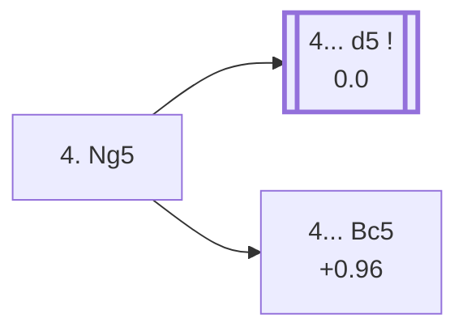

<a name="_TOP_"></a>

# C57 Italian Game: Two Knights Defense, Knight Attack <br> 1. e4 e5 2. Nf3 Nc6 3. Bc4 Nf6 4. Ng5 #

Migrated from [C50's own Fried Liver Attack section](https://github.com/onclemarcel/chess_flashcards/blob/main/e4_openings/C50_Italian.md) and [C55's own "4. Ng5" candidate bullet](https://github.com/onclemarcel/chess_flashcards/blob/main/e4_openings/C55_Two_Knights_Defense.md#_initial_move_) — this exact position is already live-tagged its own code, C57, live-tagged the *Knight Attack*. White attacks f7 twice at once (the bishop on c4 and the knight on g5), banking on Black's own last move having left the f8-bishop and king undeveloped.

### Overview

*Quick map of every move covered on this card — see the [shape key](https://github.com/onclemarcel/chess_flashcards/blob/main/start.md#content-diagram-optional) in start.md.*

<!-- content-diagram:start -->

<!-- content-diagram:end -->

<a name="_initial_move_"></a>

[](https://lichess.org/analysis/standard/r1bqkb1r/pppp1ppp/2n2n2/4p1N1/2B1P3/8/PPPP1PPP/RNBQK2R_b_KQkq_-_5_4)

*... 4. Ng5 — Knight Attack*

```
r1bqkb1r/pppp1ppp/2n2n2/4p1N1/2B1P3/8/PPPP1PPP/RNBQK2R b KQkq - 5 4
```

|  | +0.19 |
| --- | --- |

<!-- lichess-stats:start fen="r1bqkb1r/pppp1ppp/2n2n2/4p1N1/2B1P3/8/PPPP1PPP/RNBQK2R b KQkq - 5 4" db="lichess,masters" speeds="bullet,blitz" ratings="1800,2000,2200,2500" moves="4" -->
| Move | Online | W/D/B | Masters | W/D/B | |
| :--- | ---: | :--- | ---: | :--- | :-- |
| d5 | 4.3 M (80.4%) | ⬜⬜⬜⬜⬜⬛⬛⬛⬛⬛ 49/4/47 | 3.3 k (96.1%) | ⬜⬜⬜🟫🟫🟫🟫⬛⬛⬛ 32/43/25 |  |
| Bc5 | 760 k (14.3%) | ⬜⬜⬜⬜⬜⬛⬛⬛⬛⬛ 47/3/50 | 130 (3.8%) | ⬜⬜⬜⬜🟫🟫🟫🟫⬛⬛ 44/35/22 |  |
| Nxe4 | 205 k (3.9%) | ⬜⬜⬜⬜⬛⬛⬛⬛⬛⬛ 43/3/54 | 0 | — | ⚠ |
| d6 | 25 k (0.5%) | ⬜⬜⬜⬜⬜⬜⬜⬛⬛⬛ 71/3/26 | 0 | — | ⚠ |
| Na5 | 0 | — | 1 (0.0%) | — |  |
| b5 | 0 | — | 1 (0.0%) | — |  |

*Online: bullet/blitz, 1800+ — 5.3 M games. Masters: 3.5 k games. [Open in the explorer](https://lichess.org/analysis/standard/r1bqkb1r/pppp1ppp/2n2n2/4p1N1/2B1P3/8/PPPP1PPP/RNBQK2R_b_KQkq_-_5_4#explorer) — updated 2026-09-07*
<!-- lichess-stats:end -->

**4. Ng5** attacks f7 twice — the point of the whole line — and it works precisely because Black hasn't castled or developed the f8-bishop.

* [**4... d5**](#_d5_) (96.1% masters): masters' overwhelming choice, blocking the bishop's own access to f7 immediately — covered below.
* [**4... Bc5**](#_Traxler_) (3.8% masters, +0.96): the *Traxler Counterattack* (also known as the **Wilkes-Barre Variation**) — a genuine, real gambit-style counter-sacrifice, covered below.

[*Back to TOP*](#_TOP_)

---

<a name="_Traxler_"></a>

### 4... Bc5 — Traxler Counterattack

[](https://lichess.org/analysis/standard/r1bqk2r/pppp1ppp/2n2n2/2b1p1N1/2B1P3/8/PPPP1PPP/RNBQK2R_w_KQkq_-_6_5)

*... 4... Bc5 — Traxler Counterattack*

```
r1bqk2r/pppp1ppp/2n2n2/2b1p1N1/2B1P3/8/PPPP1PPP/RNBQK2R w KQkq - 6 5
```

|  | +0.96 |
| --- | --- |

Rather than defend f7, Black counter-attacks f2 in kind — a genuine, sound (if sharp and engine-favouring-White) counter-gambit, ignoring the threat on f7 entirely. Masters' clear reply is **5. Bxf7+** (67.7%), grabbing the pawn with check anyway. A real, engine-confirmed edge for White at this depth despite the counterattack's fearsome reputation among club players. Not built out further here (backlog).

[*Back to 4. Ng5*](#_initial_move_)
[*Back to TOP*](#_TOP_)

---

<a name="_d5_"></a>

### 4... d5

[](https://lichess.org/analysis/standard/r1bqkb1r/ppp2ppp/2n2n2/3Pp1N1/2B5/8/PPPP1PPP/RNBQK2R_b_KQkq_-_0_5)

*... 4... d5 — after 5. exd5*

```
r1bqkb1r/ppp2ppp/2n2n2/3Pp1N1/2B5/8/PPPP1PPP/RNBQK2R b KQkq - 0 5
```

|  | 0.00 |
| --- | --- |

Blocks the bishop's own diagonal access to f7 — the only sensible way to defend it. **5. exd5** is essentially automatic. Black's reply here genuinely forks four ways, all real named lines:

* [**5... Na5**](https://github.com/onclemarcel/chess_flashcards/blob/main/e4_openings/C58_Two_Knights_Defense_Na5.md) (86.1% masters): masters' overwhelming choice, attacking the c4-bishop directly — already live-tagged its own code, **C58**, covered on its own card.
* **5... b5** (7.3% masters): the *Ulvestad Variation* — covered below.
* [**5... Nd4**](#_Fritz_) (4.4% masters): the *Fritz Variation* — covered below.
* [**5... Nxd5**](#_Nxd5_) (2.2% masters): reaching the *Fried Liver Attack*/*Lolli Attack* fork — covered below.

[*Back to 4. Ng5*](#_initial_move_)
[*Back to TOP*](#_TOP_)

---

> [!TIP]
> **5... b5** (+0.3, a genuine engine-neutral try, rarely played — 7.3% of masters games) is the ***Ulvestad Variation***.
>
> <a name="_Ulvestad_"></a>
>
> ### 5... b5 — Ulvestad Variation
>
> [](https://lichess.org/analysis/standard/r1bqkb1r/p1p2ppp/2n2n2/1p1Pp1N1/2B5/8/PPPP1PPP/RNBQK2R_w_KQkq_-_0_6)
>
> *... 5... b5 — Ulvestad Variation*
>
> ```
> r1bqkb1r/p1p2ppp/2n2n2/1p1Pp1N1/2B5/8/PPPP1PPP/RNBQK2R w KQkq - 0 6
> ```
>
> |  | +0.3 |
> | --- | --- |
>
> Counter-attacks the bishop rather than recapturing or retreating the c6-knight. Best play for White is the unnatural-looking **6. Bf1** (known to master players, though...). Other White replies lead to a better game for Black with careful play — for example **6. Bxb5** allows **6... Qxd5**, forking the bishop and the g2 pawn, and Black gets open diagonals with a centralised queen.
>
> [](https://lichess.org/analysis/standard/r1bqkb1r/p1p2ppp/2n2n2/1B1Pp1N1/8/8/PPPP1PPP/RNBQK2R_b_KQkq_-_0_6)
>
> *... 6. Bxb5 — about 15% of Ulvestad games*
>
> ```
> r1bqkb1r/p1p2ppp/2n2n2/1B1Pp1N1/8/8/PPPP1PPP/RNBQK2R b KQkq - 0 6
> ```
>
> |  | +0.0 |
> | --- | --- |
>
> [*Back to 4... d5*](#_d5_)
> [*Back to TOP*](#_TOP_)

---

<a name="_Fritz_"></a>

### 5... Nd4 — Fritz Variation

[](https://lichess.org/analysis/standard/r1bqkb1r/ppp2ppp/5n2/3Pp1N1/2Bn4/8/PPPP1PPP/RNBQK2R_w_KQkq_-_1_6)

*... 5... Nd4 — Fritz Variation*

```
r1bqkb1r/ppp2ppp/5n2/3Pp1N1/2Bn4/8/PPPP1PPP/RNBQK2R w KQkq - 1 6
```

|  | +0.47 |
| --- | --- |

Counter-attacks with tempo rather than recapturing — the knight eyes c2 while the d5-pawn stays a real problem for Black to solve later. Masters' clear reply is **6. c3** (93.8%), kicking the knight before dealing with anything else. Continuing **6... b5 7. Bf1 Nxd5 8. Ne4!?**, the *Gruber Variation* (+0.09, a real engine-neutral continuation), centralises the knight rather than retreating it further. Not built out further here (backlog).

[*Back to 4... d5*](#_d5_)
[*Back to TOP*](#_TOP_)

---

<a name="_Nxd5_"></a>

### 5... Nxd5

[](https://lichess.org/analysis/standard/r1bqkb1r/ppp2ppp/2n5/3np1N1/2B5/8/PPPP1PPP/RNBQK2R_w_KQkq_-_0_6)

*... 5... Nxd5*

```
r1bqkb1r/ppp2ppp/2n5/3np1N1/2B5/8/PPPP1PPP/RNBQK2R w KQkq - 0 6
```

|  | 0.00 |
| --- | --- |

Recaptures directly, ignoring the double attack on f7 — objectively suspect at master level (a genuine minority try, 2.2% at the parent fork) but the position from which this whole complex's most famous named lines are reached. White's 6th move genuinely forks:

* [**6. Nxf7**](#_Fegatello_) (87.5% masters): masters' overwhelming choice — the *Fried Liver Attack* (`eco.md`'s own name is *Fegatello Attack*, the literal Italian translation of the same idea) — covered below.
* [**6. d4**](#_Lolli_) (12.5% masters): the *Lolli Attack* — covered below.

[*Back to 4... d5*](#_d5_)
[*Back to TOP*](#_TOP_)

---

<a name="_Lolli_"></a>

### 6. d4 — Lolli Attack

[](https://lichess.org/analysis/standard/r1bqkb1r/ppp2ppp/2n5/3np1N1/2BP4/8/PPP2PPP/RNBQK2R_b_KQkq_d3_0_6)

*... 6. d4 — Lolli Attack*

```
r1bqkb1r/ppp2ppp/2n5/3np1N1/2BP4/8/PPP2PPP/RNBQK2R b KQkq d3 0 6
```

|  | +0.50 |
| --- | --- |

Opens the centre and the queen's own diagonal toward d5/h5 rather than grabbing f7 immediately — a real, if secondary, try (12.5% at the parent fork). Masters split several ways at this exact position, a genuine database rarity overall (only 9 masters games): **6... Nxd4** (33.3%), **6... Be7**/**6... Be6** (22.2% each), and **6... Bb4+!?** (22.2%), the ***Pincus Variation*** (+1.30, `eco.md`'s own name has a scraping typo, "incus Variation") — a real, substantial engine edge for White despite the check. Not built out further here (backlog).

[*Back to 5... Nxd5*](#_Nxd5_)
[*Back to TOP*](#_TOP_)

---

<a name="_Fegatello_"></a>

### 6. Nxf7 — Fried Liver Attack

[](https://lichess.org/analysis/standard/r1bqkb1r/ppp2Npp/2n5/3np3/2B5/8/PPPP1PPP/RNBQK2R_b_KQkq_-_0_6)

*... 6. Nxf7 — Fried Liver Attack*

```
r1bqkb1r/ppp2Npp/2n5/3np3/2B5/8/PPPP1PPP/RNBQK2R b KQkq - 0 6
```

|  | +0.88 |
| --- | --- |

The Fried Liver Attack proper — White gives up the knight for a pawn and a real, substantial lead in development against Black's king, stuck in the centre. **6... Kxf7** is forced (100% masters). White's clear follow-up is **7. Qf3+**, forking the king and the d5-knight, and after **7... Ke6** (defending the knight and clinging to the centre), **8. Nc3** attacks the d5-knight a second time. Black's own 8th move genuinely forks:

* [**8... Nb4**](#_Leonhardt_) (96.8% masters): masters' overwhelming choice — the *Leonhardt Variation* — covered below.
* [**8... Ne7**](#_Polerio_) (3.2% masters): the *Polerio Defence* — covered below.

[*Back to 5... Nxd5*](#_Nxd5_)
[*Back to TOP*](#_TOP_)

---

<a name="_Leonhardt_"></a>

### 8... Nb4 — Leonhardt Variation

[](https://lichess.org/analysis/standard/r1bq1b1r/ppn3pp/2p1k3/3np3/2BPQ3/P1N5/1PP2PPP/R1B1K2R_w_KQ_-_1_12)

*... 11. d4 Nc7 — Leonhardt Variation*

```
r1bq1b1r/ppn3pp/2p1k3/3np3/2BPQ3/P1N5/1PP2PPP/R1B1K2R w KQ - 1 12
```

|  | −0.54 |
| --- | --- |

A long forcing sequence: **9. Qe4 c6 10. a3 Na6 11. d4 Nc7!?** — the b4-knight gets chased all the way home while the king clings on in the centre, and despite the long king walk, the engine already rates this a real, if modest, swing back toward Black. A genuine database rarity at this exact depth (0 masters games, under 900 online). Not built out further here (backlog).

[*Back to 6. Nxf7*](#_Fegatello_)
[*Back to TOP*](#_TOP_)

---

<a name="_Polerio_"></a>

### 8... Ne7 — Polerio Defence

[](https://lichess.org/analysis/standard/r1bq1b1r/ppp1n1pp/4k3/3np3/2B5/2N2Q2/PPPP1PPP/R1B1K2R_w_KQ_-_4_9)

*... 8... Ne7 — Polerio Defence*

```
r1bq1b1r/ppp1n1pp/4k3/3np3/2B5/2N2Q2/PPPP1PPP/R1B1K2R w KQ - 4 9
```

|  | +2.35 |
| --- | --- |

Reroutes the c6-knight to reinforce the centre rather than chasing counterplay with ...Nb4 — a genuine database rarity (only 2 masters games recorded), and per the engine a substantially worse practical try than the Leonhardt Variation, leaving the king exposed without enough activity to show for it. Not built out further here (backlog).

[*Back to 6. Nxf7*](#_Fegatello_)
[*Back to TOP*](#_TOP_)
