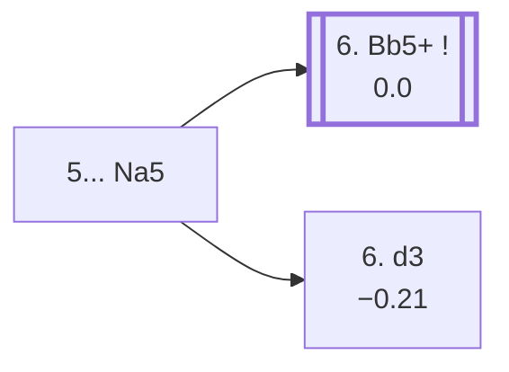

<a name="_TOP_"></a>

# C58 Italian Game: Two Knights Defense, Polerio Defense <br> 1. e4 e5 2. Nf3 Nc6 3. Bc4 Nf6 4. Ng5 d5 5. exd5 Na5 #

Spun off from [C57's own "4... d5" candidate bullet](https://github.com/onclemarcel/chess_flashcards/blob/main/e4_openings/C57_Two_Knights_Defense_Knight_Attack.md#_d5_) — masters' overwhelming main try at that fork (86.1%), already live-tagged its own code. `eco.md` labels this bare root just "Two Knights Defence"; the live explorer already tags it the ***Polerio Defense*** at this exact ply (a different, earlier "Polerio" than C57's own *Polerio Defence* sub-line — the same historical player's name attached to two distinct branches of this whole opening).

### Overview

*Quick map of every move covered on this card — see the [shape key](https://github.com/onclemarcel/chess_flashcards/blob/main/start.md#content-diagram-optional) in start.md.*

<!-- content-diagram:start -->

<!-- content-diagram:end -->

<a name="_initial_move_"></a>

[](https://lichess.org/analysis/standard/r1bqkb1r/ppp2ppp/5n2/n2Pp1N1/2B5/8/PPPP1PPP/RNBQK2R_w_KQkq_-_1_6)

*... 5... Na5 — Polerio Defense*

```
r1bqkb1r/ppp2ppp/5n2/n2Pp1N1/2B5/8/PPPP1PPP/RNBQK2R w KQkq - 1 6
```

|  | 0.00 |
| --- | --- |

Attacks the c4-bishop directly rather than counter-attacking with a knight move or recapturing at once. **6. Bb5+** is masters' overwhelming reply (97.6%).

* [**6. Bb5+**](#_Bb5_) (97.6% masters): covered below.
* [**6. d3**](#_Kieseritsky_) (a real, if secondary, try): the *Kieseritzky Variation* (`eco.md` spells it *Kieseritsky*) — covered below.

[*Back to TOP*](#_TOP_)

---

<a name="_Kieseritsky_"></a>

### 6. d3 — Kieseritzky Variation

[](https://lichess.org/analysis/standard/r1bqkb1r/ppp2ppp/5n2/n2Pp1N1/2B5/3P4/PPP2PPP/RNBQK2R_b_KQkq_-_0_6)

*... 6. d3 — Kieseritzky Variation*

```
r1bqkb1r/ppp2ppp/5n2/n2Pp1N1/2B5/3P4/PPP2PPP/RNBQK2R b KQkq - 0 6
```

|  | −0.21 |
| --- | --- |

Defends the bishop quietly rather than checking — a real, if secondary, try. Masters' clear reply is **6... h6** (88.2%), kicking the g5-knight before it can cause more trouble. Continuing **7. Nf3 e4 8. Qe2 Nxc4 9. dxc4**, White's own 9th move recapture reaches a further tabiya where Black's own 9th move forks:

* **9... Bc5**, continuing **10. Nfd2!?**, the *Yankovich Variation* (−0.47, a real engine edge for Black) — retreats the knight to reroute it toward e4/c4 rather than developing normally.
* **9... Be7**, the *Maroczy Variation* (0.00) — a quieter, fully balanced developing move instead.

Neither built out further here (backlog).

[*Back to _initial_move_*](#_initial_move_)
[*Back to TOP*](#_TOP_)

---

<a name="_Bb5_"></a>

### 6. Bb5+ — Bishop Check Line

[](https://lichess.org/analysis/standard/r1bqkb1r/ppp2ppp/5n2/nB1Pp1N1/8/8/PPPP1PPP/RNBQK2R_b_KQkq_-_2_6)

*... 6. Bb5+ — Bishop Check Line*

```
r1bqkb1r/ppp2ppp/5n2/nB1Pp1N1/8/8/PPPP1PPP/RNBQK2R b KQkq - 2 6
```

|  | +0.13 |
| --- | --- |

Checks first rather than defending the bishop passively, gaining a tempo before Black can attack it again. Masters' clear reply is **6... c6** (90.0%), and after **7. dxc6 bxc6**, White's own 8th move genuinely forks three ways — masters' actual most popular try isn't even the `eco.md`-named one:

* **8. Bd3** (50.9% masters, masters' real main try): retreats the bishop to safety and keeps an eye on the kingside — a genuine, real gap, not built out further here (backlog).
* [**8. Be2**](#_Be2_) (29.8% masters): a quieter retreat, already live-tagged its own further code — covered below.
* [**8. Qf3**](#_Qf3_) (19.4% masters): forks a8 and b7 at once — covered below.

[*Back to _initial_move_*](#_initial_move_)
[*Back to TOP*](#_TOP_)

---

<a name="_Qf3_"></a>

### 8. Qf3 — Bogoljubow Variation

[](https://lichess.org/analysis/standard/r1bqkb1r/p4ppp/2p2n2/nB2p1N1/8/5Q2/PPPP1PPP/RNB1K2R_b_kq_-_1_8)

*... 8. Qf3 — Bogoljubow Variation*

```
r1bqkb1r/p4ppp/2p2n2/nB2p1N1/8/5Q2/PPPP1PPP/RNB1K2R b kq - 1 8
```

|  | 0.00 |
| --- | --- |

Attacks the a8-rook and b7-pawn at once (`eco.md` spells this *Bogolyubov*, the live tag uses the German transliteration *Bogoljubow*). Black's reply is a genuine near-even spread: masters split **8... Be7** (38.1%), **8... Rb8** (34.0%, defending passively), **8... cxb5** (11.1%, simplifying at once), and **8... h6** (8.0%, kicking the g5-knight first). Three of these carry their own further names:

* **8... Rb8**, continuing **9. Bd3!?**, the *Colman Variation* (+0.16) — retreats the bishop to safety rather than trading it off. Not built out further here (backlog).
* [**8... cxb5**](#_Blackburne_) (+0.00): the *Blackburne Variation* — covered below.
* **8... Qc7**, continuing **9. Bd3!?**, the *Paoli Variation* (+0.59, a real engine edge for White) — covered below.

[*Back to 6. Bb5+*](#_Bb5_)
[*Back to TOP*](#_TOP_)

---

<a name="_Blackburne_"></a>

### 8... cxb5 — Blackburne Variation

[](https://lichess.org/analysis/standard/r1bqkb1r/p4ppp/5n2/np2p1N1/8/5Q2/PPPP1PPP/RNB1K2R_w_KQkq_-_0_9)

*... 8... cxb5 — Blackburne Variation*

```
r1bqkb1r/p4ppp/5n2/np2p1N1/8/5Q2/PPPP1PPP/RNB1K2R w KQkq - 0 9
```

|  | 0.00 |
| --- | --- |

Simplifies at once rather than defending the rook — accepting doubled/isolated queenside pawns for a simpler position. Masters' forced reply is **9. Qxa8** (100%), grabbing the rook. Not built out further here (backlog).

[*Back to 8. Qf3*](#_Qf3_)
[*Back to TOP*](#_TOP_)

---

<a name="_Paoli_"></a>

### 8... Qc7 9. Bd3 — Paoli Variation

[](https://lichess.org/analysis/standard/r1b1kb1r/p1q2ppp/2p2n2/n3p1N1/8/3B1Q2/PPPP1PPP/RNB1K2R_b_KQkq_-_3_9)

*... 9. Bd3 — Paoli Variation*

```
r1b1kb1r/p1q2ppp/2p2n2/n3p1N1/8/3B1Q2/PPPP1PPP/RNB1K2R b KQkq - 3 9
```

|  | +0.59 |
| --- | --- |

Retreats the bishop to safety rather than trading it off, keeping an eye on the kingside — a real, if modest, engine edge for White at this exact depth (a genuine database rarity, only 15 masters games). Masters' clear reply is **9... h6** (60.0%), kicking the g5-knight before anything else. Not built out further here (backlog).

[*Back to 8. Qf3*](#_Qf3_)
[*Back to TOP*](#_TOP_)

---

<a name="_Be2_"></a>

### 8. Be2

[](https://lichess.org/analysis/standard/r1bqkb1r/p4ppp/2p2n2/n3p1N1/8/8/PPPPBPPP/RNBQK2R_b_KQkq_-_1_8)

*... 8. Be2*

```
r1bqkb1r/p4ppp/2p2n2/n3p1N1/8/8/PPPPBPPP/RNBQK2R b KQkq - 1 8
```

|  | −0.05 |
| --- | --- |

Retreats quietly rather than pinning down b7/a8 — the whole point being to castle safely before anything else. Masters' near-unanimous reply is **8... h6** (99.1%), kicking the g5-knight immediately. This exact position is already live-tagged its own further code, **C59** — [covered on its own card](https://github.com/onclemarcel/chess_flashcards/blob/main/e4_openings/C59_Two_Knights_Defense_Polerio_h6.md).

[*Back to 6. Bb5+*](#_Bb5_)
[*Back to TOP*](#_TOP_)
