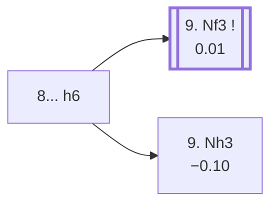

<a name="_TOP_"></a>

# C59 Italian Game: Two Knights Defense, Polerio Defense, Suhle Defense <br> 1. e4 e5 2. Nf3 Nc6 3. Bc4 Nf6 4. Ng5 d5 5. exd5 Na5 6. Bb5+ c6 7. dxc6 bxc6 8. Be2 h6 #

Spun off from [C58's own "8. Be2" section](https://github.com/onclemarcel/chess_flashcards/blob/main/e4_openings/C58_Two_Knights_Defense_Na5.md#_Be2_) — masters' near-unanimous reply there (99.1%), already live-tagged its own code. `eco.md` labels this bare root just "Two Knights Defence"; the live explorer already tags it the ***Suhle Defense*** at this exact ply.

### Overview

*Quick map of every move covered on this card — see the [shape key](https://github.com/onclemarcel/chess_flashcards/blob/main/start.md#content-diagram-optional) in start.md.*

<!-- content-diagram:start -->

<!-- content-diagram:end -->

<a name="_initial_move_"></a>

[](https://lichess.org/analysis/standard/r1bqkb1r/p4pp1/2p2n1p/n3p1N1/8/8/PPPPBPPP/RNBQK2R_w_KQkq_-_0_9)

*... 8... h6 — Suhle Defense*

```
r1bqkb1r/p4pp1/2p2n1p/n3p1N1/8/8/PPPPBPPP/RNBQK2R w KQkq - 0 9
```

|  | +0.01 |
| --- | --- |

Kicks the g5-knight before developing further. White's own reply is close to a coin flip at masters level — a genuine, real fork, not a clear main line:

* [**9. Nf3**](#_forkpoint_) (0.01, 50.6% masters): retreats toward the centre — covered below.
* [**9. Nh3**](#_Steinitz_) (49.3% masters): the *Steinitz Variation* — covered below.

[*Back to TOP*](#_TOP_)

---

<a name="_Steinitz_"></a>

### 9. Nh3 — Steinitz Variation

[](https://lichess.org/analysis/standard/r1bqkb1r/p4pp1/2p2n1p/n3p3/8/7N/PPPPBPPP/RNBQK2R_b_KQkq_-_1_9)

*... 9. Nh3 — Steinitz Variation*

```
r1bqkb1r/p4pp1/2p2n1p/n3p3/8/7N/PPPPBPPP/RNBQK2R b KQkq - 1 9
```

|  | −0.10 |
| --- | --- |

Retreats to the rim rather than back toward the centre, keeping f4/g5 squares available later. Masters' clear reply is **9... Bd6** (41.5%). Not built out further here (backlog).

[*Back to 8... h6*](#_initial_move_)
[*Back to TOP*](#_TOP_)

---

<a name="_forkpoint_"></a>

### 9. Nf3 e4 10. Ne5

[](https://lichess.org/analysis/standard/r1bqkb1r/p4pp1/2p2n1p/n3N3/4p3/8/PPPPBPPP/RNBQK2R_b_KQkq_-_1_10)

*... 10. Ne5 — after 9. Nf3 e4*

```
r1bqkb1r/p4pp1/2p2n1p/n3N3/4p3/8/PPPPBPPP/RNBQK2R b KQkq - 1 10
```

|  | 0.00 |
| --- | --- |

Retreats toward the centre; **9... e4** gains space and gains a tempo in turn, and **10. Ne5!?** centralises the knight rather than retreating it further back. Black's own reply here genuinely forks:

* [**10... Bd6**](#_Knorre_) (55.2% masters): masters' clear main try — covered below.
* [**10... Qc7**](#_Goering_) (6.9% masters): the *Göring Variation* — covered below.

[*Back to 8... h6*](#_initial_move_)
[*Back to TOP*](#_TOP_)

---

<a name="_Goering_"></a>

### 10... Qc7 — Göring Variation

[](https://lichess.org/analysis/standard/r1b1kb1r/p1q2pp1/2p2n1p/n3N3/4p3/8/PPPPBPPP/RNBQK2R_w_KQkq_-_2_11)

*... 10... Qc7 — Göring Variation*

```
r1b1kb1r/p1q2pp1/2p2n1p/n3N3/4p3/8/PPPPBPPP/RNBQK2R w KQkq - 2 11
```

|  | +0.23 |
| --- | --- |

Develops the queen toward the kingside rather than the bishop first — a real, if secondary, try (`eco.md` spells it *Goering*). Masters' clear reply is **11. d4** (84.0%), consolidating the centre pawn. Not built out further here (backlog).

[*Back to 9. Nf3 e4 10. Ne5*](#_forkpoint_)
[*Back to TOP*](#_TOP_)

---

<a name="_Knorre_"></a>

### 10... Bd6 — Knorre Variation

[](https://lichess.org/analysis/standard/r1b1k2r/p1q2pp1/2pb1n1p/n3N3/3Pp3/8/PPPBBPPP/RN1QK2R_b_kq_-_2_12)

*... 12. Bd2 — Knorre Variation*

```
r1b1k2r/p1q2pp1/2pb1n1p/n3N3/3Pp3/8/PPPBBPPP/RN1QK2R b kq - 2 12
```

|  | +0.24 |
| --- | --- |

A quiet developing sequence: **11. d4 Qc7 12. Bd2!?** — White consolidates the centre and develops the last minor piece before castling, rather than committing to anything sharp. A genuine database rarity at this exact depth (only 2 masters games recorded, both drawn/won), engine-verified a small, real edge for White. Not built out further here (backlog).

[*Back to 9. Nf3 e4 10. Ne5*](#_forkpoint_)
[*Back to TOP*](#_TOP_)
