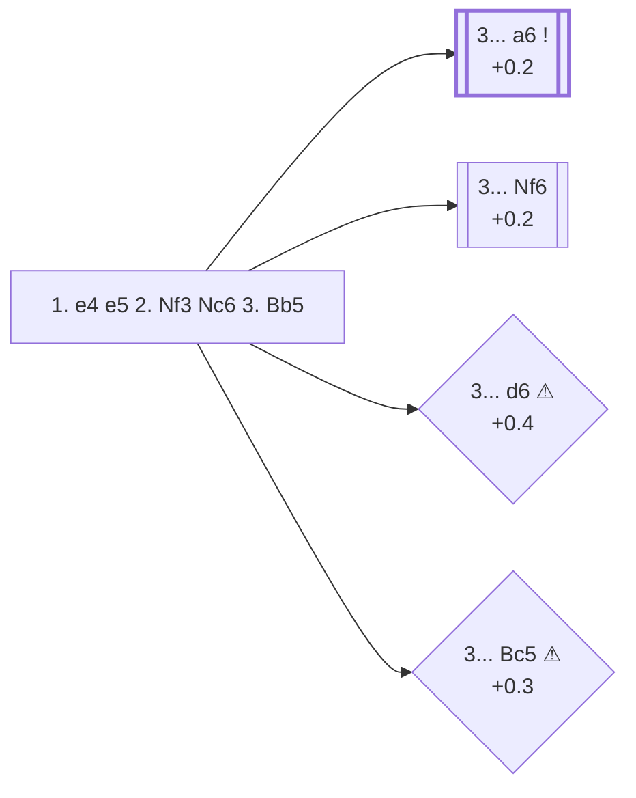

<a name="_TOP_"></a>

# C60 Ruy Lopez (Spanish Opening) <br> 1. e4 e5 2. Nf3 Nc6 3. Bb5 #

The single most studied opening in the history of chess, named after 16th-century Spanish priest Ruy López de Segura. The bishop pins the knight defending e5 — not an immediate threat to win the pawn, since ... Qxe5-style ideas don't quite work yet, but a long-term source of pressure that has produced more opening theory than any other line in the game. Masters play it 65.0% of the time after 2... Nc6, more than Italian, Scotch, and Four Knights combined.

### Overview

*Quick map of every move covered on this card — see the [shape key](https://github.com/onclemarcel/chess_flashcards/blob/main/start.md#content-diagram-optional) in start.md.*

<!-- content-diagram:start -->

<!-- content-diagram:end -->

<a name="_initial_move_"></a>

[](https://lichess.org/analysis/standard/r1bqkbnr/pppp1ppp/2n5/1B2p3/4P3/5N2/PPPP1PPP/RNBQK2R_b_KQkq_-_3_3)

*... 1. e4 e5 2. Nf3 Nc6 3. Bb5 — Ruy Lopez*

```
r1bqkbnr/pppp1ppp/2n5/1B2p3/4P3/5N2/PPPP1PPP/RNBQK2R b KQkq - 3 3
```

|  | +0.2 |
| --- | --- |

<!-- lichess-stats:start fen="r1bqkbnr/pppp1ppp/2n5/1B2p3/4P3/5N2/PPPP1PPP/RNBQK2R b KQkq - 3 3" db="lichess,masters" speeds="bullet,blitz" ratings="1800,2000,2200,2500" moves="8" -->
| Move | Online | W/D/B | Masters | W/D/B | |
| :--- | ---: | :--- | ---: | :--- | :-- |
| a6 | 12.4 M (37.0%) | ⬜⬜⬜⬜⬜🟫⬛⬛⬛⬛ 50/6/45 | 116 k (71.4%) | ⬜⬜⬜🟫🟫🟫🟫🟫⬛⬛ 30/51/19 |  |
| Nf6 | 5.9 M (17.7%) | ⬜⬜⬜⬜⬜🟫⬛⬛⬛⬛ 51/5/44 | 33 k (20.2%) | ⬜⬜🟫🟫🟫🟫🟫🟫🟫⬛ 21/65/14 |  |
| d6 | 5.0 M (14.9%) | ⬜⬜⬜⬜⬜🟫⬛⬛⬛⬛ 54/5/41 | 668 (0.4%) | ⬜⬜⬜⬜🟫🟫🟫🟫⬛⬛ 42/37/21 |  |
| Bc5 | 4.8 M (14.3%) | ⬜⬜⬜⬜⬜⬛⬛⬛⬛⬛ 50/4/46 | 2.0 k (1.2%) | ⬜⬜⬜⬜🟫🟫🟫🟫⬛⬛ 38/40/21 |  |
| f5 | 1.6 M (4.8%) | ⬜⬜⬜⬜🟫⬛⬛⬛⬛⬛ 44/5/51 | 4.4 k (2.7%) | ⬜⬜⬜⬜🟫🟫🟫🟫⬛⬛ 39/41/20 |  |
| Nge7 | 1.4 M (4.1%) | ⬜⬜⬜⬜⬜⬛⬛⬛⬛⬛ 49/5/46 | 2.4 k (1.5%) | ⬜⬜⬜⬜🟫🟫🟫🟫⬛⬛ 37/37/26 |  |
| Nd4 | 1.3 M (3.7%) | ⬜⬜⬜⬜⬜⬛⬛⬛⬛⬛ 51/4/45 | 1.1 k (0.6%) | ⬜⬜⬜⬜🟫🟫🟫🟫⬛⬛ 40/36/24 |  |
| Qf6 | 312 k (0.9%) | ⬜⬜⬜⬜⬜⬛⬛⬛⬛⬛ 50/4/46 | 0 | — | ⚠ |
| g6 | 0 | — | 2.9 k (1.8%) | ⬜⬜⬜🟫🟫🟫🟫⬛⬛⬛ 34/40/25 |  |

*Online: bullet/blitz, 1800+ — 33.5 M games. Masters: 162 k games. [Open in the explorer](https://lichess.org/analysis/standard/r1bqkbnr/pppp1ppp/2n5/1B2p3/4P3/5N2/PPPP1PPP/RNBQK2R_b_KQkq_-_3_3#explorer) — updated 2026-09-09*
<!-- lichess-stats:end -->

### Candidate moves

* [**3... a6**](#_a6_) (+0.2): the *Morphy Defense* — immediately asks the question of the bishop. By far masters' main choice (71.4%).
* [**3... Nf6**](https://github.com/onclemarcel/chess_flashcards/blob/main/e4_openings/C65_Ruy_Lopez_Berlin_Defense.md) (+0.2): the *Berlin Defense* — counter-attacks e4 instead of dealing with the pin right away. Already live-tagged its own code, **C65**, covered on its own card, including the famous drawish "Berlin Wall" endgame that shut down 1. e4 at the very top level for a decade.
* [**3... d6**](https://github.com/onclemarcel/chess_flashcards/blob/main/e4_openings/C62_Ruy_Lopez_Steinitz_Defense.md) (+0.4 ⚠): the *Old Steinitz Defense* — solid but passive, breaking the pin's tension with a pawn rather than a piece. Common online (14.9%) but rare in masters play (0.4%). Already live-tagged its own code, **C62**, covered on its own card.
* [**3... Bc5**](https://github.com/onclemarcel/chess_flashcards/blob/main/e4_openings/C64_Ruy_Lopez_Classical_Variation.md) (+0.3 ⚠): the *Classical Defense* — develops actively and ignores the pin, since 4. Bxc6 dxc6 5. Nxe5?! runs into 5... Qd4!, forking the knight and b2. Also far more common online (14.3%) than in masters play (1.2%). Already live-tagged its own code, **C64**, covered on its own card.
* **3... f5** (2.7% masters): the *Schliemann Defense* — a sharp counter-gambit, already live-tagged its own code, **C63**, covered on [its own card](https://github.com/onclemarcel/chess_flashcards/blob/main/e4_openings/C63_Ruy_Lopez_Schliemann_Defense.md).
* **3... Nd4** (0.6% masters): the *Bird Variation* — offers a central knight for the bishop pair, already live-tagged its own code, **C61**, covered on [its own card](https://github.com/onclemarcel/chess_flashcards/blob/main/e4_openings/C61_Ruy_Lopez_Bird_Defence.md).

Seven further real, live-confirmed C60 tries sit below the root stats table's own display cutoff, a genuine zero-coverage gap surfaced by a full A00-E99 ECO-code audit — none built out further here (backlog):

* **3... f6** (masters: negligible sample): the *Nuernberg Variation* — a passive, weakening try.
* **3... Na5** (0.6% masters online): the *Pollock Defence* — offers to trade off the a5-knight for the bishop after a future b4/Bxa5 or similar.
* **3... Be7** (masters: negligible sample): the *Lucena Defence* — solid but passive, blocking the f8-bishop's own natural development square.
* **3... Qe7** (masters: negligible sample): the *Vinogradov Variation*, a real database rarity.
* **3... g5** (masters: negligible sample): the *Brentano Defence*, a sharp, committal kingside pawn push.
* **3... g6** (1.8% masters): the *Fianchetto (Smyslov/Barnes) Defence* — fianchettoes the bishop rather than developing it actively.
* **3... Nge7** (1.5% masters): the *Cozio Defence* — develops the kingside knight to a less natural square to keep the f8-bishop's diagonal open. **4. Nc3 g6!?** reaches the *Paulsen Variation*.

[*Back to TOP*](#_TOP_)

---

<a name="_a6_"></a>

### 3... a6 — Morphy Defense

[](https://lichess.org/analysis/standard/r1bqkbnr/1ppp1ppp/p1n5/1B2p3/4P3/5N2/PPPP1PPP/RNBQK2R_w_KQkq_-_0_4)

*... 3... a6 — Morphy Defense*

```
r1bqkbnr/1ppp1ppp/p1n5/1B2p3/4P3/5N2/PPPP1PPP/RNBQK2R w KQkq - 0 4
```

|  | +0.2 |
| --- | --- |

<!-- lichess-stats:start fen="r1bqkbnr/1ppp1ppp/p1n5/1B2p3/4P3/5N2/PPPP1PPP/RNBQK2R w KQkq - 0 4" db="lichess,masters" speeds="bullet,blitz" ratings="1800,2000,2200,2500" moves="6" -->
| Move | Online | W/D/B | Masters | W/D/B | |
| :--- | ---: | :--- | ---: | :--- | :-- |
| Ba4 | 9.3 M (75.0%) | ⬜⬜⬜⬜⬜🟫⬛⬛⬛⬛ 50/5/45 | 106 k (91.2%) | ⬜⬜⬜🟫🟫🟫🟫🟫⬛⬛ 30/51/19 |  |
| Bxc6 | 3.0 M (24.5%) | ⬜⬜⬜⬜⬜🟫⬛⬛⬛⬛ 50/6/44 | 10 k (8.8%) | ⬜⬜⬜🟫🟫🟫🟫🟫⬛⬛ 26/53/21 |  |
| Bc4 | 32 k (0.3%) | ⬜⬜⬜⬜🟫⬛⬛⬛⬛⬛ 44/5/52 | 49 (0.0%) | ⬜⬜🟫🟫🟫🟫🟫⬛⬛⬛ 18/55/27 |  |
| O-O | 16 k (0.1%) | ⬜⬜⬜⬛⬛⬛⬛⬛⬛⬛ 29/3/68 | 1 (0.0%) | — | ⚠ |
| Be2 | 3.4 k (0.0%) | ⬜⬜⬜⬜🟫⬛⬛⬛⬛⬛ 43/5/52 | 1 (0.0%) | — | ⚠ |
| Nc3 | 3.1 k (0.0%) | ⬜⬜⬜⬛⬛⬛⬛⬛⬛⬛ 29/4/67 | 0 | — | ⚠ |
| d4 | 0 | — | 1 (0.0%) | — |  |

*Online: bullet/blitz, 1800+ — 12.4 M games. Masters: 116 k games. [Open in the explorer](https://lichess.org/analysis/standard/r1bqkbnr/1ppp1ppp/p1n5/1B2p3/4P3/5N2/PPPP1PPP/RNBQK2R_w_KQkq_-_0_4#explorer) — updated 2026-09-09*
<!-- lichess-stats:end -->

> [!NOTE]
> **4. Bxc6** — the *Exchange Variation* — trades the bishop for the knight outright, giving Black doubled c-pawns for the bishop pair. It's masters' clear second choice (8.8%) but far more popular online (24.5%) — a simpler, more forcing structure that's easier to play without deep preparation. Already live-tagged its own code, **C68**, covered in full on its own card, [C68](https://github.com/onclemarcel/chess_flashcards/blob/main/e4_openings/C68_Ruy_Lopez_Exchange_Variation.md), whose own 5. O-O tabiya is itself already live-tagged **C69** — [its own card](https://github.com/onclemarcel/chess_flashcards/blob/main/e4_openings/C69_Ruy_Lopez_Exchange_Normal.md).

* **4. Ba4**: the main retreat, keeping the pin alive and the bishop's long-term pressure on the queenside — masters' overwhelming choice (91.2%).
* **4. Bxc6**: the *Exchange Variation* — see the note above.

Almost all main lines continue **4... Nf6** — the *Morphy Defense* proper, its own code, [C77](https://github.com/onclemarcel/chess_flashcards/blob/main/e4_openings/C77_Ruy_Lopez_Morphy_Defense.md), reached 89.2% of the time after 4. Ba4 (the remaining 6.0% plays **4... d6** instead, its own code, [C71](https://github.com/onclemarcel/chess_flashcards/blob/main/e4_openings/C71_Ruy_Lopez_Modern_Steinitz_Defense.md), with every other 4th move covered as a deferred-defense sibling on [C70](https://github.com/onclemarcel/chess_flashcards/blob/main/e4_openings/C70_Ruy_Lopez_Deferred_Defenses.md)). From C77, **5. O-O** reaches [the main Ruy Lopez tabiya](https://github.com/onclemarcel/chess_flashcards/blob/main/e4_openings/C84_Ruy_Lopez_Morphy_Closed.md), where the Closed Variation and the independent Open Variation (5... Nxe4) both branch off.

[*Back to 3. Bb5*](#_initial_move_)
[*Back to TOP*](#_TOP_)

---

<a name="_Nf6_"></a>

### 3... Nf6 — Berlin Defense

Rather than address the pin, Black counter-attacks e4 instead. This position is already live-tagged its own code, **C65** — covered in full on its own card, [C65](https://github.com/onclemarcel/chess_flashcards/blob/main/e4_openings/C65_Ruy_Lopez_Berlin_Defense.md), including the famous "Berlin Wall" endgame complex (its own child, [C67](https://github.com/onclemarcel/chess_flashcards/blob/main/e4_openings/C67_Ruy_Lopez_Berlin_Open.md)) and the quieter Improved Steinitz Defense (its other child, [C66](https://github.com/onclemarcel/chess_flashcards/blob/main/e4_openings/C66_Ruy_Lopez_Berlin_Closed.md)).

[*Back to 3. Bb5*](#_initial_move_)
[*Back to TOP*](#_TOP_)

---

<a name="_d6_"></a>

### 3... d6 — Old Steinitz Defense

Solid and named for World Champion Wilhelm Steinitz, but passive: it blocks the f8-bishop and does nothing about the pin. This position is already live-tagged its own code, **C62** — covered in full on its own card, [C62](https://github.com/onclemarcel/chess_flashcards/blob/main/e4_openings/C62_Ruy_Lopez_Steinitz_Defense.md).

[*Back to 3. Bb5*](#_initial_move_)
[*Back to TOP*](#_TOP_)

---

<a name="_Bc5_"></a>

### 3... Bc5 — Classical Defense

Develops actively and calls White's bluff: **4. Bxc6 dxc6 5. Nxe5?? Qd4!** forks the e5-knight and the b2-pawn, so White should not actually try to win the e5-pawn this way. This position is already live-tagged its own code, **C64** — covered in full on its own card, [C64](https://github.com/onclemarcel/chess_flashcards/blob/main/e4_openings/C64_Ruy_Lopez_Classical_Variation.md).

[*Back to 3. Bb5*](#_initial_move_)
[*Back to TOP*](#_TOP_)
