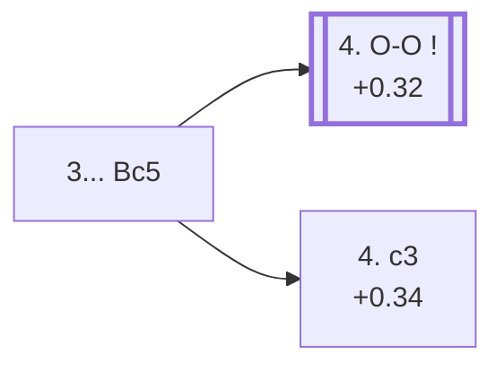

<a name="_TOP_"></a>

# C64 Ruy Lopez: Classical Variation <br> 1. e4 e5 2. Nf3 Nc6 3. Bb5 Bc5 #

Migrated from [C60's own "3... Bc5" section](https://github.com/onclemarcel/chess_flashcards/blob/main/e4_openings/C60_Ruy_Lopez.md) — this exact position is already live-tagged its own code, C64 (`eco.md`'s own name is the *Classical (Cordel) Defence*). Develops actively and calls White's bluff: **4. Bxc6 dxc6 5. Nxe5?? Qd4!** forks the e5-knight and the b2-pawn, so White should not actually try to win the e5-pawn this way.

### Overview

*Quick map of every move covered on this card — see the [shape key](https://github.com/onclemarcel/chess_flashcards/blob/main/start.md#content-diagram-optional) in start.md.*

<!-- content-diagram:start -->

<!-- content-diagram:end -->

<a name="_initial_move_"></a>

[](https://lichess.org/analysis/standard/r1bqk1nr/pppp1ppp/2n5/1Bb1p3/4P3/5N2/PPPP1PPP/RNBQK2R_w_KQkq_-_4_4)

*... 3... Bc5 — Classical Variation*

```
r1bqk1nr/pppp1ppp/2n5/1Bb1p3/4P3/5N2/PPPP1PPP/RNBQK2R w KQkq - 4 4
```

|  | +0.32 |
| --- | --- |

<!-- lichess-stats:start fen="r1bqk1nr/pppp1ppp/2n5/1Bb1p3/4P3/5N2/PPPP1PPP/RNBQK2R w KQkq - 4 4" db="lichess,masters" speeds="bullet,blitz" ratings="1800,2000,2200,2500" moves="4" -->
| Move | Online | W/D/B | Masters | W/D/B | |
| :--- | ---: | :--- | ---: | :--- | :-- |
| O-O | 2.3 M (48.1%) | ⬜⬜⬜⬜⬜⬛⬛⬛⬛⬛ 50/4/46 | 1.0 k (51.3%) | ⬜⬜⬜🟫🟫🟫🟫⬛⬛⬛ 34/41/25 |  |
| c3 | 1.3 M (27.7%) | ⬜⬜⬜⬜⬜⬛⬛⬛⬛⬛ 51/4/45 | 898 (45.5%) | ⬜⬜⬜⬜🟫🟫🟫🟫⬛⬛ 44/39/17 |  |
| Bxc6 | 645 k (13.4%) | ⬜⬜⬜⬜⬜⬛⬛⬛⬛⬛ 48/5/48 | 0 | — | ⚠ |
| d3 | 218 k (4.5%) | ⬜⬜⬜⬜⬜⬛⬛⬛⬛⬛ 47/4/49 | 23 (1.2%) | ⬜⬜🟫🟫🟫🟫⬛⬛⬛⬛ 22/43/35 |  |
| Nxe5 | 0 | — | 14 (0.7%) | — |  |

*Online: bullet/blitz, 1800+ — 4.8 M games. Masters: 2.0 k games. [Open in the explorer](https://lichess.org/analysis/standard/r1bqk1nr/pppp1ppp/2n5/1Bb1p3/4P3/5N2/PPPP1PPP/RNBQK2R_w_KQkq_-_4_4#explorer) — updated 2026-09-09*
<!-- lichess-stats:end -->

* [**4. O-O**](#_OO_) (51.3% masters): masters' clear main try — covered below.
* [**4. c3**](#_c3_) (45.5% masters): live-tagged the *Central Variation* — covered below.

[*Back to TOP*](#_TOP_)

---

<a name="_OO_"></a>

### 4. O-O

[](https://lichess.org/analysis/standard/r1bqk1nr/pppp1ppp/2n5/1Bb1p3/4P3/5N2/PPPP1PPP/RNBQ1RK1_b_kq_-_5_4)

*... 4. O-O*

```
r1bqk1nr/pppp1ppp/2n5/1Bb1p3/4P3/5N2/PPPP1PPP/RNBQ1RK1 b kq - 5 4
```

|  | +0.32 |
| --- | --- |

Castles immediately rather than preparing d4 with c3 first. **4... Nd4!?**, offering a trade of a central knight for the bishop pair, reaches a further tabiya where **5. b4!?**, the ***Zaitsev Variation***, counter-offers a pawn to deflect the bishop. Masters split between **5... Bb6** (42.9%) and **5... Bxb4** (38.1%). Not built out further here (backlog).

[*Back to 3... Bc5*](#_initial_move_)
[*Back to TOP*](#_TOP_)

---

<a name="_c3_"></a>

### 4. c3 — Central Variation

[](https://lichess.org/analysis/standard/r1bqk1nr/pppp1ppp/2n5/1Bb1p3/4P3/2P2N2/PP1P1PPP/RNBQK2R_b_KQkq_-_0_4)

*... 4. c3 — Central Variation*

```
r1bqk1nr/pppp1ppp/2n5/1Bb1p3/4P3/2P2N2/PP1P1PPP/RNBQK2R b KQkq - 0 4
```

|  | +0.34 |
| --- | --- |

Prepares d4 before castling — live-tagged the *Central Variation*. Black's own reply genuinely forks four ways, all real named lines:

* [**4... Nf6**](#_Benelux_) (48.6% masters): masters' clear main try — continues toward the *Benelux Variation* — covered below.
* **4... f5** (27.4% masters): the *Cordel Gambit* — covered below.
* [**4... Bb6**](#_Charousek_) (a real, if secondary, try): the *Charousek Variation* — covered below.
* [**4... Qe7**](#_Boden_) (a genuine database rarity): the *Boden Variation* — covered below.

[*Back to 3... Bc5*](#_initial_move_)
[*Back to TOP*](#_TOP_)

---

<a name="_Benelux_"></a>

### 4... Nf6 5. O-O O-O 6. d4 Bb6 — Benelux Variation

[](https://lichess.org/analysis/standard/r1bq1rk1/pppp1ppp/1bn2n2/1B2p3/3PP3/2P2N2/PP3PPP/RNBQ1RK1_w_-_-_1_7)

*... 6... Bb6 — Benelux Variation*

```
r1bq1rk1/pppp1ppp/1bn2n2/1B2p3/3PP3/2P2N2/PP3PPP/RNBQ1RK1 w - - 1 7
```

|  | +0.30 |
| --- | --- |

Both sides castle and White claims the centre before Black retreats the bishop to safety, keeping it aimed at f2. Masters' clear reply is **7. Bg5** (62.0%), pinning the newly-arrived f6-knight. Not built out further here (backlog).

[*Back to 4. c3*](#_c3_)
[*Back to TOP*](#_TOP_)

---

<a name="_Charousek_"></a>

### 4... Bb6 — Charousek Variation

[](https://lichess.org/analysis/standard/r1bqk1nr/pppp1ppp/1bn5/1B2p3/4P3/2P2N2/PP1P1PPP/RNBQK2R_w_KQkq_-_1_5)

*... 4... Bb6 — Charousek Variation*

```
r1bqk1nr/pppp1ppp/1bn5/1B2p3/4P3/2P2N2/PP1P1PPP/RNBQK2R w KQkq - 1 5
```

|  | +1.00 |
| --- | --- |

Retreats the bishop to safety immediately, sidestepping the Benelux move order — a real, substantial engine edge for White at this exact depth (a genuine database rarity, only 50 masters games). Masters split evenly between **5. O-O** (50.0%) and **5. d4** (46.0%). Not built out further here (backlog).

[*Back to 4. c3*](#_c3_)
[*Back to TOP*](#_TOP_)

---

<a name="_Boden_"></a>

### 4... Qe7 — Boden Variation

[](https://lichess.org/analysis/standard/r1b1k1nr/ppppqppp/2n5/1Bb1p3/4P3/2P2N2/PP1P1PPP/RNBQK2R_w_KQkq_-_1_5)

*... 4... Qe7 — Boden Variation*

```
r1b1k1nr/ppppqppp/2n5/1Bb1p3/4P3/2P2N2/PP1P1PPP/RNBQK2R w KQkq - 1 5
```

|  | +1.14 |
| --- | --- |

Defends e5 a second time and prepares ...O-O-O in some lines — a genuine database rarity (only 12 masters games), and per the engine a real, substantial edge for White, the biggest of this whole fork. Masters' clear reply is **5. O-O** (83.3%). Not built out further here (backlog).

[*Back to 4. c3*](#_c3_)
[*Back to TOP*](#_TOP_)

---

<a name="_CordelGambit_"></a>

### 4... f5 — Cordel Gambit

[](https://lichess.org/analysis/standard/r1bqk1nr/pppp2pp/2n5/1Bb1pp2/4P3/2P2N2/PP1P1PPP/RNBQK2R_w_KQkq_f6_0_5)

*... 4... f5 — Cordel Gambit*

```
r1bqk1nr/pppp2pp/2n5/1Bb1pp2/4P3/2P2N2/PP1P1PPP/RNBQK2R w KQkq f6 0 5
```

|  | +0.56 |
| --- | --- |

Counter-attacks e4 in Schliemann style rather than developing further. Masters' clear reply is **5. d4** (76.8%), striking the centre while Black's last move loosened rather than solidified it. Not built out further here (backlog).

[*Back to 4. c3*](#_c3_)
[*Back to TOP*](#_TOP_)
