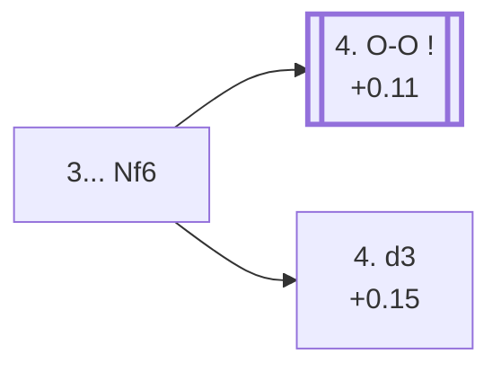

<a name="_TOP_"></a>

# C65 Ruy Lopez: Berlin Defense <br> 1. e4 e5 2. Nf3 Nc6 3. Bb5 Nf6 #

Migrated from [C60's own "3... Nf6" section](https://github.com/onclemarcel/chess_flashcards/blob/main/e4_openings/C60_Ruy_Lopez.md) — this exact position is already live-tagged its own code, C65. Rather than address the pin, Black counter-attacks e4 instead. Famous for the drawish "Berlin Wall" endgame that shut down 1. e4 at the very top level for a decade once Kramnik used it against Kasparov in their 2000 world championship match.

### Overview

*Quick map of every move covered on this card — see the [shape key](https://github.com/onclemarcel/chess_flashcards/blob/main/start.md#content-diagram-optional) in start.md.*

<!-- content-diagram:start -->

<!-- content-diagram:end -->

<a name="_initial_move_"></a>

[](https://lichess.org/analysis/standard/r1bqkb1r/pppp1ppp/2n2n2/1B2p3/4P3/5N2/PPPP1PPP/RNBQK2R_w_KQkq_-_4_4)

*... 3... Nf6 — Berlin Defense*

```
r1bqkb1r/pppp1ppp/2n2n2/1B2p3/4P3/5N2/PPPP1PPP/RNBQK2R w KQkq - 4 4
```

|  | +0.17 |
| --- | --- |

<!-- lichess-stats:start fen="r1bqkb1r/pppp1ppp/2n2n2/1B2p3/4P3/5N2/PPPP1PPP/RNBQK2R w KQkq - 4 4" db="lichess,masters" speeds="bullet,blitz" ratings="1800,2000,2200,2500" moves="4" -->
| Move | Online | W/D/B | Masters | W/D/B | |
| :--- | ---: | :--- | ---: | :--- | :-- |
| O-O | 3.1 M (51.6%) | ⬜⬜⬜⬜⬜🟫⬛⬛⬛⬛ 52/6/43 | 18 k (56.1%) | ⬜⬜🟫🟫🟫🟫🟫🟫🟫⬛ 19/69/13 |  |
| d3 | 1.5 M (24.6%) | ⬜⬜⬜⬜⬜🟫⬛⬛⬛⬛ 51/5/45 | 12 k (37.9%) | ⬜⬜🟫🟫🟫🟫🟫🟫⬛⬛ 23/63/14 |  |
| Bxc6 | 708 k (11.9%) | ⬜⬜⬜⬜⬜🟫⬛⬛⬛⬛ 50/5/45 | 0 | — | ⚠ |
| Nc3 | 385 k (6.5%) | ⬜⬜⬜⬜⬜⬛⬛⬛⬛⬛ 49/5/46 | 656 (2.0%) | ⬜⬜🟫🟫🟫🟫🟫🟫⬛⬛ 24/59/17 |  |
| Qe2 | 0 | — | 835 (2.5%) | ⬜⬜⬜🟫🟫🟫🟫⬛⬛⬛ 34/38/28 |  |

*Online: bullet/blitz, 1800+ — 6.0 M games. Masters: 33 k games. [Open in the explorer](https://lichess.org/analysis/standard/r1bqkb1r/pppp1ppp/2n2n2/1B2p3/4P3/5N2/PPPP1PPP/RNBQK2R_w_KQkq_-_4_4#explorer) — updated 2026-09-07*
<!-- lichess-stats:end -->

* **4. O-O** (+0.11, 56.1% masters): masters' clear main try — leads to the famous Berlin Wall complex, its own card, [C67](https://github.com/onclemarcel/chess_flashcards/blob/main/e4_openings/C67_Ruy_Lopez_Berlin_Open.md) (after 4...Nxe4, live-tagged the *Rio Gambit Accepted*), or the quieter [C66](https://github.com/onclemarcel/chess_flashcards/blob/main/e4_openings/C66_Ruy_Lopez_Berlin_Closed.md) (after 4...d6, the *Improved Steinitz Defense*) — both covered on their own cards.
* [**4. d3**](#_d3_) (37.9% masters): live-tagged the *Anti-Berlin Variation* — covered below.

[*Back to TOP*](#_TOP_)

---

<a name="_d3_"></a>

### 4. d3 — Anti-Berlin Variation

[](https://lichess.org/analysis/standard/r1bqkb1r/pppp1ppp/2n2n2/1B2p3/4P3/3P1N2/PPP2PPP/RNBQK2R_b_KQkq_-_0_4)

*... 4. d3 — Anti-Berlin Variation*

```
r1bqkb1r/pppp1ppp/2n2n2/1B2p3/4P3/3P1N2/PPP2PPP/RNBQK2R b KQkq - 0 4
```

|  | +0.15 |
| --- | --- |

Sidesteps the whole Berlin endgame complex by delaying O-O, a real, substantial minority try in its own right (37.9% masters). Black's own reply genuinely forks three ways:

* [**4... Bc5**](#_Kaufmann_) (79.0% masters): masters' overwhelming choice, developing actively — covered below.
* [**4... d6**](#_d3d6_) (19.3% masters): covered below.
* [**4... Ne7**](#_Mortimer_) (a real, if secondary, try): the *Mortimer Variation* — covered below.

[*Back to 3... Nf6*](#_initial_move_)
[*Back to TOP*](#_TOP_)

---

<a name="_Mortimer_"></a>

### 4... Ne7 — Mortimer Variation

[](https://lichess.org/analysis/standard/r1bqkb1r/ppppnppp/5n2/1B2p3/4P3/3P1N2/PPP2PPP/RNBQK2R_w_KQkq_-_1_5)

*... 4... Ne7 — Mortimer Variation*

```
r1bqkb1r/ppppnppp/5n2/1B2p3/4P3/3P1N2/PPP2PPP/RNBQK2R w KQkq - 1 5
```

|  | +0.38 |
| --- | --- |

Reroutes the knight rather than developing the bishop — an unusual-looking move whose whole point is a real practical trap. Masters split between **5. O-O** (49.0%) and **5. Nc3** (18.3%), but **5. Nxe5!? c6!**, the ***Mortimer Trap***, is the reason this line has any independent reputation at all: the knight looks won, but **6. Ba4 b5 7. Nxb5!? cxb5 8. Bxb5+** doesn't actually recover enough material — Black comes out a real, substantial pawn ahead (−1.29), so White should simply retreat the bishop instead of grabbing the knight. Not built out further here beyond this trap summary (backlog).

[*Back to 4. d3*](#_d3_)
[*Back to TOP*](#_TOP_)

---

<a name="_d3d6_"></a>

### 4... d6

[](https://lichess.org/analysis/standard/r1bqkb1r/ppp2ppp/2np1n2/1B2p3/4P3/3P1N2/PPP2PPP/RNBQK2R_w_KQkq_-_0_5)

*... 4... d6*

```
r1bqkb1r/ppp2ppp/2np1n2/1B2p3/4P3/3P1N2/PPP2PPP/RNBQK2R w KQkq - 0 5
```

|  | +0.21 |
| --- | --- |

Solidifies e5 rather than developing the bishop first — masters split between **5. O-O** (50.1%) and **5. c3** (40.8%). Two named lines fork from White's 5th move:

* **5. Bxc6+ bxc6!?**, the *Anderssen Variation* (−0.24, a genuine engine edge for Black despite the doubled pawns) — a genuine database rarity, only 4 masters games. Trades the bishop early rather than developing further.
* **5. c4!?**, the *Duras Variation* (0.00) — gains queenside space instead of castling; masters split **5... g6** (47.9%) and **5... Be7** (30.2%).

Neither built out further here (backlog).

[*Back to 4. d3*](#_d3_)
[*Back to TOP*](#_TOP_)

---

<a name="_Kaufmann_"></a>

### 4... Bc5 5. Be3 — Kaufmann Variation

[](https://lichess.org/analysis/standard/r1bqk2r/pppp1ppp/2n2n2/1Bb1p3/4P3/3PBN2/PPP2PPP/RN1QK2R_b_KQkq_-_2_5)

*... 5. Be3 — Kaufmann Variation*

```
r1bqk2r/pppp1ppp/2n2n2/1Bb1p3/4P3/3PBN2/PPP2PPP/RN1QK2R b KQkq - 2 5
```

|  | 0.00 |
| --- | --- |

Offers a trade of dark-squared bishops rather than developing quietly — White's own 4...Bc5 fork itself splits masters between **c3** (44.3%) and **Bxc6** (35.7%) before this named line even starts. Masters split between **5... Bxe3** (54.8%, simplifying at once) and **5... Qe7** (41.9%, keeping the tension). Not built out further here (backlog).

[*Back to 4. d3*](#_d3_)
[*Back to TOP*](#_TOP_)

---

<a name="_Nyholm_"></a>

### 4. O-O Nxe4 5. d4 exd4 — Nyholm Attack

[](https://lichess.org/analysis/standard/r1bqkb1r/pppp1ppp/2n2n2/1B6/3pP3/5N2/PPP2PPP/RNBQ1RK1_b_kq_-_1_5)

*... 5. O-O — Nyholm Attack*

```
r1bqkb1r/pppp1ppp/2n2n2/1B6/3pP3/5N2/PPP2PPP/RNBQ1RK1 b kq - 1 5
```

|  | 0.00 |
| --- | --- |

Reached via an alternate move order (4. d4 exd4 5. O-O, rather than 4. O-O Nxe4 5. d4) — the whole point is a gambit-flavoured recapture of the pawn rather than the immediate 5. Nxd4/Qxd4. Masters split between **5... a6** (55.0%, asking the bishop the question at once) and **5... Be7** (33.8%, developing quietly). Not built out further here (backlog).

[*Back to TOP*](#_TOP_)

---

<a name="_Beverwijk_"></a>

### 4. O-O Bc5 — Beverwijk Variation

[](https://lichess.org/analysis/standard/r1bqk2r/pppp1ppp/2n2n2/1Bb1p3/4P3/5N2/PPPP1PPP/RNBQ1RK1_w_kq_-_6_5)

*... 4... Bc5 — Beverwijk Variation*

```
r1bqk2r/pppp1ppp/2n2n2/1Bb1p3/4P3/5N2/PPPP1PPP/RNBQ1RK1 w kq - 6 5
```

|  | +0.36 |
| --- | --- |

Castles into a Classical-Defense-style setup rather than counter-attacking e4 — a real, if secondary, try after 4. O-O (5.6% masters, well behind 4...Nxe4's 91.0%). Masters split between **5. c3** (49.1%) and **5. Nxe5!?** (35.8%, a real pawn grab since the knight defending e5 has moved away). Not built out further here (backlog).

[*Back to TOP*](#_TOP_)
