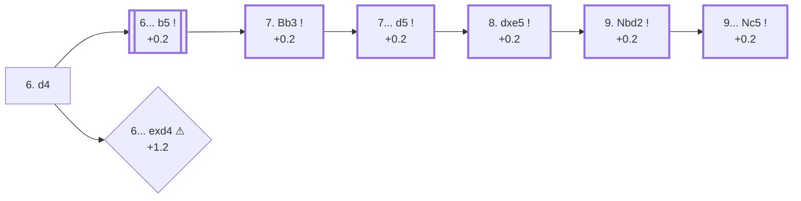

<a name="_TOP_"></a>

# C80 Ruy Lopez: Open Variation <br> 1. e4 e5 2. Nf3 Nc6 3. Bb5 a6 4. Ba4 Nf6 5. O-O Nxe4 6. d4 #

Spun off from [C84's 5... Nxe4](https://github.com/onclemarcel/chess_flashcards/blob/main/e4_openings/C84_Ruy_Lopez_Morphy_Closed.md#_Nxe4_): rather than meet the pin with ... Be7 or ... b5, Black grabs the e4 pawn while it's briefly loose. White doesn't try to win the knight back on the spot — **6. d4!** strikes the centre and the e5 pawn at once, and Black has to give ground there before the extra tempo starts to matter. The resulting positions are sharper and far more concrete than the Closed main line: a real, independent system (9.4% of masters games at move 5, see C84), not a sideline to be refuted.

### Overview

*Quick map of every move covered on this card — see the [shape key](https://github.com/onclemarcel/chess_flashcards/blob/main/start.md#content-diagram-optional) in start.md.*

<!-- content-diagram:start -->

<!-- content-diagram:end -->

<a name="_initial_move_"></a>

[](https://lichess.org/analysis/standard/r1bqkb1r/1ppp1ppp/p1n5/4p3/B2Pn3/5N2/PPP2PPP/RNBQ1RK1_b_kq_d3_0_6)

*... 6. d4 — Open Variation*

```
r1bqkb1r/1ppp1ppp/p1n5/4p3/B2Pn3/5N2/PPP2PPP/RNBQ1RK1 b kq d3 0 6
```

|  | +0.2 |
| --- | --- |

<!-- lichess-stats:start fen="r1bqkb1r/1ppp1ppp/p1n5/4p3/B2Pn3/5N2/PPP2PPP/RNBQ1RK1 b kq d3 0 6" db="lichess,masters" speeds="bullet,blitz" ratings="1800,2000,2200,2500" moves="5" -->
| Move | Online | W/D/B | Masters | W/D/B | |
| :--- | ---: | :--- | ---: | :--- | :-- |
| b5 | 162 k (75.3%) | ⬜⬜⬜⬜⬜🟫⬛⬛⬛⬛ 47/7/46 | 7.1 k (93.4%) | ⬜⬜⬜🟫🟫🟫🟫🟫🟫⬛ 28/56/15 |  |
| exd4 | 26 k (12.1%) | ⬜⬜⬜⬜🟫⬛⬛⬛⬛⬛ 38/12/50 | 106 (1.4%) | ⬜⬜⬜⬜🟫🟫🟫🟫⬛⬛ 40/39/22 |  |
| Be7 | 15 k (7.1%) | ⬜⬜⬜⬜🟫⬛⬛⬛⬛⬛ 45/9/47 | 392 (5.2%) | ⬜⬜⬜⬜🟫🟫🟫🟫⬛⬛ 36/44/20 |  |
| d5 | 8.7 k (4.1%) | ⬜⬜⬜⬜⬜🟫⬛⬛⬛⬛ 53/6/41 | 3 (0.0%) | — | ⚠ |
| Nxd4 | 805 (0.4%) | ⬜⬜⬜⬜⬜⬜⬜⬛⬛⬛ 65/3/32 | 0 | — | ⚠ |
| Nd6 | 0 | — | 1 (0.0%) | — |  |

*Online: bullet/blitz, 1800+ — 214 k games. Masters: 7.6 k games. [Open in the explorer](https://lichess.org/analysis/standard/r1bqkb1r/1ppp1ppp/p1n5/4p3/B2Pn3/5N2/PPP2PPP/RNBQ1RK1_b_kq_d3_0_6#explorer) — updated 2026-08-26*
<!-- lichess-stats:end -->

### Candidate moves

* [**6... b5**](#_b5_) (+0.2): defends the knight and gains a tempo on the bishop before it does anything else — masters' near-automatic choice (93.4%).
* **6... Be7**: solid, gives back none of the tempo White is owed for the pawn — a real but rare try (5.2% masters).
* [**6... exd4**](#_exd4_) (+1.2 ⚠): grabs a second pawn, but drops the e4 knight's cover and walks into a tactical shot — see the TIP below.

[*Back to TOP*](#_TOP_)

---

> [!TIP]
> **6... exd4?!** looks natural — Black already has one extra pawn on e4, why not take a second? — but it removes the e5 pawn that used to block the e-file, and the e4 knight has nothing else defending it.
>
> <a name="_exd4_"></a>
>
> ### 6... exd4 — the knight has no real shelter
>
> **7. Re1!** pins the idea together: the rook lands on the newly-open e-file and the knight has no good square. Best play still loses the pawn back with interest — Stockfish's own top line runs **7... f5 8. Nxd4 Qh4 9. g3 Qf6 10. Nxc6 bxc6**, and White keeps the bishop pair and a much better structure. This is a genuinely punishable mistake, not just a slightly worse version of 6... b5 (+1.2 vs +0.2 — a full pawn swing).
>
> [](https://lichess.org/analysis/standard/r1bqkb1r/1ppp1ppp/p1n5/8/B2pn3/5N2/PPP2PPP/RNBQ1RK1_w_kq_-_0_7)
>
> *... 6... exd4 — red: 7. Re1 is coming for the undefended e4 knight*
>
> ```
> r1bqkb1r/1ppp1ppp/p1n5/8/B2pn3/5N2/PPP2PPP/RNBQ1RK1 w kq - 0 7
> ```
>
> |  | +1.2 |
> | --- | --- |
>
> [*Back to 6. d4*](#_initial_move_)
> [*Back to TOP*](#_TOP_)

---

<a name="_b5_"></a>

## 6... b5

[](https://lichess.org/analysis/standard/r1bqkb1r/2pp1ppp/p1n5/1p2p3/B2Pn3/5N2/PPP2PPP/RNBQ1RK1_w_kq_b6_0_7)

*... 6... b5 — defending the knight with tempo*

```
r1bqkb1r/2pp1ppp/p1n5/1p2p3/B2Pn3/5N2/PPP2PPP/RNBQ1RK1 w kq b6 0 7
```

|  | +0.2 |
| --- | --- |

<!-- lichess-stats:start fen="r1bqkb1r/2pp1ppp/p1n5/1p2p3/B2Pn3/5N2/PPP2PPP/RNBQ1RK1 w kq b6 0 7" db="lichess,masters" speeds="bullet,blitz" ratings="1800,2000,2200,2500" moves="5" -->
| Move | Online | W/D/B | Masters | W/D/B | |
| :--- | ---: | :--- | ---: | :--- | :-- |
| Bb3 | 159 k (98.3%) | ⬜⬜⬜⬜⬜🟫⬛⬛⬛⬛ 47/7/46 | 7.1 k (99.8%) | ⬜⬜⬜🟫🟫🟫🟫🟫🟫⬛ 28/56/15 |  |
| d5 | 1.5 k (0.9%) | ⬜⬜⬜⬜⬜⬛⬛⬛⬛⬛ 46/4/49 | 7 (0.1%) | — |  |
| Re1 | 854 (0.5%) | ⬜⬜⬜⬜⬛⬛⬛⬛⬛⬛ 38/4/58 | 1 (0.0%) | — | ⚠ |
| Nxe5 | 278 (0.2%) | ⬜⬜⬜⬜⬜🟫⬛⬛⬛⬛ 53/5/42 | 5 (0.1%) | — |  |
| dxe5 | 101 (0.1%) | ⬜⬜⬜⬜⬛⬛⬛⬛⬛⬛ 36/2/62 | 0 | — | ⚠ |

*Online: bullet/blitz, 1800+ — 162 k games. Masters: 7.1 k games. [Open in the explorer](https://lichess.org/analysis/standard/r1bqkb1r/2pp1ppp/p1n5/1p2p3/B2Pn3/5N2/PPP2PPP/RNBQ1RK1_w_kq_b6_0_7#explorer) — updated 2026-08-26*
<!-- lichess-stats:end -->

**7. Bb3** is essentially forced (99.8% of masters games) — the bishop has to move off the a4-e8 diagonal before ... b4 could hit it again, and b3 keeps the long-term aim at f7 alive.

[*Back to 6. d4*](#_initial_move_)
[*Back to TOP*](#_TOP_)

---

<a name="_Bb3_"></a>

## 7. Bb3

[](https://lichess.org/analysis/standard/r1bqkb1r/2pp1ppp/p1n5/1p2p3/3Pn3/1B3N2/PPP2PPP/RNBQ1RK1_b_kq_-_1_7)

*... 7. Bb3*

```
r1bqkb1r/2pp1ppp/p1n5/1p2p3/3Pn3/1B3N2/PPP2PPP/RNBQ1RK1 b kq - 1 7
```

|  | +0.2 |
| --- | --- |

<!-- lichess-stats:start fen="r1bqkb1r/2pp1ppp/p1n5/1p2p3/3Pn3/1B3N2/PPP2PPP/RNBQ1RK1 b kq - 1 7" db="lichess,masters" speeds="bullet,blitz" ratings="1800,2000,2200,2500" moves="5" -->
| Move | Online | W/D/B | Masters | W/D/B | |
| :--- | ---: | :--- | ---: | :--- | :-- |
| d5 | 178 k (93.4%) | ⬜⬜⬜⬜⬜🟫⬛⬛⬛⬛ 47/7/46 | 7.1 k (99.4%) | ⬜⬜⬜🟫🟫🟫🟫🟫🟫⬛ 28/56/15 |  |
| exd4 | 5.6 k (2.9%) | ⬜⬜⬜⬜⬜🟫⬛⬛⬛⬛ 53/4/43 | 5 (0.1%) | — |  |
| Be7 | 3.7 k (1.9%) | ⬜⬜⬜⬜⬜🟫⬛⬛⬛⬛ 54/5/41 | 38 (0.5%) | ⬜⬜⬜⬜🟫🟫🟫🟫⬛⬛ 42/39/18 |  |
| d6 | 1.1 k (0.6%) | ⬜⬜⬜⬜⬜⬜⬜⬜⬛⬛ 78/3/19 | 0 | — | ⚠ |
| Nxd4 | 871 (0.5%) | ⬜⬜⬜⬜⬜⬜⬜⬛⬛⬛ 71/2/27 | 0 | — | ⚠ |

*Online: bullet/blitz, 1800+ — 190 k games. Masters: 7.2 k games. [Open in the explorer](https://lichess.org/analysis/standard/r1bqkb1r/2pp1ppp/p1n5/1p2p3/3Pn3/1B3N2/PPP2PPP/RNBQ1RK1_b_kq_-_1_7#explorer) — updated 2026-08-26*
<!-- lichess-stats:end -->

**7... d5** stakes out the centre while the knight is still solidly placed on e4 — the near-unanimous choice in masters play (99.4%).

[*Back to 6... b5*](#_b5_)
[*Back to TOP*](#_TOP_)

---

<a name="_d5_"></a>

## 7... d5 — the Open Variation tabiya

[](https://lichess.org/analysis/standard/r1bqkb1r/2p2ppp/p1n5/1p1pp3/3Pn3/1B3N2/PPP2PPP/RNBQ1RK1_w_kq_d6_0_8)

*... 7... d5 — Black's centre and extra activity balance White's bishop pair and lead*

```
r1bqkb1r/2p2ppp/p1n5/1p1pp3/3Pn3/1B3N2/PPP2PPP/RNBQ1RK1 w kq d6 0 8
```

|  | +0.2 |
| --- | --- |

<!-- lichess-stats:start fen="r1bqkb1r/2p2ppp/p1n5/1p1pp3/3Pn3/1B3N2/PPP2PPP/RNBQ1RK1 w kq d6 0 8" db="lichess,masters" speeds="bullet,blitz" ratings="1800,2000,2200,2500" moves="5" -->
| Move | Online | W/D/B | Masters | W/D/B | |
| :--- | ---: | :--- | ---: | :--- | :-- |
| dxe5 | 150 k (84.3%) | ⬜⬜⬜⬜⬜🟫⬛⬛⬛⬛ 47/7/46 | 7.0 k (98.2%) | ⬜⬜⬜🟫🟫🟫🟫🟫🟫⬛ 28/56/15 |  |
| Nxe5 | 16 k (8.9%) | ⬜⬜⬜⬜⬜⬛⬛⬛⬛⬛ 47/6/46 | 85 (1.2%) | ⬜⬜🟫🟫🟫🟫🟫🟫⬛⬛ 24/54/22 |  |
| Re1 | 9.4 k (5.3%) | ⬜⬜⬜⬜🟫⬛⬛⬛⬛⬛ 44/5/51 | 4 (0.1%) | — | ⚠ |
| a4 | 1.0 k (0.6%) | ⬜⬜⬜⬜⬜🟫⬛⬛⬛⬛ 51/5/43 | 19 (0.3%) | — |  |
| Nc3 | 787 (0.4%) | ⬜⬜⬜⬜⬜⬜🟫⬛⬛⬛ 61/5/34 | 18 (0.3%) | — |  |

*Online: bullet/blitz, 1800+ — 178 k games. Masters: 7.1 k games. [Open in the explorer](https://lichess.org/analysis/standard/r1bqkb1r/2p2ppp/p1n5/1p1pp3/3Pn3/1B3N2/PPP2PPP/RNBQ1RK1_w_kq_d6_0_8#explorer) — updated 2026-08-26*
<!-- lichess-stats:end -->

From here the game is essentially forced for several more moves.

* [**8. dxe5**](#_dxe5o_) (+0.2): near-unanimous (98.2% masters) — see below.

[*Back to 7. Bb3*](#_Bb3_)
[*Back to TOP*](#_TOP_)

---

<a name="_dxe5o_"></a>

## 8. dxe5

[](https://lichess.org/analysis/standard/r1bqkb1r/2p2ppp/p1n5/1p1pP3/4n3/1B3N2/PPP2PPP/RNBQ1RK1_b_kq_-_0_8)

*... 8. dxe5*

```
r1bqkb1r/2p2ppp/p1n5/1p1pP3/4n3/1B3N2/PPP2PPP/RNBQ1RK1 b kq - 0 8
```

|  | +0.2 |
| --- | --- |

**8... Be6** is essentially forced (99.9% of masters games) — developing the last minor piece and eyeing d5/c4 before White can pressure the knight.

[](https://lichess.org/analysis/standard/r2qkb1r/2p2ppp/p1n1b3/1p1pP3/4n3/1B3N2/PPP2PPP/RNBQ1RK1_w_kq_-_1_9)

*... 8... Be6 — reaching the main Open Variation tabiya*

```
r2qkb1r/2p2ppp/p1n1b3/1p1pP3/4n3/1B3N2/PPP2PPP/RNBQ1RK1 w kq - 1 9
```

|  | +0.2 |
| --- | --- |

<!-- lichess-stats:start fen="r2qkb1r/2p2ppp/p1n1b3/1p1pP3/4n3/1B3N2/PPP2PPP/RNBQ1RK1 w kq - 1 9" db="lichess,masters" speeds="bullet,blitz" ratings="1800,2000,2200,2500" moves="4" -->
| Move | Online | W/D/B | Masters | W/D/B | |
| :--- | ---: | :--- | ---: | :--- | :-- |
| c3 | 64 k (43.7%) | ⬜⬜⬜⬜🟫⬛⬛⬛⬛⬛ 46/7/47 | 1.9 k (27.7%) | ⬜⬜⬜🟫🟫🟫🟫🟫⬛⬛ 27/55/18 |  |
| Nbd2 | 39 k (26.4%) | ⬜⬜⬜⬜⬜🟫⬛⬛⬛⬛ 48/8/44 | 3.3 k (46.7%) | ⬜⬜⬜🟫🟫🟫🟫🟫🟫⬛ 27/60/13 |  |
| Qe2 | 13 k (9.0%) | ⬜⬜⬜⬜⬜🟫⬛⬛⬛⬛ 51/8/41 | 667 (9.6%) | ⬜⬜⬜🟫🟫🟫🟫🟫⬛⬛ 33/52/15 |  |
| Re1 | 9.6 k (6.5%) | ⬜⬜⬜⬜🟫⬛⬛⬛⬛⬛ 42/5/53 | 0 | — | ⚠ |
| Be3 | 0 | — | 1.0 k (14.9%) | ⬜⬜⬜🟫🟫🟫🟫🟫⬛⬛ 32/50/18 |  |

*Online: bullet/blitz, 1800+ — 147 k games. Masters: 7.0 k games. [Open in the explorer](https://lichess.org/analysis/standard/r2qkb1r/2p2ppp/p1n1b3/1p1pP3/4n3/1B3N2/PPP2PPP/RNBQ1RK1_w_kq_-_1_9#explorer) — updated 2026-08-26*
<!-- lichess-stats:end -->

White's 9th move is a genuine four-way choice: **9. Nbd2** (46.7% masters, the top try — the knight heads for e4/c4 next), **9. c3** (27.7%, supporting a later d4 or Bc2-Nbd2 regrouping), **9. Be3** (14.9%) and **9. Qe2** (9.6%) are all played.

* [**9. Nbd2**](#_Nbd2o_) (+0.2): masters' top try (46.7%) — the Bernstein Variation, see below.
* **9. c3 / 9. Be3 / 9. Qe2**: all real (27.7%/14.9%/9.6% masters) — not covered further here.

[*Back to 8. dxe5*](#_dxe5o_)
[*Back to TOP*](#_TOP_)

---

<a name="_Nbd2o_"></a>

## 9. Nbd2 — Bernstein Variation

[](https://lichess.org/analysis/standard/r2qkb1r/2p2ppp/p1n1b3/1p1pP3/4n3/1B3N2/PPPN1PPP/R1BQ1RK1_b_kq_-_2_9)

*... 9. Nbd2 — Bernstein Variation*

```
r2qkb1r/2p2ppp/p1n1b3/1p1pP3/4n3/1B3N2/PPPN1PPP/R1BQ1RK1 b kq - 2 9
```

|  | +0.1 |
| --- | --- |

<!-- lichess-stats:start fen="r2qkb1r/2p2ppp/p1n1b3/1p1pP3/4n3/1B3N2/PPPN1PPP/R1BQ1RK1 b kq - 2 9" db="lichess,masters" speeds="bullet,blitz" ratings="1800,2000,2200,2500" moves="3" -->
| Move | Online | W/D/B | Masters | W/D/B | |
| :--- | ---: | :--- | ---: | :--- | :-- |
| Nc5 | 23 k (59.6%) | ⬜⬜⬜⬜⬜🟫⬛⬛⬛⬛ 48/8/44 | 2.4 k (75.0%) | ⬜⬜⬜🟫🟫🟫🟫🟫🟫⬛ 26/62/12 |  |
| Bc5 | 8.5 k (21.9%) | ⬜⬜⬜⬜⬜🟫⬛⬛⬛⬛ 47/8/45 | 242 (7.4%) | ⬜⬜⬜🟫🟫🟫🟫🟫⬛⬛ 34/51/15 |  |
| Be7 | 5.1 k (13.1%) | ⬜⬜⬜⬜🟫⬛⬛⬛⬛⬛ 45/10/45 | 554 (17.0%) | ⬜⬜⬜🟫🟫🟫🟫🟫🟫⬛ 30/57/14 |  |

*Online: bullet/blitz, 1800+ — 39 k games. Masters: 3.3 k games. [Open in the explorer](https://lichess.org/analysis/standard/r2qkb1r/2p2ppp/p1n1b3/1p1pP3/4n3/1B3N2/PPPN1PPP/R1BQ1RK1_b_kq_-_2_9#explorer) — updated 2026-08-26*
<!-- lichess-stats:end -->

**9... Nc5** is masters' clear main try (75.0%) — this exact position is named the ***Bernstein Variation*** (verified live via the explorer's own `opening` field), retreating the knight to a safer, still-active square rather than waiting for it to be kicked with f3/Nb3.

[](https://lichess.org/analysis/standard/r2qkb1r/2p2ppp/p1n1b3/1pnpP3/8/1B3N2/PPPN1PPP/R1BQ1RK1_w_kq_-_3_10)

*... 9... Nc5 — the Bernstein Variation tabiya*

```
r2qkb1r/2p2ppp/p1n1b3/1pnpP3/8/1B3N2/PPPN1PPP/R1BQ1RK1 w kq - 3 10
```

|  | +0.2 |
| --- | --- |

<!-- lichess-stats:start fen="r2qkb1r/2p2ppp/p1n1b3/1pnpP3/8/1B3N2/PPPN1PPP/R1BQ1RK1 w kq - 3 10" db="lichess,masters" speeds="bullet,blitz" ratings="1800,2000,2200,2500" moves="4" -->
| Move | Online | W/D/B | Masters | W/D/B | |
| :--- | ---: | :--- | ---: | :--- | :-- |
| c3 | 19 k (81.9%) | ⬜⬜⬜⬜⬜🟫⬛⬛⬛⬛ 49/9/43 | 2.4 k (99.5%) | ⬜⬜⬜🟫🟫🟫🟫🟫🟫⬛ 26/62/12 |  |
| Re1 | 2.8 k (12.0%) | ⬜⬜⬜⬜🟫⬛⬛⬛⬛⬛ 44/6/50 | 1 (0.0%) | — | ⚠ |
| Qe2 | 622 (2.7%) | ⬜⬜⬜⬜⬜⬛⬛⬛⬛⬛ 50/5/45 | 8 (0.3%) | — |  |
| a4 | 575 (2.5%) | ⬜⬜⬜⬜⬜🟫⬛⬛⬛⬛ 47/9/45 | 0 | — | ⚠ |
| h3 | 0 | — | 4 (0.2%) | — |  |

*Online: bullet/blitz, 1800+ — 23 k games. Masters: 2.4 k games. [Open in the explorer](https://lichess.org/analysis/standard/r2qkb1r/2p2ppp/p1n1b3/1pnpP3/8/1B3N2/PPPN1PPP/R1BQ1RK1_w_kq_-_3_10#explorer) — updated 2026-08-26*
<!-- lichess-stats:end -->

**10. c3** is close to automatic (99.5% of masters games) — securing the b3 bishop's retreat square on c2 and preparing Bc2 or Nb3 to challenge the c5 knight, while Stockfish still calls the position dead level (+0.2). A good summary of the whole Open Variation: Black's activity and structure genuinely compensate for White's extra central space and bishop pair, all the way through forced-looking main theory. Deeper Bernstein theory past this point is its own extensive body of work, not covered further here.

[*Back to 8... Be6*](#_dxe5o_)
[*Back to TOP*](#_TOP_)
