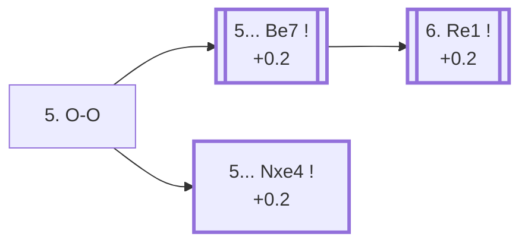

<a name="_TOP_"></a>

# C84 Ruy Lopez: Morphy Defense, Closed Variation <br> 1. e4 e5 2. Nf3 Nc6 3. Bb5 a6 4. Ba4 Nf6 5. O-O #

White castles before deciding anything else, keeping the king safe while the long-term plan — pressure down the a4-e8 diagonal and, eventually, a central break with c3 and d4 — stays exactly the same regardless of what Black does next. This is by far the main tabiya of the entire Ruy Lopez: 87.5% of masters games reach this exact position after 4... Nf6.

### Overview

*Quick map of every move covered on this card — see the [shape key](https://github.com/onclemarcel/chess_flashcards/blob/main/start.md#content-diagram-optional) in start.md. 5... b5, 5... Bc5, and 5... d6 are discussed below but have no anchor of their own, so they're left off this map rather than pointing nowhere.*

<!-- content-diagram:start -->

<!-- content-diagram:end -->

<a name="_initial_move_"></a>

[](https://lichess.org/analysis/standard/r1bqkb1r/1ppp1ppp/p1n2n2/4p3/B3P3/5N2/PPPP1PPP/RNBQ1RK1_b_kq_-_3_5)

*... 5. O-O — the main tabiya of the Ruy Lopez*

```
r1bqkb1r/1ppp1ppp/p1n2n2/4p3/B3P3/5N2/PPPP1PPP/RNBQ1RK1 b kq - 3 5
```

|  | +0.3 |
| --- | --- |

<!-- lichess-stats:start fen="r1bqkb1r/1ppp1ppp/p1n2n2/4p3/B3P3/5N2/PPPP1PPP/RNBQ1RK1 b kq - 3 5" db="lichess,masters" speeds="bullet,blitz" ratings="1800,2000,2200,2500" moves="6" -->
| Move | Online | W/D/B | Masters | W/D/B | |
| :--- | ---: | :--- | ---: | :--- | :-- |
| Be7 | 2.1 M (45.2%) | ⬜⬜⬜⬜⬜⬛⬛⬛⬛⬛ 48/6/46 | 60 k (72.4%) | ⬜⬜⬜🟫🟫🟫🟫🟫⬛⬛ 28/55/17 |  |
| b5 | 1.6 M (35.4%) | ⬜⬜⬜⬜⬜⬛⬛⬛⬛⬛ 49/5/46 | 12 k (14.3%) | ⬜⬜⬜🟫🟫🟫🟫🟫⬛⬛ 32/48/19 |  |
| Nxe4 | 378 k (8.2%) | ⬜⬜⬜⬜🟫⬛⬛⬛⬛⬛ 45/7/48 | 7.7 k (9.4%) | ⬜⬜⬜🟫🟫🟫🟫🟫⬛⬛ 29/55/16 |  |
| Bc5 | 254 k (5.5%) | ⬜⬜⬜⬜⬜🟫⬛⬛⬛⬛ 54/4/42 | 2.2 k (2.6%) | ⬜⬜⬜🟫🟫🟫🟫🟫⬛⬛ 27/50/22 |  |
| d6 | 239 k (5.2%) | ⬜⬜⬜⬜⬜🟫⬛⬛⬛⬛ 53/5/42 | 1.1 k (1.3%) | ⬜⬜⬜🟫🟫🟫🟫⬛⬛⬛ 34/39/27 |  |
| Bd6 | 5.6 k (0.1%) | ⬜⬜⬜⬜⬜⬜⬛⬛⬛⬛ 62/3/35 | 0 | — | ⚠ |
| Ng4 | 0 | — | 14 (0.0%) | — |  |

*Online: bullet/blitz, 1800+ — 4.6 M games. Masters: 82 k games. [Open in the explorer](https://lichess.org/analysis/standard/r1bqkb1r/1ppp1ppp/p1n2n2/4p3/B3P3/5N2/PPPP1PPP/RNBQ1RK1_b_kq_-_3_5#explorer) — updated 2026-09-02*
<!-- lichess-stats:end -->

### Candidate moves

* [**5... Be7**](#_Be7_) (+0.2): the *Closed Variation* proper — completes development and prepares to castle, without releasing the central tension. Masters' overwhelming main line (72.4%).
* **5... b5**: pushes the bishop back before committing the king's bishop, transposing into the same Closed structures a move order later — popular online (35.4%) but a clear second choice for masters (14.3%), since it gives White the option of meeting it with an immediate 6. Bb3 followed by a quicker c3/d4.
* [**5... Nxe4**](#_Nxe4_) (+0.2): the *Open Variation* — grabs the e4 pawn while it's briefly undefended, giving back central control for active piece play. A fully independent, respected system (9.4% of masters games), not a mistake.
* **5... Bc5** (masters 2.6%): the *Møller Defense*, developing actively toward f2 instead of the more modest e7.
* **5... d6** (masters 1.3%): solid but passive, giving up on immediate central tension.

[*Back to TOP*](#_TOP_)

---

<a name="_Be7_"></a>

### 5... Be7 — Closed Variation

[](https://lichess.org/analysis/standard/r1bqk2r/1pppbppp/p1n2n2/4p3/B3P3/5N2/PPPP1PPP/RNBQ1RK1_w_kq_-_4_6)

*... 5... Be7 — Closed Variation*

```
r1bqk2r/1pppbppp/p1n2n2/4p3/B3P3/5N2/PPPP1PPP/RNBQ1RK1 w kq - 4 6
```

|  | +0.2 |
| --- | --- |

<!-- lichess-stats:start fen="r1bqk2r/1pppbppp/p1n2n2/4p3/B3P3/5N2/PPPP1PPP/RNBQ1RK1 w kq - 4 6" db="lichess,masters" speeds="bullet,blitz" ratings="1800,2000,2200,2500" moves="6" -->
| Move | Online | W/D/B | Masters | W/D/B | |
| :--- | ---: | :--- | ---: | :--- | :-- |
| Re1 | 1.6 M (74.9%) | ⬜⬜⬜⬜⬜⬛⬛⬛⬛⬛ 48/6/47 | 51 k (84.4%) | ⬜⬜⬜🟫🟫🟫🟫🟫🟫⬛ 28/56/16 |  |
| c3 | 174 k (8.3%) | ⬜⬜⬜⬜⬜⬛⬛⬛⬛⬛ 48/5/47 | 0 | — | ⚠ |
| d3 | 165 k (7.8%) | ⬜⬜⬜⬜⬜🟫⬛⬛⬛⬛ 51/6/43 | 5.6 k (9.3%) | ⬜⬜⬜🟫🟫🟫🟫🟫⬛⬛ 31/50/18 |  |
| d4 | 68 k (3.2%) | ⬜⬜⬜⬜⬜🟫⬛⬛⬛⬛ 51/5/44 | 285 (0.5%) | ⬜⬜⬜🟫🟫🟫🟫🟫⬛⬛ 28/47/25 |  |
| Bxc6 | 63 k (3.0%) | ⬜⬜⬜⬜⬜🟫⬛⬛⬛⬛ 53/7/41 | 2.4 k (4.0%) | ⬜⬜⬜🟫🟫🟫🟫🟫⬛⬛ 29/49/22 |  |
| Qe2 | 24 k (1.2%) | ⬜⬜⬜⬜⬜🟫⬛⬛⬛⬛ 53/5/42 | 866 (1.4%) | ⬜⬜⬜🟫🟫🟫🟫⬛⬛⬛ 33/40/27 |  |
| Nc3 | 0 | — | 143 (0.2%) | ⬜⬜🟫🟫🟫🟫🟫🟫⬛⬛ 17/57/25 |  |

*Online: bullet/blitz, 1800+ — 2.1 M games. Masters: 60 k games. [Open in the explorer](https://lichess.org/analysis/standard/r1bqk2r/1pppbppp/p1n2n2/4p3/B3P3/5N2/PPPP1PPP/RNBQ1RK1_w_kq_-_4_6#explorer) — updated 2026-09-02*
<!-- lichess-stats:end -->

* [**6. Re1**](#_Re1_) (+0.2): moves the rook off the e-file's future pin/attack before playing d4, preparing to meet ... exd4 with the rook already backing up e4 — masters' near-unanimous choice (84.4%).
* **6. d3** (masters 9.3%): a quieter approach that avoids some of the deepest Closed Ruy Lopez theory, popular as a practical try since it needs far less memorisation.

[*Back to 5. O-O*](#_initial_move_)
[*Back to TOP*](#_TOP_)

---

<a name="_Re1_"></a>

### 6. Re1

[](https://lichess.org/analysis/standard/r1bqk2r/1pppbppp/p1n2n2/4p3/B3P3/5N2/PPPP1PPP/RNBQR1K1_b_kq_-_5_6)

*... 6. Re1*

```
r1bqk2r/1pppbppp/p1n2n2/4p3/B3P3/5N2/PPPP1PPP/RNBQR1K1 b kq - 5 6
```

|  | +0.2 |
| --- | --- |

<!-- lichess-stats:start fen="r1bqk2r/1pppbppp/p1n2n2/4p3/B3P3/5N2/PPPP1PPP/RNBQR1K1 b kq - 5 6" db="lichess,masters" speeds="bullet,blitz" ratings="1800,2000,2200,2500" moves="6" -->
| Move | Online | W/D/B | Masters | W/D/B | |
| :--- | ---: | :--- | ---: | :--- | :-- |
| b5 | 1.5 M (92.5%) | ⬜⬜⬜⬜⬜⬛⬛⬛⬛⬛ 47/6/47 | 50 k (98.6%) | ⬜⬜⬜🟫🟫🟫🟫🟫🟫⬛ 28/56/16 |  |
| d6 | 64 k (4.0%) | ⬜⬜⬜⬜⬜🟫⬛⬛⬛⬛ 53/5/42 | 652 (1.3%) | ⬜⬜⬜🟫🟫🟫🟫🟫⬛⬛ 29/53/18 |  |
| O-O | 52 k (3.3%) | ⬜⬜⬜⬜⬜🟫⬛⬛⬛⬛ 55/5/41 | 41 (0.1%) | ⬜⬜⬜⬜⬜⬜🟫🟫🟫🟫 61/37/2 |  |
| b6 | 1.6 k (0.1%) | ⬜⬜⬜⬜⬜⬜⬛⬛⬛⬛ 56/4/40 | 1 (0.0%) | — | ⚠ |
| Bc5 | 1.1 k (0.1%) | ⬜⬜⬜⬜⬛⬛⬛⬛⬛⬛ 38/3/59 | 0 | — | ⚠ |
| d5 | 212 (0.0%) | ⬜⬜⬜⬜⬜⬜⬛⬛⬛⬛ 58/3/39 | 1 (0.0%) | — | ⚠ |
| Bd6 | 0 | — | 1 (0.0%) | — |  |

*Online: bullet/blitz, 1800+ — 1.6 M games. Masters: 51 k games. [Open in the explorer](https://lichess.org/analysis/standard/r1bqk2r/1pppbppp/p1n2n2/4p3/B3P3/5N2/PPPP1PPP/RNBQR1K1_b_kq_-_5_6#explorer) — updated 2026-09-02*
<!-- lichess-stats:end -->

**6... b5** (98.6% of masters games) is close to automatic — pushing the bishop back to b3 before it can be challenged by ... Na5, and gaining queenside space in the process. From here [**7. Bb3**](https://github.com/onclemarcel/chess_flashcards/blob/main/e4_openings/C88_Ruy_Lopez_Closed_Bb3.md) forks between the traditional **... d6** main line (leading, several moves later, to the Chigorin/Breyer/Zaitsev tabiya) and **... O-O** (which can allow the Marshall Attack gambit) — its own dedicated card.

[*Back to 5... Be7*](#_Be7_)
[*Back to TOP*](#_TOP_)

---

<a name="_Nxe4_"></a>

### 5... Nxe4 — Open Variation

[](https://lichess.org/analysis/standard/r1bqkb1r/1ppp1ppp/p1n5/4p3/B3n3/5N2/PPPP1PPP/RNBQ1RK1_w_kq_-_0_6)

*... 5... Nxe4 — Open Variation*

```
r1bqkb1r/1ppp1ppp/p1n5/4p3/B3n3/5N2/PPPP1PPP/RNBQ1RK1 w kq - 0 6
```

|  | +0.2 |
| --- | --- |

<!-- lichess-stats:start fen="r1bqkb1r/1ppp1ppp/p1n5/4p3/B3n3/5N2/PPPP1PPP/RNBQ1RK1 w kq - 0 6" db="lichess,masters" speeds="bullet,blitz" ratings="1800,2000,2200,2500" moves="4" -->
| Move | Online | W/D/B | Masters | W/D/B | |
| :--- | ---: | :--- | ---: | :--- | :-- |
| d4 | 208 k (55.0%) | ⬜⬜⬜⬜🟫⬛⬛⬛⬛⬛ 46/8/46 | 7.5 k (96.5%) | ⬜⬜⬜🟫🟫🟫🟫🟫🟫⬛ 29/56/15 |  |
| Re1 | 153 k (40.5%) | ⬜⬜⬜⬜🟫⬛⬛⬛⬛⬛ 43/7/50 | 248 (3.2%) | ⬜⬜🟫🟫🟫🟫🟫⬛⬛⬛ 21/50/28 |  |
| Bxc6 | 9.6 k (2.6%) | ⬜⬜⬜⬜🟫⬛⬛⬛⬛⬛ 45/7/48 | 7 (0.1%) | — |  |
| Qe2 | 3.9 k (1.0%) | ⬜⬜⬜⬜🟫⬛⬛⬛⬛⬛ 46/6/48 | 11 (0.1%) | — |  |

*Online: bullet/blitz, 1800+ — 378 k games. Masters: 7.7 k games. [Open in the explorer](https://lichess.org/analysis/standard/r1bqkb1r/1ppp1ppp/p1n5/4p3/B3n3/5N2/PPPP1PPP/RNBQ1RK1_w_kq_-_0_6#explorer) — updated 2026-09-02*
<!-- lichess-stats:end -->

Unlike [Petrov's Defense](https://github.com/onclemarcel/chess_flashcards/blob/main/e4_openings/C42_Petrov_Defense.md), where grabbing e4 too early runs into the Qe2 pin, White has no such trick here — the pawn is simply gone. **6. d4!** is masters' near-universal answer (96.5%), striking the centre and the e5 pawn at once rather than trying to win the knight back immediately. The position is sharper and more concrete than the Closed lines, and — unusually for the Ruy Lopez — Black gets real chances to play for a win with correct preparation, which is part of why some elite players choose it specifically to sidestep drawish Berlin/Closed theory. See the [dedicated Open Variation card](https://github.com/onclemarcel/chess_flashcards/blob/main/e4_openings/C80_Ruy_Lopez_Open_Variation.md) for the theory past this point.

[*Back to 5. O-O*](#_initial_move_)
[*Back to TOP*](#_TOP_)
