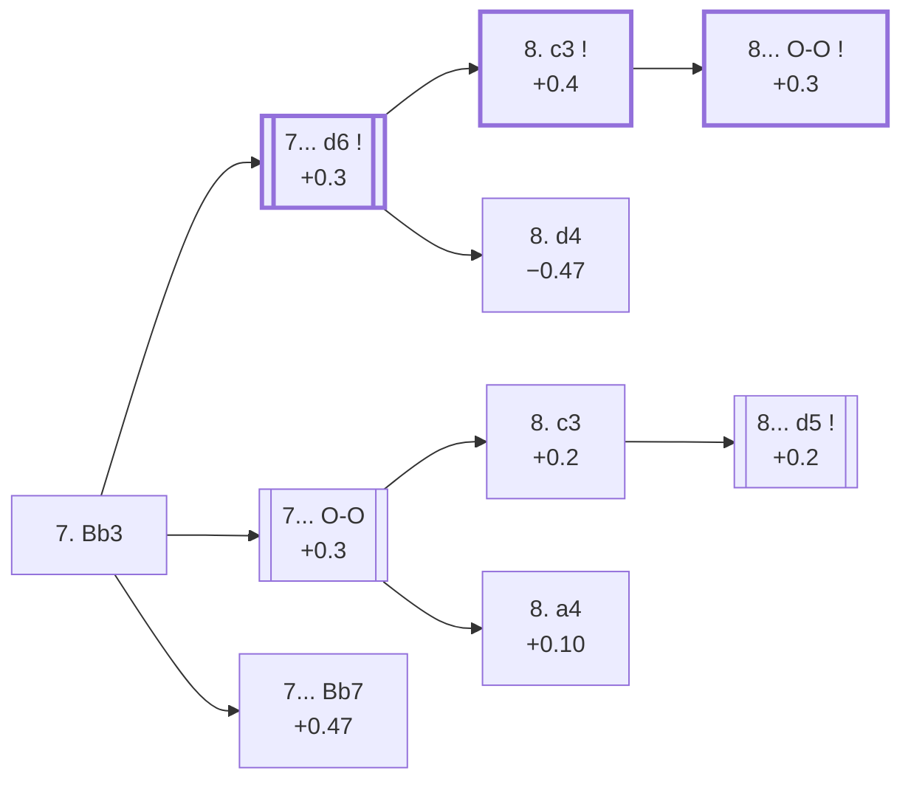

<a name="_TOP_"></a>

# C88 Ruy Lopez: Closed <br> 1. e4 e5 2. Nf3 Nc6 3. Bb5 a6 4. Ba4 Nf6 5. O-O Be7 6. Re1 b5 7. Bb3 #

Spun off from [C84's 6... b5](https://github.com/onclemarcel/chess_flashcards/blob/main/e4_openings/C84_Ruy_Lopez_Morphy_Closed.md#_Re1_): the bishop steps back to b3 before Black can gain a further tempo with ... Na5, keeping the long diagonal toward f7 alive. Black now makes a genuine choice that shapes everything that follows — finish development with **... d6** first, or castle immediately with **... O-O** and accept the possibility of the Marshall Attack. A third, rarer try, **7... Bb7**, carries its own name, the *Trajkovic Counterattack*.

### Overview

*Quick map of every move covered on this card — see the [shape key](https://github.com/onclemarcel/chess_flashcards/blob/main/start.md#content-diagram-optional) in start.md. Both 7... d6 and 7... O-O are real, well-tested choices at master level (55.3% vs 44.3%) — neither is presented as "the" main line.*

<!-- content-diagram:start -->

<!-- content-diagram:end -->

<a name="_initial_move_"></a>

[](https://lichess.org/analysis/standard/r1bqk2r/2ppbppp/p1n2n2/1p2p3/4P3/1B3N2/PPPP1PPP/RNBQR1K1_b_kq_-_1_7)

*... 7. Bb3*

```
r1bqk2r/2ppbppp/p1n2n2/1p2p3/4P3/1B3N2/PPPP1PPP/RNBQR1K1 b kq - 1 7
```

|  | +0.2 |
| --- | --- |

<!-- lichess-stats:start fen="r1bqk2r/2ppbppp/p1n2n2/1p2p3/4P3/1B3N2/PPPP1PPP/RNBQR1K1 b kq - 1 7" db="lichess,masters" speeds="bullet,blitz" ratings="1800,2000,2200,2500" moves="6" -->
| Move | Online | W/D/B | Masters | W/D/B | |
| :--- | ---: | :--- | ---: | :--- | :-- |
| O-O | 1.3 M (62.2%) | ⬜⬜⬜⬜⬜⬛⬛⬛⬛⬛ 47/5/48 | 23 k (44.3%) | ⬜⬜🟫🟫🟫🟫🟫🟫⬛⬛ 23/63/14 |  |
| d6 | 783 k (36.5%) | ⬜⬜⬜⬜⬜⬛⬛⬛⬛⬛ 48/6/46 | 28 k (55.3%) | ⬜⬜⬜🟫🟫🟫🟫🟫⬛⬛ 32/50/18 |  |
| Bb7 | 16 k (0.8%) | ⬜⬜⬜⬜🟫⬛⬛⬛⬛⬛ 43/4/53 | 209 (0.4%) | ⬜⬜⬜🟫🟫🟫🟫🟫⬛⬛ 31/47/22 |  |
| d5 | 4.1 k (0.2%) | ⬜⬜⬜⬜⬜🟫⬛⬛⬛⬛ 54/4/42 | 3 (0.0%) | — | ⚠ |
| Na5 | 3.5 k (0.2%) | ⬜⬜⬜⬜⬜⬜⬛⬛⬛⬛ 57/5/38 | 3 (0.0%) | — | ⚠ |
| h6 | 1.5 k (0.1%) | ⬜⬜⬜⬜⬜🟫⬛⬛⬛⬛ 54/5/41 | 2 (0.0%) | — | ⚠ |

*Online: bullet/blitz, 1800+ — 2.1 M games. Masters: 51 k games. [Open in the explorer](https://lichess.org/analysis/standard/r1bqk2r/2ppbppp/p1n2n2/1p2p3/4P3/1B3N2/PPPP1PPP/RNBQR1K1_b_kq_-_1_7#explorer) — updated 2026-09-06*
<!-- lichess-stats:end -->

### Candidate moves

* [**7... d6**](#_d6_) (+0.3): completes development before castling, the traditional main line — 55.3% of masters games.
* [**7... O-O**](#_OO_) (+0.3): castles immediately, keeping the option of ... d5 open — 44.3% of masters games, and by far the more popular try online (62.2%) precisely because of the Marshall Attack it can lead to.
* [**7... Bb7**](#_Trajkovic_) (+0.47): the *Trajkovic Counterattack* — covered below.
* **7... Na5**: playable but rare at this exact move (well under 1% masters) — no dedicated section here.

[*Back to TOP*](#_TOP_)

---

<a name="_d6_"></a>

## 7... d6

[](https://lichess.org/analysis/standard/r1bqk2r/2p1bppp/p1np1n2/1p2p3/4P3/1B3N2/PPPP1PPP/RNBQR1K1_w_kq_-_0_8)

*... 7... d6*

```
r1bqk2r/2p1bppp/p1np1n2/1p2p3/4P3/1B3N2/PPPP1PPP/RNBQR1K1 w kq - 0 8
```

|  | +0.3 |
| --- | --- |

<!-- lichess-stats:start fen="r1bqk2r/2p1bppp/p1np1n2/1p2p3/4P3/1B3N2/PPPP1PPP/RNBQR1K1 w kq - 0 8" db="lichess,masters" speeds="bullet,blitz" ratings="1800,2000,2200,2500" moves="5" -->
| Move | Online | W/D/B | Masters | W/D/B | |
| :--- | ---: | :--- | ---: | :--- | :-- |
| c3 | 604 k (72.3%) | ⬜⬜⬜⬜⬜🟫⬛⬛⬛⬛ 49/6/45 | 27 k (95.6%) | ⬜⬜⬜🟫🟫🟫🟫🟫⬛⬛ 32/50/18 |  |
| h3 | 159 k (19.0%) | ⬜⬜⬜⬜⬜⬛⬛⬛⬛⬛ 47/6/47 | 190 (0.7%) | ⬜⬜🟫🟫🟫🟫🟫⬛⬛⬛ 18/56/26 |  |
| a4 | 34 k (4.1%) | ⬜⬜⬜⬜⬜🟫⬛⬛⬛⬛ 52/6/42 | 947 (3.3%) | ⬜⬜⬜🟫🟫🟫🟫🟫⬛⬛ 36/46/19 |  |
| d4 | 18 k (2.2%) | ⬜⬜⬜⬜⬛⬛⬛⬛⬛⬛ 39/5/56 | 0 | — | ⚠ |
| d3 | 15 k (1.7%) | ⬜⬜⬜⬜⬜⬛⬛⬛⬛⬛ 48/6/46 | 43 (0.2%) | ⬜⬜🟫🟫🟫🟫🟫🟫⬛⬛ 23/58/19 |  |
| a3 | 0 | — | 53 (0.2%) | ⬜⬜⬜🟫🟫🟫⬛⬛⬛⬛ 26/34/40 |  |

*Online: bullet/blitz, 1800+ — 836 k games. Masters: 28 k games. [Open in the explorer](https://lichess.org/analysis/standard/r1bqk2r/2p1bppp/p1np1n2/1p2p3/4P3/1B3N2/PPPP1PPP/RNBQR1K1_w_kq_-_0_8#explorer) — updated 2026-09-06*
<!-- lichess-stats:end -->

**8. c3** is masters' near-unanimous reply (95.6%), preparing d4 while keeping the option of Bc2 or Nbd2 regroupings behind it. The rare alternative, **8. d4**, carries its own name:

* [**8. d4**](#_Rosen_) — live-tagged the *Rosen Attack* — covered below.

[*Back to 7. Bb3*](#_initial_move_)
[*Back to TOP*](#_TOP_)

---

<a name="_Rosen_"></a>

## 8. d4 — Rosen Attack

[](https://lichess.org/analysis/standard/r1bqk2r/2p1bppp/p1np1n2/1p2p3/3PP3/1B3N2/PPP2PPP/RNBQR1K1_b_kq_d3_0_8)

*... 8. d4 — live-tagged the Rosen Attack*

```
r1bqk2r/2p1bppp/p1np1n2/1p2p3/3PP3/1B3N2/PPP2PPP/RNBQR1K1 b kq d3 0 8
```

|  | −0.47 |
| --- | --- |

`eco.md` leaves this bare tabiya untitled beyond "7...d6, 8.d4"; the live explorer independently tags it the ***Rosen Attack*** — a real name divergence. Strikes the centre immediately rather than the quieter 8. c3 — a genuine database rarity (14 masters games), and the engine mildly prefers Black here. Masters split between **8... O-O** and **8... Nxd4** (42.9% each). The sequence **8... Nxd4 9. Nxd4 exd4 10. Qxd4 c5** reaches a second, independent ***Noah's Ark Trap*** tabiya — the same idea as [C71's own famous trap](https://github.com/onclemarcel/chess_flashcards/blob/main/e4_openings/C71_Ruy_Lopez_Modern_Steinitz_Defense.md#_d4_) reached via a different move order:

<a name="_NoahsArk2_"></a>

[](https://lichess.org/analysis/standard/r1bqk2r/4bppp/p2p1n2/1pp5/3QP3/1B6/PPP2PPP/RNB1R1K1_w_kq_c6_0_11)

```
r1bqk2r/4bppp/p2p1n2/1pp5/3QP3/1B6/PPP2PPP/RNB1R1K1 w kq c6 0 11
```

|  | −2.86 |
| --- | --- |

Another genuine, massive engine swing to Black (−2.86), confirming this is the same real trap as C71's version, not a coincidence of naming — c5 traps the queen and Black's advancing queenside pawns win a piece back with interest. A genuine database rarity here (0 masters games found), though the online database shows the same queen-retreat tries (Qe3/Bxf7+/Qd3/Qd1) seen at the C71 version. Not built out further here beyond this trap summary (backlog).

[*Back to 7... d6*](#_d6_)
[*Back to TOP*](#_TOP_)

---

<a name="_c3_d6_"></a>

### 8. c3

[](https://lichess.org/analysis/standard/r1bqk2r/2p1bppp/p1np1n2/1p2p3/4P3/1BP2N2/PP1P1PPP/RNBQR1K1_b_kq_-_0_8)

*... 8. c3*

```
r1bqk2r/2p1bppp/p1np1n2/1p2p3/4P3/1BP2N2/PP1P1PPP/RNBQR1K1 b kq - 0 8
```

|  | +0.4 |
| --- | --- |

<!-- lichess-stats:start fen="r1bqk2r/2p1bppp/p1np1n2/1p2p3/4P3/1BP2N2/PP1P1PPP/RNBQR1K1 b kq - 0 8" db="lichess,masters" speeds="bullet,blitz" ratings="1800,2000,2200,2500" moves="4" -->
| Move | Online | W/D/B | Masters | W/D/B | |
| :--- | ---: | :--- | ---: | :--- | :-- |
| O-O | 475 k (72.1%) | ⬜⬜⬜⬜⬜🟫⬛⬛⬛⬛ 48/6/46 | 27 k (98.3%) | ⬜⬜⬜🟫🟫🟫🟫🟫⬛⬛ 32/50/18 |  |
| Na5 | 97 k (14.8%) | ⬜⬜⬜⬜⬜🟫⬛⬛⬛⬛ 51/5/44 | 344 (1.3%) | ⬜⬜⬜⬜🟫🟫🟫🟫⬛⬛ 39/42/19 |  |
| Bg4 | 64 k (9.6%) | ⬜⬜⬜⬜⬜🟫⬛⬛⬛⬛ 54/5/42 | 85 (0.3%) | ⬜⬜⬜⬜⬜🟫🟫🟫⬛⬛ 52/33/15 |  |
| Bb7 | 6.6 k (1.0%) | ⬜⬜⬜⬜⬜🟫⬛⬛⬛⬛ 54/5/41 | 0 | — | ⚠ |
| h6 | 0 | — | 17 (0.1%) | — |  |

*Online: bullet/blitz, 1800+ — 659 k games. Masters: 27 k games. [Open in the explorer](https://lichess.org/analysis/standard/r1bqk2r/2p1bppp/p1np1n2/1p2p3/4P3/1BP2N2/PP1P1PPP/RNBQR1K1_b_kq_-_0_8#explorer) — updated 2026-09-06*
<!-- lichess-stats:end -->

**8... O-O** (+0.3, 98.3% of masters games) reaches the [main Closed Ruy Lopez tabiya](https://github.com/onclemarcel/chess_flashcards/blob/main/e4_openings/C90_Ruy_Lopez_Closed_Tabiya.md), where White's 9th move and Black's own reply fan out into the Chigorin, Breyer and Zaitsev systems. The rarer **8... Na5** (1.3% masters) leads, several moves later, to two more named lines:

<a name="_LeonhardtFork_"></a>

[](https://lichess.org/analysis/standard/r1b1k2r/2q1bppp/p2p1n2/npp1p3/3PP3/2P2N2/PPB2PPP/RNBQR1K1_w_kq_-_1_11)

*... 9. Bc2 c5 10. d4 Qc7*

```
r1b1k2r/2q1bppp/p2p1n2/npp1p3/3PP3/2P2N2/PPB2PPP/RNBQR1K1 w kq - 1 11
```

|  | +0.60 |
| --- | --- |

White's 11th move genuinely forks three ways here (this exact node is left untagged live, `opening=None`): **11. Nbd2** (36.7% masters), **11. h3** (31.6%, heading for the *Leonhardt Variation* below), and **11. a4** (16.3%, the *Balla Variation* below).

* [**11. h3**](#_Leonhardt_) — the *Leonhardt Variation* — covered below.
* [**11. a4**](#_Balla_) — the *Balla Variation* — covered below.

[*Back to 7... d6*](#_d6_)
[*Back to TOP*](#_TOP_)

---

<a name="_Leonhardt_"></a>

### 11. h3 Nc6 12. d5 Nb8 13. Nbd2 g5 — Leonhardt Variation

[](https://lichess.org/analysis/standard/rnb1k2r/2q1bp1p/p2p1n2/1ppPp1p1/4P3/2P2N1P/PPBN1PP1/R1BQR1K1_w_kq_g6_0_14)

*... 13... g5 — Leonhardt Variation*

```
rnb1k2r/2q1bp1p/p2p1n2/1ppPp1p1/4P3/2P2N1P/PPBN1PP1/R1BQR1K1 w kq g6 0 14
```

|  | +1.87 |
| --- | --- |

A genuine, historical 0-masters-game rarity in the modern database despite carrying its own name — an old, sharp regrouping (the knight retreats all the way to b8 to reroute via d7) that the engine now considers clearly better for White. Not built out further here beyond this summary (backlog).

[*Back to 11. h3 / 11. a4 fork*](#_LeonhardtFork_)
[*Back to TOP*](#_TOP_)

---

<a name="_Balla_"></a>

### 11. a4 — Balla Variation

[](https://lichess.org/analysis/standard/r1b1k2r/2q1bppp/p2p1n2/npp1p3/P2PP3/2P2N2/1PB2PPP/RNBQR1K1_b_kq_a3_0_11)

*... 11. a4 — Balla Variation*

```
r1b1k2r/2q1bppp/p2p1n2/npp1p3/P2PP3/2P2N2/1PB2PPP/RNBQR1K1 b kq a3 0 11
```

|  | +0.41 |
| --- | --- |

Strikes the queenside at once rather than developing the knight — a real, secondary try (32 masters games). Masters' clear reply is **11... b4** (53.1%), fixing the structure and gaining space. Not built out further here (backlog).

[*Back to 11. h3 / 11. a4 fork*](#_LeonhardtFork_)
[*Back to TOP*](#_TOP_)

---

<a name="_OO_"></a>

## 7... O-O

[](https://lichess.org/analysis/standard/r1bq1rk1/2ppbppp/p1n2n2/1p2p3/4P3/1B3N2/PPPP1PPP/RNBQR1K1_w_-_-_1_8)

*... 7... O-O*

```
r1bq1rk1/2ppbppp/p1n2n2/1p2p3/4P3/1B3N2/PPPP1PPP/RNBQR1K1 w - - 1 8
```

|  | +0.3 |
| --- | --- |

<!-- lichess-stats:start fen="r1bq1rk1/2ppbppp/p1n2n2/1p2p3/4P3/1B3N2/PPPP1PPP/RNBQR1K1 w - - 1 8" db="lichess,masters" speeds="bullet,blitz" ratings="1800,2000,2200,2500" moves="6" -->
| Move | Online | W/D/B | Masters | W/D/B | |
| :--- | ---: | :--- | ---: | :--- | :-- |
| c3 | 786 k (59.0%) | ⬜⬜⬜⬜🟫⬛⬛⬛⬛⬛ 45/5/50 | 10 k (44.7%) | ⬜⬜🟫🟫🟫🟫🟫🟫🟫⬛ 20/69/11 |  |
| a4 | 192 k (14.4%) | ⬜⬜⬜⬜⬜🟫⬛⬛⬛⬛ 51/6/43 | 5.0 k (22.0%) | ⬜⬜🟫🟫🟫🟫🟫🟫⬛⬛ 26/58/16 |  |
| h3 | 185 k (13.9%) | ⬜⬜⬜⬜⬜🟫⬛⬛⬛⬛ 51/5/44 | 5.1 k (22.6%) | ⬜⬜🟫🟫🟫🟫🟫🟫🟫⬛ 24/64/13 |  |
| d4 | 81 k (6.1%) | ⬜⬜⬜⬜⬜🟫⬛⬛⬛⬛ 52/5/43 | 1.3 k (5.7%) | ⬜⬜⬜🟫🟫🟫🟫🟫⬛⬛ 32/47/21 |  |
| d3 | 73 k (5.5%) | ⬜⬜⬜⬜⬜🟫⬛⬛⬛⬛ 52/6/43 | 979 (4.3%) | ⬜⬜⬜🟫🟫🟫🟫🟫⬛⬛ 30/50/20 |  |
| Nc3 | 6.3 k (0.5%) | ⬜⬜⬜⬜⬜🟫⬛⬛⬛⬛ 49/6/45 | 0 | — | ⚠ |
| a3 | 0 | — | 75 (0.3%) | ⬜⬜⬜🟫🟫🟫🟫🟫⬛⬛ 31/48/21 |  |

*Online: bullet/blitz, 1800+ — 1.3 M games. Masters: 23 k games. [Open in the explorer](https://lichess.org/analysis/standard/r1bq1rk1/2ppbppp/p1n2n2/1p2p3/4P3/1B3N2/PPPP1PPP/RNBQR1K1_w_-_-_1_8#explorer) — updated 2026-09-06*
<!-- lichess-stats:end -->

> [!NOTE]
> Unlike after 7... d6, White's 8th move here is a genuine four-way split: **8. c3** (44.7% masters) allows the Marshall Attack outright, so many White players instead reach for an *Anti-Marshall* try — **8. a4** (22.0%, the *Keres/Anti-Marshall Variation*, provoking ... b4 or ... Rb8 before committing) or **8. h3** (22.6%, ruling out ... Bg4 ideas while sidestepping ... d5 for a move). Both are real, well-tested tries in their own right rather than a way to "avoid theory" — they carry their own separate bodies of theory not covered here.

**8. c3** is masters' most common single choice at 44.7% (versus 22.6% for 8. h3 and 22.0% for 8. a4).

* [**8. a4**](#_AntiMarshall_) (22.0% masters): live-tagged simply the *Anti-Marshall* — covered below.

[*Back to 7. Bb3*](#_initial_move_)
[*Back to TOP*](#_TOP_)

---

<a name="_AntiMarshall_"></a>

### 8. a4 — Anti-Marshall

[](https://lichess.org/analysis/standard/r1bq1rk1/2ppbppp/p1n2n2/1p2p3/P3P3/1B3N2/1PPP1PPP/RNBQR1K1_b_-_a3_0_8)

*... 8. a4 — Anti-Marshall*

```
r1bq1rk1/2ppbppp/p1n2n2/1p2p3/P3P3/1B3N2/1PPP1PPP/RNBQR1K1 b - a3 0 8
```

|  | +0.10 |
| --- | --- |

Strikes the queenside pawn chain before Black can play ... d5, sidestepping the Marshall Attack entirely rather than allowing and preparing to meet it. Masters split between **8... b4** (56.2%) and **8... Bb7** (37.3%). Not built out further here (backlog).

[*Back to 7... O-O*](#_OO_)
[*Back to TOP*](#_TOP_)

---

<a name="_c3_OO_"></a>

### 8. c3

[](https://lichess.org/analysis/standard/r1bq1rk1/2ppbppp/p1n2n2/1p2p3/4P3/1BP2N2/PP1P1PPP/RNBQR1K1_b_-_-_0_8)

*... 8. c3*

```
r1bq1rk1/2ppbppp/p1n2n2/1p2p3/4P3/1BP2N2/PP1P1PPP/RNBQR1K1 b - - 0 8
```

|  | +0.2 |
| --- | --- |

<!-- lichess-stats:start fen="r1bq1rk1/2ppbppp/p1n2n2/1p2p3/4P3/1BP2N2/PP1P1PPP/RNBQR1K1 b - - 0 8" db="lichess,masters" speeds="bullet,blitz" ratings="1800,2000,2200,2500" moves="4" -->
| Move | Online | W/D/B | Masters | W/D/B | |
| :--- | ---: | :--- | ---: | :--- | :-- |
| d5 | 619 k (71.5%) | ⬜⬜⬜⬜🟫⬛⬛⬛⬛⬛ 42/5/53 | 5.5 k (54.6%) | ⬜🟫🟫🟫🟫🟫🟫🟫🟫⬛ 14/76/10 |  |
| d6 | 210 k (24.2%) | ⬜⬜⬜⬜⬜⬛⬛⬛⬛⬛ 50/5/45 | 4.5 k (44.1%) | ⬜⬜⬜🟫🟫🟫🟫🟫🟫⬛ 27/61/13 |  |
| Bb7 | 14 k (1.6%) | ⬜⬜⬜⬜⬜🟫⬛⬛⬛⬛ 53/4/43 | 23 (0.2%) | ⬜⬜⬜🟫🟫🟫🟫🟫⬛⬛ 30/52/17 |  |
| Na5 | 11 k (1.3%) | ⬜⬜⬜⬜⬜🟫⬛⬛⬛⬛ 53/5/42 | 91 (0.9%) | ⬜⬜🟫🟫🟫🟫🟫🟫🟫⬛ 20/67/13 |  |

*Online: bullet/blitz, 1800+ — 866 k games. Masters: 10 k games. [Open in the explorer](https://lichess.org/analysis/standard/r1bq1rk1/2ppbppp/p1n2n2/1p2p3/4P3/1BP2N2/PP1P1PPP/RNBQR1K1_b_-_-_0_8#explorer) — updated 2026-09-06*
<!-- lichess-stats:end -->

**8... d5!?** (+0.2), the [***Marshall Attack***](https://github.com/onclemarcel/chess_flashcards/blob/main/e4_openings/C89_Ruy_Lopez_Marshall_Attack.md), is actually masters' *more* popular reply here (54.6% vs 44.1% for the quieter 8... d6, which transposes back into the 7... d6 tabiya above) — a real gambit with a dedicated card, not a sideline.

[*Back to 7... O-O*](#_OO_)
[*Back to TOP*](#_TOP_)

---

<a name="_Trajkovic_"></a>

## 7... Bb7 — Trajkovic Counterattack

[](https://lichess.org/analysis/standard/r2qk2r/1bppbppp/p1n2n2/1p2p3/4P3/1B3N2/PPPP1PPP/RNBQR1K1_w_kq_-_2_8)

*... 7... Bb7 — Trajkovic Counterattack*

```
r2qk2r/1bppbppp/p1n2n2/1p2p3/4P3/1B3N2/PPPP1PPP/RNBQR1K1 w kq - 2 8
```

|  | +0.47 |
| --- | --- |

Develops the bishop to its most active diagonal rather than committing to ... d6 or ... O-O first — `eco.md` and the live explorer agree on the name here, the *Trajkovic Counterattack*. Masters' reply forks three ways: **8. c3** (39.5%), **8. d3** (28.9%), and **8. d4** (25.2%). Not built out further here (backlog).

[*Back to 7. Bb3*](#_initial_move_)
[*Back to TOP*](#_TOP_)
