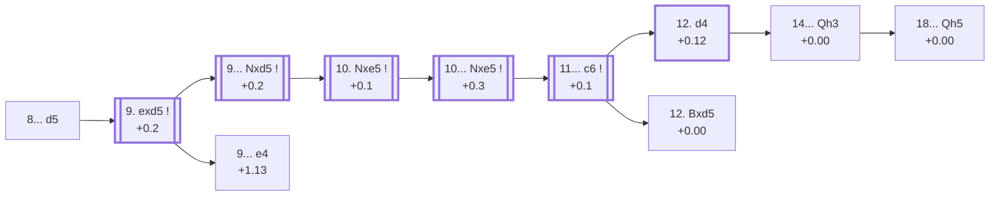

<a name="_TOP_"></a>

# C89 Ruy Lopez: Marshall Attack <br> 1. e4 e5 2. Nf3 Nc6 3. Bb5 a6 4. Ba4 Nf6 5. O-O Be7 6. Re1 b5 7. Bb3 O-O 8. c3 d5 #

Spun off from [C88's 7... O-O 8. c3](https://github.com/onclemarcel/chess_flashcards/blob/main/e4_openings/C88_Ruy_Lopez_Closed_Bb3.md#_c3_OO_): rather than transpose quietly back into the Closed main line with ... d6, Black sacrifices a pawn outright to rip the centre open while White's king is still light on defenders. Named after American champion Frank Marshall, who reportedly prepared it in secret for years before springing it in a 1918 game against Capablanca. It's masters' *more* popular choice at this exact juncture (54.6% vs 44.1% for the quiet ... d6) — a fully sound, deeply analysed gambit, not a trick that only works against unprepared opponents.

### Overview

*Quick map of every move covered on this card — see the [shape key](https://github.com/onclemarcel/chess_flashcards/blob/main/start.md#content-diagram-optional) in start.md. The forcing sequence down to 9... Nxd5 is close to unanimous in masters play — the eval barely moves despite the pawn sacrifice, which is itself the point of the whole line.*

<!-- content-diagram:start -->

<!-- content-diagram:end -->

<a name="_initial_move_"></a>

[](https://lichess.org/analysis/standard/r1bq1rk1/2p1bppp/p1n2n2/1p1pp3/4P3/1BP2N2/PP1P1PPP/RNBQR1K1_w_-_d6_0_9)

*... 8... d5 — the Marshall Attack: a pawn for a permanent initiative*

```
r1bq1rk1/2p1bppp/p1n2n2/1p1pp3/4P3/1BP2N2/PP1P1PPP/RNBQR1K1 w - d6 0 9
```

|  | +0.2 |
| --- | --- |

<!-- lichess-stats:start fen="r1bq1rk1/2p1bppp/p1n2n2/1p1pp3/4P3/1BP2N2/PP1P1PPP/RNBQR1K1 w - d6 0 9" db="lichess,masters" speeds="bullet,blitz" ratings="1800,2000,2200,2500" moves="4" -->
| Move | Online | W/D/B | Masters | W/D/B | |
| :--- | ---: | :--- | ---: | :--- | :-- |
| exd5 | 549 k (88.6%) | ⬜⬜⬜⬜🟫⬛⬛⬛⬛⬛ 42/5/54 | 5.2 k (93.9%) | ⬜🟫🟫🟫🟫🟫🟫🟫🟫⬛ 13/76/10 |  |
| d3 | 31 k (5.0%) | ⬜⬜⬜⬜⬜🟫⬛⬛⬛⬛ 49/7/44 | 30 (0.5%) | ⬜⬜🟫🟫🟫🟫🟫🟫⬛⬛ 20/63/17 |  |
| d4 | 29 k (4.7%) | ⬜⬜⬜⬜⬜🟫⬛⬛⬛⬛ 52/7/41 | 303 (5.5%) | ⬜⬜🟫🟫🟫🟫🟫🟫🟫⬛ 22/66/12 |  |
| h3 | 6.2 k (1.0%) | ⬜⬜⬜⬜⬛⬛⬛⬛⬛⬛ 36/4/60 | 6 (0.1%) | — |  |

*Online: bullet/blitz, 1800+ — 619 k games. Masters: 5.5 k games. [Open in the explorer](https://lichess.org/analysis/standard/r1bq1rk1/2p1bppp/p1n2n2/1p1pp3/4P3/1BP2N2/PP1P1PPP/RNBQR1K1_w_-_d6_0_9#explorer) — updated 2026-09-06*
<!-- lichess-stats:end -->

### Candidate moves

* [**9. exd5**](#_exd5_) (+0.2): accepts the pawn — by far masters' choice (93.9%), and the whole point of the line for both sides.
* **9. d4 / 9. h3**: declining tries, both rare (5.5% and 0.1% masters) and outside the scope of this card.

[*Back to TOP*](#_TOP_)

---

<a name="_exd5_"></a>

## 9. exd5

[](https://lichess.org/analysis/standard/r1bq1rk1/2p1bppp/p1n2n2/1p1Pp3/8/1BP2N2/PP1P1PPP/RNBQR1K1_b_-_-_0_9)

*... 9. exd5*

```
r1bq1rk1/2p1bppp/p1n2n2/1p1Pp3/8/1BP2N2/PP1P1PPP/RNBQR1K1 b - - 0 9
```

|  | +0.2 |
| --- | --- |

<!-- lichess-stats:start fen="r1bq1rk1/2p1bppp/p1n2n2/1p1Pp3/8/1BP2N2/PP1P1PPP/RNBQR1K1 b - - 0 9" db="lichess,masters" speeds="bullet,blitz" ratings="1800,2000,2200,2500" moves="4" -->
| Move | Online | W/D/B | Masters | W/D/B | |
| :--- | ---: | :--- | ---: | :--- | :-- |
| Nxd5 | 502 k (91.4%) | ⬜⬜⬜⬜🟫⬛⬛⬛⬛⬛ 42/5/53 | 5.2 k (99.3%) | ⬜🟫🟫🟫🟫🟫🟫🟫🟫⬛ 13/77/10 |  |
| e4 | 47 k (8.5%) | ⬜⬜⬜⬛⬛⬛⬛⬛⬛⬛ 32/3/65 | 35 (0.7%) | ⬜⬜⬜⬜⬜⬜🟫🟫⬛⬛ 60/17/23 |  |
| Na5 | 289 (0.1%) | ⬜⬜⬜⬜⬜⬜⬛⬛⬛⬛ 58/4/38 | 0 | — | ⚠ |
| Qxd5 | 14 (0.0%) | — | 0 | — |  |

*Online: bullet/blitz, 1800+ — 549 k games. Masters: 5.2 k games. [Open in the explorer](https://lichess.org/analysis/standard/r1bq1rk1/2p1bppp/p1n2n2/1p1Pp3/8/1BP2N2/PP1P1PPP/RNBQR1K1_b_-_-_0_9#explorer) — updated 2026-09-06*
<!-- lichess-stats:end -->

**9... Nxd5** recaptures with the knight (99.3% of masters games) rather than the f6-knight or the queen — keeping the f6 knight free to swing toward the kingside attack later. The rare alternative, **9... e4**, delays the recapture and carries its own name.

[*Back to 8... d5*](#_initial_move_)
[*Back to TOP*](#_TOP_)

---

<a name="_HermanSteiner_"></a>

## 9... e4 — Herman Steiner Variation

[](https://lichess.org/analysis/standard/r1bq1rk1/2p1bppp/p1n2n2/1p1P4/4p3/1BP2N2/PP1P1PPP/RNBQR1K1_w_-_-_0_10)

*... 9... e4 — live-tagged the Steiner Variation*

```
r1bq1rk1/2p1bppp/p1n2n2/1p1P4/4p3/1BP2N2/PP1P1PPP/RNBQR1K1 w - - 0 10
```

|  | +1.13 |
| --- | --- |

`eco.md` calls this the *Herman Steiner Variation*; the live explorer drops the first name, tagging it simply the ***Steiner Variation***. Pushes the pawn to kick the knight rather than recapturing on d5 first — a real, if secondary, try (35 masters games), and the engine prefers White considerably more than the main 9... Nxd5 line, since Black has given up the extra central pawn without full compensation. Masters' near-unanimous reply is **10. dxc6** (94.3%), simply grabbing the knight. Not built out further here (backlog).

[*Back to 9. exd5*](#_exd5_)
[*Back to TOP*](#_TOP_)

---

<a name="_Nxd5_"></a>

## 9... Nxd5

[](https://lichess.org/analysis/standard/r1bq1rk1/2p1bppp/p1n5/1p1np3/8/1BP2N2/PP1P1PPP/RNBQR1K1_w_-_-_0_10)

*... 9... Nxd5*

```
r1bq1rk1/2p1bppp/p1n5/1p1np3/8/1BP2N2/PP1P1PPP/RNBQR1K1 w - - 0 10
```

|  | +0.2 |
| --- | --- |

<!-- lichess-stats:start fen="r1bq1rk1/2p1bppp/p1n5/1p1np3/8/1BP2N2/PP1P1PPP/RNBQR1K1 w - - 0 10" db="lichess,masters" speeds="bullet,blitz" ratings="1800,2000,2200,2500" moves="4" -->
| Move | Online | W/D/B | Masters | W/D/B | |
| :--- | ---: | :--- | ---: | :--- | :-- |
| Nxe5 | 376 k (74.6%) | ⬜⬜⬜⬜⬛⬛⬛⬛⬛⬛ 40/5/55 | 5.1 k (98.6%) | ⬜🟫🟫🟫🟫🟫🟫🟫🟫⬛ 13/77/10 |  |
| d4 | 68 k (13.5%) | ⬜⬜⬜⬜⬜🟫⬛⬛⬛⬛ 50/7/44 | 19 (0.4%) | — |  |
| h3 | 29 k (5.8%) | ⬜⬜⬜⬜⬜🟫⬛⬛⬛⬛ 50/5/45 | 0 | — | ⚠ |
| d3 | 18 k (3.5%) | ⬜⬜⬜⬜⬜⬛⬛⬛⬛⬛ 50/5/45 | 10 (0.2%) | — |  |
| a4 | 0 | — | 38 (0.7%) | ⬜🟫🟫🟫🟫🟫🟫🟫⬛⬛ 11/74/16 |  |

*Online: bullet/blitz, 1800+ — 503 k games. Masters: 5.2 k games. [Open in the explorer](https://lichess.org/analysis/standard/r1bq1rk1/2p1bppp/p1n5/1p1np3/8/1BP2N2/PP1P1PPP/RNBQR1K1_w_-_-_0_10#explorer) — updated 2026-09-06*
<!-- lichess-stats:end -->

**10. Nxe5** is masters' near-unanimous choice (98.6%) — the d5 knight no longer defends e5, so White simply collects the second pawn back rather than trying to hold on to material some other way.

[*Back to 9. exd5*](#_exd5_)
[*Back to TOP*](#_TOP_)

---

<a name="_Nxe5_"></a>

## 10. Nxe5 — the point of the gambit

[](https://lichess.org/analysis/standard/r1bq1rk1/2p1bppp/p1n5/1p1nN3/8/1BP5/PP1P1PPP/RNBQR1K1_b_-_-_0_10)

*... 10. Nxe5 — material is level for now, but Black's whole army is ready to attack while White's queenside pieces haven't moved*

```
r1bq1rk1/2p1bppp/p1n5/1p1nN3/8/1BP5/PP1P1PPP/RNBQR1K1 b - - 0 10
```

|  | +0.1 |
| --- | --- |

From here the thematic continuation gives up the pawn for good in exchange for the bishop pair and lasting piece activity — that balance between "objectively fine for White" and "extremely dangerous to face without preparation" is exactly why many White players choose an Anti-Marshall try (8. a4 / 8. h3, see [C88](https://github.com/onclemarcel/chess_flashcards/blob/main/e4_openings/C88_Ruy_Lopez_Closed_Bb3.md#_OO_)) rather than allow this position at all.

* [**10... Nxe5**](#_Nxe5b_) (+0.3): essentially forced — see below.

[*Back to 9... Nxd5*](#_Nxd5_)
[*Back to TOP*](#_TOP_)

---

<a name="_Nxe5b_"></a>

## 10... Nxe5

[](https://lichess.org/analysis/standard/r1bq1rk1/2p1bppp/p7/1p1nn3/8/1BP5/PP1P1PPP/RNBQR1K1_w_-_-_0_11)

*... 10... Nxe5*

```
r1bq1rk1/2p1bppp/p7/1p1nn3/8/1BP5/PP1P1PPP/RNBQR1K1 w - - 0 11
```

|  | +0.3 |
| --- | --- |

**11. Rxe5** recaptures the pawn (100% of masters games) — the rook lands actively on the e-file, already eyeing e7/e8 down the line.

[](https://lichess.org/analysis/standard/r1bq1rk1/2p1bppp/p7/1p1nR3/8/1BP5/PP1P1PPP/RNBQ2K1_b_-_-_0_11)

*... 11. Rxe5*

```
r1bq1rk1/2p1bppp/p7/1p1nR3/8/1BP5/PP1P1PPP/RNBQ2K1 b - - 0 11
```

|  | +0.2 |
| --- | --- |

<!-- lichess-stats:start fen="r1bq1rk1/2p1bppp/p7/1p1nR3/8/1BP5/PP1P1PPP/RNBQ2K1 b - - 0 11" db="lichess,masters" speeds="bullet,blitz" ratings="1800,2000,2200,2500" moves="4" -->
| Move | Online | W/D/B | Masters | W/D/B | |
| :--- | ---: | :--- | ---: | :--- | :-- |
| c6 | 286 k (76.3%) | ⬜⬜⬜⬜🟫⬛⬛⬛⬛⬛ 42/5/53 | 4.9 k (96.0%) | ⬜🟫🟫🟫🟫🟫🟫🟫🟫⬛ 12/78/10 |  |
| Nf6 | 77 k (20.6%) | ⬜⬜⬜⬜⬛⬛⬛⬛⬛⬛ 34/3/63 | 41 (0.8%) | ⬜⬜⬜⬜🟫🟫🟫⬛⬛⬛ 44/27/29 |  |
| Bb7 | 8.5 k (2.3%) | ⬜⬜⬜⬜⬛⬛⬛⬛⬛⬛ 40/5/55 | 154 (3.0%) | ⬜⬜🟫🟫🟫🟫🟫🟫🟫⬛ 21/64/14 |  |
| Bd6 | 942 (0.3%) | ⬜⬜⬜⬜⬜⬜⬛⬛⬛⬛ 62/4/34 | 0 | — | ⚠ |
| Nb6 | 0 | — | 5 (0.1%) | — |  |

*Online: bullet/blitz, 1800+ — 374 k games. Masters: 5.1 k games. [Open in the explorer](https://lichess.org/analysis/standard/r1bq1rk1/2p1bppp/p7/1p1nR3/8/1BP5/PP1P1PPP/RNBQ2K1_b_-_-_0_11#explorer) — updated 2026-09-06*
<!-- lichess-stats:end -->

**11... c6** is masters' clear main try (96.0%) — securing the d5 knight once and for all before starting the kingside build-up (... Bd6, ... Qh4, ... Bg4/... Ng4 and more), the true tabiya of the whole gambit.

[](https://lichess.org/analysis/standard/r1bq1rk1/4bppp/p1p5/1p1nR3/8/1BP5/PP1P1PPP/RNBQ2K1_w_-_-_0_12)

*... 11... c6 — the Marshall Attack tabiya*

```
r1bq1rk1/4bppp/p1p5/1p1nR3/8/1BP5/PP1P1PPP/RNBQ2K1 w - - 0 12
```

|  | +0.1 |
| --- | --- |

<!-- lichess-stats:start fen="r1bq1rk1/4bppp/p1p5/1p1nR3/8/1BP5/PP1P1PPP/RNBQ2K1 w - - 0 12" db="lichess,masters" speeds="bullet,blitz" ratings="1800,2000,2200,2500" moves="4" -->
| Move | Online | W/D/B | Masters | W/D/B | |
| :--- | ---: | :--- | ---: | :--- | :-- |
| d4 | 197 k (68.8%) | ⬜⬜⬜⬜🟫⬛⬛⬛⬛⬛ 41/5/54 | 2.6 k (53.6%) | ⬜🟫🟫🟫🟫🟫🟫🟫🟫⬛ 13/76/11 |  |
| d3 | 31 k (10.9%) | ⬜⬜⬜⬜⬜🟫⬛⬛⬛⬛ 51/6/43 | 1.2 k (24.6%) | ⬜🟫🟫🟫🟫🟫🟫🟫🟫⬛ 12/80/8 |  |
| Bxd5 | 30 k (10.6%) | ⬜⬜⬜⬜🟫⬛⬛⬛⬛⬛ 41/6/53 | 106 (2.2%) | ⬜⬜⬜🟫🟫🟫🟫🟫⬛⬛ 28/55/17 |  |
| Re1 | 12 k (4.3%) | ⬜⬜⬜⬜🟫⬛⬛⬛⬛⬛ 41/5/53 | 922 (18.9%) | ⬜🟫🟫🟫🟫🟫🟫🟫🟫🟫 9/86/5 |  |

*Online: bullet/blitz, 1800+ — 286 k games. Masters: 4.9 k games. [Open in the explorer](https://lichess.org/analysis/standard/r1bq1rk1/4bppp/p1p5/1p1nR3/8/1BP5/PP1P1PPP/RNBQ2K1_w_-_-_0_12#explorer) — updated 2026-09-06*
<!-- lichess-stats:end -->

This exact position is tagged live by the explorer as the ***Marshall Attack, Modern Variation***, and Stockfish still calls it close to level (+0.1) despite Black's permanent pawn deficit — a good summary of the whole gambit. White's 12th move is a real choice: **12. d4** (53.6% masters) is the main try, heading for the classical **12... Bd6 13. Re1 Qh4** kingside build-up, with **12. d3** (24.6%) and **12. Re1** (18.9%) both real alternatives; **12. Bxd5**, trading off the attacking knight outright, is the named ***Re3 Variation*** (`eco.md`'s own name, *Kevitz Variation*, doesn't match the live tag).

* [**12. d4**](#_MainLine_) (+0.12, 53.6% masters): masters' main try — the *Main Line* — covered below.
* [**12. Bxd5**](#_Kevitz_) (+0.00): the *Re3 Variation* (`eco.md`: *Kevitz Variation*) — covered below.

[*Back to 10. Nxe5*](#_Nxe5_)
[*Back to TOP*](#_TOP_)

---

<a name="_Kevitz_"></a>

## 12. Bxd5 cxd5 13. d4 Bd6 14. Re3 — Kevitz Variation

[](https://lichess.org/analysis/standard/r1bq1rk1/5ppp/p2b4/1p1p4/3P4/2P1R3/PP3PPP/RNBQ2K1_b_-_-_2_14)

*... 14. Re3 — live-tagged the Re3 Variation*

```
r1bq1rk1/5ppp/p2b4/1p1p4/3P4/2P1R3/PP3PPP/RNBQ2K1 b - - 2 14
```

|  | +0.00 |
| --- | --- |

Trades off the bishop for the attacking knight rather than the more common 12. d4, giving Black an isolated d-pawn but real simplification — a real, secondary try (100 masters games). Masters' overwhelming reply is **14... Qh4** (82.0%), keeping the initiative going despite the missing pawn. Not built out further here (backlog).

[*Back to 11... c6*](#_Nxe5b_)
[*Back to TOP*](#_TOP_)

---

<a name="_MainLine_"></a>

## 12. d4 Bd6 13. Re1 Qh4 14. g3 Qh3 — Modern Main Line

[](https://lichess.org/analysis/standard/r1b2rk1/5ppp/p1pb4/1p1n4/3P4/1BP3Pq/PP3P1P/RNBQR1K1_w_-_-_1_15)

*... 14... Qh3 — Modern Main Line*

```
r1b2rk1/5ppp/p1pb4/1p1n4/3P4/1BP3Pq/PP3P1P/RNBQR1K1 w - - 1 15
```

|  | +0.00 |
| --- | --- |

The classical kingside build-up: Black's queen lands on h3, threatening mating ideas along the second rank while the knight and bishop bear down on White's king. Masters' clear main try is **15. Be3** (49.0%), returning the bishop to defend while untangling the back rank; **15. Re4** (26.1%) is a real, sharp alternative. Stockfish calls the whole tabiya dead level (+0.0) despite Black's permanent pawn deficit — the point of the entire gambit. The classical main line continues **15. Be3 Bg4 16. Qd3 Rae8 17. Nd2 Re6 18. a4 Qh5**, the named ***Spassky Variation***:

<a name="_Spassky_"></a>

[](https://lichess.org/analysis/standard/5rk1/5ppp/p1pbr3/1p1n3q/P2P2b1/1BPQB1P1/1P1N1P1P/R3R1K1_w_-_-_1_19)

```
5rk1/5ppp/p1pbr3/1p1n3q/P2P2b1/1BPQB1P1/1P1N1P1P/R3R1K1 w - - 1 19
```

|  | +0.00 |
| --- | --- |

The deep, classical tabiya of the whole Marshall Attack, named for the Spassky-era theory built around it. Masters' overwhelming reply is **19. axb5** (96.2%), finally resolving the queenside while the kingside attack simmers on. Stockfish still calls the position dead level after 19 moves of forced-looking theory — the enduring practical appeal of the whole gambit. Deeper Marshall theory past this point is its own extensive body of work, not covered further here.

[*Back to 11... c6*](#_Nxe5b_)
[*Back to TOP*](#_TOP_)
