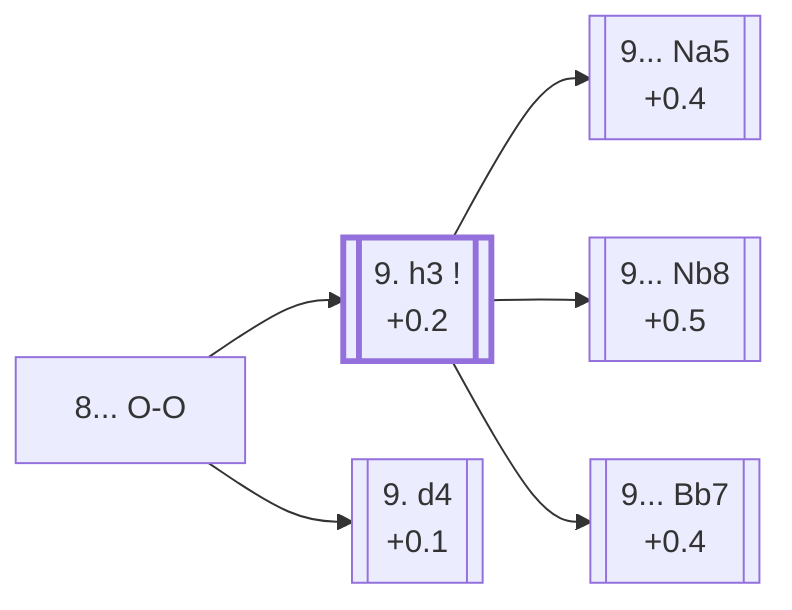

<a name="_TOP_"></a>

# C90 Ruy Lopez: Closed <br> 1. e4 e5 2. Nf3 Nc6 3. Bb5 a6 4. Ba4 Nf6 5. O-O Be7 6. Re1 b5 7. Bb3 d6 8. c3 O-O #

Spun off from [C88's 7... d6 8. c3](https://github.com/onclemarcel/chess_flashcards/blob/main/e4_openings/C88_Ruy_Lopez_Closed_Bb3.md#_c3_d6_): both sides have finished the opening's easy decisions. This is the classical Closed Ruy Lopez tabiya — the position from which the immense Chigorin, Breyer and Zaitsev bodies of theory all branch, each fighting over the same basic plan (White's c3+d4 centre versus Black's queenside space and eventual counterplay).

### Overview

*Quick map of every move covered on this card — see the [shape key](https://github.com/onclemarcel/chess_flashcards/blob/main/start.md#content-diagram-optional) in start.md. Black's three main 9th-move tries (Na5/Nb8/Bb7) are a genuine three-way split at master level (34.6% / 27.8% / 24.1%) — none is presented as dominant.*

<!-- content-diagram:start -->

<!-- content-diagram:end -->

<a name="_initial_move_"></a>

[](https://lichess.org/analysis/standard/r1bq1rk1/2p1bppp/p1np1n2/1p2p3/4P3/1BP2N2/PP1P1PPP/RNBQR1K1_w_-_-_1_9)

*... 8... O-O — the classical Closed Ruy Lopez tabiya*

```
r1bq1rk1/2p1bppp/p1np1n2/1p2p3/4P3/1BP2N2/PP1P1PPP/RNBQR1K1 w - - 1 9
```

|  | +0.3 |
| --- | --- |

<!-- lichess-stats:start fen="r1bq1rk1/2p1bppp/p1np1n2/1p2p3/4P3/1BP2N2/PP1P1PPP/RNBQR1K1 w - - 1 9" db="lichess,masters" speeds="bullet,blitz" ratings="1800,2000,2200,2500" moves="5" -->
| Move | Online | W/D/B | Masters | W/D/B | |
| :--- | ---: | :--- | ---: | :--- | :-- |
| h3 | 478 k (69.7%) | ⬜⬜⬜⬜⬜🟫⬛⬛⬛⬛ 49/6/45 | 27 k (87.3%) | ⬜⬜⬜🟫🟫🟫🟫🟫⬛⬛ 31/53/16 |  |
| d4 | 144 k (21.0%) | ⬜⬜⬜⬜⬜⬛⬛⬛⬛⬛ 48/5/47 | 3.0 k (9.7%) | ⬜⬜⬜⬜🟫🟫🟫🟫⬛⬛ 35/43/22 |  |
| d3 | 50 k (7.3%) | ⬜⬜⬜⬜⬜🟫⬛⬛⬛⬛ 51/5/44 | 535 (1.7%) | ⬜⬜⬜🟫🟫🟫🟫⬛⬛⬛ 32/44/24 |  |
| a4 | 10 k (1.5%) | ⬜⬜⬜⬜⬜🟫⬛⬛⬛⬛ 50/6/44 | 275 (0.9%) | ⬜⬜⬜⬜🟫🟫🟫⬛⬛⬛ 41/34/25 |  |
| Bc2 | 1.8 k (0.3%) | ⬜⬜⬜⬜⬜⬛⬛⬛⬛⬛ 46/6/49 | 0 | — | ⚠ |
| a3 | 0 | — | 91 (0.3%) | ⬜⬜⬜🟫🟫🟫🟫⬛⬛⬛ 31/44/25 |  |

*Online: bullet/blitz, 1800+ — 685 k games. Masters: 31 k games. [Open in the explorer](https://lichess.org/analysis/standard/r1bq1rk1/2p1bppp/p1np1n2/1p2p3/4P3/1BP2N2/PP1P1PPP/RNBQR1K1_w_-_-_1_9#explorer) — updated 2026-08-31*
<!-- lichess-stats:end -->

### Candidate moves

* [**9. h3**](#_h3_) (+0.2): rules out ... Bg4 pinning the f3 knight before doing anything else — masters' clear main try (87.3%).
* [**9. d4**](#_d4_) (+0.1): strikes the centre immediately instead — the *Yates Variation* (verified live via the explorer's own `opening` field), masters' clear second choice (9.7%).

[*Back to TOP*](#_TOP_)

---

<a name="_h3_"></a>

## 9. h3

[](https://lichess.org/analysis/standard/r1bq1rk1/2p1bppp/p1np1n2/1p2p3/4P3/1BP2N1P/PP1P1PP1/RNBQR1K1_b_-_-_0_9)

*... 9. h3*

```
r1bq1rk1/2p1bppp/p1np1n2/1p2p3/4P3/1BP2N1P/PP1P1PP1/RNBQR1K1 b - - 0 9
```

|  | +0.2 |
| --- | --- |

<!-- lichess-stats:start fen="r1bq1rk1/2p1bppp/p1np1n2/1p2p3/4P3/1BP2N1P/PP1P1PP1/RNBQR1K1 b - - 0 9" db="lichess,masters" speeds="bullet,blitz" ratings="1800,2000,2200,2500" moves="6" -->
| Move | Online | W/D/B | Masters | W/D/B | |
| :--- | ---: | :--- | ---: | :--- | :-- |
| Na5 | 344 k (47.7%) | ⬜⬜⬜⬜⬜🟫⬛⬛⬛⬛ 49/5/45 | 9.9 k (34.6%) | ⬜⬜⬜🟫🟫🟫🟫🟫⬛⬛ 36/47/17 |  |
| Nb8 | 138 k (19.1%) | ⬜⬜⬜⬜⬜🟫⬛⬛⬛⬛ 48/6/46 | 7.9 k (27.8%) | ⬜⬜⬜🟫🟫🟫🟫🟫⬛⬛ 29/55/17 |  |
| Bb7 | 102 k (14.1%) | ⬜⬜⬜⬜⬜🟫⬛⬛⬛⬛ 49/6/45 | 6.9 k (24.1%) | ⬜⬜⬜🟫🟫🟫🟫🟫🟫⬛ 27/59/14 |  |
| Be6 | 51 k (7.0%) | ⬜⬜⬜⬜⬜⬜⬛⬛⬛⬛ 55/5/40 | 0 | — | ⚠ |
| h6 | 46 k (6.4%) | ⬜⬜⬜⬜⬜🟫⬛⬛⬛⬛ 52/5/42 | 753 (2.6%) | ⬜⬜⬜🟫🟫🟫🟫🟫⬛⬛ 33/48/19 |  |
| Re8 | 20 k (2.8%) | ⬜⬜⬜⬜⬜🟫⬛⬛⬛⬛ 50/6/44 | 1.3 k (4.6%) | ⬜⬜⬜🟫🟫🟫🟫🟫🟫⬛ 26/61/13 |  |
| Nd7 | 0 | — | 990 (3.5%) | ⬜⬜⬜⬜🟫🟫🟫🟫⬛⬛ 36/44/21 |  |

*Online: bullet/blitz, 1800+ — 722 k games. Masters: 29 k games. [Open in the explorer](https://lichess.org/analysis/standard/r1bq1rk1/2p1bppp/p1np1n2/1p2p3/4P3/1BP2N1P/PP1P1PP1/RNBQR1K1_b_-_-_0_9#explorer) — updated 2026-08-31*
<!-- lichess-stats:end -->

Black's three main tries here are a genuine three-way split, each its own named system with its own dedicated card:

* [**9... Na5**](https://github.com/onclemarcel/chess_flashcards/blob/main/e4_openings/C97_Ruy_Lopez_Chigorin.md) (+0.4, 34.6% masters): the ***Chigorin Defense*** — the knight heads for c4 or c6, immediately questioning the b3 bishop.
* [**9... Nb8**](https://github.com/onclemarcel/chess_flashcards/blob/main/e4_openings/C94_Ruy_Lopez_Breyer.md) (+0.5, 27.8% masters): the ***Breyer Defense*** — a famously slow-looking retreat that rerolls the knight to d7 instead, a favourite of Spassky and Karpov.
* [**9... Bb7**](https://github.com/onclemarcel/chess_flashcards/blob/main/e4_openings/C92_Ruy_Lopez_Zaitsev.md) (+0.4, 24.1% masters): develops the bishop first — after 10. d4 Re8 this becomes the ***Zaitsev Variation***, Kasparov's long-time weapon of choice.
* **9... Re8 / 9... Nd7**: both playable but clearly secondary (4.6% and 3.5% masters) — not covered further here.

[*Back to 8... O-O*](#_initial_move_)
[*Back to TOP*](#_TOP_)

---

> [!NOTE]
> **9. d4**, the *Yates Variation*, strikes the centre a move earlier than 9. h3 — Black's near-automatic reply is **9... Bg4** (95.1% of masters games), pinning the f3 knight immediately since h3 hasn't been played yet.
>
> <a name="_d4_"></a>
>
> ### 9. d4
>
> [](https://lichess.org/analysis/standard/r1bq1rk1/2p1bppp/p1np1n2/1p2p3/3PP3/1BP2N2/PP3PPP/RNBQR1K1_b_-_d3_0_9)
>
> *... 9. d4 — Yates Variation*
>
> ```
> r1bq1rk1/2p1bppp/p1np1n2/1p2p3/3PP3/1BP2N2/PP3PPP/RNBQR1K1 b - d3 0 9
> ```
>
> |  | +0.1 |
> | --- | --- |
>
> [*Back to 8... O-O*](#_initial_move_)
> [*Back to TOP*](#_TOP_)
