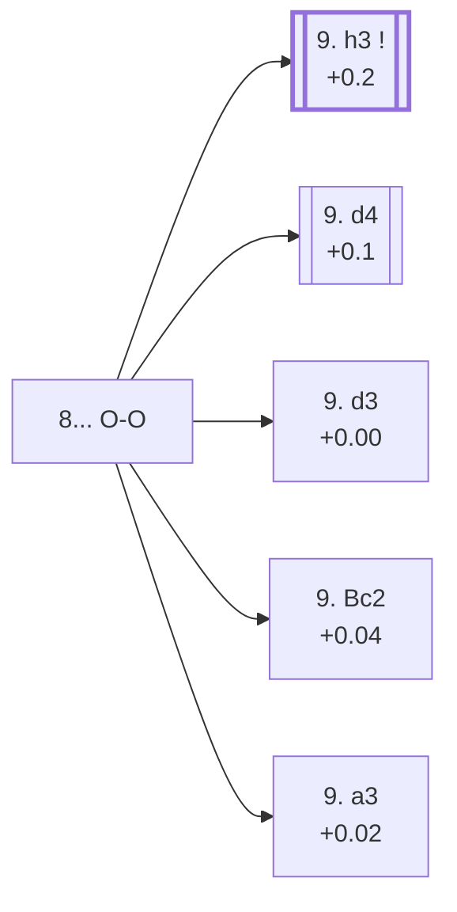

<a name="_TOP_"></a>

# C90 Ruy Lopez: Closed <br> 1. e4 e5 2. Nf3 Nc6 3. Bb5 a6 4. Ba4 Nf6 5. O-O Be7 6. Re1 b5 7. Bb3 d6 8. c3 O-O #

Spun off from [C88's 7... d6 8. c3](https://github.com/onclemarcel/chess_flashcards/blob/main/e4_openings/C88_Ruy_Lopez_Closed_Bb3.md#_c3_d6_): both sides have finished the opening's easy decisions. This is the classical Closed Ruy Lopez tabiya — the position from which the immense Chigorin, Breyer and Zaitsev bodies of theory all branch, each fighting over the same basic plan (White's c3+d4 centre versus Black's queenside space and eventual counterplay). White's own 9th-move fork itself escalates to two further codes — **9. h3** to [C92](https://github.com/onclemarcel/chess_flashcards/blob/main/e4_openings/C92_Ruy_Lopez_Zaitsev.md) and **9. d4** to [C91](https://github.com/onclemarcel/chess_flashcards/blob/main/e4_openings/C91_Ruy_Lopez_Yates_Variation.md) — while three quieter tries (**9. d3**/**9. Bc2**/**9. a3**) all stay at this parent code, C90.

### Overview

*Quick map of every move covered on this card — see the [shape key](https://github.com/onclemarcel/chess_flashcards/blob/main/start.md#content-diagram-optional) in start.md.*

<!-- content-diagram:start -->

<!-- content-diagram:end -->

<a name="_initial_move_"></a>

[](https://lichess.org/analysis/standard/r1bq1rk1/2p1bppp/p1np1n2/1p2p3/4P3/1BP2N2/PP1P1PPP/RNBQR1K1_w_-_-_1_9)

*... 8... O-O — the classical Closed Ruy Lopez tabiya*

```
r1bq1rk1/2p1bppp/p1np1n2/1p2p3/4P3/1BP2N2/PP1P1PPP/RNBQR1K1 w - - 1 9
```

|  | +0.3 |
| --- | --- |

<!-- lichess-stats:start fen="r1bq1rk1/2p1bppp/p1np1n2/1p2p3/4P3/1BP2N2/PP1P1PPP/RNBQR1K1 w - - 1 9" db="lichess,masters" speeds="bullet,blitz" ratings="1800,2000,2200,2500" moves="5" -->
| Move | Online | W/D/B | Masters | W/D/B | |
| :--- | ---: | :--- | ---: | :--- | :-- |
| h3 | 478 k (69.7%) | ⬜⬜⬜⬜⬜🟫⬛⬛⬛⬛ 49/6/45 | 27 k (87.3%) | ⬜⬜⬜🟫🟫🟫🟫🟫⬛⬛ 31/53/16 |  |
| d4 | 144 k (21.0%) | ⬜⬜⬜⬜⬜⬛⬛⬛⬛⬛ 48/5/47 | 3.0 k (9.7%) | ⬜⬜⬜⬜🟫🟫🟫🟫⬛⬛ 35/43/22 |  |
| d3 | 50 k (7.3%) | ⬜⬜⬜⬜⬜🟫⬛⬛⬛⬛ 51/5/44 | 535 (1.7%) | ⬜⬜⬜🟫🟫🟫🟫⬛⬛⬛ 32/44/24 |  |
| a4 | 10 k (1.5%) | ⬜⬜⬜⬜⬜🟫⬛⬛⬛⬛ 50/6/44 | 275 (0.9%) | ⬜⬜⬜⬜🟫🟫🟫⬛⬛⬛ 41/34/25 |  |
| Bc2 | 1.8 k (0.3%) | ⬜⬜⬜⬜⬜⬛⬛⬛⬛⬛ 46/6/49 | 0 | — | ⚠ |
| a3 | 0 | — | 91 (0.3%) | ⬜⬜⬜🟫🟫🟫🟫⬛⬛⬛ 31/44/25 |  |

*Online: bullet/blitz, 1800+ — 685 k games. Masters: 31 k games. [Open in the explorer](https://lichess.org/analysis/standard/r1bq1rk1/2p1bppp/p1np1n2/1p2p3/4P3/1BP2N2/PP1P1PPP/RNBQR1K1_w_-_-_1_9#explorer) — updated 2026-09-06*
<!-- lichess-stats:end -->

### Candidate moves

* **9. h3** (+0.2, 87.3% masters): rules out ... Bg4 pinning the f3 knight before doing anything else — masters' clear main try, already live-tagged its own code, [C92](https://github.com/onclemarcel/chess_flashcards/blob/main/e4_openings/C92_Ruy_Lopez_Zaitsev.md).
* **9. d4** (+0.1, 9.7% masters): strikes the centre immediately instead — the *Yates Variation*, already live-tagged its own code, [C91](https://github.com/onclemarcel/chess_flashcards/blob/main/e4_openings/C91_Ruy_Lopez_Yates_Variation.md).
* [**9. d3**](#_Pilnik_) (1.7% masters): the *Pilnik Variation* — covered below.
* [**9. Bc2**](#_Lutikov_) (a genuine database rarity, 11 masters games): the *Lutikov Variation* — covered below.
* [**9. a3**](#_Suetin_) (0.3% masters): the *Suetin Variation* — covered below.

[*Back to TOP*](#_TOP_)

---

<a name="_Pilnik_"></a>

## 9. d3 — Pilnik Variation

[](https://lichess.org/analysis/standard/r1bq1rk1/2p1bppp/p1np1n2/1p2p3/4P3/1BPP1N2/PP3PPP/RNBQR1K1_b_-_-_0_9)

*... 9. d3 — Pilnik Variation*

```
r1bq1rk1/2p1bppp/p1np1n2/1p2p3/4P3/1BPP1N2/PP3PPP/RNBQR1K1 b - - 0 9
```

|  | +0.00 |
| --- | --- |

Sidesteps both the h3/Bg4 question and the sharpest d4 theory, a quieter practical try (1.7% masters). Masters' clear main try is **9... Na5** (81.1%), transposing toward Chigorin-flavoured structures a tempo later. Not built out further here (backlog).

[*Back to 8... O-O*](#_initial_move_)
[*Back to TOP*](#_TOP_)

---

<a name="_Lutikov_"></a>

## 9. Bc2 — Lutikov Variation

[](https://lichess.org/analysis/standard/r1bq1rk1/2p1bppp/p1np1n2/1p2p3/4P3/2P2N2/PPBP1PPP/RNBQR1K1_b_-_-_2_9)

*... 9. Bc2 — Lutikov Variation*

```
r1bq1rk1/2p1bppp/p1np1n2/1p2p3/4P3/2P2N2/PPBP1PPP/RNBQR1K1 b - - 2 9
```

|  | +0.04 |
| --- | --- |

Retreats the bishop off the b3-g8 diagonal before Black can even ask the question, sidestepping the whole Chigorin ... Na5 idea — a genuine database rarity (11 masters games). Masters split fairly evenly between **9... d5**, **9... Bg4**, **9... Bb7**, and **9... Na5**. Not built out further here (backlog).

[*Back to 8... O-O*](#_initial_move_)
[*Back to TOP*](#_TOP_)

---

<a name="_Suetin_"></a>

## 9. a3 — Suetin Variation

[](https://lichess.org/analysis/standard/r1bq1rk1/2p1bppp/p1np1n2/1p2p3/4P3/PBP2N2/1P1P1PPP/RNBQR1K1_b_-_-_0_9)

*... 9. a3 — Suetin Variation*

```
r1bq1rk1/2p1bppp/p1np1n2/1p2p3/4P3/PBP2N2/1P1P1PPP/RNBQR1K1 b - - 0 9
```

|  | +0.02 |
| --- | --- |

Rules out ... Bb4/... Nb4 ideas before committing to h3 or d4 — a real, if secondary, try (0.3% masters). Masters' clear main try is **9... Na5** (30.4%). Not built out further here (backlog).

[*Back to 8... O-O*](#_initial_move_)
[*Back to TOP*](#_TOP_)
