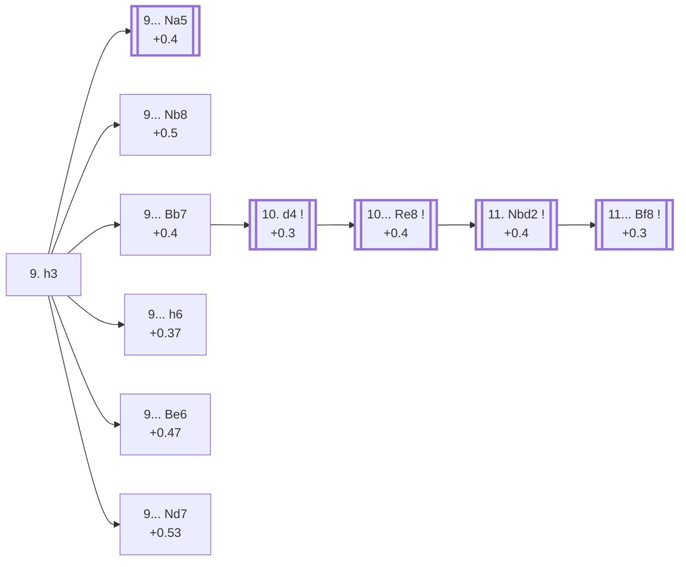

<a name="_TOP_"></a>

# C92 Ruy Lopez: Closed <br> 1. e4 e5 2. Nf3 Nc6 3. Bb5 a6 4. Ba4 Nf6 5. O-O Be7 6. Re1 b5 7. Bb3 d6 8. c3 O-O 9. h3 #

Spun off from [C90's own "9. h3" candidate bullet](https://github.com/onclemarcel/chess_flashcards/blob/main/e4_openings/C90_Ruy_Lopez_Closed_Tabiya.md#_initial_move_) — masters' clear main try there (87.3%), already live-tagged its own code. Rules out ... Bg4 pinning the f3 knight before committing to any particular plan. Black's own reply is a genuine multi-way fork, three of whose branches escalate to their own codes.

### Overview

*Quick map of every move covered on this card — see the [shape key](https://github.com/onclemarcel/chess_flashcards/blob/main/start.md#content-diagram-optional) in start.md.*

<!-- content-diagram:start -->

<!-- content-diagram:end -->

<a name="_initial_move_"></a>

[](https://lichess.org/analysis/standard/r1bq1rk1/2p1bppp/p1np1n2/1p2p3/4P3/1BP2N1P/PP1P1PP1/RNBQR1K1_b_-_-_0_9)

*... 9. h3*

```
r1bq1rk1/2p1bppp/p1np1n2/1p2p3/4P3/1BP2N1P/PP1P1PP1/RNBQR1K1 b - - 0 9
```

|  | +0.2 |
| --- | --- |

<!-- lichess-stats:start fen="r1bq1rk1/2p1bppp/p1np1n2/1p2p3/4P3/1BP2N1P/PP1P1PP1/RNBQR1K1 b - - 0 9" db="lichess,masters" speeds="bullet,blitz" ratings="1800,2000,2200,2500" moves="7" -->
| Move | Online | W/D/B | Masters | W/D/B | |
| :--- | ---: | :--- | ---: | :--- | :-- |
| Na5 | 344 k (47.7%) | ⬜⬜⬜⬜⬜🟫⬛⬛⬛⬛ 49/5/45 | 9.9 k (34.6%) | ⬜⬜⬜🟫🟫🟫🟫🟫⬛⬛ 36/47/17 |  |
| Nb8 | 138 k (19.1%) | ⬜⬜⬜⬜⬜🟫⬛⬛⬛⬛ 48/6/46 | 7.9 k (27.8%) | ⬜⬜⬜🟫🟫🟫🟫🟫⬛⬛ 29/55/17 |  |
| Bb7 | 102 k (14.1%) | ⬜⬜⬜⬜⬜🟫⬛⬛⬛⬛ 49/6/45 | 6.9 k (24.1%) | ⬜⬜⬜🟫🟫🟫🟫🟫🟫⬛ 27/59/14 |  |
| Be6 | 51 k (7.0%) | ⬜⬜⬜⬜⬜⬜⬛⬛⬛⬛ 55/5/40 | 354 (1.2%) | ⬜⬜⬜🟫🟫🟫🟫🟫⬛⬛ 32/52/15 |  |
| h6 | 46 k (6.4%) | ⬜⬜⬜⬜⬜🟫⬛⬛⬛⬛ 52/5/42 | 753 (2.6%) | ⬜⬜⬜🟫🟫🟫🟫🟫⬛⬛ 33/48/19 |  |
| Re8 | 20 k (2.8%) | ⬜⬜⬜⬜⬜🟫⬛⬛⬛⬛ 50/6/44 | 1.3 k (4.6%) | ⬜⬜⬜🟫🟫🟫🟫🟫🟫⬛ 26/61/13 |  |
| Nd7 | 7.9 k (1.1%) | ⬜⬜⬜⬜⬜🟫⬛⬛⬛⬛ 48/6/45 | 990 (3.5%) | ⬜⬜⬜⬜🟫🟫🟫🟫⬛⬛ 36/44/21 |  |

*Online: bullet/blitz, 1800+ — 722 k games. Masters: 29 k games. [Open in the explorer](https://lichess.org/analysis/standard/r1bq1rk1/2p1bppp/p1np1n2/1p2p3/4P3/1BP2N1P/PP1P1PP1/RNBQR1K1_b_-_-_0_9#explorer) — updated 2026-09-09*
<!-- lichess-stats:end -->

Black's own reply is a genuine multi-way fork — three tries each already carry their own dedicated code:

* **9... Na5** (+0.4, 34.6% masters): the ***Chigorin Defense*** — its own code, [C97](https://github.com/onclemarcel/chess_flashcards/blob/main/e4_openings/C97_Ruy_Lopez_Chigorin.md).
* **9... Nb8** (+0.5, 27.8% masters): the ***Breyer Defense*** — its own code, [C94](https://github.com/onclemarcel/chess_flashcards/blob/main/e4_openings/C94_Ruy_Lopez_Breyer.md).
* [**9... Bb7**](#_Bb7_) (+0.4, 24.1% masters): develops the bishop first, staying at this parent code — covered below (after 10. d4 Re8 this becomes the ***Zaitsev Variation***, Kasparov's long-time weapon of choice).
* **9... h6** (+0.37, 2.6% masters): the *Smyslov Defense* — its own code, [C93](https://github.com/onclemarcel/chess_flashcards/blob/main/e4_openings/C93_Ruy_Lopez_Smyslov_Defense.md).
* [**9... Be6**](#_Kholmov_) (a genuine database rarity in the current sample): the *Kholmov Variation* — covered below.
* [**9... Nd7**](#_Karpov_) (3.5% masters): live-tagged the *Karpov Variation* — covered below.
* **9... Re8**: playable but clearly secondary (4.6% masters) — no dedicated section here.

[*Back to TOP*](#_TOP_)

---

<a name="_Kholmov_"></a>

## 9... Be6 — Kholmov Variation

[](https://lichess.org/analysis/standard/r2q1rk1/2p1bppp/p1npbn2/1p2p3/4P3/1BP2N1P/PP1P1PP1/RNBQR1K1_w_-_-_1_10)

*... 9... Be6 — Kholmov Variation*

```
r2q1rk1/2p1bppp/p1npbn2/1p2p3/4P3/1BP2N1P/PP1P1PP1/RNBQR1K1 w - - 1 10
```

|  | +0.47 |
| --- | --- |

Offers a trade of the light-squared bishops immediately rather than developing on the long diagonal. Masters' clear main try is **10. d4** (85.9%), striking the centre; **10. Bxe6** (8.2%) simplifies at once. Not built out further here (backlog).

[*Back to 9. h3*](#_initial_move_)
[*Back to TOP*](#_TOP_)

---

<a name="_Karpov_"></a>

## 9... Nd7 — Karpov Variation

[](https://lichess.org/analysis/standard/r1bq1rk1/2pnbppp/p1np4/1p2p3/4P3/1BP2N1P/PP1P1PP1/RNBQR1K1_w_-_-_1_10)

*... 9... Nd7 — live-tagged the Karpov Variation*

```
r1bq1rk1/2pnbppp/p1np4/1p2p3/4P3/1BP2N1P/PP1P1PP1/RNBQR1K1 w - - 1 10
```

|  | +0.53 |
| --- | --- |

`eco.md` calls this the *Ragozin-Petrosian ('Keres') Variation*; the live explorer tags it the ***Karpov Variation*** instead — a real name divergence. Rather than reroute the queenside knight (Breyer-style) or the kingside knight (as here, toward b6 or f8), Black keeps flexible. Masters' overwhelming reply is **10. d4** (93.2%). Not built out further here (backlog).

[*Back to 9. h3*](#_initial_move_)
[*Back to TOP*](#_TOP_)

---

<a name="_Bb7_"></a>

## 9... Bb7 — Flohr System

[](https://lichess.org/analysis/standard/r2q1rk1/1bp1bppp/p1np1n2/1p2p3/4P3/1BP2N1P/PP1P1PP1/RNBQR1K1_w_-_-_1_10)

*... 9... Bb7 — Flohr System, one move short of the Zaitsev Variation*

```
r2q1rk1/1bp1bppp/p1np1n2/1p2p3/4P3/1BP2N1P/PP1P1PP1/RNBQR1K1 w - - 1 10
```

|  | +0.4 |
| --- | --- |

<!-- lichess-stats:start fen="r2q1rk1/1bp1bppp/p1np1n2/1p2p3/4P3/1BP2N1P/PP1P1PP1/RNBQR1K1 w - - 1 10" db="lichess,masters" speeds="bullet,blitz" ratings="1800,2000,2200,2500" moves="4" -->
| Move | Online | W/D/B | Masters | W/D/B | |
| :--- | ---: | :--- | ---: | :--- | :-- |
| d4 | 90 k (80.1%) | ⬜⬜⬜⬜⬜🟫⬛⬛⬛⬛ 49/6/44 | 6.7 k (96.6%) | ⬜⬜⬜🟫🟫🟫🟫🟫🟫⬛ 27/59/14 |  |
| d3 | 15 k (13.6%) | ⬜⬜⬜⬜⬜🟫⬛⬛⬛⬛ 51/5/44 | 210 (3.0%) | ⬜⬜⬜🟫🟫🟫🟫🟫⬛⬛ 31/51/17 |  |
| a4 | 3.3 k (3.0%) | ⬜⬜⬜⬜⬜🟫⬛⬛⬛⬛ 50/6/45 | 21 (0.3%) | ⬜⬜⬜🟫🟫🟫🟫🟫🟫⬛ 29/62/10 |  |
| Bc2 | 2.4 k (2.1%) | ⬜⬜⬜⬜⬜⬛⬛⬛⬛⬛ 50/5/45 | 3 (0.0%) | — | ⚠ |

*Online: bullet/blitz, 1800+ — 112 k games. Masters: 6.9 k games. [Open in the explorer](https://lichess.org/analysis/standard/r2q1rk1/1bp1bppp/p1np1n2/1p2p3/4P3/1BP2N1P/PP1P1PP1/RNBQR1K1_w_-_-_1_10#explorer) — updated 2026-09-09*
<!-- lichess-stats:end -->

### Candidate moves

* [**10. d4**](#_d4_) (+0.3): strikes the centre — masters' clear main try (96.6%).

[*Back to 9. h3*](#_initial_move_)
[*Back to TOP*](#_TOP_)

---

<a name="_d4_"></a>

## 10. d4

[](https://lichess.org/analysis/standard/r2q1rk1/1bp1bppp/p1np1n2/1p2p3/3PP3/1BP2N1P/PP3PP1/RNBQR1K1_b_-_d3_0_10)

*... 10. d4*

```
r2q1rk1/1bp1bppp/p1np1n2/1p2p3/3PP3/1BP2N1P/PP3PP1/RNBQR1K1 b - d3 0 10
```

|  | +0.3 |
| --- | --- |

<!-- lichess-stats:start fen="r2q1rk1/1bp1bppp/p1np1n2/1p2p3/3PP3/1BP2N1P/PP3PP1/RNBQR1K1 b - d3 0 10" db="lichess,masters" speeds="bullet,blitz" ratings="1800,2000,2200,2500" moves="5" -->
| Move | Online | W/D/B | Masters | W/D/B | |
| :--- | ---: | :--- | ---: | :--- | :-- |
| Re8 | 43 k (44.5%) | ⬜⬜⬜⬜🟫⬛⬛⬛⬛⬛ 45/8/47 | 6.0 k (88.0%) | ⬜⬜⬜🟫🟫🟫🟫🟫🟫⬛ 26/62/12 |  |
| exd4 | 22 k (23.1%) | ⬜⬜⬜⬜⬜⬜⬛⬛⬛⬛ 57/4/39 | 0 | — | ⚠ |
| h6 | 11 k (11.8%) | ⬜⬜⬜⬜⬜⬛⬛⬛⬛⬛ 49/5/46 | 141 (2.1%) | ⬜⬜⬜🟫🟫🟫🟫⬛⬛⬛ 26/40/34 |  |
| Na5 | 9.8 k (10.2%) | ⬜⬜⬜⬜⬜⬜⬛⬛⬛⬛ 55/5/41 | 105 (1.5%) | ⬜⬜⬜🟫🟫🟫🟫⬛⬛⬛ 32/37/30 |  |
| Nd7 | 5.9 k (6.1%) | ⬜⬜⬜⬜⬜⬛⬛⬛⬛⬛ 45/5/49 | 469 (6.9%) | ⬜⬜⬜🟫🟫🟫🟫⬛⬛⬛ 34/41/26 |  |
| Qd7 | 0 | — | 63 (0.9%) | ⬜⬜⬜⬜⬜🟫🟫🟫⬛⬛ 52/29/19 |  |

*Online: bullet/blitz, 1800+ — 96 k games. Masters: 6.8 k games. [Open in the explorer](https://lichess.org/analysis/standard/r2q1rk1/1bp1bppp/p1np1n2/1p2p3/3PP3/1BP2N1P/PP3PP1/RNBQR1K1_b_-_d3_0_10#explorer) — updated 2026-09-09*
<!-- lichess-stats:end -->

**10... Re8** is masters' clear main try (88.0%) — repositioning the rook off f8 so that after a future ... exd4/cxd4 exchange, it directly backs up the e5 pawn rather than sitting on a now-open f-file that doesn't matter yet. This is the move that actually defines the Zaitsev Variation; **10... Nd7** (6.9%) stays closer to the quieter Flohr System instead.

[*Back to 9... Bb7*](#_Bb7_)
[*Back to TOP*](#_TOP_)

---

<a name="_Re8_"></a>

## 10... Re8 — Zaitsev Variation

[](https://lichess.org/analysis/standard/r2qr1k1/1bp1bppp/p1np1n2/1p2p3/3PP3/1BP2N1P/PP3PP1/RNBQR1K1_w_-_-_1_11)

*... 10... Re8 — Zaitsev Variation, Kasparov's long-time main defense*

```
r2qr1k1/1bp1bppp/p1np1n2/1p2p3/3PP3/1BP2N1P/PP3PP1/RNBQR1K1 w - - 1 11
```

|  | +0.4 |
| --- | --- |

<!-- lichess-stats:start fen="r2qr1k1/1bp1bppp/p1np1n2/1p2p3/3PP3/1BP2N1P/PP3PP1/RNBQR1K1 w - - 1 11" db="lichess,masters" speeds="bullet,blitz" ratings="1800,2000,2200,2500" moves="4" -->
| Move | Online | W/D/B | Masters | W/D/B | |
| :--- | ---: | :--- | ---: | :--- | :-- |
| Nbd2 | 30 k (60.9%) | ⬜⬜⬜⬜⬜⬛⬛⬛⬛⬛ 46/6/48 | 6.2 k (86.8%) | ⬜⬜⬜🟫🟫🟫🟫🟫🟫⬛ 26/63/11 |  |
| Ng5 | 5.1 k (10.4%) | ⬜⬜⬜⬜🟫🟫⬛⬛⬛⬛ 37/22/41 | 281 (3.9%) | ⬜⬜🟫🟫🟫🟫🟫⬛⬛⬛ 18/50/32 |  |
| d5 | 4.4 k (9.0%) | ⬜⬜⬜⬜🟫⬛⬛⬛⬛⬛ 42/5/53 | 0 | — | ⚠ |
| Bg5 | 3.4 k (7.1%) | ⬜⬜⬜⬜⬜⬛⬛⬛⬛⬛ 47/6/47 | 0 | — | ⚠ |
| a4 | 0 | — | 370 (5.2%) | ⬜⬜⬜🟫🟫🟫🟫🟫⬛⬛ 32/53/15 |  |
| a3 | 0 | — | 233 (3.2%) | ⬜⬜🟫🟫🟫🟫🟫🟫🟫⬛ 19/68/13 |  |

*Online: bullet/blitz, 1800+ — 49 k games. Masters: 7.2 k games. [Open in the explorer](https://lichess.org/analysis/standard/r2qr1k1/1bp1bppp/p1np1n2/1p2p3/3PP3/1BP2N1P/PP3PP1/RNBQR1K1_w_-_-_1_11#explorer) — updated 2026-09-09*
<!-- lichess-stats:end -->

**11. Nbd2** is masters' clear main try (86.8%), rerouting the knight toward f1-g3 or e3 while keeping the central tension unresolved.

[*Back to 10. d4*](#_d4_)
[*Back to TOP*](#_TOP_)

---

<a name="_Nbd2_"></a>

## 11. Nbd2

[](https://lichess.org/analysis/standard/r2qr1k1/1bp1bppp/p1np1n2/1p2p3/3PP3/1BP2N1P/PP1N1PP1/R1BQR1K1_b_-_-_2_11)

*... 11. Nbd2*

```
r2qr1k1/1bp1bppp/p1np1n2/1p2p3/3PP3/1BP2N1P/PP1N1PP1/R1BQR1K1 b - - 2 11
```

|  | +0.4 |
| --- | --- |

From here Black typically continues **... Bf8**, keeping every piece flexible while White manoeuvres the knight toward f1-g3 or e3 and prepares d4-d5 or the classic kingside expansion with Nf1-g3, Bg5/Be3 and a4.

* [**11... Bf8**](#_Bf8_) (+0.3): see below.

[*Back to 10... Re8*](#_Re8_)
[*Back to TOP*](#_TOP_)

---

<a name="_Bf8_"></a>

## 11... Bf8 — the Zaitsev tabiya

[](https://lichess.org/analysis/standard/r2qrbk1/1bp2ppp/p1np1n2/1p2p3/3PP3/1BP2N1P/PP1N1PP1/R1BQR1K1_w_-_-_3_12)

*... 11... Bf8 — reaching the main Zaitsev tabiya*

```
r2qrbk1/1bp2ppp/p1np1n2/1p2p3/3PP3/1BP2N1P/PP1N1PP1/R1BQR1K1 w - - 3 12
```

|  | +0.3 |
| --- | --- |

<!-- lichess-stats:start fen="r2qrbk1/1bp2ppp/p1np1n2/1p2p3/3PP3/1BP2N1P/PP1N1PP1/R1BQR1K1 w - - 3 12" db="lichess,masters" speeds="bullet,blitz" ratings="1800,2000,2200,2500" moves="4" -->
| Move | Online | W/D/B | Masters | W/D/B | |
| :--- | ---: | :--- | ---: | :--- | :-- |
| Bc2 | 10 k (36.7%) | ⬜⬜⬜⬜🟫⬛⬛⬛⬛⬛ 46/6/48 | 789 (13.3%) | ⬜⬜🟫🟫🟫🟫🟫🟫⬛⬛ 24/56/19 |  |
| a4 | 4.8 k (17.1%) | ⬜⬜⬜⬜🟫⬛⬛⬛⬛⬛ 45/7/48 | 2.1 k (35.8%) | ⬜⬜⬜🟫🟫🟫🟫🟫🟫⬛ 25/65/10 |  |
| Nf1 | 4.8 k (17.1%) | ⬜⬜⬜⬜🟫⬛⬛⬛⬛⬛ 44/5/52 | 0 | — | ⚠ |
| d5 | 3.4 k (12.2%) | ⬜⬜⬜⬜⬜🟫⬛⬛⬛⬛ 46/8/46 | 1.1 k (18.6%) | ⬜⬜⬜🟫🟫🟫🟫🟫🟫⬛ 29/60/11 |  |
| a3 | 0 | — | 1.9 k (31.1%) | ⬜⬜🟫🟫🟫🟫🟫🟫🟫⬛ 25/65/10 |  |

*Online: bullet/blitz, 1800+ — 28 k games. Masters: 6.0 k games. [Open in the explorer](https://lichess.org/analysis/standard/r2qrbk1/1bp2ppp/p1np1n2/1p2p3/3PP3/1BP2N1P/PP1N1PP1/R1BQR1K1_w_-_-_3_12#explorer) — updated 2026-09-09*
<!-- lichess-stats:end -->

White's 12th move here is a genuine multi-way split — no single try dominates: **12. a4** (35.8% masters) probes the queenside immediately, **12. a3** (31.1%) prepares Bc2/b4 more slowly, **12. d5** (18.6%) closes the centre, and **12. Bc2** (13.3%) simply repositions the bishop off the b3-g8 diagonal before Black's ... Nc4/... Na5 ideas. Each branch is its own extensive body of theory, not covered further here.

[*Back to 11. Nbd2*](#_Nbd2_)
[*Back to TOP*](#_TOP_)
