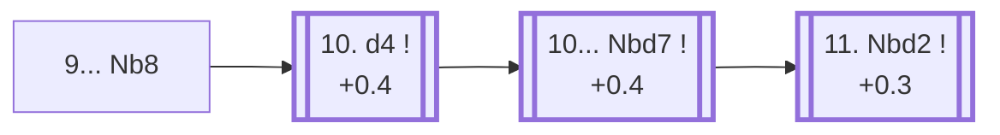

<a name="_TOP_"></a>

# C94 Ruy Lopez: Closed, Breyer Defense <br> 1. e4 e5 2. Nf3 Nc6 3. Bb5 a6 4. Ba4 Nf6 5. O-O Be7 6. Re1 b5 7. Bb3 d6 8. c3 O-O 9. h3 Nb8 #

Spun off from [C90's 9. h3](https://github.com/onclemarcel/chess_flashcards/blob/main/e4_openings/C90_Ruy_Lopez_Closed_Tabiya.md#_h3_): named after Hungarian master Gyula Breyer, who reportedly quipped "after 1. e4! White's game is in its last throes" — the retreat looks like it wastes two whole tempi, but the knight is actually rerouting to d7, from where it supports ... c5 and ... Bb7 without ever blocking the c-pawn the way it did on c6. A favourite of Spassky and Karpov, and masters' second most common 9th-move try (27.8%).

### Overview

*Quick map of every move covered on this card — see the [shape key](https://github.com/onclemarcel/chess_flashcards/blob/main/start.md#content-diagram-optional) in start.md.*

<!-- content-diagram:start -->

<!-- content-diagram:end -->

<a name="_initial_move_"></a>

[](https://lichess.org/analysis/standard/rnbq1rk1/2p1bppp/p2p1n2/1p2p3/4P3/1BP2N1P/PP1P1PP1/RNBQR1K1_w_-_-_1_10)

*... 9... Nb8 — Breyer Defense: rerouting the knight to d7*

```
rnbq1rk1/2p1bppp/p2p1n2/1p2p3/4P3/1BP2N1P/PP1P1PP1/RNBQR1K1 w - - 1 10
```

|  | +0.5 |
| --- | --- |

<!-- lichess-stats:start fen="rnbq1rk1/2p1bppp/p2p1n2/1p2p3/4P3/1BP2N1P/PP1P1PP1/RNBQR1K1 w - - 1 10" db="lichess,masters" speeds="bullet,blitz" ratings="1800,2000,2200,2500" moves="4" -->
| Move | Online | W/D/B | Masters | W/D/B | |
| :--- | ---: | :--- | ---: | :--- | :-- |
| d4 | 123 k (88.6%) | ⬜⬜⬜⬜⬜⬛⬛⬛⬛⬛ 47/6/46 | 7.5 k (94.4%) | ⬜⬜⬜🟫🟫🟫🟫🟫⬛⬛ 29/55/17 |  |
| d3 | 8.1 k (5.8%) | ⬜⬜⬜⬜⬜🟫⬛⬛⬛⬛ 50/6/44 | 354 (4.5%) | ⬜⬜⬜🟫🟫🟫🟫🟫⬛⬛ 30/51/19 |  |
| a4 | 6.0 k (4.4%) | ⬜⬜⬜⬜⬜🟫⬛⬛⬛⬛ 49/7/44 | 75 (0.9%) | ⬜⬜🟫🟫🟫🟫🟫🟫⬛⬛ 19/60/21 |  |
| Bc2 | 1.3 k (0.9%) | ⬜⬜⬜⬜⬜🟫⬛⬛⬛⬛ 52/6/43 | 13 (0.2%) | — |  |

*Online: bullet/blitz, 1800+ — 139 k games. Masters: 7.9 k games. [Open in the explorer](https://lichess.org/analysis/standard/rnbq1rk1/2p1bppp/p2p1n2/1p2p3/4P3/1BP2N1P/PP1P1PP1/RNBQR1K1_w_-_-_1_10#explorer) — updated 2026-08-25*
<!-- lichess-stats:end -->

### Candidate moves

* [**10. d4**](#_d4_) (+0.4): strikes the centre while Black's pieces are still reorganising — masters' clear main try (94.4%).

[*Back to TOP*](#_TOP_)

---

<a name="_d4_"></a>

## 10. d4

[](https://lichess.org/analysis/standard/rnbq1rk1/2p1bppp/p2p1n2/1p2p3/3PP3/1BP2N1P/PP3PP1/RNBQR1K1_b_-_d3_0_10)

*... 10. d4*

```
rnbq1rk1/2p1bppp/p2p1n2/1p2p3/3PP3/1BP2N1P/PP3PP1/RNBQR1K1 b - d3 0 10
```

|  | +0.4 |
| --- | --- |

<!-- lichess-stats:start fen="rnbq1rk1/2p1bppp/p2p1n2/1p2p3/3PP3/1BP2N1P/PP3PP1/RNBQR1K1 b - d3 0 10" db="lichess,masters" speeds="bullet,blitz" ratings="1800,2000,2200,2500" moves="4" -->
| Move | Online | W/D/B | Masters | W/D/B | |
| :--- | ---: | :--- | ---: | :--- | :-- |
| Nbd7 | 121 k (97.9%) | ⬜⬜⬜⬜⬜⬛⬛⬛⬛⬛ 47/6/47 | 7.5 k (99.9%) | ⬜⬜⬜🟫🟫🟫🟫🟫⬛⬛ 29/55/17 |  |
| exd4 | 1.1 k (0.9%) | ⬜⬜⬜⬜⬜⬜⬛⬛⬛⬛ 58/5/37 | 0 | — | ⚠ |
| Bb7 | 666 (0.5%) | ⬜⬜⬜⬜⬜⬛⬛⬛⬛⬛ 49/5/46 | 3 (0.0%) | — | ⚠ |
| c5 | 488 (0.4%) | ⬜⬜⬜⬜⬜⬜⬛⬛⬛⬛ 61/3/36 | 1 (0.0%) | — | ⚠ |
| Re8 | 0 | — | 2 (0.0%) | — |  |

*Online: bullet/blitz, 1800+ — 123 k games. Masters: 7.5 k games. [Open in the explorer](https://lichess.org/analysis/standard/rnbq1rk1/2p1bppp/p2p1n2/1p2p3/3PP3/1BP2N1P/PP3PP1/RNBQR1K1_b_-_d3_0_10#explorer) — updated 2026-08-25*
<!-- lichess-stats:end -->

**10... Nbd7** is essentially forced (99.9% of masters games) — the whole idea of 9... Nb8, finally completing the knight's reroute from c6 to a square where it doesn't block the c-pawn.

[*Back to 9... Nb8*](#_initial_move_)
[*Back to TOP*](#_TOP_)

---

<a name="_Nbd7_"></a>

## 10... Nbd7 — the Breyer tabiya

[](https://lichess.org/analysis/standard/r1bq1rk1/2pnbppp/p2p1n2/1p2p3/3PP3/1BP2N1P/PP3PP1/RNBQR1K1_w_-_-_1_11)

*... 10... Nbd7 — reaching the main Breyer Defense tabiya*

```
r1bq1rk1/2pnbppp/p2p1n2/1p2p3/3PP3/1BP2N1P/PP3PP1/RNBQR1K1 w - - 1 11
```

|  | +0.4 |
| --- | --- |

From here White typically continues **11. Nbd2**, re-routing the other knight toward f1-g3/e3 while Black finishes with ... Bb7, ... Re8 and ... Bf8 — a famously slow, manoeuvring middlegame prized for its resilience rather than sharp tactics.

* [**11. Nbd2**](#_Nbd2b_) (+0.4): see below.

[*Back to 10. d4*](#_d4_)
[*Back to TOP*](#_TOP_)

---

<a name="_Nbd2b_"></a>

## 11. Nbd2

[](https://lichess.org/analysis/standard/r1bq1rk1/2pnbppp/p2p1n2/1p2p3/3PP3/1BP2N1P/PP1N1PP1/R1BQR1K1_b_-_-_2_11)

*... 11. Nbd2*

```
r1bq1rk1/2pnbppp/p2p1n2/1p2p3/3PP3/1BP2N1P/PP1N1PP1/R1BQR1K1 b - - 2 11
```

|  | +0.3 |
| --- | --- |

<!-- lichess-stats:start fen="r1bq1rk1/2pnbppp/p2p1n2/1p2p3/3PP3/1BP2N1P/PP1N1PP1/R1BQR1K1 b - - 2 11" db="lichess,masters" speeds="bullet,blitz" ratings="1800,2000,2200,2500" moves="3" -->
| Move | Online | W/D/B | Masters | W/D/B | |
| :--- | ---: | :--- | ---: | :--- | :-- |
| Bb7 | 74 k (84.9%) | ⬜⬜⬜⬜⬜⬛⬛⬛⬛⬛ 47/7/47 | 6.2 k (94.8%) | ⬜⬜⬜🟫🟫🟫🟫🟫⬛⬛ 28/55/17 |  |
| c5 | 9.3 k (10.7%) | ⬜⬜⬜⬜⬜🟫⬛⬛⬛⬛ 50/5/45 | 322 (4.9%) | ⬜⬜⬜🟫🟫🟫🟫🟫⬛⬛ 28/48/24 |  |
| Re8 | 2.4 k (2.8%) | ⬜⬜⬜⬜⬜⬜⬛⬛⬛⬛ 56/5/38 | 10 (0.2%) | — |  |

*Online: bullet/blitz, 1800+ — 87 k games. Masters: 6.5 k games. [Open in the explorer](https://lichess.org/analysis/standard/r1bq1rk1/2pnbppp/p2p1n2/1p2p3/3PP3/1BP2N1P/PP1N1PP1/R1BQR1K1_b_-_-_2_11#explorer) — updated 2026-08-25*
<!-- lichess-stats:end -->

**11... Bb7** is masters' overwhelming choice (94.8%) — completing development on the long diagonal before deciding on ... Re8/... Bf8 and the classic knight reroute. Deeper Breyer theory past this point is its own extensive body of work, not covered further here.

[*Back to 10... Nbd7*](#_Nbd7_)
[*Back to TOP*](#_TOP_)
