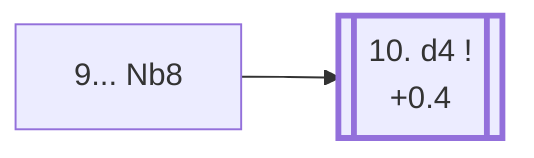

<a name="_TOP_"></a>

# C94 Ruy Lopez: Closed, Breyer Defense <br> 1. e4 e5 2. Nf3 Nc6 3. Bb5 a6 4. Ba4 Nf6 5. O-O Be7 6. Re1 b5 7. Bb3 d6 8. c3 O-O 9. h3 Nb8 #

Spun off from [C92's 9. h3](https://github.com/onclemarcel/chess_flashcards/blob/main/e4_openings/C92_Ruy_Lopez_Zaitsev.md#_initial_move_): named after Hungarian master Gyula Breyer, who reportedly quipped "after 1. e4! White's game is in its last throes" — the retreat looks like it wastes two whole tempi, but the knight is actually rerouting to d7, from where it supports ... c5 and ... Bb7 without ever blocking the c-pawn the way it did on c6. A favourite of Spassky and Karpov, and masters' second most common 9th-move try (27.8%). White's near-universal **10. d4** reply is itself already live-tagged its own code, [C95](https://github.com/onclemarcel/chess_flashcards/blob/main/e4_openings/C95_Ruy_Lopez_Breyer_Main_Line.md).

### Overview

*Quick map of every move covered on this card — see the [shape key](https://github.com/onclemarcel/chess_flashcards/blob/main/start.md#content-diagram-optional) in start.md.*

<!-- content-diagram:start -->

<!-- content-diagram:end -->

<a name="_initial_move_"></a>

[](https://lichess.org/analysis/standard/rnbq1rk1/2p1bppp/p2p1n2/1p2p3/4P3/1BP2N1P/PP1P1PP1/RNBQR1K1_w_-_-_1_10)

*... 9... Nb8 — Breyer Defense: rerouting the knight to d7*

```
rnbq1rk1/2p1bppp/p2p1n2/1p2p3/4P3/1BP2N1P/PP1P1PP1/RNBQR1K1 w - - 1 10
```

|  | +0.5 |
| --- | --- |

<!-- lichess-stats:start fen="rnbq1rk1/2p1bppp/p2p1n2/1p2p3/4P3/1BP2N1P/PP1P1PP1/RNBQR1K1 w - - 1 10" db="lichess,masters" speeds="bullet,blitz" ratings="1800,2000,2200,2500" moves="4" -->
| Move | Online | W/D/B | Masters | W/D/B | |
| :--- | ---: | :--- | ---: | :--- | :-- |
| d4 | 123 k (88.6%) | ⬜⬜⬜⬜⬜⬛⬛⬛⬛⬛ 47/6/46 | 7.5 k (94.4%) | ⬜⬜⬜🟫🟫🟫🟫🟫⬛⬛ 29/55/17 |  |
| d3 | 8.1 k (5.8%) | ⬜⬜⬜⬜⬜🟫⬛⬛⬛⬛ 50/6/44 | 354 (4.5%) | ⬜⬜⬜🟫🟫🟫🟫🟫⬛⬛ 30/51/19 |  |
| a4 | 6.0 k (4.4%) | ⬜⬜⬜⬜⬜🟫⬛⬛⬛⬛ 49/7/44 | 75 (0.9%) | ⬜⬜🟫🟫🟫🟫🟫🟫⬛⬛ 19/60/21 |  |
| Bc2 | 1.3 k (0.9%) | ⬜⬜⬜⬜⬜🟫⬛⬛⬛⬛ 52/6/43 | 13 (0.2%) | — |  |

*Online: bullet/blitz, 1800+ — 139 k games. Masters: 7.9 k games. [Open in the explorer](https://lichess.org/analysis/standard/rnbq1rk1/2p1bppp/p2p1n2/1p2p3/4P3/1BP2N1P/PP1P1PP1/RNBQR1K1_w_-_-_1_10#explorer) — updated 2026-09-15*
<!-- lichess-stats:end -->

### Candidate moves

* **10. d4** (+0.4, 94.4% masters): strikes the centre while Black's pieces are still reorganising — masters' clear main try, already live-tagged its own code, [C95](https://github.com/onclemarcel/chess_flashcards/blob/main/e4_openings/C95_Ruy_Lopez_Breyer_Main_Line.md).

[*Back to TOP*](#_TOP_)
