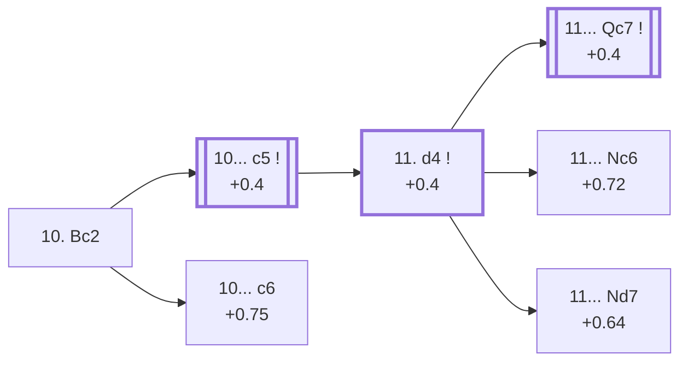

<a name="_TOP_"></a>

# C96 Ruy Lopez: Closed, Chigorin Defense <br> 1. e4 e5 2. Nf3 Nc6 3. Bb5 a6 4. Ba4 Nf6 5. O-O Be7 6. Re1 b5 7. Bb3 d6 8. c3 O-O 9. h3 Na5 10. Bc2 #

Spun off from [C97's own "9... Na5" root](https://github.com/onclemarcel/chess_flashcards/blob/main/e4_openings/C97_Ruy_Lopez_Chigorin.md#_initial_move_) — masters' near-forced reply there (99.9%), already live-tagged its own code: a real "wrong root code" find, since C97's own file previously built this exact position (and everything below it) as if it stayed C97. Tucks the bishop away from ... c5-c4, keeping long-term pressure on h7 alive.

### Overview

*Quick map of every move covered on this card — see the [shape key](https://github.com/onclemarcel/chess_flashcards/blob/main/start.md#content-diagram-optional) in start.md.*

<!-- content-diagram:start -->

<!-- content-diagram:end -->

<a name="_initial_move_"></a>

[](https://lichess.org/analysis/standard/r1bq1rk1/2p1bppp/p2p1n2/np2p3/4P3/2P2N1P/PPBP1PP1/RNBQR1K1_b_-_-_2_10)

*... 10. Bc2 — sidestepping ... c5-c4*

```
r1bq1rk1/2p1bppp/p2p1n2/np2p3/4P3/2P2N1P/PPBP1PP1/RNBQR1K1 b - - 2 10
```

|  | +0.42 |
| --- | --- |

<!-- lichess-stats:start fen="r1bq1rk1/2p1bppp/p2p1n2/np2p3/4P3/2P2N1P/PPBP1PP1/RNBQR1K1 b - - 2 10" db="lichess,masters" speeds="bullet,blitz" ratings="1800,2000,2200,2500" moves="4" -->
| Move | Online | W/D/B | Masters | W/D/B | |
| :--- | ---: | :--- | ---: | :--- | :-- |
| c5 | 331 k (95.9%) | ⬜⬜⬜⬜⬜🟫⬛⬛⬛⬛ 49/5/45 | 9.6 k (96.8%) | ⬜⬜⬜🟫🟫🟫🟫🟫⬛⬛ 36/48/17 |  |
| Bb7 | 5.0 k (1.5%) | ⬜⬜⬜⬜⬜⬜⬛⬛⬛⬛ 55/4/41 | 18 (0.2%) | — |  |
| d5 | 3.5 k (1.0%) | ⬜⬜⬜⬜🟫⬛⬛⬛⬛⬛ 41/6/53 | 282 (2.9%) | ⬜⬜⬜⬜🟫🟫🟫🟫⬛⬛ 37/39/24 |  |
| Nc4 | 1.6 k (0.5%) | ⬜⬜⬜⬜⬜⬜⬛⬛⬛⬛ 60/3/37 | 0 | — | ⚠ |
| c6 | 0 | — | 8 (0.1%) | — |  |

*Online: bullet/blitz, 1800+ — 346 k games. Masters: 9.9 k games. [Open in the explorer](https://lichess.org/analysis/standard/r1bq1rk1/2p1bppp/p2p1n2/np2p3/4P3/2P2N1P/PPBP1PP1/RNBQR1K1_b_-_-_2_10#explorer) — updated 2026-09-09*
<!-- lichess-stats:end -->

**10... c5** is close to automatic (96.8% of masters games) — the whole point of ... Na5, gaining queenside space and preparing ... Qc7/... Nc6 or ... Bb7 setups. The rare alternative, **10... c6**, is a genuine database rarity (8 masters games) that stays at this same code.

* [**10... c5**](#_c5_) (+0.4): see below.
* [**10... c6**](#_c6_) (+0.75): covered below.

[*Back to TOP*](#_TOP_)

---

<a name="_c6_"></a>

## 10... c6

[](https://lichess.org/analysis/standard/r1bq1rk1/4bppp/p1pp1n2/np2p3/4P3/2P2N1P/PPBP1PP1/RNBQR1K1_w_-_-_0_11)

*... 10... c6*

```
r1bq1rk1/4bppp/p1pp1n2/np2p3/4P3/2P2N1P/PPBP1PP1/RNBQR1K1 w - - 0 11
```

|  | +0.75 |
| --- | --- |

Supports a later ... d5 rather than committing to the queenside space of ... c5 — a genuine database rarity (only 8 masters games), and the engine prefers White noticeably more than the main line. Masters' clear main try is **11. d4** (87.5%). **11. d4 Qc7** reaches the named ***Rossolimo Defense***:

<a name="_Rossolimo_"></a>

[](https://lichess.org/analysis/standard/r1b2rk1/2q1bppp/p1pp1n2/np2p3/3PP3/2P2N1P/PPB2PP1/RNBQR1K1_w_-_-_1_12)

```
r1b2rk1/2q1bppp/p1pp1n2/np2p3/3PP3/2P2N1P/PPB2PP1/RNBQR1K1 w - - 1 12
```

|  | +0.64 |
| --- | --- |

A genuine database rarity (only 7 masters games, all reaching the same 12. Nbd2). Not built out further here beyond this summary (backlog).

[*Back to 10. Bc2*](#_initial_move_)
[*Back to TOP*](#_TOP_)

---

<a name="_c5_"></a>

## 10... c5 — the Chigorin tabiya

[](https://lichess.org/analysis/standard/r1bq1rk1/4bppp/p2p1n2/npp1p3/4P3/2P2N1P/PPBP1PP1/RNBQR1K1_w_-_c6_0_11)

*... 10... c5 — reaching the main Chigorin Defense tabiya*

```
r1bq1rk1/4bppp/p2p1n2/npp1p3/4P3/2P2N1P/PPBP1PP1/RNBQR1K1 w - c6 0 11
```

|  | +0.42 |
| --- | --- |

From here White typically continues **11. d4**, striking the centre while Black's queenside space and the a5 knight (soon rerouted via ... Nc6 or ... Bc6-e8-g6 style manoeuvres in deeper lines) provide lasting counterplay.

* [**11. d4**](#_d4c_) (+0.4): see below.

[*Back to 10. Bc2*](#_initial_move_)
[*Back to TOP*](#_TOP_)

---

<a name="_d4c_"></a>

## 11. d4

[](https://lichess.org/analysis/standard/r1bq1rk1/4bppp/p2p1n2/npp1p3/3PP3/2P2N1P/PPB2PP1/RNBQR1K1_b_-_d3_0_11)

*... 11. d4*

```
r1bq1rk1/4bppp/p2p1n2/npp1p3/3PP3/2P2N1P/PPB2PP1/RNBQR1K1 b - d3 0 11
```

|  | +0.4 |
| --- | --- |

<!-- lichess-stats:start fen="r1bq1rk1/4bppp/p2p1n2/npp1p3/3PP3/2P2N1P/PPB2PP1/RNBQR1K1 b - d3 0 11" db="lichess,masters" speeds="bullet,blitz" ratings="1800,2000,2200,2500" moves="5" -->
| Move | Online | W/D/B | Masters | W/D/B | |
| :--- | ---: | :--- | ---: | :--- | :-- |
| Qc7 | 169 k (57.9%) | ⬜⬜⬜⬜⬜⬛⬛⬛⬛⬛ 48/6/46 | 6.4 k (67.8%) | ⬜⬜⬜⬜🟫🟫🟫🟫🟫⬛ 36/49/15 |  |
| cxd4 | 58 k (19.9%) | ⬜⬜⬜⬜⬜🟫⬛⬛⬛⬛ 50/5/44 | 473 (5.0%) | ⬜⬜⬜⬜🟫🟫🟫🟫🟫⬛ 43/45/12 |  |
| Nc6 | 25 k (8.5%) | ⬜⬜⬜⬜⬜🟫⬛⬛⬛⬛ 53/5/41 | 204 (2.2%) | ⬜⬜⬜⬜🟫🟫🟫🟫⬛⬛ 42/42/16 |  |
| Nd7 | 24 k (8.3%) | ⬜⬜⬜⬜🟫⬛⬛⬛⬛⬛ 45/7/48 | 1.9 k (20.3%) | ⬜⬜⬜🟫🟫🟫🟫🟫⬛⬛ 34/45/21 |  |
| exd4 | 9.9 k (3.4%) | ⬜⬜⬜⬜⬜🟫⬛⬛⬛⬛ 54/4/42 | 0 | — | ⚠ |
| Bb7 | 0 | — | 249 (2.6%) | ⬜⬜⬜🟫🟫🟫🟫⬛⬛⬛ 35/39/26 |  |

*Online: bullet/blitz, 1800+ — 291 k games. Masters: 9.4 k games. [Open in the explorer](https://lichess.org/analysis/standard/r1bq1rk1/4bppp/p2p1n2/npp1p3/3PP3/2P2N1P/PPB2PP1/RNBQR1K1_b_-_d3_0_11#explorer) — updated 2026-09-09*
<!-- lichess-stats:end -->

**11... Qc7** (+0.4) is masters' clear main try (67.8%), connecting the rooks and eyeing a later ... Rd8 or ... Bd7/... Rfe8 regrouping while the tension on d4/e5 stays unresolved — this exact reply escalates to its own code, [C97](https://github.com/onclemarcel/chess_flashcards/blob/main/e4_openings/C97_Ruy_Lopez_Chigorin.md), the true Chigorin Defense tabiya. **11... Nd7** (20.3%) and **11... Nc6** (masters count too small to register at this exact node, but a real secondary try online) both stay at this parent code instead.

* **11... Qc7** (67.8% masters): its own code, [C97](https://github.com/onclemarcel/chess_flashcards/blob/main/e4_openings/C97_Ruy_Lopez_Chigorin.md).
* [**11... Nc6**](#_Borisenko_): the *Borisenko Variation* — covered below.
* [**11... Nd7**](#_Keres_) (20.3% masters): live-tagged the *Keres Defense* — covered below.

[*Back to 10... c5*](#_c5_)
[*Back to TOP*](#_TOP_)

---

<a name="_Borisenko_"></a>

## 11... Nc6 — Borisenko Variation

[](https://lichess.org/analysis/standard/r1bq1rk1/4bppp/p1np1n2/1pp1p3/3PP3/2P2N1P/PPB2PP1/RNBQR1K1_w_-_-_1_12)

*... 11... Nc6 — live-tagged the Borisenko Variation*

```
r1bq1rk1/4bppp/p1np1n2/1pp1p3/3PP3/2P2N1P/PPB2PP1/RNBQR1K1 w - - 1 12
```

|  | +0.72 |
| --- | --- |

`eco.md` calls this the *Borisenko Defence*; the live explorer tags it the ***Borisenko Variation*** instead — a minor naming divergence. Rather than complete development, the knight simply retreats back to its original square, undoing its own opening tempo — a real, secondary try (207 masters games), and the engine gives White a real edge, noticeably more than the main 11...Qc7 line. Masters' clear main try is **12. d5** (60.4%), gaining space at once now that the c6 knight blocks its own c-pawn's support. Not built out further here (backlog).

[*Back to 11. d4*](#_d4c_)
[*Back to TOP*](#_TOP_)

---

<a name="_Keres_"></a>

## 11... Nd7 — Keres Defense

[](https://lichess.org/analysis/standard/r1bq1rk1/3nbppp/p2p4/npp1p3/3PP3/2P2N1P/PPB2PP1/RNBQR1K1_w_-_-_1_12)

*... 11... Nd7 — live-tagged the Keres Defense*

```
r1bq1rk1/3nbppp/p2p4/npp1p3/3PP3/2P2N1P/PPB2PP1/RNBQR1K1 w - - 1 12
```

|  | +0.64 |
| --- | --- |

`eco.md` calls this the *Keres (...Nd7) Defence*; the live explorer shortens it to the ***Keres Defense***. Rather than the main ... Qc7, Black repositions the kingside knight toward b6 or f6-again, keeping the structure flexible — a real, secondary try (20.3% masters). Masters' clear main try is **12. Nbd2** (56.1%), rerouting toward f1-g3/e3 in classic Ruy Lopez fashion. Not built out further here (backlog).

[*Back to 11. d4*](#_d4c_)
[*Back to TOP*](#_TOP_)
