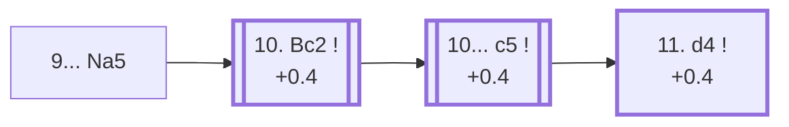

<a name="_TOP_"></a>

# C97 Ruy Lopez: Closed, Chigorin Defense <br> 1. e4 e5 2. Nf3 Nc6 3. Bb5 a6 4. Ba4 Nf6 5. O-O Be7 6. Re1 b5 7. Bb3 d6 8. c3 O-O 9. h3 Na5 #

Spun off from [C90's 9. h3](https://github.com/onclemarcel/chess_flashcards/blob/main/e4_openings/C90_Ruy_Lopez_Closed_Tabiya.md#_h3_): named after 19th-century Russian master Mikhail Chigorin, one of the Ruy Lopez's earliest great practitioners. The knight immediately questions the b3 bishop — White has to decide whether to retreat it or trade it — while Black prepares ... c5, staking a claim on the queenside before White's centre gets moving. Masters' single most popular 9th-move try (34.6%).

### Overview

*Quick map of every move covered on this card — see the [shape key](https://github.com/onclemarcel/chess_flashcards/blob/main/start.md#content-diagram-optional) in start.md.*

<!-- content-diagram:start -->

<!-- content-diagram:end -->

<a name="_initial_move_"></a>

[](https://lichess.org/analysis/standard/r1bq1rk1/2p1bppp/p2p1n2/np2p3/4P3/1BP2N1P/PP1P1PP1/RNBQR1K1_w_-_-_1_10)

*... 9... Na5 — Chigorin Defense*

```
r1bq1rk1/2p1bppp/p2p1n2/np2p3/4P3/1BP2N1P/PP1P1PP1/RNBQR1K1 w - - 1 10
```

|  | +0.4 |
| --- | --- |

<!-- lichess-stats:start fen="r1bq1rk1/2p1bppp/p2p1n2/np2p3/4P3/1BP2N1P/PP1P1PP1/RNBQR1K1 w - - 1 10" db="lichess,masters" speeds="bullet,blitz" ratings="1800,2000,2200,2500" moves="4" -->
| Move | Online | W/D/B | Masters | W/D/B | |
| :--- | ---: | :--- | ---: | :--- | :-- |
| Bc2 | 339 k (98.3%) | ⬜⬜⬜⬜⬜🟫⬛⬛⬛⬛ 50/5/45 | 9.9 k (99.9%) | ⬜⬜⬜🟫🟫🟫🟫🟫⬛⬛ 36/47/17 |  |
| d4 | 5.1 k (1.5%) | ⬜⬜⬜⬜⬜⬛⬛⬛⬛⬛ 47/6/47 | 7 (0.1%) | — |  |
| d3 | 428 (0.1%) | ⬜⬜⬜⬜⬜🟫⬛⬛⬛⬛ 46/8/46 | 0 | — | ⚠ |
| a4 | 141 (0.0%) | ⬜⬜⬜⬜⬜🟫⬛⬛⬛⬛ 50/5/45 | 0 | — | ⚠ |
| Qc2 | 0 | — | 1 (0.0%) | — |  |

*Online: bullet/blitz, 1800+ — 345 k games. Masters: 9.9 k games. [Open in the explorer](https://lichess.org/analysis/standard/r1bq1rk1/2p1bppp/p2p1n2/np2p3/4P3/1BP2N1P/PP1P1PP1/RNBQR1K1_w_-_-_1_10#explorer) — updated 2026-09-02*
<!-- lichess-stats:end -->

### Candidate moves

* [**10. Bc2**](#_Bc2_) (+0.4): the only real square — near-forced (99.9% of masters games). Keeping the bishop on the a2-g8 diagonal (b3) would let ... c5-c4 trap it; c2 tucks it away safely while still eyeing h7 later.

[*Back to TOP*](#_TOP_)

---

<a name="_Bc2_"></a>

## 10. Bc2

[](https://lichess.org/analysis/standard/r1bq1rk1/2p1bppp/p2p1n2/np2p3/4P3/2P2N1P/PPBP1PP1/RNBQR1K1_b_-_-_2_10)

*... 10. Bc2 — sidestepping ... c5-c4*

```
r1bq1rk1/2p1bppp/p2p1n2/np2p3/4P3/2P2N1P/PPBP1PP1/RNBQR1K1 b - - 2 10
```

|  | +0.4 |
| --- | --- |

<!-- lichess-stats:start fen="r1bq1rk1/2p1bppp/p2p1n2/np2p3/4P3/2P2N1P/PPBP1PP1/RNBQR1K1 b - - 2 10" db="lichess,masters" speeds="bullet,blitz" ratings="1800,2000,2200,2500" moves="4" -->
| Move | Online | W/D/B | Masters | W/D/B | |
| :--- | ---: | :--- | ---: | :--- | :-- |
| c5 | 331 k (95.9%) | ⬜⬜⬜⬜⬜🟫⬛⬛⬛⬛ 49/5/45 | 9.6 k (96.8%) | ⬜⬜⬜🟫🟫🟫🟫🟫⬛⬛ 36/48/17 |  |
| Bb7 | 5.0 k (1.5%) | ⬜⬜⬜⬜⬜⬜⬛⬛⬛⬛ 55/4/41 | 18 (0.2%) | — |  |
| d5 | 3.5 k (1.0%) | ⬜⬜⬜⬜🟫⬛⬛⬛⬛⬛ 41/6/53 | 282 (2.9%) | ⬜⬜⬜⬜🟫🟫🟫🟫⬛⬛ 37/39/24 |  |
| Nc4 | 1.6 k (0.5%) | ⬜⬜⬜⬜⬜⬜⬛⬛⬛⬛ 60/3/37 | 0 | — | ⚠ |
| c6 | 0 | — | 8 (0.1%) | — |  |

*Online: bullet/blitz, 1800+ — 346 k games. Masters: 9.9 k games. [Open in the explorer](https://lichess.org/analysis/standard/r1bq1rk1/2p1bppp/p2p1n2/np2p3/4P3/2P2N1P/PPBP1PP1/RNBQR1K1_b_-_-_2_10#explorer) — updated 2026-09-02*
<!-- lichess-stats:end -->

**10... c5** is close to automatic (96.8% of masters games) — the whole point of ... Na5, gaining queenside space and preparing ... Qc7/... Nc6 or ... Bb7 setups.

[*Back to 9... Na5*](#_initial_move_)
[*Back to TOP*](#_TOP_)

---

<a name="_c5_"></a>

## 10... c5 — the Chigorin tabiya

[](https://lichess.org/analysis/standard/r1bq1rk1/4bppp/p2p1n2/npp1p3/4P3/2P2N1P/PPBP1PP1/RNBQR1K1_w_-_c6_0_11)

*... 10... c5 — reaching the main Chigorin Defense tabiya*

```
r1bq1rk1/4bppp/p2p1n2/npp1p3/4P3/2P2N1P/PPBP1PP1/RNBQR1K1 w - c6 0 11
```

|  | +0.4 |
| --- | --- |

From here White typically continues **11. d4**, striking the centre while Black's queenside space and the a5 knight (soon rerouted via ... Nc6 or ... Bc6-e8-g6 style manoeuvres in deeper lines) provide lasting counterplay.

* [**11. d4**](#_d4c_) (+0.4): see below.

[*Back to 10. Bc2*](#_Bc2_)
[*Back to TOP*](#_TOP_)

---

<a name="_d4c_"></a>

## 11. d4

[](https://lichess.org/analysis/standard/r1bq1rk1/4bppp/p2p1n2/npp1p3/3PP3/2P2N1P/PPB2PP1/RNBQR1K1_b_-_d3_0_11)

*... 11. d4*

```
r1bq1rk1/4bppp/p2p1n2/npp1p3/3PP3/2P2N1P/PPB2PP1/RNBQR1K1 b - d3 0 11
```

|  | +0.4 |
| --- | --- |

<!-- lichess-stats:start fen="r1bq1rk1/4bppp/p2p1n2/npp1p3/3PP3/2P2N1P/PPB2PP1/RNBQR1K1 b - d3 0 11" db="lichess,masters" speeds="bullet,blitz" ratings="1800,2000,2200,2500" moves="4" -->
| Move | Online | W/D/B | Masters | W/D/B | |
| :--- | ---: | :--- | ---: | :--- | :-- |
| Qc7 | 169 k (57.9%) | ⬜⬜⬜⬜⬜⬛⬛⬛⬛⬛ 48/6/46 | 6.4 k (67.8%) | ⬜⬜⬜⬜🟫🟫🟫🟫🟫⬛ 36/49/15 |  |
| cxd4 | 58 k (19.9%) | ⬜⬜⬜⬜⬜🟫⬛⬛⬛⬛ 50/5/44 | 473 (5.0%) | ⬜⬜⬜⬜🟫🟫🟫🟫🟫⬛ 43/45/12 |  |
| Nc6 | 25 k (8.5%) | ⬜⬜⬜⬜⬜🟫⬛⬛⬛⬛ 53/5/41 | 0 | — | ⚠ |
| Nd7 | 24 k (8.3%) | ⬜⬜⬜⬜🟫⬛⬛⬛⬛⬛ 45/7/48 | 1.9 k (20.3%) | ⬜⬜⬜🟫🟫🟫🟫🟫⬛⬛ 34/45/21 |  |
| Bb7 | 0 | — | 249 (2.6%) | ⬜⬜⬜🟫🟫🟫🟫⬛⬛⬛ 35/39/26 |  |

*Online: bullet/blitz, 1800+ — 291 k games. Masters: 9.4 k games. [Open in the explorer](https://lichess.org/analysis/standard/r1bq1rk1/4bppp/p2p1n2/npp1p3/3PP3/2P2N1P/PPB2PP1/RNBQR1K1_b_-_d3_0_11#explorer) — updated 2026-09-02*
<!-- lichess-stats:end -->

**11... Qc7** is masters' clear main try (67.8%) — connecting the rooks and eyeing a later ... Rd8 or ... Bd7/... Rfe8 regrouping, while the tension on d4/e5 stays unresolved. Deeper Chigorin theory past this point (the resulting piece-vs-space middlegame) is its own extensive body of work, not covered further here.

[*Back to 10... c5*](#_c5_)
[*Back to TOP*](#_TOP_)
