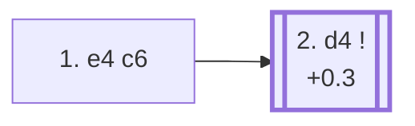

<a name="_TOP_"></a>

# B10 Caro-Kann Defense <br> 1. e4 c6 #

Like the French, Black prepares ... d5 before playing it — but from c6 instead of e6, keeping the light-squared bishop free to develop outside the pawn chain via ... Bf5 or ... Bg4 before the position closes around it. This is generally considered the main structural advantage the Caro-Kann holds over the French. In exchange, the c-pawn no longer supports a future ... c5 break, and Black's position can be slightly slower to develop active piece play.

### Overview

*Quick map of every move covered on this card — see the [shape key](https://github.com/onclemarcel/chess_flashcards/blob/main/start.md#content-diagram-optional) in start.md. None of White's four main tries after 2... d5 have their own card yet, so that fan-out is left off the map — see the candidate-move list below instead.*

<!-- content-diagram:start -->

<!-- content-diagram:end -->

<a name="_initial_move_"></a>

[](https://lichess.org/analysis/standard/rnbqkbnr/pp1ppppp/2p5/8/4P3/8/PPPP1PPP/RNBQKBNR_w_KQkq_-_0_2)

*... 1. e4 c6 — Caro-Kann Defense*

```
rnbqkbnr/pp1ppppp/2p5/8/4P3/8/PPPP1PPP/RNBQKBNR w KQkq - 0 2
```

|  | +0.3 |
| --- | --- |

<!-- lichess-stats:start fen="rnbqkbnr/pp1ppppp/2p5/8/4P3/8/PPPP1PPP/RNBQKBNR w KQkq - 0 2" db="lichess,masters" speeds="bullet,blitz" ratings="1800,2000,2200,2500" moves="8" -->
| Move | Online | W/D/B | Masters | W/D/B | |
| :--- | ---: | :--- | ---: | :--- | :-- |
| d4 | 61.6 M (49.4%) | ⬜⬜⬜⬜⬜⬛⬛⬛⬛⬛ 49/5/46 | 86 k (80.5%) | ⬜⬜⬜🟫🟫🟫🟫🟫⬛⬛ 32/44/24 |  |
| Nf3 | 29.0 M (23.3%) | ⬜⬜⬜⬜⬜⬛⬛⬛⬛⬛ 46/5/49 | 5.3 k (4.9%) | ⬜⬜⬜🟫🟫🟫🟫⬛⬛⬛ 35/39/26 |  |
| Nc3 | 14.0 M (11.3%) | ⬜⬜⬜⬜⬜⬛⬛⬛⬛⬛ 48/5/47 | 7.8 k (7.3%) | ⬜⬜⬜🟫🟫🟫🟫⬛⬛⬛ 32/41/27 |  |
| f4 | 4.4 M (3.6%) | ⬜⬜⬜⬜⬜⬛⬛⬛⬛⬛ 47/4/49 | 116 (0.1%) | ⬜⬜⬜🟫🟫🟫🟫⬛⬛⬛ 31/36/33 |  |
| d3 | 4.2 M (3.4%) | ⬜⬜⬜⬜⬜⬛⬛⬛⬛⬛ 49/5/46 | 2.6 k (2.5%) | ⬜⬜⬜🟫🟫🟫🟫⬛⬛⬛ 33/38/28 |  |
| Bc4 | 3.8 M (3.0%) | ⬜⬜⬜⬜🟫⬛⬛⬛⬛⬛ 43/4/53 | 0 | — | ⚠ |
| c4 | 3.7 M (2.9%) | ⬜⬜⬜⬜⬜🟫⬛⬛⬛⬛ 50/5/45 | 4.3 k (4.0%) | ⬜⬜⬜🟫🟫🟫🟫⬛⬛⬛ 34/41/25 |  |
| e5 | 1.1 M (0.9%) | ⬜⬜⬜⬜⬜⬛⬛⬛⬛⬛ 48/4/48 | 0 | — | ⚠ |
| Ne2 | 0 | — | 427 (0.4%) | ⬜⬜⬜⬜🟫🟫🟫⬛⬛⬛ 40/35/25 |  |
| b3 | 0 | — | 68 (0.1%) | ⬜⬜⬜🟫🟫🟫⬛⬛⬛⬛ 29/28/43 |  |

*Online: bullet/blitz, 1800+ — 124.7 M games. Masters: 106 k games. [Open in the explorer](https://lichess.org/analysis/standard/rnbqkbnr/pp1ppppp/2p5/8/4P3/8/PPPP1PPP/RNBQKBNR_w_KQkq_-_0_2#explorer) — updated 2026-08-23*
<!-- lichess-stats:end -->

### Candidate moves

* [**2. d4**](#_d4_) (+0.3): occupies the centre and is masters' overwhelming preference (80.5%) — Black answers almost automatically with **2... d5**, completing the point of 1... c6.

[*Back to TOP*](#_TOP_)

---

<a name="_d4_"></a>

### 2. d4 d5

[](https://lichess.org/analysis/standard/rnbqkbnr/pp2pppp/2p5/3p4/3PP3/8/PPP2PPP/RNBQKBNR_w_KQkq_d6_0_3)

*... 2. d4 d5 — masters play 2... d5 97.6% of the time*

```
rnbqkbnr/pp2pppp/2p5/3p4/3PP3/8/PPP2PPP/RNBQKBNR w KQkq d6 0 3
```

|  | +0.2 |
| --- | --- |

<!-- lichess-stats:start fen="rnbqkbnr/pp2pppp/2p5/3p4/3PP3/8/PPP2PPP/RNBQKBNR w KQkq d6 0 3" db="lichess,masters" speeds="bullet,blitz" ratings="1800,2000,2200,2500" moves="6" -->
| Move | Online | W/D/B | Masters | W/D/B | |
| :--- | ---: | :--- | ---: | :--- | :-- |
| exd5 | 19.6 M (33.1%) | ⬜⬜⬜⬜⬜⬛⬛⬛⬛⬛ 48/6/47 | 17 k (20.0%) | ⬜⬜⬜🟫🟫🟫🟫⬛⬛⬛ 29/44/26 |  |
| e5 | 18.2 M (30.7%) | ⬜⬜⬜⬜⬜⬛⬛⬛⬛⬛ 49/5/47 | 33 k (39.9%) | ⬜⬜⬜⬜🟫🟫🟫🟫⬛⬛ 35/43/22 |  |
| Nc3 | 13.9 M (23.5%) | ⬜⬜⬜⬜⬜🟫⬛⬛⬛⬛ 50/5/45 | 20 k (23.5%) | ⬜⬜⬜🟫🟫🟫🟫🟫⬛⬛ 29/47/24 |  |
| Nd2 | 3.5 M (6.0%) | ⬜⬜⬜⬜⬜🟫⬛⬛⬛⬛ 50/6/44 | 11 k (13.6%) | ⬜⬜⬜🟫🟫🟫🟫🟫⬛⬛ 32/46/22 |  |
| f3 | 2.6 M (4.4%) | ⬜⬜⬜⬜⬜🟫⬛⬛⬛⬛ 53/4/43 | 2.5 k (3.0%) | ⬜⬜⬜⬜🟫🟫🟫⬛⬛⬛ 37/32/30 |  |
| Bd3 | 614 k (1.0%) | ⬜⬜⬜⬜⬜⬛⬛⬛⬛⬛ 48/5/47 | 27 (0.0%) | ⬜⬜⬜⬜🟫🟫⬛⬛⬛⬛ 41/22/37 |  |

*Online: bullet/blitz, 1800+ — 59.2 M games. Masters: 84 k games. [Open in the explorer](https://lichess.org/analysis/standard/rnbqkbnr/pp2pppp/2p5/3p4/3PP3/8/PPP2PPP/RNBQKBNR_w_KQkq_d6_0_3#explorer) — updated 2026-08-23*
<!-- lichess-stats:end -->

Unlike the French, masters' top choice here is to gain space rather than develop first. Each answer opens into its own body of theory — none of them continue on this page:

* **3. e5** (39.9% masters): the *Advance Variation* — masters' main line, gaining space and inviting Black to develop the light-squared bishop to f5 before playing ... e6.
* **3. Nc3** (23.5% masters): the *Classical* / *Modern* Variation, developing naturally and keeping the tension; often continues 3... dxe4 4. Nxe4.
* **3. exd5** (20.0% masters): the *Exchange Variation* — trades off the tension for a symmetrical structure, similar in spirit to the French Exchange but generally considered to give White somewhat better long-term chances here thanks to the open diagonal for the light-squared bishop.
* **3. Nd2** (13.6% masters): the *Tarrasch Variation*, avoiding ... dxe4 lines that trade off a piece for the knight and keeping options flexible.

[*Back to 1... c6*](#_initial_move_)
[*Back to TOP*](#_TOP_)
