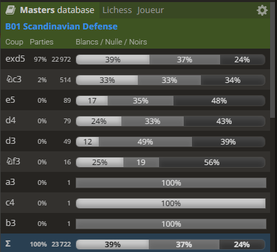
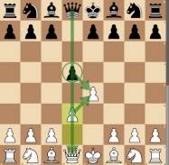
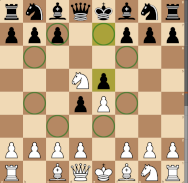
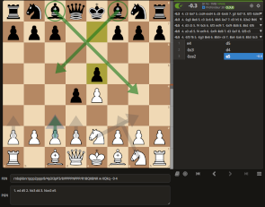

# 1. e4 d5 : The Scandinavian Defense (B01) #

Black move directly brings White to take a decision: take or leave the d5 pawn: 
 
        
 
- [**2. d3**](#_d3_)  (Stockfish -0.1) : no compensation for White following the Queens exchange
- [**2. Nc3**](#_Nc3_) (Stockfish -0.6) : less space for White than Black in the opening
- [**2. Nf3**](#_Nf3_) (Stockfish xx.x) : Tennison Gambit

  

> [!NOTE]
> - If **2. d3**, then **... dxe4 3. dxe4** leaves the d-column open, Black may now exchange the Queens with White King exposed on d1
>
>     
>     ... 2. d3  
>     *Lichess: Very Rare* 
>     *Stockfish -0.1* 
>     [*Back to TOP*](#_TOP_)

> [!NOTE]
> - If **2. Nc3**, then **... d4** gives more space to Black while attacking the knight.
>      - **3. Nd5** is met by **... e5**, which blocks the escape squares of the knight on d5, then c6 picks up the White Knight
>
>         
>         ... 2. Nc3 d4 3. Nd5  
>         *Lichess: Very Rare* 
>         *Stockfish -0.8* 
>         [*Back to TOP*](#_TOP_)
>
>      - **3. Nce2** is also met by **... e5**, giving more space to Black and open the dark squares diagonal while White is stuck
>       
>          
>         ... 2. Nc3 d4 3. Nce2 e5  
>         *Lichess: Very Rare* 
>         *Stockfish -0.6* 
>         [*Back to TOP*](#_TOP_)
>        

> [!NOTE]
> - **2. Nf3** transposes into the "[Tennison Gambit](../traps/gambits/Tennison.md)" (see [openings traps](../traps/opening_traps.md)), with the idea of capturing the Black Queen through seemingly sensible moves
> - *This trap backfires when avoided by Black, with a score of -0.7 estimated by Stockfish*
>
>        
>   
> - Black may: 
>     -  refuse with ... c6 ([Caro-Kann Defense](./e4_c6_Caro_Kann.md) - Stockfish +0.3) or
>     -  refuse with ... e6 ([French Defense](./e4_e6_French.md)    - Stockfish +0.1) or
>     -  accept with ... dxe4 (Stockfish -0.7) : this is the most played move at 52% in masters games
>
>     [*Back to TOP*](#_TOP_)
>

