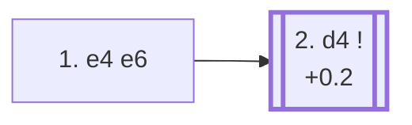

<a name="_TOP_"></a>

# C00 French Defense <br> 1. e4 e6 #

Black prepares ... d5 before playing it, avoiding the immediate central clash of 1... e5 or 1... d5 in favour of a slower build-up. The trade-off is well known: Black's light-squared bishop is often shut in behind its own pawn chain for much of the game, while White gets a free hand to grab extra space. In exchange, Black's structure is very solid and the resulting positions are rich in long-term strategic play — the French has a reputation as a fighting, if slightly passive-looking, defense.

### Overview

*Quick map of every move covered on this card — see the [shape key](https://github.com/onclemarcel/chess_flashcards/blob/main/start.md#content-diagram-optional) in start.md. None of White's four main tries after 2... d5 have their own card yet, so that fan-out is left off the map — see the candidate-move list below instead.*

<!-- content-diagram:start -->

<!-- content-diagram:end -->

<a name="_initial_move_"></a>

[](https://lichess.org/analysis/standard/rnbqkbnr/pppp1ppp/4p3/8/4P3/8/PPPP1PPP/RNBQKBNR_w_KQkq_-_0_2)

*... 1. e4 e6 — French Defense*

```
rnbqkbnr/pppp1ppp/4p3/8/4P3/8/PPPP1PPP/RNBQKBNR w KQkq - 0 2
```

|  | +0.2 |
| --- | --- |

<!-- lichess-stats:start fen="rnbqkbnr/pppp1ppp/4p3/8/4P3/8/PPPP1PPP/RNBQKBNR w KQkq - 0 2" db="lichess,masters" speeds="bullet,blitz" ratings="1800,2000,2200,2500" moves="8" -->
| Move | Online | W/D/B | Masters | W/D/B | |
| :--- | ---: | :--- | ---: | :--- | :-- |
| d4 | 81.1 M (51.0%) | ⬜⬜⬜⬜⬜⬛⬛⬛⬛⬛ 49/5/46 | 137 k (89.5%) | ⬜⬜⬜⬜🟫🟫🟫🟫⬛⬛ 35/42/23 |  |
| Nf3 | 35.9 M (22.6%) | ⬜⬜⬜⬜⬜⬛⬛⬛⬛⬛ 47/5/48 | 2.5 k (1.6%) | ⬜⬜⬜🟫🟫🟫🟫⬛⬛⬛ 32/35/33 |  |
| Nc3 | 14.0 M (8.8%) | ⬜⬜⬜⬜⬜⬛⬛⬛⬛⬛ 49/4/47 | 1.1 k (0.7%) | ⬜⬜⬜🟫🟫🟫🟫⬛⬛⬛ 32/39/29 |  |
| d3 | 6.8 M (4.3%) | ⬜⬜⬜⬜⬜⬛⬛⬛⬛⬛ 50/5/46 | 8.8 k (5.8%) | ⬜⬜⬜⬜🟫🟫🟫⬛⬛⬛ 36/34/30 |  |
| f4 | 6.5 M (4.1%) | ⬜⬜⬜⬜⬜⬛⬛⬛⬛⬛ 47/4/49 | 319 (0.2%) | ⬜⬜⬜⬜🟫🟫🟫🟫⬛⬛ 36/39/26 |  |
| c4 | 3.6 M (2.3%) | ⬜⬜⬜⬜⬜⬛⬛⬛⬛⬛ 51/4/45 | 241 (0.2%) | ⬜⬜⬜⬜🟫🟫🟫⬛⬛⬛ 35/30/35 |  |
| Bc4 | 3.4 M (2.2%) | ⬜⬜⬜⬜🟫⬛⬛⬛⬛⬛ 43/4/52 | 0 | — | ⚠ |
| e5 | 2.2 M (1.4%) | ⬜⬜⬜⬜⬜⬛⬛⬛⬛⬛ 47/4/48 | 0 | — | ⚠ |
| Qe2 | 0 | — | 2.1 k (1.4%) | ⬜⬜⬜⬜🟫🟫🟫⬛⬛⬛ 39/32/29 |  |
| b3 | 0 | — | 721 (0.5%) | ⬜⬜⬜🟫🟫🟫🟫⬛⬛⬛ 34/35/31 |  |

*Online: bullet/blitz, 1800+ — 159.0 M games. Masters: 153 k games. [Open in the explorer](https://lichess.org/analysis/standard/rnbqkbnr/pppp1ppp/4p3/8/4P3/8/PPPP1PPP/RNBQKBNR_w_KQkq_-_0_2#explorer) — updated 2026-08-24*
<!-- lichess-stats:end -->

### Candidate moves

* [**2. d4**](#_d4_) (+0.2): occupies the centre and is masters' overwhelming preference (89.5%) — Black answers almost automatically with **2... d5**, completing the point of 1... e6.

[*Back to TOP*](#_TOP_)

---

<a name="_d4_"></a>

### 2. d4 d5

[](https://lichess.org/analysis/standard/rnbqkbnr/ppp2ppp/4p3/3p4/3PP3/8/PPP2PPP/RNBQKBNR_w_KQkq_d6_0_3)

*... 2. d4 d5 — masters play 2... d5 98.8% of the time*

```
rnbqkbnr/ppp2ppp/4p3/3p4/3PP3/8/PPP2PPP/RNBQKBNR w KQkq d6 0 3
```

|  | +0.4 |
| --- | --- |

<!-- lichess-stats:start fen="rnbqkbnr/ppp2ppp/4p3/3p4/3PP3/8/PPP2PPP/RNBQKBNR w KQkq d6 0 3" db="lichess,masters" speeds="bullet,blitz" ratings="1800,2000,2200,2500" moves="6" -->
| Move | Online | W/D/B | Masters | W/D/B | |
| :--- | ---: | :--- | ---: | :--- | :-- |
| exd5 | 19.7 M (29.3%) | ⬜⬜⬜⬜⬜⬛⬛⬛⬛⬛ 47/6/47 | 8.2 k (5.9%) | ⬜⬜🟫🟫🟫🟫🟫🟫⬛⬛ 20/55/25 |  |
| Nc3 | 18.2 M (26.9%) | ⬜⬜⬜⬜⬜⬛⬛⬛⬛⬛ 50/5/45 | 71 k (50.5%) | ⬜⬜⬜⬜🟫🟫🟫🟫⬛⬛ 36/42/22 |  |
| e5 | 16.7 M (24.7%) | ⬜⬜⬜⬜⬜⬛⬛⬛⬛⬛ 48/4/48 | 16 k (11.4%) | ⬜⬜⬜⬜🟫🟫🟫⬛⬛⬛ 36/35/29 |  |
| Nd2 | 9.8 M (14.5%) | ⬜⬜⬜⬜⬜🟫⬛⬛⬛⬛ 50/5/44 | 44 k (31.3%) | ⬜⬜⬜⬜🟫🟫🟫🟫⬛⬛ 36/42/22 |  |
| Bd3 | 1.7 M (2.5%) | ⬜⬜⬜⬜⬜🟫⬛⬛⬛⬛ 50/5/45 | 1.3 k (0.9%) | ⬜⬜⬜⬜🟫🟫🟫⬛⬛⬛ 37/35/29 |  |
| c4 | 496 k (0.7%) | ⬜⬜⬜⬜⬜⬛⬛⬛⬛⬛ 51/4/45 | 0 | — | ⚠ |
| Be3 | 0 | — | 30 (0.0%) | ⬜⬜⬜🟫🟫🟫🟫⬛⬛⬛ 27/40/33 |  |

*Online: bullet/blitz, 1800+ — 67.4 M games. Masters: 140 k games. [Open in the explorer](https://lichess.org/analysis/standard/rnbqkbnr/ppp2ppp/4p3/3p4/3PP3/8/PPP2PPP/RNBQKBNR_w_KQkq_d6_0_3#explorer) — updated 2026-08-24*
<!-- lichess-stats:end -->

White now decides how to resolve the central tension. Each answer opens into its own body of theory — none of them continue on this page:

* **3. Nc3** (50.5% masters): develops naturally, keeping the tension. Leads to the *Winawer* (after 3... Bb4), *Classical* (3... Nf6), or *Rubinstein* (3... dxe4) Variations.
* **3. Nd2** (31.3% masters): the *Tarrasch Variation*, avoiding the pin that 3... Bb4 would otherwise place on the knight, at the cost of blocking the c1-bishop's most natural diagonal for a while.
* **3. e5** (11.4% masters): the *Advance Variation* — gains space immediately and locks the centre, giving Black a clear target on d4 to attack with ... c5.
* **3. exd5** (5.9% masters, 29.3% online): the *Exchange Variation* — trades off the central tension for a symmetrical pawn structure. Simple and drawish, and correspondingly far more common in casual play than at master level.

[*Back to 1... e6*](#_initial_move_)
[*Back to TOP*](#_TOP_)
