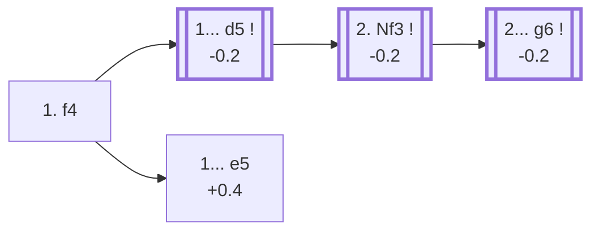

<a name="_TOP_"></a>

# A02 Bird's Opening <br> 1. f4 #

Named after 19th-century English master Henry Bird. Stakes a claim on e5 from the flank and prepares a kingside fianchetto or a quick Nf3, essentially a reversed Dutch Defense with an extra tempo for White. Genuinely playable rather than dubious — Stockfish rates it only 0.2 worse than the main first moves — though the permanently weakened e1-h6 diagonal and the slightly awkward king position give Black real chances to fight for the initiative, which is part of the opening's appeal for White players who enjoy an unbalanced game.

### Overview

*Quick map of every move covered on this card — see the [shape key](https://github.com/onclemarcel/chess_flashcards/blob/main/start.md#content-diagram-optional) in start.md.*

<!-- content-diagram:start -->

<!-- content-diagram:end -->

<a name="_initial_move_"></a>

[](https://lichess.org/analysis/standard/rnbqkbnr/pppppppp/8/8/5P2/8/PPPPP1PP/RNBQKBNR_b_KQkq_f3_0_1)

*... 1. f4 — Bird's Opening*

```
rnbqkbnr/pppppppp/8/8/5P2/8/PPPPP1PP/RNBQKBNR b KQkq f3 0 1
```

|  | -0.2 |
| --- | --- |

<!-- lichess-stats:start fen="rnbqkbnr/pppppppp/8/8/5P2/8/PPPPP1PP/RNBQKBNR b KQkq f3 0 1" db="lichess,masters" speeds="bullet,blitz" ratings="1800,2000,2200,2500" moves="6" -->
| Move | Online | W/D/B | Masters | W/D/B | |
| :--- | ---: | :--- | ---: | :--- | :-- |
| d5 | 9.9 M (32.0%) | ⬜⬜⬜⬜⬜⬛⬛⬛⬛⬛ 50/5/45 | 3.6 k (53.1%) | ⬜⬜⬜🟫🟫🟫🟫⬛⬛⬛ 25/41/33 |  |
| e5 | 3.8 M (12.3%) | ⬜⬜⬜⬜⬜⬛⬛⬛⬛⬛ 48/4/49 | 406 (6.1%) | ⬜⬜⬜⬜🟫🟫🟫⬛⬛⬛ 38/34/27 |  |
| c5 | 3.7 M (11.9%) | ⬜⬜⬜⬜⬜⬛⬛⬛⬛⬛ 50/4/46 | 725 (10.8%) | ⬜⬜⬜🟫🟫🟫⬛⬛⬛⬛ 32/33/35 |  |
| e6 | 3.0 M (9.6%) | ⬜⬜⬜⬜⬜⬛⬛⬛⬛⬛ 52/4/44 | 0 | — | ⚠ |
| Nf6 | 2.3 M (7.5%) | ⬜⬜⬜⬜⬜⬛⬛⬛⬛⬛ 49/4/47 | 999 (14.9%) | ⬜⬜⬜🟫🟫🟫🟫⬛⬛⬛ 28/37/35 |  |
| c6 | 1.9 M (6.1%) | ⬜⬜⬜⬜⬜⬛⬛⬛⬛⬛ 50/4/46 | 0 | — | ⚠ |
| g6 | 0 | — | 654 (9.8%) | ⬜⬜⬜🟫🟫🟫⬛⬛⬛⬛ 27/33/40 |  |
| d6 | 0 | — | 105 (1.6%) | ⬜⬜⬜⬜🟫🟫🟫⬛⬛⬛ 42/26/32 |  |

*Online: bullet/blitz, 1800+ — 31.0 M games. Masters: 6.7 k games. [Open in the explorer](https://lichess.org/analysis/standard/rnbqkbnr/pppppppp/8/8/5P2/8/PPPPP1PP/RNBQKBNR_b_KQkq_f3_0_1#explorer) — updated 2026-08-25*
<!-- lichess-stats:end -->

### Candidate moves

* [**1... d5**](#_d5_) (-0.2): masters' clear main try (53.1%), taking the centre and covered below.
* **1... Nf6** (14.9% masters): develops before committing centrally.
* **1... c5 / 1... g6**: both real minor tries (10.8% and 9.8% masters).
* [**1... e5**](#_e5_) (+0.4): the ***From's Gambit*** — see the TIP below.

[*Back to TOP*](#_TOP_)

---

<a name="_d5_"></a>

## 1... d5

[](https://lichess.org/analysis/standard/rnbqkbnr/ppp1pppp/8/3p4/5P2/8/PPPPP1PP/RNBQKBNR_w_KQkq_d6_0_2)

*... 1... d5*

```
rnbqkbnr/ppp1pppp/8/3p4/5P2/8/PPPPP1PP/RNBQKBNR w KQkq d6 0 2
```

|  | -0.2 |
| --- | --- |

<!-- lichess-stats:start fen="rnbqkbnr/ppp1pppp/8/3p4/5P2/8/PPPPP1PP/RNBQKBNR w KQkq d6 0 2" db="lichess,masters" speeds="bullet,blitz" ratings="1800,2000,2200,2500" moves="6" -->
| Move | Online | W/D/B | Masters | W/D/B | |
| :--- | ---: | :--- | ---: | :--- | :-- |
| Nf3 | 7.3 M (73.6%) | ⬜⬜⬜⬜⬜⬛⬛⬛⬛⬛ 51/5/45 | 3.1 k (87.7%) | ⬜⬜⬜🟫🟫🟫🟫⬛⬛⬛ 26/42/33 |  |
| e3 | 996 k (10.0%) | ⬜⬜⬜⬜⬜⬛⬛⬛⬛⬛ 50/4/46 | 109 (3.1%) | ⬜⬜🟫🟫🟫🟫⬛⬛⬛⬛ 17/45/38 |  |
| d4 | 664 k (6.7%) | ⬜⬜⬜⬜⬜⬛⬛⬛⬛⬛ 49/5/46 | 0 | — | ⚠ |
| d3 | 274 k (2.8%) | ⬜⬜⬜⬜⬜⬛⬛⬛⬛⬛ 49/4/47 | 29 (0.8%) | ⬜⬜⬜⬜🟫🟫🟫⬛⬛⬛ 34/31/34 |  |
| b3 | 176 k (1.8%) | ⬜⬜⬜⬜⬜🟫⬛⬛⬛⬛ 52/4/44 | 183 (5.1%) | ⬜⬜⬜🟫🟫🟫⬛⬛⬛⬛ 28/36/37 |  |
| g3 | 158 k (1.6%) | ⬜⬜⬜⬜⬜⬛⬛⬛⬛⬛ 49/5/46 | 100 (2.8%) | ⬜⬜🟫🟫🟫🟫⬛⬛⬛⬛ 25/39/36 |  |
| c4 | 0 | — | 6 (0.2%) | — |  |

*Online: bullet/blitz, 1800+ — 9.9 M games. Masters: 3.6 k games. [Open in the explorer](https://lichess.org/analysis/standard/rnbqkbnr/ppp1pppp/8/3p4/5P2/8/PPPPP1PP/RNBQKBNR_w_KQkq_d6_0_2#explorer) — updated 2026-08-25*
<!-- lichess-stats:end -->

**2. Nf3** is masters' clear main try (87.7%) — the *Dutch Variation*, developing before committing the kingside structure.

[*Back to 1. f4*](#_initial_move_)
[*Back to TOP*](#_TOP_)

---

<a name="_Nf3_"></a>

### 2. Nf3 — Dutch Variation

[](https://lichess.org/analysis/standard/rnbqkbnr/ppp1pppp/8/3p4/5P2/5N2/PPPPP1PP/RNBQKB1R_b_KQkq_-_1_2)

*... 2. Nf3 — Dutch Variation*

```
rnbqkbnr/ppp1pppp/8/3p4/5P2/5N2/PPPPP1PP/RNBQKB1R b KQkq - 1 2
```

|  | -0.2 |
| --- | --- |

<!-- lichess-stats:start fen="rnbqkbnr/ppp1pppp/8/3p4/5P2/5N2/PPPPP1PP/RNBQKB1R b KQkq - 1 2" db="lichess,masters" speeds="bullet,blitz" ratings="1800,2000,2200,2500" moves="4" -->
| Move | Online | W/D/B | Masters | W/D/B | |
| :--- | ---: | :--- | ---: | :--- | :-- |
| c5 | 1.7 M (23.2%) | ⬜⬜⬜⬜⬜🟫⬛⬛⬛⬛ 51/5/44 | 250 (8.0%) | ⬜⬜⬜🟫🟫🟫⬛⬛⬛⬛ 33/31/36 |  |
| Nf6 | 1.5 M (20.8%) | ⬜⬜⬜⬜⬜⬛⬛⬛⬛⬛ 50/5/45 | 1.0 k (32.7%) | ⬜⬜⬜🟫🟫🟫🟫⬛⬛⬛ 28/44/27 |  |
| Nc6 | 1.3 M (17.3%) | ⬜⬜⬜⬜⬜🟫⬛⬛⬛⬛ 52/4/44 | 0 | — | ⚠ |
| e6 | 757 k (10.4%) | ⬜⬜⬜⬜⬜🟫⬛⬛⬛⬛ 53/4/43 | 0 | — | ⚠ |
| g6 | 0 | — | 1.4 k (46.3%) | ⬜⬜🟫🟫🟫🟫⬛⬛⬛⬛ 22/43/35 |  |
| Bg4 | 0 | — | 246 (7.9%) | ⬜⬜⬜🟫🟫🟫⬛⬛⬛⬛ 25/33/42 |  |

*Online: bullet/blitz, 1800+ — 7.3 M games. Masters: 3.1 k games. [Open in the explorer](https://lichess.org/analysis/standard/rnbqkbnr/ppp1pppp/8/3p4/5P2/5N2/PPPPP1PP/RNBQKB1R_b_KQkq_-_1_2#explorer) — updated 2026-08-25*
<!-- lichess-stats:end -->

* [**2... g6**](#_g6_) (-0.2): masters' narrow main try (46.3%), fianchettoing to match White's own eventual g3 — covered below.
* **2... Nf6** (32.7% masters): a close second, keeping the bishop's diagonal open for now.

[*Back to 2. Nf3*](#_Nf3_)
[*Back to TOP*](#_TOP_)

---

<a name="_g6_"></a>

### 2... g6

[](https://lichess.org/analysis/standard/rnbqkbnr/ppp1pp1p/6p1/3p4/5P2/5N2/PPPPP1PP/RNBQKB1R_w_KQkq_-_0_3)

*... 2... g6 — reaching the main Bird's Opening tabiya*

```
rnbqkbnr/ppp1pp1p/6p1/3p4/5P2/5N2/PPPPP1PP/RNBQKB1R w KQkq - 0 3
```

|  | -0.2 |
| --- | --- |

From here **3. g3** is masters' clear main try (59.2%), completing White's own fianchetto for a reversed Leningrad Dutch structure — both sides castle short and manoeuvre for the thematic e4 (White) or e5 (Black) break. Deeper theory past this point is its own body of work, not covered further here.

[*Back to 2. Nf3*](#_Nf3_)
[*Back to TOP*](#_TOP_)

---

> [!TIP]
> **1... e5!?**, the *From's Gambit*, offers a pawn back immediately to rip open the long light diagonal and the f-file before White's king finds safety — a real, sharp try, not just a swindle attempt.
>
> <a name="_e5_"></a>
>
> ### 1... e5 — From's Gambit
>
> [](https://lichess.org/analysis/standard/rnbqkbnr/pppp1ppp/8/4p3/5P2/8/PPPPP1PP/RNBQKBNR_w_KQkq_e6_0_2)
>
> *... 1... e5 — From's Gambit*
>
> ```
> rnbqkbnr/pppp1ppp/8/4p3/5P2/8/PPPPP1PP/RNBQKBNR w KQkq e6 0 2
> ```
>
> |  | +0.4 |
> | --- | --- |
>
> **2. fxe5** is masters' clear main try (80.3%) — declining with 2. e4 or 2. d3 is playable but concedes the whole point of 1. f4. After **2... d6** (91.7% masters, ripping the long diagonal back open) **3. exd6 Bxd6**, Black has real piece activity and attacking chances for the pawn, but Stockfish still rates the position a little better for White (+0.4) if the extra material is defended accurately — a genuine practical try rather than a sound equalizer.
>
> [*Back to 1. f4*](#_initial_move_)
> [*Back to TOP*](#_TOP_)

---

<a name="_real_game_"></a>

## A real example: Mamedyarov vs So, 2018

Bird's Opening is a real weapon at the very top of the game, not just a club-level surprise. **Shakhriyar Mamedyarov** (White, 2817, world top-5 at the time) played it against **Wesley So** (Black, 2765, world top-10) at the 2018 Tata Steel India Blitz — reaching, move for move, the exact main line built out above: **1. f4 d5 2. Nf3 g6 3. g3**.

```
[Event "Tata Steel India Blitz"]
[Site "Kolkata IND"]
[Date "2018.11.14"]
[White "Mamedyarov, S."]
[Black "So, W."]
[Result "0-1"]
[WhiteElo "2817"]
[BlackElo "2765"]
[ECO "A03"]
[Opening "Bird Opening: Dutch Variation"]

1. f4 d5 2. Nf3 g6 3. g3 Bg7 4. Bg2 Nf6 5. O-O b6 6. c4 c5 7. Ne5 O-O
8. Nc3 Bb7 9. g4 e6 10. e3 Ne4 11. d4 f6 12. Nd3 cxd4 13. exd4 f5 14. Ne5
dxc4 15. Nxe4 Bxe4 16. Bxe4 fxe4 17. Be3 Qd5 18. Rc1 b5 19. b3 Nc6 20. bxc4
bxc4 21. Rxc4 Nxe5 22. Rc5 Nc4 23. Rxd5 Nxe3 24. Qe2 Nxf1 25. Rd7 Rxf4
26. Qc4 Ne3 27. Qxe6+ Kh8 28. h3 Raf8 29. Rxg7 Kxg7 30. Qe5+ Kh6 0-1
```

White's own 9. g4 kingside expansion backfired once the centre opened up — a sharp, fully fought game rather than a quiet draw, ending in a clean win for Black by move 30. For the full interactive board, see the [live game on Lichess](https://lichess.org/kuzHEYNl).

[*Back to TOP*](#_TOP_)
