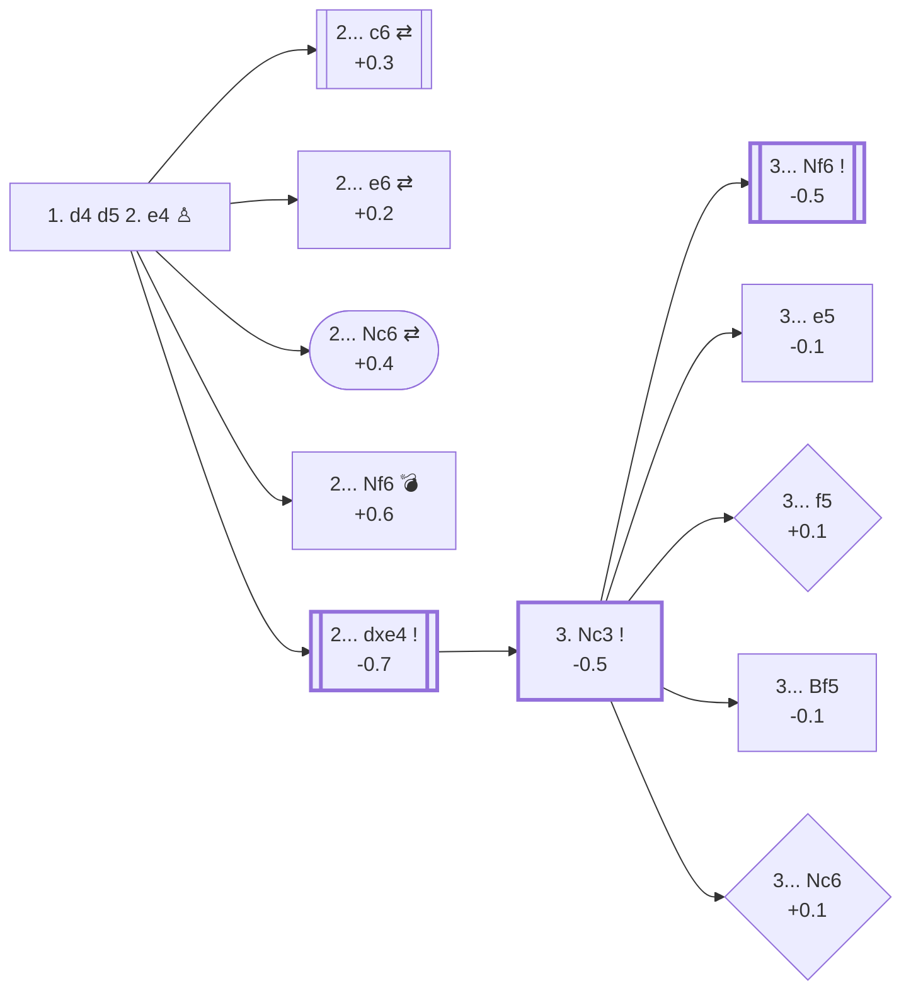

<a name="_TOP_"></a>

# D00 Blackmar-Diemer Gambit <br> 1. d4 d5 2. e4 #

This two-step gambit (Blackmar & Diemer) may be reached from the Queen's Pawn Game (D00), the Scandinavian Defense (B01), or even through an Indian Defense (A45) with **2. Nc3 d5 3. e4**.

### Overview

*Quick map of every move covered on this card — see the [shape key](https://github.com/onclemarcel/chess_flashcards/blob/main/start.md#content-diagram-optional) in start.md. This card runs five levels deep (2nd move → 3. Nc3 → 3rd move → 4. f3 → 5th move); the diagram stops after the fourth, matching B01's own depth, so 4. f3's own branches (Vienna Defense, Brombacher Countergambit, the Halosar Trap...) stay prose-only below. Gambit/trap cards like this one are exempt from the usual 3-move depth limit — see start.md — since the point of the card is exactly that depth; this diagram just stays legible rather than mapping all five levels.*

<!-- content-diagram:start -->

<!-- content-diagram:end -->

<a name="_initial_move_"></a>

[](https://lichess.org/analysis/standard/rnbqkbnr/ppp1pppp/8/3p4/3PP3/8/PPP2PPP/RNBQKBNR_b_KQkq_-_0_2)

*... 1. d4 d5 2. e4 — Blackmar-Diemer Gambit*

```
rnbqkbnr/ppp1pppp/8/3p4/3PP3/8/PPP2PPP/RNBQKBNR b KQkq - 0 2
```

|  | -0.6 |
| --- | --- |

<!-- lichess-stats:start fen="rnbqkbnr/ppp1pppp/8/3p4/3PP3/8/PPP2PPP/RNBQKBNR b KQkq - 0 2" db="lichess,masters" speeds="bullet,blitz" ratings="1800,2000,2200,2500" moves="8" -->
| Move | Online | W/D/B | Masters | W/D/B | |
| :--- | ---: | :--- | ---: | :--- | :-- |
| dxe4 | 6.4 M (70.3%) | ⬜⬜⬜⬜⬜⬛⬛⬛⬛⬛ 51/4/45 | 225 (74.8%) | ⬜⬜🟫🟫🟫🟫⬛⬛⬛⬛ 21/35/44 |  |
| c6 | 763 k (8.4%) | ⬜⬜⬜⬜⬜⬛⬛⬛⬛⬛ 52/4/44 | 29 (9.6%) | ⬜⬜⬜🟫🟫🟫⬛⬛⬛⬛ 28/34/38 |  |
| e6 | 732 k (8.1%) | ⬜⬜⬜⬜⬜🟫⬛⬛⬛⬛ 53/4/43 | 42 (14.0%) | ⬜⬜⬜🟫🟫🟫🟫⬛⬛⬛ 33/38/29 |  |
| Nf6 | 632 k (7.0%) | ⬜⬜⬜⬜⬜⬜⬛⬛⬛⬛ 55/3/42 | 3 (1.0%) | — | ⚠ |
| Nc6 | 186 k (2.1%) | ⬜⬜⬜⬜⬜⬛⬛⬛⬛⬛ 51/4/45 | 2 (0.7%) | — | ⚠ |
| c5 | 142 k (1.6%) | ⬜⬜⬜⬜⬜⬛⬛⬛⬛⬛ 50/4/46 | 0 | — | ⚠ |
| e5 | 87 k (1.0%) | ⬜⬜⬜⬜⬜⬛⬛⬛⬛⬛ 52/4/44 | 0 | — | ⚠ |
| Bg4 | 67 k (0.7%) | ⬜⬜⬜⬜⬛⬛⬛⬛⬛⬛ 42/3/55 | 0 | — | ⚠ |

*Online: bullet/blitz, 1800+ — 9.1 M games. Masters: 301 games. [Open in the explorer](https://lichess.org/analysis/standard/rnbqkbnr/ppp1pppp/8/3p4/3PP3/8/PPP2PPP/RNBQKBNR_b_KQkq_-_0_2#explorer) — updated 2026-08-23*
<!-- lichess-stats:end -->

> [!NOTE]
> ### Summary
> - White's main idea is to gain the initiative by quickly opening the e-column and, later on, the f-column, through a pawn sacrifice and a pawn exchange.
> - Black's objective is to break White's initiative and strive for exchanging pieces to reach a better endgame.
> - Black may avoid the gambit by playing the [Caro-Kann Defense](https://github.com/onclemarcel/chess_flashcards/blob/main/e4_openings/e4_c6_Caro_Kann.md) (+0.3) or the [French Defense](https://github.com/onclemarcel/chess_flashcards/blob/main/e4_openings/e4_e6_French.md) (+0.2).
> - A prepared Black player may also use several side lines to the main one ([Lemberger Countergambit](#_3_Nc3_e5_) (-0.1), [Vienna Defense](#_4_f3_Bf5_) (-0.4), or even the O'Kelly Variation (-0.2) of the [Caro-Kann](https://github.com/onclemarcel/chess_flashcards/blob/main/e4_openings/e4_c6_Caro_Kann.md)).
> - The [accepted Blackmar-Diemer](#_4_f3_exf3_) (-0.5) is full of tactical traps from White, with two main lines: the risky [5. Qxf3](#_accepted_Qxf3_) (-1.4) and the main [5. Nxf3](#_accepted_Nxf3_) (-0.5).

> [!TIP]
> The main variation of the Blackmar-Diemer gambit may also be obtained from the [Caro-Kann Defense](https://github.com/onclemarcel/chess_flashcards/blob/main/e4_openings/e4_c6_Caro_Kann.md), with **1. e4 c6 2. d4 d5 3. Nc3 dxe4 4. f3 exf3 5. Nxf3 Nf6** — with a beautiful mate case study from a "false pin" on Nf3: **6. Bc4 Bg4? 7. Ne5! Bxd1?? 8. Bxf7#**.

### Candidate moves

This opening is not correct with respect to opening principles, but leads to a ***dynamic game with many tactical ideas*** for both players. When correctly prepared, Black is able to avoid many of its traps and obtain a good position for the middle and endgame (-0.5). That said, due to the amount of preparation required from Black, a good White player may still surprise their opponent in blitz/bullet games.

* refuse with **2... c6**, transposing into the [Caro-Kann Defense](https://github.com/onclemarcel/chess_flashcards/blob/main/e4_openings/e4_c6_Caro_Kann.md) (+0.3), or
* refuse with **2... e6**, transposing into the [French Defense](https://github.com/onclemarcel/chess_flashcards/blob/main/e4_openings/e4_e6_French.md) (+0.2), or
* refuse with **2... Nc6**, transposing into the [Nimzowitsch Defense](https://github.com/onclemarcel/chess_flashcards/blob/main/e4_openings/e4_Nc6_Nimzovitch.md) (+0.4), or
* refuse with [**2... Nf6**](#_Nf6_) (+0.6): which allows White to grab more space with **3. e5**, or
* **accept** with [**2... dxe4**](#_accepted_) (-0.7): this is the most played move, at ***74%*** of masters games

[*Back to TOP*](#_TOP_)

---

> [!TIP]
> When Black refuses the gambit with **2... Nf6**, White takes space with **3. e5** while attacking the knight. Two typical traps lurk here if Black replies naturally.
>
> <a name="_Nf6_"></a>
>
> ### 1. d4 d5 2. e4 Nf6? — refused with Nf6
>
> **Case 1**: Black blocks its own knight with **3... Ne4??**. It has no available square to escape, so **4. f3** simply wins it.
>
> [](https://lichess.org/analysis/standard/rnbqkb1r/ppp1pppp/8/3pP3/3Pn3/5P2/PPP3PP/RNBQKBNR_b_KQkq_-_0_4)
>
> *... 2... Nf6 3. e5 Ne4?? 4. f3 — the knight has no escape square*
>
> ```
> rnbqkb1r/ppp1pppp/8/3pP3/3Pn3/5P2/PPP3PP/RNBQKBNR b KQkq - 0 4
> ```
>
> |  | +3.0 |
> | --- | --- |
>
> **Case 2**: Black retreats with **3... Nfd7**, close to the king. Chasing the knight with **4. e6 fxe6** opens the h5-e8 diagonal, and **5. Bd3** sets the trap. Black must avoid it with **... g6**, **... Nf6**, or even **... Kf7**; a passive move like **5... Nc6??** triggers a forced mate:
>
> [](https://lichess.org/analysis/standard/r1bqkb1r/pppnp1pp/2n1p3/3p4/3P4/3B4/PPP2PPP/RNBQK1NR_w_KQkq_-_2_6)
>
> *... 5... Nc6?? — Mate in 3: 6. Qh5+ g6 7. Qxg6+ hxg6 8. Bxg6#*
>
> ```
> r1bqkb1r/pppnp1pp/2n1p3/3p4/3P4/3B4/PPP2PPP/RNBQK1NR w KQkq - 2 6
> ```
>
> |  | #3 |
> | --- | --- |
>
> [*Back to TOP*](#_TOP_)

---

<a name="_accepted_"></a>

## 1. d4 d5 2. e4 dxe4 — accepting the Blackmar-Diemer

As soon as the gambit is accepted, White should play **3. Nc3** (Diemer) instead of the direct **3. f3** (Blackmar), which is easily met with **3... e5**, opening the critical h4-d8 diagonal for the Black queen.

<a name="_3_Nc3_"></a>

[](https://lichess.org/analysis/standard/rnbqkbnr/ppp1pppp/8/8/3Pp3/2N5/PPP2PPP/R1BQKBNR_b_KQkq_-_1_3)

*... 3. Nc3*

```
rnbqkbnr/ppp1pppp/8/8/3Pp3/2N5/PPP2PPP/R1BQKBNR b KQkq - 1 3
```

|  | -0.5 |
| --- | --- |

<!-- lichess-stats:start fen="rnbqkbnr/ppp1pppp/8/8/3Pp3/2N5/PPP2PPP/R1BQKBNR b KQkq - 1 3" db="lichess,masters" speeds="bullet,blitz" ratings="1800,2000,2200,2500" moves="8" -->
| Move | Online | W/D/B | Masters | W/D/B | |
| :--- | ---: | :--- | ---: | :--- | :-- |
| Nf6 | 2.7 M (64.9%) | ⬜⬜⬜⬜⬜⬛⬛⬛⬛⬛ 52/4/44 | 172 (78.5%) | ⬜⬜🟫🟫🟫🟫⬛⬛⬛⬛ 19/35/45 |  |
| f5 | 385 k (9.1%) | ⬜⬜⬜⬜⬜⬜⬛⬛⬛⬛ 56/3/41 | 2 (0.9%) | — | ⚠ |
| Bf5 | 302 k (7.2%) | ⬜⬜⬜⬜⬜⬛⬛⬛⬛⬛ 53/4/44 | 10 (4.6%) | — |  |
| e5 | 300 k (7.1%) | ⬜⬜⬜⬜⬜⬛⬛⬛⬛⬛ 46/5/49 | 29 (13.2%) | ⬜⬜⬜🟫🟫🟫⬛⬛⬛⬛ 28/34/38 |  |
| Nc6 | 138 k (3.3%) | ⬜⬜⬜⬜⬜⬛⬛⬛⬛⬛ 50/4/46 | 0 | — | ⚠ |
| e6 | 134 k (3.2%) | ⬜⬜⬜⬜⬜⬜⬛⬛⬛⬛ 57/4/40 | 1 (0.5%) | — | ⚠ |
| c5 | 92 k (2.2%) | ⬜⬜⬜⬜⬜⬛⬛⬛⬛⬛ 49/5/47 | 0 | — | ⚠ |
| e3 | 47 k (1.1%) | ⬜⬜⬜⬜⬜⬜⬛⬛⬛⬛ 54/4/42 | 0 | — | ⚠ |
| c6 | 0 | — | 3 (1.4%) | — |  |
| g6 | 0 | — | 2 (0.9%) | — |  |

*Online: bullet/blitz, 1800+ — 4.2 M games. Masters: 219 games. [Open in the explorer](https://lichess.org/analysis/standard/rnbqkbnr/ppp1pppp/8/8/3Pp3/2N5/PPP2PPP/R1BQKBNR_b_KQkq_-_1_3#explorer) — updated 2026-08-23*
<!-- lichess-stats:end -->

Black should develop the knight while defending the e4 pawn. That said, several other options are worth mentioning since White may be less prepared for those:

* [**3... Nf6**](#_3_Nc3_Nf6_) (-0.5): main move, most played and best rated in this position
* [**3... e5**](#_3_Nc3_e5_) (-0.1): the [Lemberger Countergambit](#_3_Nc3_e5_) — a side move that may disrupt White's initiative in this opening (played only 13% of the time)
* [**3... f5**](#_3_Nc3_f5_) (+0.1): the [Netherlands Variation](#_3_Nc3_f5_) — another interesting side move, but more dangerous for Black, since it weakens the f7 square and exposes the king
* [**3... Bf5**](#_3_Nc3_Bf5_) (-0.1): the [Zeller Defense](#_3_Nc3_Bf5_) — this allows White to attack the bishop with g4 while keeping the initiative

Black may also choose unexpected answers such as **3... c5** or [**3... Nc6**](#_3_Nc3_Nc6_) (+0.1), where in both cases White should play **4. d5**.

[*Back to TOP*](#_TOP_)

---

> [!NOTE]
> When Black answers with **3... Nc6?**, **4. d5** chases the knight.
>
> <a name="_3_Nc3_Nc6_"></a>
>
> ### 3... Nc6? — a knight chased across the board
>
> **... Ne5** is chased again with **5. Qd4**. Black moves the knight once more, e.g. **... Ng6**, then **6. Bb5+** sets a trap:
>
> [](https://lichess.org/analysis/standard/r1bqkbnr/ppp1pppp/6n1/1B1P4/3Qp3/2N5/PPP2PPP/R1B1K1NR_b_KQkq_-_4_6)
>
> *... 6. Bb5+*
>
> ```
> r1bqkbnr/ppp1pppp/6n1/1B1P4/3Qp3/2N5/PPP2PPP/R1B1K1NR b KQkq - 4 6
> ```
>
> |  | +0.1 |
> | --- | --- |
>
> If Black blocks with the pawn, White can safely take with **7. dxc6** (+2.3), since the White queen — if taken — can "respawn" on a8 thanks to a discovered check via Bb5 after **8. cxb7+** and **9. bxa8=Q** (a very nice combination). Black's best move is **6... Bd7** instead of **... c6**, aiming for a better endgame by exchanging pieces to break White's initiative. Conversely, White should avoid exchanges and continue developing with **7. Be3** or **7. Nge2**.
>
> [*Back to 3. Nc3*](#_3_Nc3_)
> [*Back to TOP*](#_TOP_)

---

> [!NOTE]
> **3... f5!?** is a side move usually not anticipated by White in this gambit, but it weakens the king and lets White aim at the h5-e8 diagonal.
>
> <a name="_3_Nc3_f5_"></a>
>
> ### 3... f5!? — Netherlands Variation
>
> White, according to Stockfish, should play **4. Bg5**; however a typical move in the Blackmar-Diemer spirit is **4. f3**, to open the f-column:
> - if Black takes with **... exf3**, White is much better with **5. Nxf3** (+0.8)
> - but Black should attack the centre to break White's initiative with **4... e5!** (-0.1); if White takes **5. fxe4**, Black breaks with **... exd4**, chasing the knight, followed by **... Nc6** to protect d4
>
> [](https://lichess.org/analysis/standard/rnbqkbnr/ppp3pp/8/4pp2/3Pp3/2N2P2/PPP3PP/R1BQKBNR_w_KQkq_-_0_5)
>
> *... 4... e5!*
>
> ```
> rnbqkbnr/ppp3pp/8/4pp2/3Pp3/2N2P2/PPP3PP/R1BQKBNR w KQkq - 0 5
> ```
>
> |  | -0.1 |
> | --- | --- |
>
> The best move for White here is to exchange queens with **5. dxe5**, in order to block the attack on the centre.
>
> [*Back to 3. Nc3*](#_3_Nc3_)
> [*Back to TOP*](#_TOP_)

---

> [!NOTE]
> **3... Bf5!?** is a side move to the gambit. White may directly aim at chasing the bishop with **4. g4** — Stockfish's best move.
>
> <a name="_3_Nc3_Bf5_"></a>
>
> ### 3... Bf5!? — Zeller Defense
>
> There is a good chance White instead continues in the **4. f3** spirit *(73% of masters games)*. Black should not take here, and should protect e4 with **... Nf6** instead — attacking the centre with **... e5** leads to the drawback of exchanging the White bishop for the knight. The idea is to aim for exchanges with an advantage in the endgame.
>
> [](https://lichess.org/analysis/standard/rn1qkbnr/ppp1pppp/8/5b2/3Pp1P1/2N5/PPP2P1P/R1BQKBNR_b_KQkq_-_0_4)
>
> *... 4. g4*
>
> ```
> rn1qkbnr/ppp1pppp/8/5b2/3Pp1P1/2N5/PPP2P1P/R1BQKBNR b KQkq - 0 4
> ```
>
> |  | -0.1 |
> | --- | --- |
>
> White's moves should aim at developing the knight, chasing the bishop, and pushing the kingside pawns.
>
> [*Back to 3. Nc3*](#_3_Nc3_)
> [*Back to TOP*](#_TOP_)

---

> [!NOTE]
> **3... e5** is a side move chosen 13% of the time by Black in masters games, disrupting White's plans.
>
> <a name="_3_Nc3_e5_"></a>
>
> ### 3... e5 — Lemberger Countergambit
>
> White's reactions in masters games depart from Stockfish's preferred move here (**4. Nge2**), which protects d4 before launching **5. Nxe4** if possible: if Black prevents it with **... Nf6**, then **5. Bg5 exd4 6. Qxd4 Qxd4 7. Nxd4 Bb4 8. Nb5** aims at c7; after **... Na6 9. O-O-O**, there's a mate threat on **10. Rd8#** if Black doesn't see it.
>
> [](https://lichess.org/analysis/standard/r1b1k2r/ppp2ppp/n4n2/1N4B1/1b2p3/2N5/PPP2PPP/2KR1B1R_b_kq_-_4_9)
>
> *... 4. Nge2 Nf6 5. Bg5 exd4 6. Qxd4 Qxd4 7. Nxd4 Bb4 8. Nb5 Na6 9. O-O-O*
>
> ```
> r1b1k2r/ppp2ppp/n4n2/1N4B1/1b2p3/2N5/PPP2PPP/2KR1B1R b kq - 4 9
> ```
>
> |  | +0.4 |
> | --- | --- |
>
> The most played move in masters games is **4. Qh5**, which directly aims at f7, followed by **5. Bc4** for a mate threat on f7 — a quite dangerous variation for Black, although the correct move order lets Black reach a better game:
> - **4. Qh5 exd4 5. Qe5+ Ne7 6. Bb5+ Nc6 7. Nxe4 Be6 8. Nc5 Qd5 9. Nf3 O-O-O** — White should exchange queens here, or the knight is taken by **... Qxc5**.
> - **4. Qh5 exd4 5. Bc4 Qe7 6. Bg5 Nf6 7. Bxf6 Qxf6 8. Nxe4 Qe7 9. O-O-O Qxe4** — White is a piece down, and Black can escape the mate and develop with **... Nc6**.
>
> [](https://lichess.org/analysis/standard/rnbqkbnr/ppp2ppp/8/7Q/2Bpp3/2N5/PPP2PPP/R1B1K1NR_b_KQkq_-_1_5)
>
> *... 4. Qh5 exd4 5. Bc4*
>
> ```
> rnbqkbnr/ppp2ppp/8/7Q/2Bpp3/2N5/PPP2PPP/R1B1K1NR b KQkq - 1 5
> ```
>
> |  | -0.6 |
> | --- | --- |
>
> Another played move in masters games is **4. Nxe4**, allowing Black to take on d4: **4. Nxe4 Qxd4 5. Bd3 Nc6 6. Nf3 Qd5 7. O-O Nf6**, with Black continuing to provoke White's pieces. A move seen in blitz/bullet club games is **4. Qe2**, also allowing Black to take on d4, letting White chase the black queen for an active, tactical position — although Stockfish still rates it better for Black: **4. Qe2 Qxd4 5. Be3 Qd6 6. Nb5 Qc6 7. O-O-O**, and Black keeps provoking White's pieces.
>
> [](https://lichess.org/analysis/standard/rnb1kbnr/ppp2ppp/2q5/1N2p3/4p3/4B3/PPP1QPPP/2KR1BNR_b_kq_-_5_7)
>
> *... 4. Qe2 Qxd4 5. Be3 Qd6 6. Nb5 Qc6 7. O-O-O*
>
> ```
> rnb1kbnr/ppp2ppp/2q5/1N2p3/4p3/4B3/PPP1QPPP/2KR1BNR b kq - 5 7
> ```
>
> |  | -1.3 |
> | --- | --- |
>
> [*Back to 3. Nc3*](#_3_Nc3_)
> [*Back to TOP*](#_TOP_)

---

<a name="_3_Nc3_Nf6_"></a>

### 1. d4 d5 2. e4 dxe4 3. Nc3 Nf6 4. f3 — the Diemer Gambit

This is the variation of Emil Josef Diemer, an improvement on the initial version by Armand Blackmar, where **3. f3** was played directly. The complete gambit is played in 92% of masters games after **3... Nf6**, and is the subject of this flash card.

<a name="_4_f3_"></a>

[](https://lichess.org/analysis/standard/rnbqkb1r/ppp1pppp/5n2/8/3Pp3/2N2P2/PPP3PP/R1BQKBNR_b_KQkq_-_0_4)

*... 4. f3*

```
rnbqkb1r/ppp1pppp/5n2/8/3Pp3/2N2P2/PPP3PP/R1BQKBNR b KQkq - 0 4
```

|  | -0.6 |
| --- | --- |

<!-- lichess-stats:start fen="rnbqkb1r/ppp1pppp/5n2/8/3Pp3/2N2P2/PPP3PP/R1BQKBNR b KQkq - 0 4" db="lichess,masters" speeds="bullet,blitz" ratings="1800,2000,2200,2500" moves="8" -->
| Move | Online | W/D/B | Masters | W/D/B | |
| :--- | ---: | :--- | ---: | :--- | :-- |
| exf3 | 2.0 M (72.7%) | ⬜⬜⬜⬜⬜🟫⬛⬛⬛⬛ 53/4/43 | 240 (78.7%) | ⬜⬜🟫🟫🟫🟫⬛⬛⬛⬛ 20/38/42 |  |
| Bf5 | 253 k (9.3%) | ⬜⬜⬜⬜⬜⬛⬛⬛⬛⬛ 49/4/47 | 22 (7.2%) | ⬜⬜⬜⬜🟫🟫🟫🟫⬛⬛ 36/41/23 |  |
| e3 | 129 k (4.7%) | ⬜⬜⬜⬜⬜⬛⬛⬛⬛⬛ 48/5/47 | 21 (6.9%) | ⬜⬜⬜🟫🟫🟫🟫⬛⬛⬛ 24/43/33 |  |
| e6 | 89 k (3.3%) | ⬜⬜⬜⬜⬜⬜⬛⬛⬛⬛ 59/3/38 | 2 (0.7%) | — | ⚠ |
| e5 | 84 k (3.1%) | ⬜⬜⬜⬜⬜⬛⬛⬛⬛⬛ 50/5/46 | 3 (1.0%) | — | ⚠ |
| c5 | 75 k (2.8%) | ⬜⬜⬜⬜⬜⬛⬛⬛⬛⬛ 47/5/48 | 3 (1.0%) | — | ⚠ |
| Nc6 | 57 k (2.1%) | ⬜⬜⬜⬜⬜⬛⬛⬛⬛⬛ 51/4/45 | 0 | — | ⚠ |
| c6 | 19 k (0.7%) | ⬜⬜⬜⬜⬜⬛⬛⬛⬛⬛ 49/4/46 | 11 (3.6%) | — |  |
| Nbd7 | 0 | — | 2 (0.7%) | — |  |

*Online: bullet/blitz, 1800+ — 2.7 M games. Masters: 305 games. [Open in the explorer](https://lichess.org/analysis/standard/rnbqkb1r/ppp1pppp/5n2/8/3Pp3/2N2P2/PPP3PP/R1BQKBNR_b_KQkq_-_0_4#explorer) — updated 2026-08-23*
<!-- lichess-stats:end -->

The pawn-taking move represents 78% of masters games, but Black still has counterplay in refusing the f3 pawn:

* **accept with** [**4... exf3**](#_4_f3_exf3_) (-0.7): main move, most played and best rated in this position
* refuse with [**4... Bf5**](#_4_f3_Bf5_) (-0.4): the [Vienna Defense](#_4_f3_Bf5_) — a sound side move avoiding the well-known main line, rarely played (8%) and worth working on
* refuse with [**4... c5**](#_4_f3_c5_) (-0.4): the [Brombacher Countergambit](#_4_f3_c5_) — another side move that needs good preparation for Black, included here for a nice trap set by White
* refuse with **4... c6** (-0.2): the **O'Kelly Defense** — identical to an Exchange [Caro-Kann](https://github.com/onclemarcel/chess_flashcards/blob/main/e4_openings/e4_c6_Caro_Kann.md) where White attempts to transpose into the Blackmar-Diemer gambit against a Black player who refused with Nf6. Black aims at attacking the centre with **... e5**
* refuse with **4... e3** (+0.4): the **Langeheinicke Defense** — also a side move, but it lets White recover a good position similar to a [Caro-Kann](https://github.com/onclemarcel/chess_flashcards/blob/main/e4_openings/e4_c6_Caro_Kann.md) variation

[*Back to 3. Nc3*](#_3_Nc3_)
[*Back to TOP*](#_TOP_)

---

> [!NOTE]
> The Vienna Defense is a rare move, but clearly a sound one, taking White out of well-trodden gambit knowledge.
>
> <a name="_4_f3_Bf5_"></a>
>
> ### 4... Bf5 — Vienna Defense
>
> Usually White takes the pawn with **5. fxe4**, recaptured with **... Nxe4**. If White plays **6. Qf3** to threaten the knight, **... Nxc3** exchanges pieces and Black has counterplay even if White finally takes **Qxb7**.
>
> [](https://lichess.org/analysis/standard/rn1qkb1r/ppp1pppp/8/5b2/3Pn3/2N5/PPP3PP/R1BQKBNR_w_KQkq_-_0_6)
>
> *... the 5. fxe4 line*
>
> ```
> rn1qkb1r/ppp1pppp/8/5b2/3Pn3/2N5/PPP3PP/R1BQKBNR w KQkq - 0 6
> ```
>
> |  | -0.5 |
> | --- | --- |
>
> In other games White pushes **5. g4** to chase the bishop, then **6. g5** moves the black knight to d5 and White takes it back with **7. Nxe4**. After **... e6**, Black is developing and maintains a slight advantage.
>
> [](https://lichess.org/analysis/standard/rn1qkb1r/ppp1pppp/5n2/5b2/3Pp1P1/2N2P2/PPP4P/R1BQKBNR_b_KQkq_-_0_5)
>
> *... the 5. g4 line*
>
> ```
> rn1qkb1r/ppp1pppp/5n2/5b2/3Pp1P1/2N2P2/PPP4P/R1BQKBNR b KQkq - 0 5
> ```
>
> |  | -0.5 |
> | --- | --- |
>
> [*Back to 4. f3*](#_4_f3_)
> [*Back to TOP*](#_TOP_)

---

> [!NOTE]
> **4... c5** sets White off the main line. The correct answer is to move forward, increasing space with **5. d5**.
>
> <a name="_4_f3_c5_"></a>
>
> ### 4... c5 — Brombacher Countergambit
>
> Note that **5. Bf4** eyes the c7 square, and while Black is threatening the d4 pawn, White will most likely 'naturally' move the knight to **6. Nb5**. Black could defend with **... Na6** (-0.9), or with **... Nd5** (-0.4).
>
> [](https://lichess.org/analysis/standard/rnbqkb1r/pp2pppp/8/1N1n4/3ppB2/5P2/PPP3PP/R2QKBNR_w_KQkq_-_2_7)
>
> *... 5. Bf4 cxd4 6. Nb5 Nd5*
>
> ```
> rnbqkb1r/pp2pppp/8/1N1n4/3ppB2/5P2/PPP3PP/R2QKBNR w KQkq - 2 7
> ```
>
> |  | -0.3 |
> | --- | --- |
>
> Here there is a tactical shot with **7. Bxb8**, attracting the black knight to **... Ne3** (+3.1). **8. Nc7+** forces the loss of the black queen with **... Qxc7**, or else **8... Kd7** is mate in 2! Black may avoid **... Ne3** with **7... d3!!**, preventing Bf1 from protecting Nb5; then **Qa5+** picks up the undefended knight.
>
> [*Back to 4. f3*](#_4_f3_)
> [*Back to TOP*](#_TOP_)

---

<a name="_4_f3_exf3_"></a>

### 1. d4 d5 2. e4 dxe4 3. Nc3 Nf6 4. f3 exf3 — gambit accepted

This is the main line of the Blackmar-Diemer gambit. White has two main tries here:

* the risky [**5. Qxf3**](#_accepted_Qxf3_) (-1.4): leads to lots of traps for Black, but is likely to lose in a tournament game against a prepared opponent
* the safer [**5. Nxf3**](#_accepted_Nxf3_) (-0.5): *98% of masters games* — also leads to several traps and more complex situations against a prepared player

[*Back to TOP*](#_TOP_)

---

> [!NOTE]
> Although not really a serious line, **5. Qxf3** is a tactical try for White with many case studies worth knowing.
>
> <a name="_accepted_Qxf3_"></a>
>
> ### 5. Qxf3 — the risky recapture
>
> **5. Qxf3** lets Black grab another free pawn with **... Qxd4** (hence the Stockfish score of -1.4). **6. Be3** chases the black queen while developing the dark-squared bishop, allowing White's queenside castle. Whether the black queen goes to **... Qe5**, **... Qb4**, **... Qg4** or **... Qh4+**, there is a trap set for Black on the b7/c7 square. Examples:
> - **... Qe5 7. O-O-O Bg4** (attacking both queen and rook) **8. Qxb7 Qxe3+ 9. Kb1 Bxd1?? 10. Qc7#**
> - **... Qg4 7. Qf2 Qb4 8. O-O-O Nc6 9. Nb5 Qa5** — a nice trap with the knight eyeing c7 on the open d-column; here **10. Qe1** deflects the black queen.
> - **... Qb4 7. O-O-O Bg4 8. Nb5!** — this is the **Halosar Trap**, with a knight eyeing c7 on the open d-column:
>   - **8... Bxf3 9. Nxc7#**
>   - **8... Na6 9. Qxb7 Rb8 10. Qxb8+ Nxb8 11. Nxc7#**
>   - **8... Nfd7 9. Qxb7**
>   - **8... e5 9. Nxc7+ Ke7 10. Qxb7 Qxb7 11. Bc5#**
>
> [](https://lichess.org/analysis/standard/rn2kb1r/ppp1pppp/5n2/1N6/1q4b1/4BQ2/PPP3PP/2KR1BNR_b_kq_-_5_8)
>
> *... 5... Qxd4 6. Be3 Qb4 7. O-O-O Bg4 8. Nb5! — the Halosar Trap*
>
> ```
> rn2kb1r/ppp1pppp/5n2/1N6/1q4b1/4BQ2/PPP3PP/2KR1BNR b kq - 5 8
> ```
>
> |  | +3.3 |
> | --- | --- |
>
> [*Back to 4... exf3*](#_4_f3_exf3_)
> [*Back to TOP*](#_TOP_)

---

<a name="_accepted_Nxf3_"></a>

### 5. Nxf3 — gambit accepted, main line

The main line of the accepted gambit has been well studied and leads to many choices from Black.

[](https://lichess.org/analysis/standard/rnbqkb1r/ppp1pppp/5n2/8/3P4/2N2N2/PPP3PP/R1BQKB1R_b_KQkq_-_0_5)

*... 5. Nxf3*

```
rnbqkb1r/ppp1pppp/5n2/8/3P4/2N2N2/PPP3PP/R1BQKB1R b KQkq - 0 5
```

|  | -0.7 |
| --- | --- |

<!-- lichess-stats:start fen="rnbqkb1r/ppp1pppp/5n2/8/3P4/2N2N2/PPP3PP/R1BQKB1R b KQkq - 0 5" db="lichess,masters" speeds="bullet,blitz" ratings="1800,2000,2200,2500" moves="8" -->
| Move | Online | W/D/B | Masters | W/D/B | |
| :--- | ---: | :--- | ---: | :--- | :-- |
| Bg4 | 593 k (38.3%) | ⬜⬜⬜⬜⬜🟫⬛⬛⬛⬛ 54/4/42 | 68 (28.7%) | ⬜⬜🟫🟫🟫🟫⬛⬛⬛⬛ 25/38/37 |  |
| e6 | 429 k (27.7%) | ⬜⬜⬜⬜⬜⬜⬛⬛⬛⬛ 59/3/38 | 40 (16.9%) | ⬜⬜⬜⬜🟫🟫🟫⬛⬛⬛ 35/30/35 |  |
| g6 | 128 k (8.3%) | ⬜⬜⬜⬜⬜⬛⬛⬛⬛⬛ 48/4/48 | 81 (34.2%) | ⬜🟫🟫🟫🟫⬛⬛⬛⬛⬛ 9/37/54 |  |
| c6 | 121 k (7.8%) | ⬜⬜⬜⬜⬜🟫⬛⬛⬛⬛ 52/4/44 | 24 (10.1%) | ⬜🟫🟫🟫🟫🟫🟫⬛⬛⬛ 12/58/29 |  |
| Nc6 | 105 k (6.8%) | ⬜⬜⬜⬜⬜⬜⬛⬛⬛⬛ 54/4/42 | 0 | — | ⚠ |
| Bf5 | 80 k (5.2%) | ⬜⬜⬜⬜⬜⬛⬛⬛⬛⬛ 46/4/50 | 23 (9.7%) | ⬜⬜⬜🟫🟫🟫⬛⬛⬛⬛ 26/35/39 |  |
| c5 | 42 k (2.7%) | ⬜⬜⬜⬜⬜⬛⬛⬛⬛⬛ 50/5/45 | 0 | — | ⚠ |
| b6 | 14 k (0.9%) | ⬜⬜⬜⬜⬜⬜⬛⬛⬛⬛ 55/3/42 | 0 | — | ⚠ |
| a6 | 0 | — | 1 (0.4%) | — |  |

*Online: bullet/blitz, 1800+ — 1.5 M games. Masters: 237 games. [Open in the explorer](https://lichess.org/analysis/standard/rnbqkb1r/ppp1pppp/5n2/8/3P4/2N2N2/PPP3PP/R1BQKB1R_b_KQkq_-_0_5#explorer) — updated 2026-08-23*
<!-- lichess-stats:end -->

Not less than five Black moves are played in masters games — **... g6** (-0.5, Bogoljubow Defense), **... Bg4** (-0.2, Teichmann Defense), **... e6** (-0.3, Euwe Variation), **... Bf5** (-0.3, Gunderam Defense), and **... c6** (-0.5, Ziegler Defense) — each *pending its own dedicated card*. Some players' games also involve [**5... Nc6**](#_5_Nxf3_Nc6_) (-0.2), the Pietrowsky Defense.

[*Back to 4... exf3*](#_4_f3_exf3_)
[*Back to TOP*](#_TOP_)

---

> [!NOTE]
> **5... Nc6** may quickly lead to an ideal White position for this gambit through normal moves.
>
> <a name="_5_Nxf3_Nc6_"></a>
>
> ### 5... Nc6 — Pietrowsky Defense
>
> **6. Bb5 Bd7 7. O-O e6 8. d5!** If Black takes with **... exd5**, White can clean the board with **9. Nxd5 Nxd5 10. Qxd5**, reaching a winning position that aims at the f7 square.
>
> [](https://lichess.org/analysis/standard/r2qkb1r/pppb1ppp/2n1pn2/1B1P4/8/2N2N2/PPP3PP/R1BQ1RK1_b_kq_-_0_8)
>
> *... 5... Nc6 6. Bb5 Bd7 7. O-O e6 8. d5!*
>
> ```
> r2qkb1r/pppb1ppp/2n1pn2/1B1P4/8/2N2N2/PPP3PP/R1BQ1RK1 b kq - 0 8
> ```
>
> |  | -0.2 |
> | --- | --- |
>
> [*Back to 5. Nxf3*](#_accepted_Nxf3_)
> [*Back to TOP*](#_TOP_)
