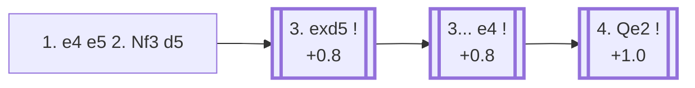

<a name="_TOP_"></a>

# C40 Elephant Gambit <br> 1. e4 e5 2. Nf3 d5 #

Black strikes back in the centre at once, offering a pawn to seize space and open lines before White can consolidate the extra material. Named — like the Elephant Trap in the Queen's Gambit — for how easily an unprepared opponent can lumber into trouble, though at master level the gambit is considered objectively insufficient for full equality.

### Overview

*Quick map of every move covered on this card — see the [shape key](https://github.com/onclemarcel/chess_flashcards/blob/main/start.md#content-diagram-optional) in start.md.*

<!-- content-diagram:start -->

<!-- content-diagram:end -->

<a name="_initial_move_"></a>

[](https://lichess.org/analysis/standard/rnbqkbnr/ppp2ppp/8/3pp3/4P3/5N2/PPPP1PPP/RNBQKB1R_w_KQkq_d6_0_3)

*... 1. e4 e5 2. Nf3 d5 — Elephant Gambit*

```
rnbqkbnr/ppp2ppp/8/3pp3/4P3/5N2/PPPP1PPP/RNBQKB1R w KQkq d6 0 3
```

|  | +0.8 |
| --- | --- |

<!-- lichess-stats:start fen="rnbqkbnr/ppp2ppp/8/3pp3/4P3/5N2/PPPP1PPP/RNBQKB1R w KQkq d6 0 3" db="lichess,masters" speeds="bullet,blitz" ratings="1800,2000,2200,2500" moves="6" -->
| Move | Online | W/D/B | Masters | W/D/B | |
| :--- | ---: | :--- | ---: | :--- | :-- |
| exd5 | 3.0 M (48.6%) | ⬜⬜⬜⬜⬜⬛⬛⬛⬛⬛ 45/4/51 | 121 (45.1%) | ⬜⬜⬜⬜⬜🟫🟫🟫⬛⬛ 51/26/23 |  |
| Nxe5 | 1.7 M (26.3%) | ⬜⬜⬜⬜⬜⬛⬛⬛⬛⬛ 46/4/50 | 79 (29.5%) | ⬜⬜⬜⬜🟫⬛⬛⬛⬛⬛ 37/15/48 |  |
| d4 | 611 k (9.7%) | ⬜⬜⬜⬜⬜⬛⬛⬛⬛⬛ 49/4/47 | 56 (20.9%) | ⬜⬜⬜⬜⬜🟫🟫⬛⬛⬛ 50/20/30 |  |
| Nc3 | 376 k (6.0%) | ⬜⬜⬜⬜⬜⬛⬛⬛⬛⬛ 48/4/48 | 5 (1.9%) | — |  |
| d3 | 236 k (3.8%) | ⬜⬜⬜⬜🟫⬛⬛⬛⬛⬛ 46/6/48 | 4 (1.5%) | — | ⚠ |
| Bc4 | 232 k (3.7%) | ⬜⬜⬜⬛⬛⬛⬛⬛⬛⬛ 32/3/66 | 0 | — | ⚠ |
| Be2 | 0 | — | 2 (0.7%) | — |  |

*Online: bullet/blitz, 1800+ — 6.3 M games. Masters: 268 games. [Open in the explorer](https://lichess.org/analysis/standard/rnbqkbnr/ppp2ppp/8/3pp3/4P3/5N2/PPPP1PPP/RNBQKB1R_w_KQkq_d6_0_3#explorer) — updated 2026-08-24*
<!-- lichess-stats:end -->

### Candidate moves

* [**3. exd5**](#_exd5_) (+0.8): takes the pawn — masters' clear main choice (45.1%) and the critical test.
* **3. Nxe5** (masters 29.5%): takes the other pawn instead. Black's most natural reply is **3... Bd6**, developing while eyeing the knight, rather than immediately grabbing back with **3... dxe4**.
* **3. d4** (masters 20.9%): builds the centre and ignores both pawns for now.

[*Back to TOP*](#_TOP_)

---

<a name="_exd5_"></a>

### 3. exd5

[](https://lichess.org/analysis/standard/rnbqkbnr/ppp2ppp/8/3Pp3/8/5N2/PPPP1PPP/RNBQKB1R_b_KQkq_-_0_3)

*... 3. exd5*

```
rnbqkbnr/ppp2ppp/8/3Pp3/8/5N2/PPPP1PPP/RNBQKB1R b KQkq - 0 3
```

|  | +0.8 |
| --- | --- |

<!-- lichess-stats:start fen="rnbqkbnr/ppp2ppp/8/3Pp3/8/5N2/PPPP1PPP/RNBQKB1R b KQkq - 0 3" db="lichess,masters" speeds="bullet,blitz" ratings="1800,2000,2200,2500" moves="6" -->
| Move | Online | W/D/B | Masters | W/D/B | |
| :--- | ---: | :--- | ---: | :--- | :-- |
| e4 | 2.4 M (78.3%) | ⬜⬜⬜⬜⬜⬛⬛⬛⬛⬛ 44/4/52 | 69 (57.0%) | ⬜⬜⬜⬜⬜🟫🟫⬛⬛⬛ 43/23/33 |  |
| Qxd5 | 268 k (8.7%) | ⬜⬜⬜⬜⬜⬛⬛⬛⬛⬛ 52/4/44 | 3 (2.5%) | — | ⚠ |
| Bd6 | 210 k (6.8%) | ⬜⬜⬜⬜⬜⬛⬛⬛⬛⬛ 46/3/51 | 48 (39.7%) | ⬜⬜⬜⬜⬜⬜🟫🟫🟫⬛ 65/25/10 |  |
| Nf6 | 103 k (3.3%) | ⬜⬜⬜⬜⬜⬛⬛⬛⬛⬛ 47/4/50 | 1 (0.8%) | — | ⚠ |
| c6 | 47 k (1.5%) | ⬜⬜⬜⬜⬜⬛⬛⬛⬛⬛ 51/4/45 | 0 | — | ⚠ |
| Bg4 | 17 k (0.6%) | ⬜⬜⬜⬜⬜⬛⬛⬛⬛⬛ 50/5/45 | 0 | — | ⚠ |

*Online: bullet/blitz, 1800+ — 3.1 M games. Masters: 121 games. [Open in the explorer](https://lichess.org/analysis/standard/rnbqkbnr/ppp2ppp/8/3Pp3/8/5N2/PPPP1PPP/RNBQKB1R_b_KQkq_-_0_3#explorer) — updated 2026-08-24*
<!-- lichess-stats:end -->

* [**3... e4**](#_e4_) (57.0% masters): the actual point of the gambit — attacks the f3-knight and grabs central space before White can develop comfortably.
* **3... Bd6** (39.7% masters): a quieter alternative, developing before deciding how to regain the pawn.

[*Back to 3. exd5*](#_exd5_)
[*Back to TOP*](#_TOP_)

---

<a name="_e4_"></a>

### 3... e4

[](https://lichess.org/analysis/standard/rnbqkbnr/ppp2ppp/8/3P4/4p3/5N2/PPPP1PPP/RNBQKB1R_w_KQkq_-_0_4)

*... 3... e4*

```
rnbqkbnr/ppp2ppp/8/3P4/4p3/5N2/PPPP1PPP/RNBQKB1R w KQkq - 0 4
```

|  | +0.8 |
| --- | --- |

<!-- lichess-stats:start fen="rnbqkbnr/ppp2ppp/8/3P4/4p3/5N2/PPPP1PPP/RNBQKB1R w KQkq - 0 4" db="lichess,masters" speeds="bullet,blitz" ratings="1800,2000,2200,2500" moves="6" -->
| Move | Online | W/D/B | Masters | W/D/B | |
| :--- | ---: | :--- | ---: | :--- | :-- |
| Qe2 | 1.0 M (42.4%) | ⬜⬜⬜⬜⬜⬛⬛⬛⬛⬛ 46/4/50 | 52 (75.4%) | ⬜⬜⬜⬜⬜⬜🟫🟫⬛⬛ 56/23/21 |  |
| Nd4 | 683 k (28.4%) | ⬜⬜⬜⬜⬛⬛⬛⬛⬛⬛ 42/4/54 | 4 (5.8%) | — | ⚠ |
| Ng1 | 366 k (15.2%) | ⬜⬜⬜⬜🟫⬛⬛⬛⬛⬛ 43/4/53 | 0 | — | ⚠ |
| Ne5 | 232 k (9.6%) | ⬜⬜⬜⬜⬜⬛⬛⬛⬛⬛ 50/4/47 | 10 (14.5%) | — |  |
| Nc3 | 38 k (1.6%) | ⬜⬜⬜⬜⬛⬛⬛⬛⬛⬛ 37/3/60 | 0 | — | ⚠ |
| Ng5 | 24 k (1.0%) | ⬜⬜⬜⬜⬛⬛⬛⬛⬛⬛ 34/3/63 | 0 | — | ⚠ |
| Bb5+ | 0 | — | 3 (4.3%) | — |  |

*Online: bullet/blitz, 1800+ — 2.4 M games. Masters: 69 games. [Open in the explorer](https://lichess.org/analysis/standard/rnbqkbnr/ppp2ppp/8/3P4/4p3/5N2/PPPP1PPP/RNBQKB1R_w_KQkq_-_0_4#explorer) — updated 2026-08-24*
<!-- lichess-stats:end -->

* [**4. Qe2**](#_Qe2_) (+1.0): masters' clear main choice (75.4%) — pins the e4 pawn to Black's own king along the e-file — **4... exf3??** would open the e-file straight into a check — while preparing to meet a properly supported ... exf3 with Qxf3.
* **4. Ne5** (masters 14.5%): centralises the knight actively instead of retreating.

[*Back to 3. exd5*](#_exd5_)
[*Back to TOP*](#_TOP_)

---

<a name="_Qe2_"></a>

### 4. Qe2

[](https://lichess.org/analysis/standard/rnbqkbnr/ppp2ppp/8/3P4/4p3/5N2/PPPPQPPP/RNB1KB1R_b_KQkq_-_1_4)

*... 4. Qe2*

```
rnbqkbnr/ppp2ppp/8/3P4/4p3/5N2/PPPPQPPP/RNB1KB1R b KQkq - 1 4
```

|  | +1.0 |
| --- | --- |

<!-- lichess-stats:start fen="rnbqkbnr/ppp2ppp/8/3P4/4p3/5N2/PPPPQPPP/RNB1KB1R b KQkq - 1 4" db="lichess,masters" speeds="bullet,blitz" ratings="1800,2000,2200,2500" moves="6" -->
| Move | Online | W/D/B | Masters | W/D/B | |
| :--- | ---: | :--- | ---: | :--- | :-- |
| Nf6 | 666 k (65.2%) | ⬜⬜⬜⬜⬜⬛⬛⬛⬛⬛ 45/4/51 | 45 (86.5%) | ⬜⬜⬜⬜⬜🟫🟫🟫⬛⬛ 53/24/22 |  |
| f5 | 156 k (15.3%) | ⬜⬜⬜⬜⬜⬛⬛⬛⬛⬛ 49/4/47 | 0 | — | ⚠ |
| Qe7 | 110 k (10.8%) | ⬜⬜⬜⬜⬜⬛⬛⬛⬛⬛ 45/5/50 | 6 (11.5%) | — |  |
| Qxd5 | 40 k (3.9%) | ⬜⬜⬜⬜⬜⬜⬛⬛⬛⬛ 55/5/40 | 0 | — | ⚠ |
| Be7 | 39 k (3.8%) | ⬜⬜⬜⬜⬜⬛⬛⬛⬛⬛ 44/4/52 | 1 (1.9%) | — | ⚠ |
| Bf5 | 4.7 k (0.5%) | ⬜⬜⬜⬜⬜⬜⬛⬛⬛⬛ 55/4/42 | 0 | — | ⚠ |

*Online: bullet/blitz, 1800+ — 1.0 M games. Masters: 52 games. [Open in the explorer](https://lichess.org/analysis/standard/rnbqkbnr/ppp2ppp/8/3P4/4p3/5N2/PPPPQPPP/RNB1KB1R_b_KQkq_-_1_4#explorer) — updated 2026-08-24*
<!-- lichess-stats:end -->

**4... Nf6** (65.2% online) is Black's most natural try, defending d5's recapture and developing, but White simply continues **5. d3**, chipping away at the e4 pawn while keeping the extra material — Black's compensation here is real in practical terms but not, by engine assessment, quite enough.

[*Back to 3... e4*](#_e4_)
[*Back to TOP*](#_TOP_)
