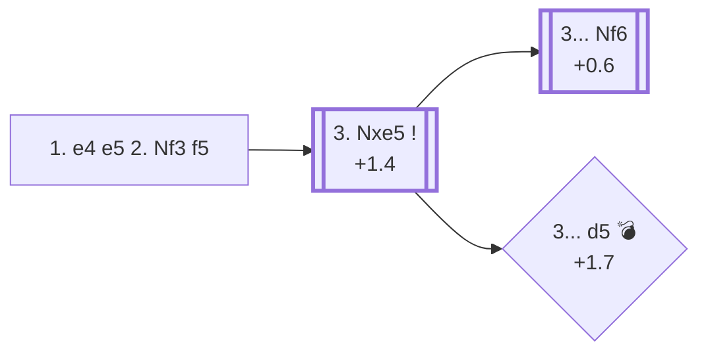

<a name="_TOP_"></a>

# C40 Latvian Gambit <br> 1. e4 e5 2. Nf3 f5 #

Black counter-attacks e4 immediately rather than defending e5, offering a pawn for open lines toward White's king. It's one of the sharpest and most objectively dubious tries in mainstream opening theory — engines consistently favour White by well over a pawn — but it's also a real trap-laden weapon at club level, which is exactly why it has a small but devoted following. Named after the Latvian players who analysed it extensively in the early 20th century.

### Overview

*Quick map of every move covered on this card — see the [shape key](https://github.com/onclemarcel/chess_flashcards/blob/main/start.md#content-diagram-optional) in start.md.*

<!-- content-diagram:start -->

<!-- content-diagram:end -->

<a name="_initial_move_"></a>

[](https://lichess.org/analysis/standard/rnbqkbnr/pppp2pp/8/4pp2/4P3/5N2/PPPP1PPP/RNBQKB1R_w_KQkq_f6_0_3)

*... 1. e4 e5 2. Nf3 f5 — Latvian Gambit*

```
rnbqkbnr/pppp2pp/8/4pp2/4P3/5N2/PPPP1PPP/RNBQKB1R w KQkq f6 0 3
```

|  | +1.4 |
| --- | --- |

<!-- lichess-stats:start fen="rnbqkbnr/pppp2pp/8/4pp2/4P3/5N2/PPPP1PPP/RNBQKB1R w KQkq f6 0 3" db="lichess,masters" speeds="bullet,blitz" ratings="1800,2000,2200,2500" moves="6" -->
| Move | Online | W/D/B | Masters | W/D/B | |
| :--- | ---: | :--- | ---: | :--- | :-- |
| Nxe5 | 1.1 M (31.7%) | ⬜⬜⬜⬜⬜⬛⬛⬛⬛⬛ 49/3/47 | 279 (76.4%) | ⬜⬜⬜⬜⬜⬜⬜🟫🟫⬛ 73/16/11 |  |
| exf5 | 890 k (26.2%) | ⬜⬜⬜⬜⬜⬛⬛⬛⬛⬛ 46/4/50 | 29 (7.9%) | ⬜⬜⬜⬜⬜⬜🟫🟫⬛⬛ 59/21/21 |  |
| d3 | 405 k (11.9%) | ⬜⬜⬜⬜⬜⬛⬛⬛⬛⬛ 46/4/50 | 8 (2.2%) | — |  |
| d4 | 381 k (11.2%) | ⬜⬜⬜⬜⬜⬛⬛⬛⬛⬛ 48/3/48 | 29 (7.9%) | ⬜⬜⬜⬜⬜⬜🟫🟫⬛⬛ 55/24/21 |  |
| Nc3 | 337 k (9.9%) | ⬜⬜⬜⬜⬜⬛⬛⬛⬛⬛ 47/4/49 | 11 (3.0%) | — |  |
| Bc4 | 259 k (7.6%) | ⬜⬜⬜⬜⬜⬛⬛⬛⬛⬛ 48/3/49 | 9 (2.5%) | — |  |

*Online: bullet/blitz, 1800+ — 3.4 M games. Masters: 365 games. [Open in the explorer](https://lichess.org/analysis/standard/rnbqkbnr/pppp2pp/8/4pp2/4P3/5N2/PPPP1PPP/RNBQKB1R_w_KQkq_f6_0_3#explorer) — updated 2026-08-31*
<!-- lichess-stats:end -->

### Candidate moves

* [**3. Nxe5**](#_Nxe5_) (+1.4): simply takes the pawn — masters' overwhelming choice (76.4%) and the critical test of the whole gambit.
* **3. exf5** (masters 7.9%, online 26.2%): also takes a pawn, but lets Black recapture the tension with **3... e4**, chasing the knight and regaining activity.
* **3. d4** (masters 7.9%): builds the centre first, ignoring both pawns for now.

[*Back to TOP*](#_TOP_)

---

<a name="_Nxe5_"></a>

### 3. Nxe5

[](https://lichess.org/analysis/standard/rnbqkbnr/pppp2pp/8/4Np2/8/8/PPPP1PPP/RNBQKB1R_b_KQkq_-_0_3)

*... 3. Nxe5*

```
rnbqkbnr/pppp2pp/8/4Np2/8/8/PPPP1PPP/RNBQKB1R b KQkq - 0 3
```

|  | +1.4 |
| --- | --- |

Modern online practice favours quieter development over the historically "classical" tries:

* [**3... Nf6**](#_Nf6_) (62.1% online): the most common choice today — develops naturally and prepares to meet the knight's activity without further weakening the kingside.
* [**3... d5**](#_Trap_) (27.0% online): also natural-looking, but see the tip below — it walks into a real practical trick.
* **3... Qf6** and **3... Qg5**: the historically "classical" main tries in opening literature, both attacking the e5-knight immediately (Qg5 also eyes g2). They're barely seen in current online play at this rating band, but remain the traditional books' main line — treat them as real tries worth knowing if you play this gambit seriously, rather than as refuted.

[*Back to 3. Nxe5*](#_initial_move_)
[*Back to TOP*](#_TOP_)

---

<a name="_Nf6_"></a>

### 3... Nf6

[](https://lichess.org/analysis/standard/rnbqkb1r/pppp2pp/5n2/4Np2/8/8/PPPP1PPP/RNBQKB1R_w_KQkq_-_1_4)

*... 3... Nf6*

```
rnbqkb1r/pppp2pp/5n2/4Np2/8/8/PPPP1PPP/RNBQKB1R w KQkq - 1 4
```

|  | +0.6 |
| --- | --- |

White continues developing with **4. d4** (47.1% online) or **4. Bc4** (28.5%), keeping the extra pawn and a comfortable lead in development — Black's compensation is real but not sufficient by engine standards.

[*Back to 3. Nxe5*](#_Nxe5_)
[*Back to TOP*](#_TOP_)

---

> [!TIP]
> Playing **3... d5** before **... Nf6** leaves the f7-e8-h5 light squares without a knight covering them, and White punishes that immediately.
>
> <a name="_Trap_"></a>
>
> ### 3... d5 4. Qh5+! — the light-square trick
>
> [](https://lichess.org/analysis/standard/rnbqkbnr/ppp3pp/8/3pN2Q/5p2/8/PPPP1PPP/RNB1KB1R_b_KQkq_-_1_4)
>
> *... 4. Qh5+ — check along the h5-e8 diagonal, and only g6 blocks it*
>
> ```
> rnbqkbnr/ppp3pp/8/3pN2Q/5p2/8/PPPP1PPP/RNB1KB1R b KQkq - 1 4
> ```
>
> |  | +1.7 |
> | --- | --- |
>
> This is masters' and online players' overwhelming choice here (89.0% online) precisely because it works so well: the only way to block is **4... g6**, further ripping open Black's kingside, since the knight hasn't come to f6 yet to cover the check. White keeps the extra pawn and a lasting structural edge.
>
> [*Back to 3. Nxe5*](#_Nxe5_)
> [*Back to TOP*](#_TOP_)
