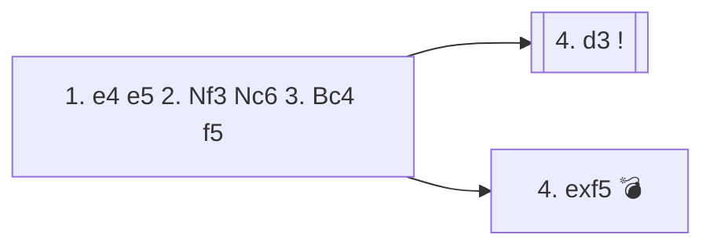

<a name="_TOP_"></a>

# C50 Rousseau Gambit <br> 1. e4 e5 2. Nf3 Nc6 3. Bc4 f5 #

Black strikes back at the centre from the Italian Game move order instead of developing quietly — the same idea as the Latvian Gambit, but a tempo ahead since White's bishop is already committed to c4 rather than still on f1. Named after 18th-century player Vincent Rousseau, and sometimes described as a Vienna Gambit with the colours reversed.

### Overview

*Quick map of every move covered on this card — see the [shape key](https://github.com/onclemarcel/chess_flashcards/blob/main/start.md#content-diagram-optional) in start.md.*

<!-- content-diagram:start -->

<!-- content-diagram:end -->

<a name="_initial_move_"></a>

[](https://lichess.org/analysis/standard/r1bqkbnr/pppp2pp/2n5/4pp2/2B1P3/5N2/PPPP1PPP/RNBQK2R_w_KQkq_f6_0_4)

*... 1. e4 e5 2. Nf3 Nc6 3. Bc4 f5 — Rousseau Gambit*

```
r1bqkbnr/pppp2pp/2n5/4pp2/2B1P3/5N2/PPPP1PPP/RNBQK2R w KQkq f6 0 4
```

|  | +1.0 |
| --- | --- |

<!-- lichess-stats:start fen="r1bqkbnr/pppp2pp/2n5/4pp2/2B1P3/5N2/PPPP1PPP/RNBQK2R w KQkq f6 0 4" db="lichess,masters" speeds="bullet,blitz" ratings="1800,2000,2200,2500" moves="6" -->
| Move | Online | W/D/B | Masters | W/D/B | |
| :--- | ---: | :--- | ---: | :--- | :-- |
| d3 | 549 k (37.0%) | ⬜⬜⬜⬜⬜⬛⬛⬛⬛⬛ 51/3/46 | 7 (46.7%) | — |  |
| exf5 | 450 k (30.3%) | ⬜⬜⬜⬜⬛⬛⬛⬛⬛⬛ 39/3/57 | 0 | — | ⚠ |
| d4 | 258 k (17.3%) | ⬜⬜⬜⬜⬜⬛⬛⬛⬛⬛ 52/3/45 | 7 (46.7%) | — |  |
| Nc3 | 81 k (5.5%) | ⬜⬜⬜⬜⬛⬛⬛⬛⬛⬛ 40/3/57 | 1 (6.7%) | — | ⚠ |
| O-O | 57 k (3.8%) | ⬜⬜⬜⬜⬛⬛⬛⬛⬛⬛ 41/3/56 | 0 | — | ⚠ |
| Bxg8 | 43 k (2.9%) | ⬜⬜⬜⬜⬜⬛⬛⬛⬛⬛ 47/3/50 | 0 | — | ⚠ |

*Online: bullet/blitz, 1800+ — 1.5 M games. Masters: 15 games. [Open in the explorer](https://lichess.org/analysis/standard/r1bqkbnr/pppp2pp/2n5/4pp2/2B1P3/5N2/PPPP1PPP/RNBQK2R_w_KQkq_f6_0_4#explorer) — updated 2026-08-25*
<!-- lichess-stats:end -->

### Candidate moves

* [**4. d3**](#_d3_) (masters/online tied at 46.7%/37.0%): declines the pawn and simply defends e4, keeping a comfortable extra tempo without entering complications.
* **4. d4**: countergambits in the centre instead, offering a pawn back to open the position before Black's king is safe.
* [**4. exf5**](#_Trap_): accepts the pawn — natural-looking, but it hands Black exactly the central counterplay the gambit is built around.

[*Back to TOP*](#_TOP_)

---

<a name="_d3_"></a>

### 4. d3

Simply defending e4 sidesteps every trick the gambit relies on: Black has spent a tempo on ... f5 while White's development is unharmed, so declining is considered White's most comfortable option. Play typically continues **4... fxe4 5. dxe4 Nf6**, transposing toward calm, roughly balanced middlegames.

[*Back to 1... Nc6*](#_initial_move_)
[*Back to TOP*](#_TOP_)

---

> [!TIP]
> **4. exf5** looks like simply winning a pawn, but it deflects a central pawn away from e4 and opens the position before White has finished developing — exactly what Black's gambit is hoping for.
>
> <a name="_Trap_"></a>
>
> ### 4. exf5 e4 — the point of the gambit
>
> [](https://lichess.org/analysis/standard/r1bqkbnr/pppp2pp/2n5/5P2/2B1p3/5N2/PPPP1PPP/RNBQK2R_w_KQkq_-_0_5)
>
> *... 4... e4 — attacking the f3-knight and seizing the centre*
>
> ```
> r1bqkbnr/pppp2pp/2n5/5P2/2B1p3/5N2/PPPP1PPP/RNBQK2R w KQkq - 0 5
> ```
>
> |  | 0.0 |
> | --- | --- |
>
> <!-- lichess-stats:start fen="r1bqkbnr/pppp2pp/2n5/5P2/2B1p3/5N2/PPPP1PPP/RNBQK2R w KQkq - 0 5" db="lichess,masters" speeds="bullet,blitz" ratings="1800,2000,2200,2500" moves="6" -->
> | Move | Online | W/D/B | Masters | W/D/B | |
> | :--- | ---: | :--- | ---: | :--- | :-- |
> | Ng1 | 102 k (43.1%) | ⬜⬜⬜⬜⬛⬛⬛⬛⬛⬛ 37/3/59 | 0 | — | ⚠ |
> | Qe2 | 101 k (42.8%) | ⬜⬜⬜⬛⬛⬛⬛⬛⬛⬛ 32/3/65 | 0 | — | ⚠ |
> | Nd4 | 11 k (4.8%) | ⬜⬜⬜⬜⬜⬛⬛⬛⬛⬛ 49/3/48 | 0 | — | ⚠ |
> | Bxg8 | 6.5 k (2.7%) | ⬜⬜⬜⬜⬛⬛⬛⬛⬛⬛ 38/3/59 | 0 | — | ⚠ |
> | O-O | 5.1 k (2.2%) | ⬜⬜⬜⬜⬛⬛⬛⬛⬛⬛ 42/2/56 | 0 | — | ⚠ |
> | Ng5 | 3.9 k (1.7%) | ⬜⬜⬜⬜⬛⬛⬛⬛⬛⬛ 35/3/63 | 0 | — | ⚠ |
> 
> *Online: bullet/blitz, 1800+ — 237 k games. Masters: 0 games. [Open in the explorer](https://lichess.org/analysis/standard/r1bqkbnr/pppp2pp/2n5/5P2/2B1p3/5N2/PPPP1PPP/RNBQK2R_w_KQkq_-_0_5#explorer) — updated 2026-08-25*
> <!-- lichess-stats:end -->
>
> The attacked knight has real options, split almost evenly in practice between **5. Ng1** (43.1%, simply retreating) and **5. Qe2** (42.8%, holding the square — the queen defends f3 in place, so ... exf3 just meets Qxf3). Engines actually rate the more active **5. Nd4** as at least as good as either, offering the knight an outpost instead of a retreat. Whichever White chooses, the position is roughly balanced (0.0) — Black has real central space and development in exchange for the pawn, rather than a clearly winning attack.
>
> [*Back to 1... Nc6*](#_initial_move_)
> [*Back to TOP*](#_TOP_)
