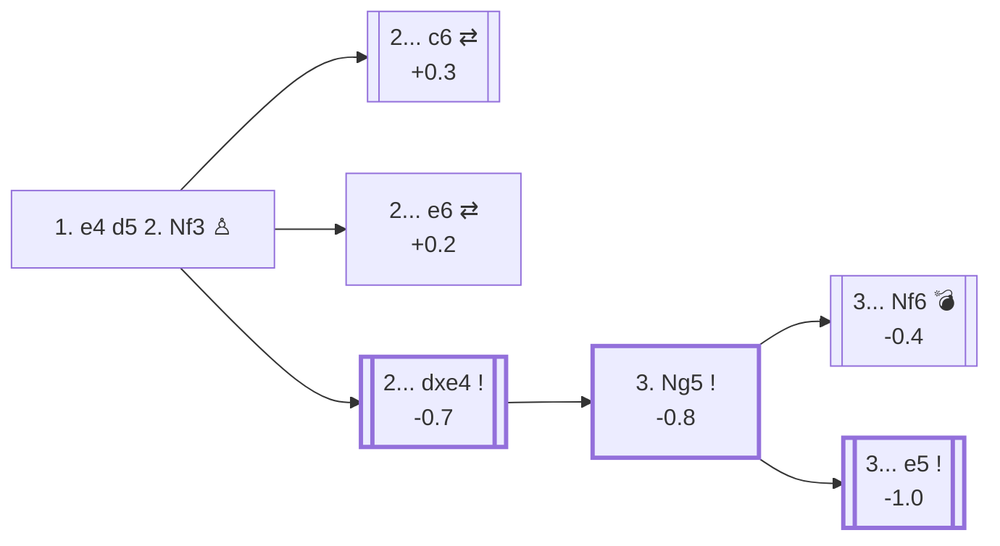

<a name="_TOP_"></a>

# A06 Tennison Gambit <br> 1. e4 d5 2. Nf3 dxe4 3. Ng5 #

This gambit may be reached from the Réti/Zukertort Opening (A06, 1. Nf3 d5 2. e4) or by transposition from the Scandinavian Defense (B01, 1. e4 d5 2. Nf3) — see [B01](https://github.com/onclemarcel/chess_flashcards/blob/main/e4_openings/B01_Scandinavian.md#_Nf3_). The main idea is to capture the Black queen through seemingly sensible moves. This trap backfires when avoided by Black, with a score of -0.7 estimated by Stockfish.

### Overview

*Quick map of every move covered on this card — see the [shape key](https://github.com/onclemarcel/chess_flashcards/blob/main/start.md#content-diagram-optional) in start.md. Both 3... Nf6 and 3... e5 are tied at 41.7% of masters games (a 5-game sample, so read that tie loosely) — Nf6 is master-safe in its own right, the trap is specifically two moves further, at 5. Bxd3 h6??.*

<!-- content-diagram:start -->

<!-- content-diagram:end -->

<a name="_Nf3_"></a>

[](https://lichess.org/analysis/standard/rnbqkbnr/ppp1pppp/8/3p4/4P3/5N2/PPPP1PPP/RNBQKB1R_b_KQkq_-_1_2)

*... 1. e4 d5 2. Nf3 — Tennison Gambit*

```
rnbqkbnr/ppp1pppp/8/3p4/4P3/5N2/PPPP1PPP/RNBQKB1R b KQkq - 1 2
```

|  | -0.7 |
| --- | --- |

<!-- lichess-stats:start fen="rnbqkbnr/ppp1pppp/8/3p4/4P3/5N2/PPPP1PPP/RNBQKB1R b KQkq - 1 2" db="lichess,masters" speeds="bullet,blitz" ratings="1800,2000,2200,2500" moves="5" -->
| Move | Online | W/D/B | Masters | W/D/B | |
| :--- | ---: | :--- | ---: | :--- | :-- |
| dxe4 | 9.7 M (83.3%) | ⬜⬜⬜⬜⬜⬛⬛⬛⬛⬛ 48/4/48 | 12 (52.2%) | — |  |
| c6 | 434 k (3.7%) | ⬜⬜⬜⬜⬜⬛⬛⬛⬛⬛ 47/4/49 | 7 (30.4%) | — |  |
| Nf6 | 377 k (3.2%) | ⬜⬜⬜⬜⬜⬛⬛⬛⬛⬛ 50/4/46 | 0 | — | ⚠ |
| d4 | 336 k (2.9%) | ⬜⬜⬜⬜⬜⬛⬛⬛⬛⬛ 52/3/45 | 0 | — | ⚠ |
| e6 | 272 k (2.3%) | ⬜⬜⬜⬜⬜⬛⬛⬛⬛⬛ 48/4/48 | 3 (13.0%) | — | ⚠ |
| e5 | 0 | — | 1 (4.3%) | — |  |

*Online: bullet/blitz, 1800+ — 11.6 M games. Masters: 23 games. [Open in the explorer](https://lichess.org/analysis/standard/rnbqkbnr/ppp1pppp/8/3p4/4P3/5N2/PPPP1PPP/RNBQKB1R_b_KQkq_-_1_2#explorer) — updated 2026-08-31*
<!-- lichess-stats:end -->

### Candidate moves

* Black may:
  - refuse with **2... c6**, transposing into the [Caro-Kann Defense](https://github.com/onclemarcel/chess_flashcards/blob/main/e4_openings/B10_Caro_Kann.md) (+0.3), or
  - refuse with **2... e6**, transposing into the [French Defense](https://github.com/onclemarcel/chess_flashcards/blob/main/e4_openings/C00_French_Defense.md) (+0.2), or
  - accept with [**2... dxe4**](#_dxe4_) (-0.7): this is the most played move, at 52% of masters games

[*Back to TOP*](#_TOP_)

---

<a name="_dxe4_"></a>

### 2... dxe4 3. Ng5

After **2... dxe4**, White escapes with **3. Ng5**. The objective is to prepare an attack on f7, while getting ready to push the light-squared bishop onto the d3-g6 diagonal, along with an X-ray attack of Qd1 on Qd8. White is hoping for natural-looking Black moves — this is where the trap below may backfire.

[](https://lichess.org/analysis/standard/rnbqkbnr/ppp1pppp/8/6N1/4p3/8/PPPP1PPP/RNBQKB1R_b_KQkq_-_1_3)

*... 3. Ng5*

```
rnbqkbnr/ppp1pppp/8/6N1/4p3/8/PPPP1PPP/RNBQKB1R b KQkq - 1 3
```

|  | -0.8 |
| --- | --- |

<!-- lichess-stats:start fen="rnbqkbnr/ppp1pppp/8/6N1/4p3/8/PPPP1PPP/RNBQKB1R b KQkq - 1 3" db="lichess,masters" speeds="bullet,blitz" ratings="1800,2000,2200,2500" moves="6" -->
| Move | Online | W/D/B | Masters | W/D/B | |
| :--- | ---: | :--- | ---: | :--- | :-- |
| Nf6 | 4.7 M (55.1%) | ⬜⬜⬜⬜⬜⬛⬛⬛⬛⬛ 49/4/46 | 5 (41.7%) | — |  |
| Bf5 | 1.2 M (14.4%) | ⬜⬜⬜⬜⬜⬛⬛⬛⬛⬛ 48/4/49 | 1 (8.3%) | — | ⚠ |
| e5 | 718 k (8.5%) | ⬜⬜⬜⬜🟫⬛⬛⬛⬛⬛ 44/4/52 | 5 (41.7%) | — |  |
| f5 | 570 k (6.7%) | ⬜⬜⬜⬜⬜⬛⬛⬛⬛⬛ 51/3/46 | 0 | — | ⚠ |
| Qd5 | 400 k (4.7%) | ⬜⬜⬜⬜⬜⬛⬛⬛⬛⬛ 50/3/47 | 0 | — | ⚠ |
| Nc6 | 246 k (2.9%) | ⬜⬜⬜⬜⬜⬛⬛⬛⬛⬛ 47/4/50 | 0 | — | ⚠ |
| e3 | 0 | — | 1 (8.3%) | — |  |

*Online: bullet/blitz, 1800+ — 8.5 M games. Masters: 12 games. [Open in the explorer](https://lichess.org/analysis/standard/rnbqkbnr/ppp1pppp/8/6N1/4p3/8/PPPP1PPP/RNBQKB1R_b_KQkq_-_1_3#explorer) — updated 2026-08-31*
<!-- lichess-stats:end -->

* [**3... Nf6**](#_Trap_) (-0.4, 55.1% online): the natural developing move — but it walks straight into the trap below if Black then plays carelessly
* [**3... e5**](#_Escape_) (-1.0, 41.7% masters): the correct way to meet the gambit, threatening the Ng5 knight directly

[*Back to TOP*](#_TOP_)

---

> [!TIP]
> **3... Nf6 4. d3 exd3 5. Bxd3 h6??** looks like a completely normal sequence for Black — kicking the knight — but it loses the queen on the spot. This is the trap the whole gambit is built around: White is hoping Black plays exactly these natural-looking moves.
>
> <a name="_Trap_"></a>
>
> ### 3... Nf6 4. d3 exd3 5. Bxd3 h6?? — the Tennison Gambit trap
>
> [](https://lichess.org/analysis/standard/rnbqkb1r/ppp1ppp1/5n1p/6N1/8/3B4/PPP2PPP/RNBQK2R_w_KQkq_-_0_6)
>
> *... 5... h6?? — Black falls into the trap here, about to lose the queen*
>
> ```
> rnbqkb1r/ppp1ppp1/5n1p/6N1/8/3B4/PPP2PPP/RNBQK2R w KQkq - 0 6
> ```
>
> |  | +2.8 |
> | --- | --- |
>
> The point is **6. Nxf7! Kxf7 7. Bg6+! Kxg6 8. Qxd8**, winning the queen outright. Black should instead defend with **4... Nc6** or **4... exd3** followed by consolidating rather than grabbing the knight with the h-pawn.
>
> [*Back to TOP*](#_TOP_)

---

**3... e5** is Black's soundest reply, immediately threatening the Ng5 knight. White should not take on e4 too quickly, since **4... f5** will chase the knight once again. White typically protects it with **4. h4 Be7**, and then **5. Nxe4**.

<a name="_Escape_"></a>

[](https://lichess.org/analysis/standard/rnbqk1nr/ppp1bppp/8/4p3/4N2P/8/PPPP1PP1/RNBQKB1R_b_KQkq_-_0_5)

*... 5. Nxe4 — White has recovered the pawn, and the position is roughly balanced*

```
rnbqk1nr/ppp1bppp/8/4p3/4N2P/8/PPPP1PP1/RNBQKB1R b KQkq - 0 5
```

|  | -0.7 |
| --- | --- |

[*Back to TOP*](#_TOP_)
