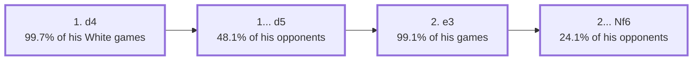

<a name="_TOP_"></a>

# Guigui4378 — White Main Line (first 4 moves) <br> 1. d4 d5 2. e3 Nf6 #

A trial card in the `start.md` visual format, built on top of [Guigui's own White scouting profile](https://github.com/onclemarcel/chess_flashcards/blob/main/players/guigui/Guigui_White_System.md) — see that file first for the full methodology and formatting-rules explanation (no `lichess-stats` markers, no masters/online shape-key, everything still live-verified). This card narrows to a single concrete line — what Guigui actually plays, what his own opponent pool (chess.com players at his own level, ~1400-1450) actually answers with, and where the engine's own top choice agrees or disagrees with that practical reality — for exactly his first 4 moves as White. If this format holds up, it's the template for expanding deeper and for the Black-repertoire companion.

**Data**: 1887 of his own White games, replayed via `tools/player_tree.py`/`tools/player_report.py` (reproduced fresh for this card). Every FEN below is derived via `tools/apply_san.py`; every eval is a live Lichess `cloud-eval` query (depth 50-65) — its own top line's first move is quoted directly as "the engine's own choice" at that node, not inferred by comparing candidates by eye.

The mermaid node labels below carry Guigui's own frequency, not a Stockfish eval — that's a deliberate choice to keep the diagram showing the empirical move chain itself, with the engine comparison living in each section's own prose/table instead. `tools/check_diagram.py` will flag this file's two frequency-labelled nodes as "eval not found nearby" — that's expected and not a bug, for the same reason the [White scouting profile](https://github.com/onclemarcel/chess_flashcards/blob/main/players/guigui/Guigui_White_System.md) opts out of that tool entirely: it isn't built to understand a personal-frequency data model.

### Overview

*A plain 4-node chain — no shape-key classification here (see the profile page for why); node labels carry Guigui's own frequency.*



[*Back to TOP*](#_TOP_)

---

<a name="_d4_"></a>

## 1. d4

[](https://lichess.org/analysis/standard/rnbqkbnr/pppppppp/8/8/3P4/8/PPP1PPPP/RNBQKBNR_b_KQkq_d3_0_1)

```
rnbqkbnr/pppppppp/8/8/3P4/8/PPP1PPPP/RNBQKBNR b KQkq d3 0 1
```

|  | +0.15 |
| --- | --- |

**Guigui's own games (n=1886):** d4 — 1880 (**99.7%**). Essentially automatic; the 6 exceptions (4×e4, 1×d3, 1×e3) are noise. The engine's own single top line here actually starts 1. e4 by a hair, but 1. d4 is itself a completely mainstream, engine-approved try — no real gap to report at this first ply.

The engine's own top continuation from here is **1... Nf6** — worth remembering before the next section, since that is *not* what his opponents usually play.

[*Back to TOP*](#_TOP_)

---

<a name="_d5_"></a>

## 1... d5 — most-played reply

[](https://lichess.org/analysis/standard/rnbqkbnr/ppp1pppp/8/3p4/3P4/8/PPP1PPPP/RNBQKBNR_w_KQkq_d6_0_2)

```
rnbqkbnr/ppp1pppp/8/3p4/3P4/8/PPP1PPPP/RNBQKBNR w KQkq d6 0 2
```

|  | +0.27 |
| --- | --- |

**Guigui's opponents (n=1879, all replies to his 1. d4):**

| Reply | Games | Share |
| :--- | ---: | ---: |
| **d5** | 904 | **48.1%** |
| e6 | 213 | 11.3% |
| e5 | 203 | 10.8% |
| Nf6 | 138 | 7.3% |
| g6 | 103 | 5.5% |

**A real, if small, divergence from the engine here.** The engine's own top choice at the previous node was 1... Nf6 (eval +0.15), not 1... d5 — and this isn't just a stylistic preference: the position right here, after 1... d5, is +0.27 for White, a genuine ~0.12-pawn step up for White compared to holding at +0.15 with 1... Nf6. In plain terms: the move his opponent pool actually plays most often is measurably *more* comfortable for Guigui than the engine's own preferred defence — 1... Nf6 is objectively the tougher test, and it's also his least common White-side puzzle (only 7.3% of games, and even there his own reply is still 2. e3 in 95% of cases per the full profile — so facing it doesn't change his plan, only Black's resulting comfort).

[*Back to 1. d4*](#_d4_)
[*Back to TOP*](#_TOP_)

---

<a name="_e3_"></a>

## 2. e3

[](https://lichess.org/analysis/standard/rnbqkbnr/ppp1pppp/8/3p4/3P4/4P3/PPP2PPP/RNBQKBNR_b_KQkq_-_0_2)

```
rnbqkbnr/ppp1pppp/8/3p4/3P4/4P3/PPP2PPP/RNBQKBNR b KQkq - 0 2
```

|  | +0.03 |
| --- | --- |

**Guigui's own games (n=904, replies to 1... d5):**

| Reply | Games | Share |
| :--- | ---: | ---: |
| **e3** | 896 | **99.1%** |
| Nf3 | 7 | 0.8% |
| e4 | 1 | 0.1% |

**This is the clearest gap in the whole line.** The engine's own top choice here is **2. c4** — played by Guigui in only 7 of 904 games (0.8%). Live-checked directly: after 2. c4 the eval is +0.22 (nearly matching the parent node's own +0.27, as it should — that's the engine's preferred continuation), while after his actual 2. e3 the eval drops to +0.03, essentially dead level. That's a real, verified ~0.2-pawn concession — not because e3 is a bad move (it's a completely sound, standard developing move), but because it spends a tempo on a move that doesn't fight for the center the way an immediate c4 does, letting Black equalize comfortably. This is the concrete shape of his "quiet universal e3 system" cost, quantified at its very first branch point (see the full profile page for the same pattern recurring deeper in the tree).

[*Back to 1... d5*](#_d5_)
[*Back to TOP*](#_TOP_)

---

<a name="_Nf6_"></a>

## 2... Nf6 — most-played reply, engine agrees

[](https://lichess.org/analysis/standard/rnbqkb1r/ppp1pppp/5n2/3p4/3P4/4P3/PPP2PPP/RNBQKBNR_w_KQkq_-_1_3)

```
rnbqkb1r/ppp1pppp/5n2/3p4/3P4/4P3/PPP2PPP/RNBQKBNR w KQkq - 1 3
```

|  | +0.10 |
| --- | --- |

**Guigui's opponents (n=895, replies to his 2. e3):**

| Reply | Games | Share |
| :--- | ---: | ---: |
| **Nf6** | 216 | **24.1%** |
| Nc6 | 213 | 23.8% |
| e6 | 159 | 17.8% |
| Bf5 | 144 | 16.1% |

**Practice and engine agree here — the only node in this 4-move line where they do.** The engine's own top continuation from the previous position is 2... Nf6, exactly matching his opponents' single most common reply. Worth flagging honestly, though: at 24.1% vs. 23.8%, Nf6 only barely edges out 2... Nc6 in practice — this is a near coin-flip, not a real preference, so don't expect this exact node reliably; treat Nc6 as an equally live sibling in his actual games even though this card follows the (barely) more common Nf6 branch.

Not built out further here — this is the trial 4-move depth; expanding to move 6 and beyond, and building the Nc6/e6/Bf5 siblings out properly, is exactly what "worth expanding" would mean next.

[*Back to 2. e3*](#_e3_)
[*Back to TOP*](#_TOP_)
