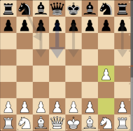
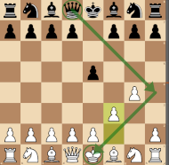

# Start Position (A00) #
\<*Set title of the page with* \<*Opening Name (ECO Code)*\> 1. \<*w1*\> \<*b1*\>  2. \<*w2*\> \<*b2*\> ... \>  
 

\<*Add here a short description of the main characteristics of this position (opening, trap, mate pattern, ...) - Sources for description may be a Lichess description, a video introduction (e.g. David Naroditsky, Levy Rozman, Igor Smirnov, ...), an opening book description, ...* \> 
 

*\< Add here the diagram of the position and the LiChess statistics of possible moves from the position\>*
 

     
    ... Start Position  
    <table align="center"><tr> 
    <td valign="center"></td><td>0.0</td></tr></table>
 
 
*Example taken from the start position*
 

 

- *\<list here possible moves, with short summary on the strategy related to this move\>*
- *\<create a internal link to a paragraph on this page or an external link when the move is transposing to another opening \>*
- *\< Mention the Stockfish rating of the move in parenthesis \>*
  - [**1. \<uncommon_move\>**](#_uncommon_note_)  (-0.x) : *\<for uncommon moves illustrated in books/videos, create notes to highlight the discussion\>*
  - [**1. \<Mate or Trap Pattern\>**](#_mate_or_trap_) (-0.x) : *\<create tips when a Mate pattern or Trap Pattern should be highlighted\>*
  - [**1. \<move\>**](#_move_)  (x.x) : *\<Main moves are discussed after the notes or tips, they can be reached by clicking on an internal anchor link - *click on the move*\>*
 

- From the starting position, White makes its choice to open the game - opening theory is quite extensively documented in books and on the Internet, with golden rules for beginners (e.g. pieces development rules, control of the center, pawn structure, ....):
  - [**1. e4**](./e4_openings/e4_KPG.md)  (+0.2) : the [King's Pawn Opening](./e4_openings/e4_KPG.md), is the most popular first move at all levels of the game. White aims at controlling the center
  
  

> [!NOTE]
> ### \<uncommon move worth a note\> 
> 
> - *\<Add here some notes from books/videos/web sites on a specific move or variation, worth to be mentionned, although not in the main line of this flashcard\>* 
> - Example:
>     - With **1. g4**, White enters the [Grob's Attack](./g4_opening/Grob.md), significantly compromising the kingside's pawn structure, and placing the g-pawn on an unusual square that is difficult to defend without giving Black the initiative 
>  

>      
>     ... 1. g4 : the Grob's Attack  
>     <table align="center"><tr><td valign="center"></td><td>Very Rare</td> 
>     <td valign="center"></td><td>-0.9</td></tr></table>
>   

>     [*Back to previous move*](#_initial_move_)

 

> [!TIP]
> ### \<Mate Pattern or Trap Pattern worth a tip\> 
>
> - *\<Add here some notes when a Mate pattern appears with this move or can be created from this move. This also applies to some specific traps. The tip helps in detecting patterns in real games, in order to either anticipate for avoiding a trap or use it against the opponent \>* 
> - Example:
>     - **1. g4?** [Grob's Attack](./g4_opening/Grob.md) is generally considered to be one of the worst starting moves
>     - A typical scholar Mate Pattern is reached through this sequence : **1. g4? e5 2. f3 ??**  
>  

>      
>     ... Shortest Game - ***Mate in 1***  
>     <table align="center"><tr><td valign="center"></td><td>Very Rare</td> 
>     <td valign="center"></td><td>#-1</td></tr></table>
>   

>     [*Back to previous move*](#_initial_move_)

  
### 1. \<move\>
 

*\<Present subsequent moves with the same structure as the initial move\>* 
*\<show LiChess stats, list of moves with summaries, add notes/tips when needed...\>* 

 [*Back to previous move*](#_initial_move_)  
 [*Back to TOP*](#_TOP_)
