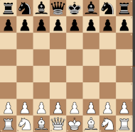

# \<Opening Name (ECO Code)\> 1. \<w1\> \<b1\>  2. \<w2\> \<b2\> ...    #
 

Short description of the main characteristics of this opening 
 

*Sources for description may be a Lichess description, a video introduction (e.g. David Naroditsky, Levy Rozman, Igor Smirnov, ...), an opening book description, ...*  
 

*\< Add here the diagram of the position and the LiChess statistics of possible moves from the position\>*
 

     
    ... Start Position  
    <table align="center"><tr> 
    <td valign="center"></td><td>0.0</td></tr></table>
 

 

*Example taken from the start position*
 

- *\<list here possible moves, with short summary on the strategy related to this move\>*
- *\<create a internal link to a paragraph on this page or an external link when the move is transposing to another opening \>*
- *\< Mention the Stockfish rating of the move in parenthesis \>*

- Example:
  - [**1. e4**](./e4_openings/e4_KPG.md)  (+0.2) : the [King's Pawn Opening](./e4_openings/e4_KPG.md), is the most popular first move at all levels of the game
  - [**1. b4**](#_b4_)  (-0.1) : *\<for uncommon moves illustrated in books/videos, create notes to highlight the discussion\>*
  - [**1. g4?**](#_g4_) (-1.0) : *\<create tips when a Mate pattern or Trap Pattern should be highlighted\>*
  - [**1. \<move\>**](#_move_)  (x.x) : *\<Main moves are discussed after the notes, with the help of an internal anchor link - *click on the move*\>*
 

> [!NOTE]
> ### 1. b4 Polish opening
> - The purpose of this move is to fight for a spatial advantage on the queenside instead of immediately taking control of the centre.  
>  

>      
>     ... 1. b4  
>     <table align="center"><tr><td valign="center"></td><td>Very Rare</td> 
>     <td valign="center"></td><td>-0.1</td></tr></table>
>   

>     [*Back to previous move*](#_initial_move_)

 

> [!TIP]
> ### 1. g4 Grob opening
> - Grob's Attack is generally considered to be one of the worst starting moves
> - A typical scholar Mate Pattern is reached through this sequence : **1. g4? e5 2. f3 ??**  
>  

>      
>     ... Shortest Game - ***Mate in 1***  
>     <table align="center"><tr><td valign="center"></td><td>Very Rare</td> 
>     <td valign="center"></td><td>#-1</td></tr></table>
>   

>     [*Back to previous move*](#_initial_move_)

  
### 1. \<move\>
 

*\<Present subsequent moves with the same structure as the initial move\>* 
*\<show LiChess stats, list of moves with summaries, add notes/tips when needed...\>* 

 [*Back to previous move*](#_initial_move_)  
 [*Back to TOP*](#_TOP_)
