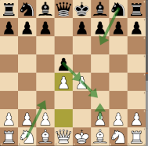
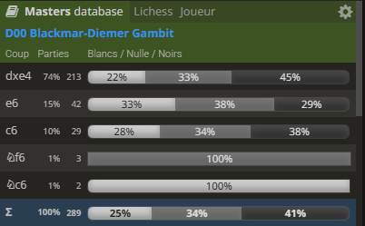
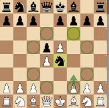
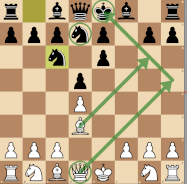
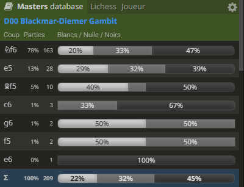
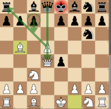

# The Blackmar-Diemer Gambit (D00 - Queen Pawn Game) #

This gambit may be reached by the Queen Pawn Game (D00), the Scandinavian Defense (B01) or even through an Indian Defense (A45) with **2. Nc3 d5 3. e4**
  
The main idea for White is to gain the initiative by quickly opening the e-column and, later on, the f-column through a pawn sacrifice and a pawn exchange

 

        
 
        
 

- This opening is not correct with respect to openings principles, but leads to a ***dynamic game with many tactical ideas*** for both players
- When correctly prepared, Black is able to avoid many traps of this opening and obtain a good position for middle and end game (-0.5). 
- That said, due to the need for preparation for Black, a good White player may still surprise his opponent in blitz/bullet games.
- Black may: 
    -  refuse with **... c6** ([Caro-Kann Defense](../../e4_openings/e4_c6_Caro_Kann.md) +0.3) or
    -  refuse with **... e6** ([French Defense](../../e4_openings/e4_e6_French.md) +0.3) or
    -  refuse with **... Nc6** ([Nimzovitch Defense](../../e4_openings/e4_Nc6_Nimzovitch.md) +0.4) or
    -  refuse with [**... Nf6**](#_Nf6_) (+0.6) : which allows White to grab more space with **2. e5** (+0.6) or
    -  **accept** with [**... dxe4**](#_accepted_) (-0.7) : this is the most played move at ***74%*** in masters games
  

> [!TIP]
> - This variation is never played in masters games, but when Black refuses the gambit with **... Nf6**, White takes space with **3. e5** while attacking the knight
> - There are 2 typical case studies hidden in this variation
> - **Case 1**: Black blocks its own knight with **3. ... Ne4**, since it gets no available square to escape, so **4. f3** just grabs it. 
>  

>      
>     ... 2. ... Nf6 3. e5 Ne4??  
>     <table align="center"><tr><td valign="center"></td><td>Very Rare</td> 
>     <td valign="center"></td><td>+5.2</td></tr></table>
>   

> - **Case 2**: Black retreats to **... Nfd7** close to the King : chasing the knight by **4. e6 fxe6** opens the h5-e8 diagonal, **5. Bd3** sets the trap. It must be avoided by black with a **... g6** or **... Nf6** or even **... Kf7**; a passive move like **... Nc6** triggers this beautiful mate pattern:  
>  

>      
>     ... 2. ... Nf6 3. e5 Nfd7 4. e6 fxe6 5. Bd3 Nc6?? 
>     ***Mate in 3*** *(6. Qh5+ g6 7. Qxg6+ hxg6 8.Bxg6#)* 
>   

> [*Back to TOP*](#_TOP_)
>

As soon as the gambit is accepted, White should play **3. Nc3** (Diemer) instead of a direct **3. f3** (Blackmar) that is easily met with **... e5**, opening the critical daigonal h4-d8 for the Black Queen.
 
*Note that **3. Nc3** is played 99% of the time with no win for White in masters games when other moves are played*
 
The following table shows the typical Black moves after **3. Nc3**
 

        
 

Black may choose unexpected answers such as **... c5** or **... Nc6**, where in both case White should play **4. d5**
 
> [!NOTE]
> - When Black answers with **.. Nc6**, **4. d5** chases the Knight : look for **... Ne5** to be chased again with **5. Qd4**
> - Black moves its knight again, e.g. **... Ng6**, then Bb5+ sets a trap: 
>  

>      
>     ... 3. Nc3 Nc6 4. d5 Ne5? 5. Qd4 Ng6 6. Bb5+  
>     <table align="center"><tr><td valign="center"></td><td>Very Rare</td> 
>     <td valign="center"></td><td>+0.0</td></tr></table>
>   

> - If Black blocks with the pawn, then White can safely take with **7. dxc6** (+2.3) since the White Queen, if taken, can respawn ... in a8, thanks to a discovered check with Bb5 after **8. cxb7+** and **9. bxa8=Q** (very nice combination, indeed)
