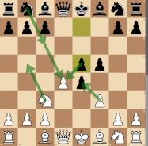
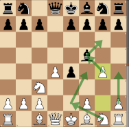

# The Blackmar-Diemer Gambit (D00 - Queen Pawn Game) #
# 1. d4 d5 2. e4 #

This gambit may be reached by the Queen Pawn Game (D00), the Scandinavian Defense (B01) or even through an Indian Defense (A45) with **2. Nc3 d5 3. e4**
  
> [!NOTE]
> The main variation of the Blackmar-Diemer gambit may also be obtained from the [Caro-Kann Defense](../../e4_openings/e4_c6_Caro_Kann.md), with **1. e4 c6 2. d4 d5 3. Nc3 dxe4 4. f3 exf3 5. Nf3 Nf6**
>
  
The main idea for White is to gain the initiative by quickly opening the e-column and, later on, the f-column through a pawn sacrifice and a pawn exchange 
When Black faces this gambit, the objective is to break White's initiative and strive for exchanges the pieces, to reach a better end game 
 

     
    ... 1. d4 d5 2. e4  
    <table align="center"><tr> 
    <td valign="center"></td><td>-0.7</td></tr></table>
 
 
 

 

- This opening is not correct with respect to openings principles, but leads to a ***dynamic game with many tactical ideas*** for both players
- When correctly prepared, Black is able to avoid many traps of this opening and obtain a good position for middle and end game (-0.5). 
- That said, due to the need for preparation for Black, a good White player may still surprise his opponent in blitz/bullet games.
- Black may: 
    -  refuse with **... c6** ([Caro-Kann Defense](../../e4_openings/e4_c6_Caro_Kann.md) +0.3) or
    -  refuse with **... e6** ([French Defense](../../e4_openings/e4_e6_French.md) +0.3) or
    -  refuse with **... Nc6** ([Nimzovitch Defense](../../e4_openings/e4_Nc6_Nimzovitch.md) +0.4) or
    -  refuse with [**... Nf6**](#_Nf6_) (+0.6) : which allows White to grab more space with **2. e5** (+0.6) or
    -  **accept** with [**... dxe4**](#_accepted_) (-0.7) : this is the most played move at ***74%*** in masters games
  

> [!TIP]
> ### 1. d4 d5 2. e4 Nf6? : gambit refused with Nf6 ( : +0.6)
> - This variation is never played in masters games, but when Black refuses the gambit with **... Nf6**, White takes space with **3. e5** while attacking the knight
> - There are 2 typical case studies hidden in this variation
> - **Case 1**: Black blocks its own knight with **3. ... Ne4**, since it gets no available square to escape, so **4. f3** just grabs it. 
>  

>      
>     ... 2. ... Nf6 3. e5 Ne4??  
>     <table align="center"><tr><td valign="center"></td><td>Very Rare</td> 
>     <td valign="center"></td><td>+5.2</td></tr></table>
>   

> - **Case 2**: Black retreats to **... Nfd7** close to the King : chasing the knight by **4. e6 fxe6** opens the h5-e8 diagonal, **5. Bd3** sets the trap. It must be avoided by black with a **... g6** or **... Nf6** or even **... Kf7**; a passive move like **... Nc6** triggers this beautiful mate pattern:  
>  

>      
>     ... 2. ... Nf6 3. e5 Nfd7 4. e6 fxe6 5. Bd3 Nc6?? 
>     ***Mate in 3*** *(6. Qh5+ g6 7. Qxg6+ hxg6 8.Bxg6#)* 
>   

>     [*Back to previous move*](#_initial_move_)

## 1. d4 d5 2. e4 dxe4 : gambit accepted 
As soon as the gambit is accepted, White should play **3. Nc3** (Diemer) instead of a direct **3. f3** (Blackmar) that is easily met with **... e5**, opening the critical daigonal h4-d8 for the Black Queen.
 
> [!NOTE]
> **3. Nc3** is played 99% of the time with no win for White in masters games when other moves are played*
> 
 

The following table shows the typical Black moves after **3. Nc3**
 

        
 

- Here Black should develop the knight while defending the e4 pawn - which represent 78% of masters game: 
    - [**... Nf6**](#_3_Nc3_Nf6_) (-0.5) : main move, most played and best rated in this position
    - [**... e5**](#_3_Nc3_e5_) (-0.1) : side move for Black, which may disrupt White initiative in this opening (played only 13%)
    - [**... f5**](#_3_Nc3_f5_) (+0.1) : another interesting side move, but more dangerous for Black, since it weakens f7 square and exposes the King
    - [**... Bf5**](#_3_Nc3_Bf5_) (-0.1) : Black move allows White attacking the bishop with g4 and keeping ths initiative 

Black may choose unexpected answers such as **... c5** or [**... Nc6**](#_3_Nc3_Nc6_), where in both case White should play **4. d5** 

[*Back to previous move*](#_initial_move_)
 

> [!NOTE]
> ## Gambit Accepted : 3. Nc3 Nc6? ( : +0.1)
> - When Black answers with **.. Nc6**, **4. d5** chases the Knight : look for **... Ne5** to be chased again with **5. Qd4**
> - Black moves its knight again, e.g. **... Ng6**, then Bb5+ sets a trap: 
>  

>      
>     ... 3. Nc3 Nc6 4. d5 Ne5? 5. Qd4 Ng6 6. Bb5+  
>     <table align="center"><tr><td valign="center"></td><td>Very Rare</td> 
>     <td valign="center"></td><td>+0.0</td></tr></table>
>   

> - If Black blocks with the pawn, then White can safely take with **7. dxc6** (+2.3) since the White Queen, if taken, can respawn ... in a8, thanks to a discovered check with Bb5 after **8. cxb7+** and **9. bxa8=Q** (very nice combination, indeed)
> - Best move for Black is **... Bd7** instead of **... c6*** : Black should aim for a better end game and exchange pieces to break White initiatives
> - On the contrary, White should avoid exchanges and continue on setting pieces on the board by **7. Be3** or **7. Nge2**
>   

>     [*Back to previous move*](#_3_Nc3_)
 

> [!NOTE]
> ## Gambit Accepted : 3. Nc3 f5!? ( : +0.1)
> - This is a side move usually not anticipated by White in this gambit, but the move **... f5** weakens the King and White may aim at the h5-e8 diagonal
> - White, according to Stockfish should play **4.Bg5**, however a typical White move in the Blackmar-Diemer gambit spirit is to play **4.f3** to open the e-column:
>     - if Black takes with **... exf3**, White are much better with **5.Nxf3** (+0.8)
>     - but Black should attack the center to break White's initiative (-0.5) : **... e5!**: if White takes **5.fxe4**, then Black breaks with **... exd4** chasing the Knight, followed by **6. ... Nc6** to protect d4 
>
>  

>      
>     ... 3. Nc3 f5 4. f3 e5!  
>     <table align="center"><tr><td valign="center"></td><td>Very Rare</td> 
>     <td valign="center"></td><td>-0.1</td></tr></table>
>   

> - The best move for White here is ... to exchange the Queens with **5. dxe5** in order to block the attack of the center
>   

>     [*Back to previous move*](#_3_Nc3_)
 

> [!NOTE]
> ## Gambit Accepted : 3. Nc3 f5!? ( : -0.1)
> - A side move to the gambit, White may directly aim at chasing the bishop by **4. g4**, which is the Stockfish best move
> - but, there is a chance that White continue with the **4. f3** spirit *(73% of the masters games)*:
>     - Black should not take here and protect d4 with **... Nf6** (attacking the center with **... e5** leads to the drawback of exchanging the white bishop with the knight) : the idea is to try exchanging pieces with an advantage in the end game 
>  

>      
>     ... 3. Nc3 Bf5 4. g4  
>     <table align="center"><tr><td valign="center"></td><td>Very Rare</td> 
>     <td valign="center"></td><td>-0.1</td></tr></table>
>   

> - White moves should aim at developing the knight, chasing the bishop, pushing the kingside pawns
>   

>     [*Back to previous move*](#_3_Nc3_)
 

> [!NOTE]
> ## Gambit Accepted : 3. Nc3 e5 ( : -0.1)
> - A side move to the gambit chosen at 13% by Black in masters game, to disrupt White's plans
> - White's reactions in masters games depart from Stockfish moves here (**4. Nge2**): although the move protects d4, it blocks the bishop and the queen...
> - Most played move is **4.Qh5** which directly aims at f7, followed by **5. Bc4** for the mate threat on f7 : a quite dangerous variation for Black although a correct order of moves allow Black to get a better game : **4.Qh5 exd4 5.Bc4 Qe7 6.Bg5 Nf6 7.Bxf6 Qxf6 8.Nxe4 Qe7 9.O-O-O Qxe4** - White is a piece down and Black can escape the mate, develop Nc6, ...
>  

>      
>     ... 3. Nc3 Bf5 4. g4  
>     <table align="center"><tr><td valign="center"></td><td>Side Move</td> 
>     <td valign="center"></td><td>-0.1</td></tr></table>
>   

> - White moves should aim at developing the knight, chasing the bishop, pushing the kingside pawns
>   

>     [*Back to previous move*](#_3_Nc3_)
 

Follow-up

[*Back to TOP*](#_TOP_)

