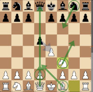
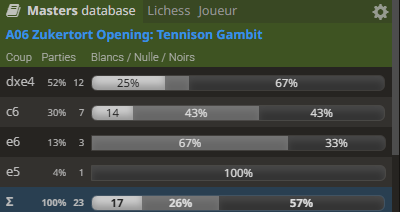

# The Tennnison Gambit (A06 - Zukertort Opening) #

This gambit may be reached by the Zukertort opening (A06) or the Scandinavian Defense (B01)\
The main idea is to capture the Black Queen through seemingly sensible moves\
*This trap backfires when avoided by Black, with a score of -0.7 estimated by Stockfish*
 

        
 
        
 

- Black may: 
    -  refuse with **... c6** ([Caro-Kann Defense](../../e4_openings/e4_c6_Caro_Kann.md) - Stockfish +0.3) or
    -  refuse with **... e6** ([French Defense](../../e4_openings/e4_e6_French.md)    - Stockfish +0.1) or
    -  accept with **... dxe4** (Stockfish -0.7) : this is the most played move at 52% in masters games
  
- After **... dxe4**, White escape to **3. Ng5**.
- The objective is to prepare an attack on f7, while preparing for pushing the light squares bishop on the d3-g6 diagonal along with an X-Ray attack of Qd1 on Qd8
- Here White is ***hoping*** for Black normal moves - this is where the trap may backfire:

  
    -  

